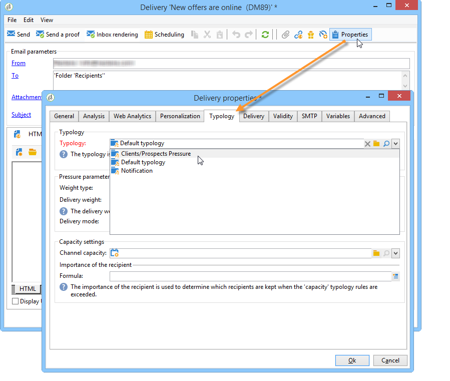

# 應用類型規則{#applying-rules}

## 對交貨應用類型 {#apply-a-typology-to-a-delivery}

要應用您建立的類型規則，請將其與類型關聯，然後在您的交貨中引用此類型。

要執行此操作，請遵循下列步驟：

1. 建立市場活動類型。

   通過 **[!UICONTROL Administration > Campaign Management > Typology management]** > **[!UICONTROL Typologies]** 市場活動瀏覽器的資料夾。

1. 轉到 **[!UICONTROL Rules]** 頁籤 **[!UICONTROL Add]** 按鈕，選擇要應用於此類型的規則。

   

1. 保存類型：是否被添加到現有類型清單中。
1. 開啟要應用規則的交貨。
1. 瀏覽到交貨屬性並開啟 **[!UICONTROL Typology]** 頁籤。
1. 在下拉清單中選擇類型。

   

   >[!NOTE]
   >
   >可以在傳遞範本中定義類型，以便自動套用至使用此範本建立的所有傳送。

## 定義申請條件 {#define-application-conditions}

您可以根據需要限制規則的應用程式欄位（控制規則除外）。

可以配置類型規則，以便它們只涉及它們連結到的某些交貨，或者某些收件人是交貨的目標。

要定義規則的應用條件，請按一下 **[!UICONTROL Edit the rule application conditions...]** 連結 **[!UICONTROL General]** 頁籤。

然後使用查詢編輯器定義過濾條件。 在下例中，能力規則僅涉及在標籤中加上「優惠」字樣的交貨或在2013年4月1日之前建立的交貨。

>[!NOTE]
>
>對於篩選規則，可以選擇篩選條件的應用條件：他們可以依靠交貨或交貨大綱。 [了解更多](filtering-rules.md#condition-a-filtering-rule)。

## 調整計算頻率 {#adjust-calculation-frequency}

通過資料庫清理工作流，每晚自動重新執行仲裁。 但是，值可以保存到此期間之後。

事實上，有些計算使用的值不會每天更改。 因此，每天重新計算資料，使資料庫無償超載將無關緊要。 例如，如果一個過程每週都用客戶傾向分數和購買資訊豐富了市場營銷資料庫，則不需要每天重新計算基於這些值的資料。

為此， **[!UICONTROL Frequency]** 的 **[!UICONTROL General]** 頁籤中，您可以定義保存目標的最長期間。 預設情況下， **0** 指示計算在下次執行每日重新仲裁之前一直有效。

要保存超出此期間的結果，請在 **[!UICONTROL Frequency]** 欄位：一旦此期間過期，將重新應用所有規則。

的 **[!UICONTROL Re-apply the rule at the start of personalization]** 選項允許您在個性化設定階段自動應用規則，包括 **[!UICONTROL Frequency]** 欄位仍然有效。

## 選擇規則應用程式階段 {#selecting-the-rule-application-phase}

在它們所關注的遞送的目標、分析和個性化階段期間，按特定順序應用分類規則。

### 執行順序 {#execution-order}

在標準操作模式下，會依下列順序套用規則：

1. 控制規則（如果這些規則是在定位開始時套用）。
1. 篩選規則：

   * 地址資格的本機應用規則：denylist/quarantined address / address quality上的已定義地址/未驗證地址/地址。
   * 篩選由使用者定義的規則。
   * 地址或標識符上的重複資料消除規則（如有必要，應用）。

1. 壓力規則.
1. 容量規則。
1. 控制規則（如果這些規則是在定位結束時套用）。
1. 控制規則（如果這些規則是在個人化開始時套用）。如果用戶規則（過濾/壓力/電容性）已過期，需要重新計算，則在此步驟中應用這些規則。
1. 控制規則（如果它們在個性化結束時應用）。

>[!NOTE]
>
>如果您使用「市場活動交互」模組，則在與篩選規則（對於在交貨大綱中找到的優惠）或在個性化階段（在對優惠引擎的呼叫期間）同時應用優惠資格規則。

您可以使用中的相應欄位來調整具有相同類型的規則的執行順序 **[!UICONTROL General]** 頁籤。 當在同一消息處理階段執行多個規則時，可以在 **[!UICONTROL Execution sequence]** 的子菜單。

例如，在執行順序為30的壓力規則之前執行執行順序為20的壓力規則。

### 控制規則 {#control-rules}

對於 **[!UICONTROL Control]** 規則，您可以決定在交貨生命週期的哪個點應用規則：在目標之前或之後，在個性化的開始，在分析的結束。 選擇要應用於的 **[!UICONTROL Phase]** 的 **[!UICONTROL General]** 頁籤。

可能的值為：

* **[!UICONTROL At the start of targeting]**

   要防止在出錯時執行個性化設定步驟，可以在此處應用控制規則。

* **[!UICONTROL After targeting]**

   如果需要知道目標的卷才能應用控制規則，請選擇此階段。

   例如， **[!UICONTROL Check proof size]** 控制規則在每個目標階段後應用：如果證明收件人太多，此規則將阻止郵件個性化。

* **[!UICONTROL At the start of personalization]**

   如果控制項涉及郵件個性化的批准，則必須選擇此階段。 在分析階段執行消息個性化。

* **[!UICONTROL At the end of the analysis]**

   當檢查要求完成消息個性化時，請選擇此階段。

## 其他設定 {#additional-configurations}

### 控制傳出SMTP通信 {#control-outgoing-smtp-traffic}

作為選項，您可以 **[!UICONTROL Managing affinities with IP addresses]** 欄位，將交貨連結到此關聯的傳遞伺服器(MTA)。 這允許您將特定交貨的電子郵件數量限制到電腦或輸出地址。

>[!NOTE]
>
>關聯管理不適用於 **[!UICONTROL Filtering]** 類型。

<!--
>Affinities are defined in the instance configuration file, on the Adobe Campaign server. For more on this, refer to [this section](../../installation/using/about-initial-configuration.md).-->

### 市場活動優化與分佈式營銷 {#campaign-optimization-and-distributed-marketing}

的 **[!UICONTROL Distributed Marketing]** 頁籤用於定義在訂購和/或保留共用市場活動時應用的類型和/或規則的重新映射。 為本地實體定義的類型/規則（連結到為中央實體定義的類型）替換連結到中央實體的規則/類型。 通過重新映射，您可以將中心實體規則調整為訂購市場活動的本地實體。

>[!NOTE]
>
>在類型和類型規則中， **[!UICONTROL Distributed Marketing]** 頁籤：請檢查您的許可協定。\
>有關分佈式營銷的詳細資訊，請參閱 [此部分](../distributed-marketing/about-distributed-marketing.md)。
