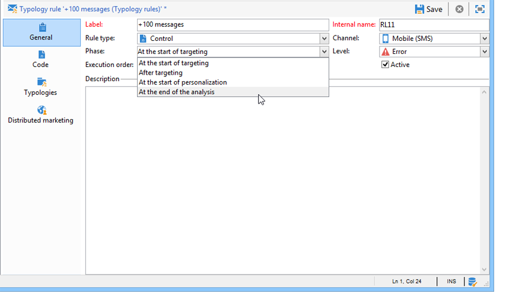

# 套用類型規則{#applying-rules}

## 套用類型至傳送 {#apply-a-typology-to-a-delivery}

若要套用您建立的類型規則，您必須將其與類型建立關聯，然後在您的傳送中參考此類型。 操作步驟：

1. 建立行銷活動類型。

   類型可透過 **[!UICONTROL Administration > Campaign Management > Typology management]** > **[!UICONTROL Typologies]** Campaign檔案總管的資料夾。

1. 前往 **[!UICONTROL Rules]** ，按一下 **[!UICONTROL Add]** 按鈕並選取要與此類型套用的規則。

   

1. 儲存類型：會新增至現有類型清單中。
1. 開啟您要套用規則的傳送。
1. 開啟傳送屬性並存取 **[!UICONTROL Typology]** 標籤。
1. 在下拉式清單中選取類型。

   

   >[!NOTE]
   >
   >可以在傳遞範本中定義類型，以便自動套用至使用此範本建立的所有傳送。

## 定義應用條件 {#define-application-conditions}

您可以根據需求限制規則的應用程式欄位（控制規則除外）。

您可以設定類型規則，使其僅關注其連結的特定傳送，或關注傳送目標中的特定收件者。

若要定義規則的應用條件，請按一下 **[!UICONTROL Edit the rule application conditions...]** 連結 **[!UICONTROL General]** 標籤。

然後使用查詢編輯器定義篩選條件。 在下列範例中，容量規則僅關注在2013年4月1日之前建立之標籤或傳送中加上&#39;offer&#39;字的傳送。

>[!NOTE]
>
>若是篩選規則，您可以選取篩選條件的應用程式條件：它們取決於傳送或傳送大綱。 [了解更多資訊](filtering-rules.md#condition-a-filtering-rule)。

## 調整計算頻率 {#adjust-calculation-frequency}

每晚都會透過資料庫清除工作流程自動重新執行仲裁。 不過，值可儲存在此期間之後。

事實上，有些計算使用的值並未每天改變。 因此，每天重新計算資料並無償超載資料庫將無關緊要。 例如，如果程式以每週的客戶傾向分數和購買資訊豐富行銷資料庫，則基於這些值的資料不需要每天重新計算。

若要這麼做， **[!UICONTROL Frequency]** 欄位 **[!UICONTROL General]** 索引標籤可讓您定義儲存定位的期間。 依預設，值 **0** 表示在下次執行每日重新仲裁之前，計算仍然有效。

若要儲存超過此期間的結果，請在 **[!UICONTROL Frequency]** 欄位：此期間過期後，會重新套用所有規則。

此 **[!UICONTROL Re-apply the rule at the start of personalization]** 選項可讓您在個人化階段期間自動套用規則，包括 **[!UICONTROL Frequency]** 欄位仍然有效。

## 選擇規則應用程式階段 {#selecting-the-rule-application-phase}

在相關傳送的鎖定目標、分析和個人化階段期間，會以特定順序套用類型規則。

### 執行順序 {#execution-order}

在標準操作模式下，會依下列順序套用規則：

1. 控制規則（如果這些規則是在定位開始時套用）。
1. 篩選規則：

   * 地址限定的本機應用規則：封鎖清單/隔離位址/位址品質上已定義的位址/未驗證的位址/位址。
   * 篩選由使用者定義的規則。
   * 位址或識別碼上的重複資料刪除規則（如有需要則套用）。

1. 壓力規則.
1. 容量規則。
1. 控制規則（如果這些規則是在定位結束時套用）。
1. 控制規則（如果這些規則是在個人化開始時套用）。如果使用者規則（篩選/壓力/容性）已過期，需要重新計算，則會在此步驟中套用。
1. 控制規則（如果這些規則在個人化結束時套用）。

>[!NOTE]
>
>如果您使用「促銷活動互動」模組，則會在呼叫優惠方案引擎期間，與篩選規則（適用於在傳送大綱中找到的優惠方案）或在個人化階段期間，同時套用優惠方案適用性規則。

您可以使用 **[!UICONTROL General]** 標籤。 在相同的訊息處理階段期間執行數個規則時，您可以在 **[!UICONTROL Execution sequence]** 欄位。

例如，執行順序為20的壓力規則將在執行順序為30的壓力規則之前執行。

### 控制規則 {#control-rules}

針對 **[!UICONTROL Control]** 規則，您可以決定要套用規則的傳送生命週期的哪個時間點（在鎖定目標之前或之後、在個人化開始時、在分析結束時）。 選取要在 **[!UICONTROL Phase]** 欄位，在 **[!UICONTROL General]** 標籤。

可能的值包括：

* **[!UICONTROL At the start of targeting]**

   若要防止在發生錯誤時執行個人化步驟，您可以在此處套用控制規則。

* **[!UICONTROL After targeting]**

   如果需要知道目標的體積以應用控制規則，請選擇此階段。

   例如， **[!UICONTROL Check proof size]** 控制規則會套用至每個目標階段之後：如果校樣收件者太多，此規則會防止訊息個人化。

* **[!UICONTROL At the start of personalization]**

   如果控制涉及訊息個人化的核准，則必須選取此階段。 在分析階段期間會執行訊息個人化。

* **[!UICONTROL At the end of the analysis]**

   當檢查需要完成訊息個人化時，請選取此階段。

## 其他設定 {#additional-configurations}

### 控制傳出的SMTP流量 {#control-outgoing-smtp-traffic}

作為選項，您可以使用 **[!UICONTROL Managing affinities with IP addresses]** 欄位，將傳遞連結至此相關性的傳送伺服器(MTA)。 這可讓您將特定傳送的電子郵件數量限制在電腦或輸出地址。

>[!NOTE]
>
>相關性管理不適用於 **[!UICONTROL Filtering]** 類型。

<!--
>Affinities are defined in the instance configuration file, on the Adobe Campaign server. For more on this, refer to [this section](../../installation/using/about-initial-configuration.md).-->

### 行銷活動最佳化和分散式行銷 {#campaign-optimization-and-distributed-marketing}

此 **[!UICONTROL Distributed Marketing]** 索引標籤可讓您定義重新對應當訂購和/或保留共用促銷活動時套用的類型和/或規則。 為本地實體定義的類型/規則（連結至為中央實體定義的類型）會取代連結至中央實體的規則/類型。 重新對應可讓您調整中央實體規則，使其與排序促銷活動的本機實體一致。

>[!NOTE]
>
>在類型與類型規則中， **[!UICONTROL Distributed Marketing]** 標籤（如果您的授權包含此選項）:請檢查您的授權合約。\
>如需分散式行銷的詳細資訊，請參閱 [本節](../distributed-marketing/about-distributed-marketing.md).
