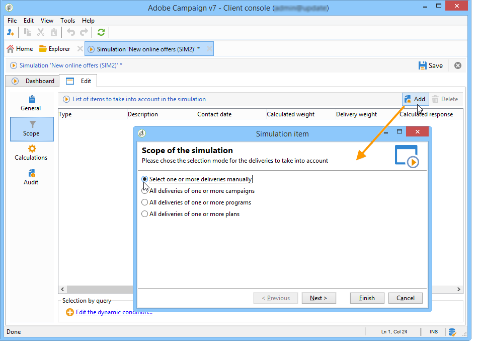
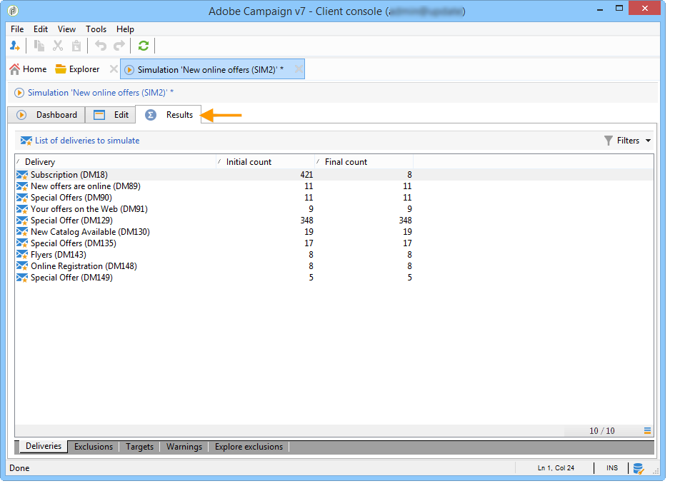

# Campaign 模擬{#campaign-simulations}

行銷活動最佳化可讓您使用模擬來測試行銷活動計畫的效率。 這可讓您評估行銷活動的潛在成功：產生的收入、根據套用的型別規則的目標數量等。

模擬可讓您監控及比較傳送的影響。

## 設定模擬 {#set-up-a-simulation}

### 注意

已在中準備傳遞 **測試** 例如，在分散式行銷中評估行銷活動時，或只要傳送未在臨時行事曆中排程，模式就不會相互影響。

這表示壓力和容量規則僅適用於中的傳遞。 **[!UICONTROL Target estimation and message personalization]** 模式。 中的傳遞 **[!UICONTROL Estimation and approval of the provisional target]** 模式和 **[!UICONTROL Target evaluation]** 模式未被考慮。

傳遞模式選擇於 **[!UICONTROL Typology]** 傳遞屬性的子標籤。

### 建立模擬 {#create-a-simulation}

若要建立模擬，請套用下列步驟：

1. 開啟 **[!UICONTROL Campaigns]** 索引標籤，按一下 **[!UICONTROL More]** 內的連結 **[!UICONTROL Create]** 區段並選取 **[!UICONTROL Simulation]** 選項。

   

1. 輸入範本和模擬的名稱。 按一下 **[!UICONTROL Save]** 以建立模擬。

   

1. 按一下 **[!UICONTROL Edit]** 標籤進行設定。

   

1. 在 **[!UICONTROL Scope]** 索引標籤，指定您要考慮用於此模擬的傳送。 若要這麼做，請按一下 **[!UICONTROL Add]** 按鈕並指定要考慮的傳送選擇模式。

   

   您可以逐一選取每個傳遞，或依行銷活動、方案或計畫排序。

   >[!NOTE]
   >
   >如果您透過計畫、方案或行銷活動選取傳送，Adobe Campaign會自動重新整理傳送清單，以便在模擬啟動時加以考慮。 要執行此操作，請核取 **[!UICONTROL Refresh the selection of deliveries each time the simulation is started]** 選項。
   >  
   >如果您不這麼做，則建立模擬時不會考慮計畫、方案或行銷活動中不可用的任何傳送：稍後新增的傳送將被忽略。

   

1. 選取要包含在模擬範圍內的元素。 如有必要，請使用SHIFT和CTRL鍵選取多個元素。

   

   按一下 **[!UICONTROL Finish]** 以核准選取專案。

   您可以手動合併屬於計畫、方案或行銷活動的選定傳遞與傳遞。

   

   如有需要，您可以透過 **[!UICONTROL Edit the dynamic condition...]** 連結。

   按一下 **[!UICONTROL Save]** 以核准此設定。

   >[!NOTE]
   >
   >計算模擬時，只考慮已計算目標的傳送(狀態： **目標已就緒** 或 **準備遞送**)。

1. 在 **[!UICONTROL Calculations]** 索引標籤中，選取分析維度，例如收件者綱要。

   

1. 然後，您可以新增運算式。

   

### 執行設定 {#execution-settings}

此 **[!UICONTROL General]** 模擬的索引標籤可讓您輸入執行設定：

* 此 **[!UICONTROL Schedule execution for down-time]** 選項會根據所選的優先順序層級，將模擬啟動延遲到較不繁忙的時間段。 例如，模擬會使用大量的資料庫資源，因此非緊急模擬應該排程在夜間執行。
* 此 **[!UICONTROL Priority]** 是套用至模擬以延遲其觸發的層級。
* **[!UICONTROL Save SQL queries in the log]**. SQL記錄檔可讓您在模擬結束時診斷錯誤。 它們也可以幫助您找出模擬太慢的原因。 在模擬之後，這些訊息將會顯示在 **[!UICONTROL SQL logs]** 的子標籤 **[!UICONTROL Audit]** 標籤。

## 執行模擬 {#execute-a-simulation}

### 開始模擬 {#start-a-simulation}

定義模擬範圍後，即可執行。

若要這麼做，請開啟模擬圖示板並按一下 **[!UICONTROL Start simulation]**.

執行完成後，請開啟模擬並按一下 **[!UICONTROL Results]** 標籤以檢視針對每個傳遞計算的目標。

1. 此 **[!UICONTROL Deliveries]** 子頁簽會列出模擬所考慮的所有傳遞。 它會顯示兩個計數：

   * 此 **[!UICONTROL Initial count]** 是傳遞中估計期間所計算的目標。
   * 此 **[!UICONTROL Final count]** 是模擬後計數的收件者人數。

     初始計數和最終計數之間的差異，反映了模擬之前設定的各種規則或篩選器的套用。

     若要進一步瞭解此計算，請編輯 **[!UICONTROL Exclusions]** 子標籤。

1. 此 **[!UICONTROL Exclusions]** 子頁簽可讓您檢視排除專案劃分資訊。

   

1. 此 **[!UICONTROL Alerts]** 子頁簽會將模擬期間產生的所有警示訊息分組。 在容量超載時（例如，如果鎖定的收件者人數超過設定的容量），可以傳送警報訊息。
1. 此 **[!UICONTROL Exploration of the exclusions]** 子標籤可讓您建立結果分析表格。 使用者需要在橫截面/縱座標軸中指出變數。

   有關建立分析表格的範例，請參閱分析表的 [本節](#explore-results).

### 檢視結果 {#view-results}

#### 稽核 {#audit}

此 **[!UICONTROL Audit]** 標籤可讓您監視模擬執行。 此 **[!UICONTROL SQL Logs]** 子標籤對專家使用者很有用。 它以SQL格式列出執行記錄。 這些記錄只會在 **[!UICONTROL Save SQL queries in the log]** 選項已選取於 **[!UICONTROL General]** 標籤中。

#### 探索結果 {#explore-results}

此 **[!UICONTROL Exploration of the exclusions]** 子標籤可讓您分析模擬產生的資料。

<!--
Descriptive analysis is detailed in [this section](../../reporting/using/about-adobe-campaign-reporting-tools.md).
-->

## 模擬的結果 {#results-of-a-simulation}

中的指示器 **[!UICONTROL Log]** 和 **[!UICONTROL Results]** 標籤會提供模擬結果的第一個概觀。 如需結果的詳細檢視，請開啟 **[!UICONTROL Reports]** 標籤。

### 報告 {#reports}

若要分析模擬的結果，請編輯其報表：顯示排除專案和原因。

預設會提供下列報表：

* **[!UICONTROL Detail of simulation exclusions]** ：此報錶針對所有相關傳遞提供詳細的排除原因圖表。
* **[!UICONTROL Simulation summary]** ：此報表會顯示各種傳送中從模擬排除的母體。
* **[!UICONTROL Summary of exclusions linked to the simulation]** ：此報表顯示模擬導致的排除圖表、套用的型別規則，以及顯示每個規則的排除率的圖表。

<!--
>[!NOTE]
>
>You can create new reports and add them to the ones offered. For more on this, refer to [this section](../../reporting/using/about-adobe-campaign-reporting-tools.md).
-->

若要存取報表，請按一下 **[!UICONTROL Reports]** 目標模擬的連結（透過其控制面板）。

您也可以使用編輯報告 **[!UICONTROL Reports]** 可從模擬控制面板存取的連結。

### 比較模擬 {#compare-simulations-}

每次執行模擬時，結果都會取代之前的任何結果：您無法顯示和比較從一個執行到另一個執行的結果。

若要比較結果，必須使用報表。 事實上，Adobe Campaign可讓您儲存報表歷史記錄，以便稍後再次檢視。 此歷史記錄會在模擬的整個生命週期中儲存。

**範例：**

1. 針對型別為的傳遞建立模擬 **A** 套用至。
1. 在 **[!UICONTROL Reports]** 標籤，編輯其中一個可用報表，例如 **[!UICONTROL Detail of simulation exclusions]** 例如。
1. 在報表的右上角，按一下圖示以建立新的歷史記錄。

   

1. 關閉模擬並變更型別的設定 **A**.
1. 再次執行模擬，並將結果與建立歷史記錄之報表中顯示的結果進行比較。

   

   您可以視需要儲存儘可能多的報表歷史記錄。

### 報告軸 {#reporting-axes}

此 **[!UICONTROL Calculations]** 標籤可讓您定義目標上的報告軸。 這些軸將用於期間 [結果分析](#explore-results).

>[!NOTE]
>
>我們建議在模擬範本中定義計算軸，而不是為每個模擬分別定義計算軸。\
>模擬範本會儲存在 **[!UICONTROL Resources > Templates > Simulation templates]** Campaign檔案總管的資料夾。

**範例：**

在以下範例中，我們要根據收件者的狀態（「客戶」、「潛在客戶」或無）建立額外的報告軸。

1. 若要定義報表軸，請選取包含要在中處理之資訊的表格 **[!UICONTROL Analysis dimension]** 欄位。 此資訊是強制性的。
1. 在此，我們要選取收件者表格的「區段」欄位。

   

1. 可以使用以下選項：

   * **[!UICONTROL Generate target overlap statistics]** 可讓您復原模擬報表中的所有重疊統計資料。 重疊是在一個模擬中至少兩次傳遞鎖定的收件者。

     >[!CAUTION]
     >
     >選取此選項會大幅增加模擬執行時間。

   * **[!UICONTROL Keep the simulation work table]** 可讓您保留模擬追蹤。

     >[!CAUTION]
     >
     >自動儲存這些表格需要相當的儲存容量：請確定資料庫夠大。

顯示模擬結果時，所選運算式的資訊將顯示在 **[!UICONTROL Overlaps]** 子標籤。

傳遞目標重疊表示在至少兩次模擬傳遞中的目標收件者。

>[!NOTE]
>
>只有在 **[!UICONTROL Generate target recovery statistics]** 選項已啟用。

報表軸上的資訊可在中建立的排除分析報表中處理 **[!UICONTROL Exploring exclusions]** 子標籤。 [了解更多](#explore-results)。
