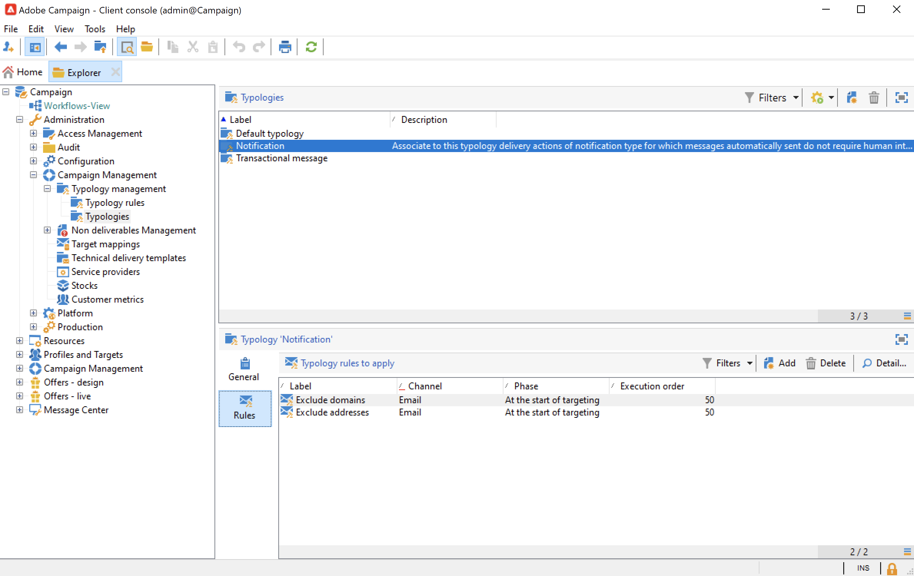

# 開始使用行銷活動型別{#about-campaign-typologies}

**行銷活動最佳化**&#x200B;是Adobe Campaign模組，可讓您控制、篩選及監視傳遞的傳送。 為了避免行銷活動之間發生衝突，Adobe Campaign 可以套用特定限制規則來測試各種組合。 這樣可確保傳送的訊息符合客戶和公司通訊政策的需求及期望。

 [在影片中探索此功能](#typologies-video)

>[!NOTE]
>
>根據您的產品，可包含Campaign Optimization或附加元件。 請檢查您的授權合約。

## 型別規則與型別 {#typology-rules}

依預設，Campaign隨附內建型別和型別規則。

型別是一組驗證規則，在傳遞分析期間套用於所有訊息。

行銷活動型別可包含數個型別規則，但傳遞只能參考一個型別。

Campaign檔案總管的&#x200B;**[!UICONTROL Administration > Campaign management > Typology management]**&#x200B;資料夾中有內建型別規則和型別。

對於每個型別，**[!UICONTROL Rules]**&#x200B;索引標籤可讓您新增、刪除或檢視要套用的型別規則。

一旦建立型別規則後，就會將型別規則分組到傳遞中參考的行銷活動&#x200B;**型別**。 [了解更多資訊](#apply-typologies)。

行銷活動隨附一組預設&#x200B;**篩選**&#x200B;和&#x200B;**控制**&#x200B;規則：

* **篩選**&#x200B;規則是用來根據條件排除部分目標。 [了解更多資訊](filtering-rules.md)。
* **控制**&#x200B;規則可讓您在傳送訊息之前檢查訊息是否有效。 [了解更多資訊](control-rules.md)。

Campaign Optimization附加元件提供另外兩種型別的&#x200B;**型別規則**：

* 可讓您控制行銷疲勞的&#x200B;**壓力**&#x200B;規則。 [了解更多資訊](pressure-rules.md)。
* **容量**&#x200B;規則可讓您限制載入，以確保最佳處理條件。 [了解更多資訊](consistency-rules.md#controlling-capacity)。

>[!NOTE]
>
>如果您使用&#x200B;**互動**&#x200B;模組來管理優惠方案，您也可以建立&#x200B;**優惠方案簡報**&#x200B;型別規則，以使用簡報規則控制優惠方案主張的流程。 [了解更多資訊](../../v8/interaction/interaction-offer.md#offer-presentation)。

## 建立及使用型別的重要步驟 {#apply-typologies}

若要建立和使用傳送的型別，請遵循下列步驟：

1. 建立型別規則並建立型別以將其參照至其中。
詳細步驟列於以下章節：

   * [篩選規則](filtering-rules.md)
   * [控制規則](control-rules.md)
   * [壓力規則](pressure-rules.md)
   * [容量規則](consistency-rules.md)

1. 設定您的傳遞方式，以使用您建立的型別。 [了解更多資訊](apply-rules.md#apply-a-typology-to-a-delivery)。
1. 透過行銷活動模擬測試及控制行為。 [了解更多資訊](campaign-simulations.md)。

在準備傳遞期間，符合條件時會排除收件者。 您可以檢查日誌以監控排除。

在[此頁面](pressure-rules.md#use-cases-on-pressure-rules)中有提供壓力型別規則的範例使用案例。

## 教學課程影片 {#typologies-video}

### 使用類型規則設定疲勞管理

此影片說明如何運用型別規則，在Adobe Campaign中實施疲勞管理。

>[!VIDEO](https://video.tv.adobe.com/v/3448342?captions=chi_hant&quality=12)

### 使用預先定義的篩選器設定疲勞管理

疲勞管理控制傳訊的頻率和數量，以避免過度向收件者發送請求。 如果您的行銷活動執行個體中沒有行銷活動最佳化模組，您可以設定預先定義的篩選器，以根據收到的訊息數量篩選目標母體
此影片說明如何使用篩選器在Adobe Campaign中實施疲勞管理。

>[!VIDEO](https://video.tv.adobe.com/v/3444611?captions=chi_hant&quality=12)
