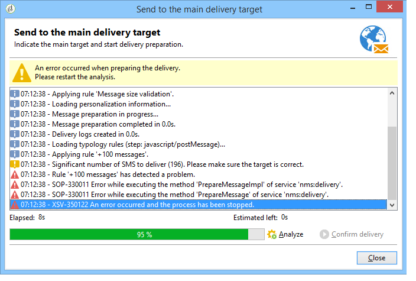

# 控制規則{#control-rules}

控制規則可讓您在傳送之前保證訊息的有效性和品質：字元顯示、簡訊大小、位址格式等。

一組現成的規則可讓您執行一般的檢查。 這些檢查（在介面中以粗體顯示）包括：

* **[!UICONTROL Object approval]** （電子郵件）：檢查寄件者物件與地址是否不包含特殊字元，這可能造成某些郵件代理程式發生問題。
* **[!UICONTROL URL label approval]** （電子郵件）：檢查每個追蹤URL是否有標籤。
* **[!UICONTROL URL approval]** （電子郵件）：檢查追蹤URL （是否有「&amp;」字元）。
* **[!UICONTROL Message size approval]** （行動裝置）：檢查SMS訊息的大小。
* **[!UICONTROL Validity period check]** （電子郵件）：檢查傳遞的有效期是否足夠長，以傳送所有訊息。
* **[!UICONTROL Proof size check]** （所有管道）：如果校訂目標母體超過100個收件者，則產生錯誤訊息。
* **[!UICONTROL Wave scheduling check]** （電子郵件）：如果傳遞劃分為數個批次，則檢查最後一個傳遞批次是否已排程在有效期間結束前開始。
* **[!UICONTROL Unsubscription link approval]** （電子郵件）：檢查每個內容(HTML和文字)中是否有至少一個取消訂閱（選擇退出） URL。

## 建立控制規則 {#create-a-control-rule}

您可以建立新的控制規則以符合您的需求。 若要這麼做，請建立&#x200B;**[!UICONTROL Control]**&#x200B;型別規則，並在&#x200B;**[!UICONTROL Code]**&#x200B;索引標籤的SQL中輸入控制項公式。

**範例：**

在以下範例中，我們將建立規則以防止SMS選件傳送給超過100個收件者。 此規則將連結至行銷活動型別，然後連結至可使用相關選件的SMS傳送。

應用以下步驟：

1. 建立&#x200B;**[!UICONTROL Control]**&#x200B;型別規則。 選取&#x200B;**[!UICONTROL Warning]**&#x200B;警示等級。

   

1. 在&#x200B;**[!UICONTROL Code]**&#x200B;索引標籤中，輸入指令碼以套用所需的臨界值，如下所示：

   

   如果傳送目標超過100個連絡人，此指令碼會觸發警告：

   ```
   if( delivery.FCP == false && delivery.properties.toDeliver > 100 ) { logWarning("Significant number of SMS to deliver (" + delivery.properties.toDeliver + "). Please make sure the target is correct.") return false; } return true
   ```

1. 將此規則連結至行銷活動型別，並參考相關SMS傳送中的型別。

   

1. 在傳遞分析期間，會套用規則並建立警告（如適用）。

   

   但是，傳遞仍可傳送。

   如果您提高警示等級，將無法開始傳遞。

   

   分析結束時，**[!UICONTROL Confirm delivery]**&#x200B;按鈕將不可用。

   
