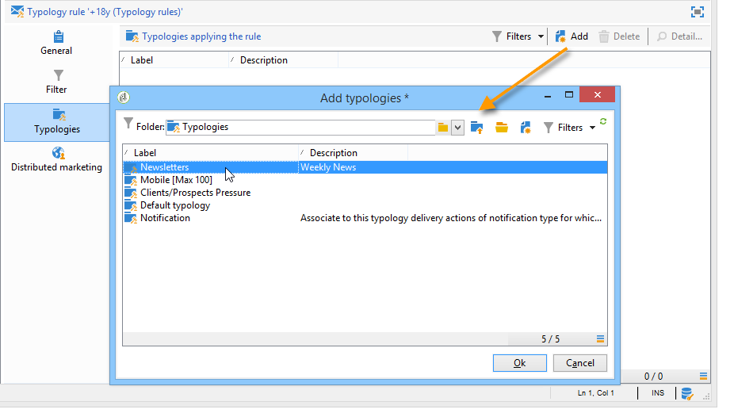

# 篩選規則{#filtering-rules}

使用篩選規則，根據查詢中定義的條件選取要排除的訊息。 這些規則會連結至目標維度。

篩選規則可連結至其他類型的規則（控制、壓力等） 類型中，或分組為專用 **篩選** 類型。 [了解更多資訊](#create-and-use-a-filtering-typology)。

## 建立篩選規則 {#create-a-filtering-rule}

例如，您可以篩選電子報訂閱者，以防止將通訊傳送給未成年的收件者。

若要定義此篩選器，請套用下列步驟：

1. 瀏覽至 **[!UICONTROL Administration > Campaign management > Typology management > Typology rules]** Campaign Explorer的資料夾，然後按一下 **新增** 圖示來建立類型規則。
1. 建立 **[!UICONTROL Filtering]** 類型規則。

   

1. 從 **篩選** 標籤將預設目標維度變更為 **訂閱** (**nms:subscription**)。

   

1. 使用 **[!UICONTROL Edit the query from the targeting dimension...]** 連結。

   

1. 依收件者年齡篩選並儲存篩選條件。

   

1. 從 **類型** 標籤，將此規則連結至促銷活動類型並儲存。

   

若在傳送中使用此規則，系統會自動排除未成年訂閱者。 特定訊息會指出何時套用規則：

## 條件篩選規則 {#condition-a-filtering-rule}

您可以根據連結的傳送或傳送大綱來限制篩選規則的應用程式欄位。

若要這麼做，請前往 **[!UICONTROL General]** ，請選取要套用的限制類型並建立篩選器。
<!--

-->

在此情況下，即使規則連結至所有傳送，也只會套用至符合已定義篩選條件的傳送。

>[!NOTE]
>
>類型和篩選規則可用於工作流程中，位於 **[!UICONTROL Delivery outline]** 活動。 [了解更多資訊](../workflow/delivery-outline.md)。

## 建立及使用篩選類型 {#create-and-use-a-filtering-typology}

您可以建立 **[!UICONTROL Filtering]** 類型：它們只包含篩選規則。

選取目標時，這些特定類型可連結至傳送：在傳送精靈中，按一下 **[!UICONTROL To]** 連結，然後按一下 **[!UICONTROL Exclusions]** 標籤。

然後選取要套用至傳送的篩選類型。 若要這麼做，請按一下 **[!UICONTROL Add]** 按鈕並選取要套用的類型。

您也可以透過此索引標籤直接連結篩選規則，而不會將它們分組到類型中。 要執行此操作，請使用視窗的下部。

>[!NOTE]
>
>選取視窗中僅提供類型和篩選規則。
>
>這些設定可在傳送範本中定義，以自動套用至使用範本建立的所有新傳送。

## 預設傳遞能力排除規則 {#default-deliverability-exclusion-rules}

預設提供兩個篩選規則： **[!UICONTROL Exclude addresses]** ( **[!UICONTROL addressExclusions]** )和 **[!UICONTROL Exclude domains]** ( **[!UICONTROL domainExclusions]** )。 在電子郵件分析期間，這些規則會比較收件者電子郵件地址與傳遞能力實例中管理的加密全域隱藏清單中包含的禁止地址或網域名稱。 如果有相符項目，則不會將訊息傳送給該收件者。

這是為了避免由於惡意活動（尤其是使用Spamtrap）而被添加到封鎖清單中。 例如，如果使用Spamtrap通過您的其中一個Web表單進行訂閱，則會自動向該Spamtrap發送確認電子郵件，這會導致您的地址被自動添加到封鎖清單中。

>[!NOTE]
>
>全局隱藏清單中包含的地址和域名將被隱藏。 傳送分析記錄中只會指出已排除的收件者數目。
