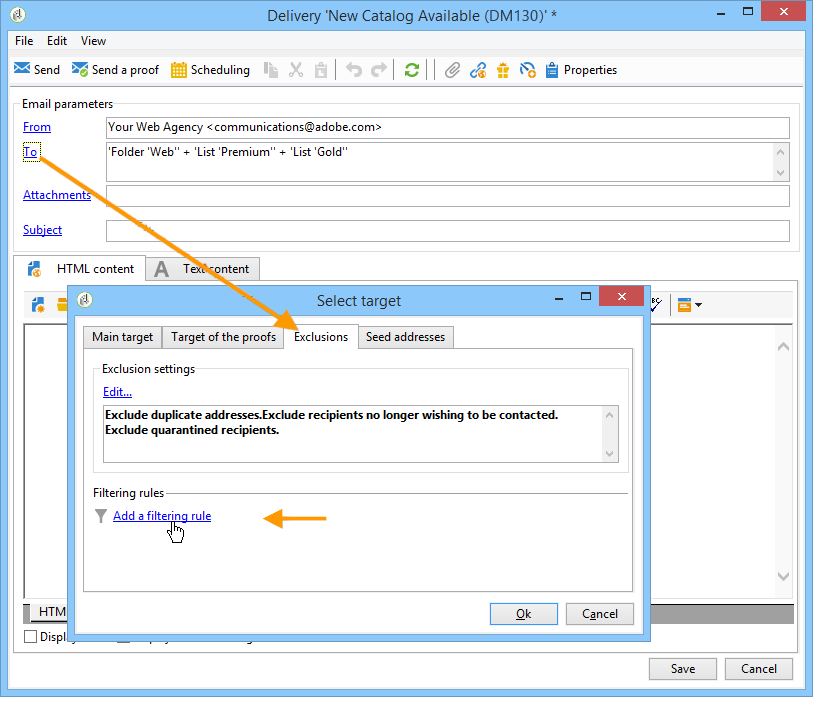

# 篩選規則{#filtering-rules}

使用篩選規則，根據查詢中定義的條件來選取要排除的訊息。 這些規則會連結至目標維度。

篩選規則可以連結到其他型別的規則（控制、壓力等） 在型別中，或分組在專用的 **篩選** 型別。 [了解更多](#create-and-use-a-filtering-typology)。

## 建立篩選規則 {#create-a-filtering-rule}

例如，您可以篩選新聞稿訂閱者，以防止將通訊傳送給未成年的收件者。

若要定義此篩選，請套用下列步驟：

1. 瀏覽至 **[!UICONTROL Administration > Campaign management > Typology management > Typology rules]** Campaign匯出程式的資料夾，然後按一下 **新增** 圖示以建立型別規則。
1. 建立 **[!UICONTROL Filtering]** 適用於所有管道的型別規則。

   

1. 從 **篩選** 索引標籤將預設目標維度變更為 **訂閱** (**nms：subscription**)。

   

1. 使用建立篩選器 **[!UICONTROL Edit the query from the targeting dimension...]** 連結。

   

1. 依收件者年齡篩選並儲存篩選條件。

   

1. 從 **型別** 標籤，將此規則連結至行銷活動型別並儲存。

   

在傳送中使用此規則時，系統會自動排除未成年訂閱者。 特定訊息會指出何時套用規則：

## 設定篩選規則的條件 {#condition-a-filtering-rule}

您可以根據連結的傳遞或傳遞大網限制篩選規則的應用程式欄位。

若要這麼做，請前往 **[!UICONTROL General]** 型別規則的索引標籤中，選取要套用的限制型別並建立篩選器。
<!--

-->

在此情況下，即使規則已連結至所有傳送，它僅會套用至符合已定義篩選條件的那些傳送。

>[!NOTE]
>
>型別與篩選規則可用於工作流程中，位於 **[!UICONTROL Delivery outline]** 活動。 [了解更多](../workflow/delivery-outline.md)。

## 建立並使用篩選型別 {#create-and-use-a-filtering-typology}

您可以建立 **[!UICONTROL Filtering]** 型別：僅包含篩選規則。

在選取目標時，這些特定型別可以連結至傳遞：在傳遞精靈中，按一下 **[!UICONTROL To]** 連結，然後按一下 **[!UICONTROL Exclusions]** 標籤。

然後選取要套用至傳遞的篩選型別。 若要這麼做，請按一下 **[!UICONTROL Add]** 按鈕並選取要套用的型別。

您也可以透過此索引標籤直接連結篩選規則，而不需將其分組在型別中。 要執行此操作，請使用視窗的下半部。

>[!NOTE]
>
>只有型別和篩選規則可在選取視窗中使用。
>
>這些設定可在傳遞範本中定義，以自動套用至使用範本建立的所有新傳遞。
>

## 預設傳遞能力排除規則 {#default-deliverability-exclusion-rules}

預設提供兩種篩選規則： **[!UICONTROL Exclude addresses]** ( **[!UICONTROL addressExclusions]** )和 **[!UICONTROL Exclude domains]** ( **[!UICONTROL domainExclusions]** )。 在電子郵件分析期間，這些規則會將收件者電子郵件地址與包含在加密全域隱藏清單（在傳遞能力執行個體中管理）中的禁止地址或網域名稱進行比較。 如果有相符專案，則不會傳送訊息給該收件者。

這是為了避免因惡意活動（尤其是使用Spamtrap）而加入封鎖清單。 例如，如果使用Spamtrap透過您的網路表單進行訂閱，則會自動傳送確認電子郵件給該Spamtrap，而您的地址會自動新增至封鎖清單中。

>[!NOTE]
>
>全域隱藏清單中包含的位址和網域名稱會隱藏。 傳遞分析記錄中只會指出已排除的收件者數量。
