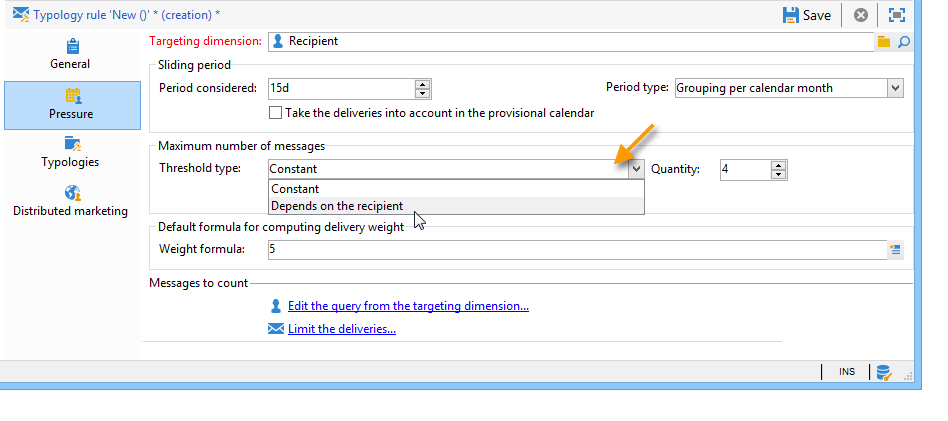
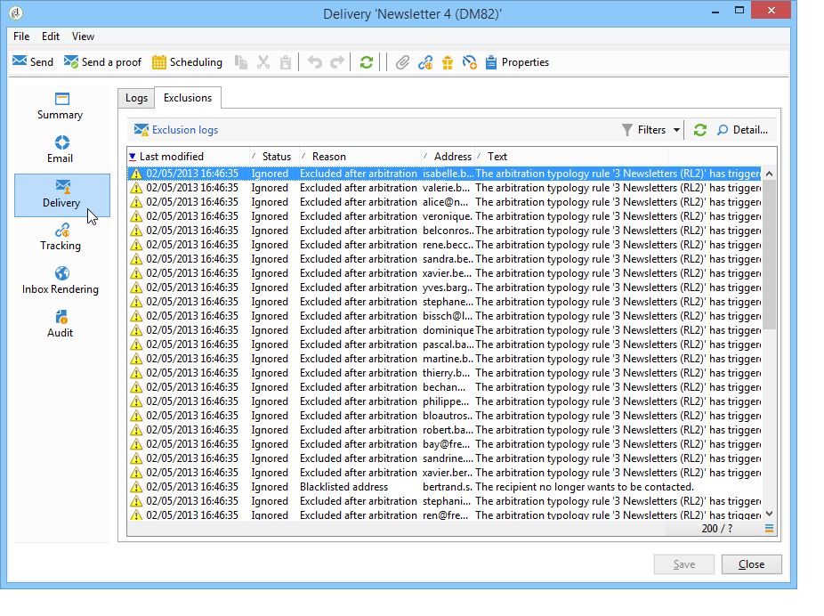

# 壓力規則{#pressure-rules}

實作銷售壓力管理可讓您避免過度向資料庫中的人口行銷（也稱為行銷疲勞）。 若要這麼做，您可以定義每個收件者的訊息數目上限。 它也可讓您在行銷活動之間實施仲裁規則，以將最佳訊息傳送給目標對象。

**壓力**&#x200B;規則，用於管理行銷疲勞，例如，將傳送給母體的信件數量限製為兩個、選取最符合訂閱者群組利益的通訊、避免傳送SMS給不滿的客戶等。

行銷活動是根據定義的臨界值和訊息權重來選取。

* 臨界值是指定期間內指定收件者獲授權的最高傳遞數量。 可以是設定或變數。 這是在型別規則設定中設定或計算的。 [了解更多](#maximum-number-of-messages)。
* 傳遞權重可讓您確認壓力管理架構內最優先的傳遞。具有最高權重的訊息具有優先順序。 [了解更多](#message-weight)。

仲裁包括確保權重大於進行中行銷活動的已排程行銷活動不會導致過多的設定檔請求：如果是這種情況，則會將設定檔從傳送中排除。

仲裁標準（訊息權重和/或臨界值）可能因兩種資訊型別而異：

* 收件者偏好設定，為宣告式資訊：電子報訂閱、收件者狀態（客戶或潛在客戶）、
* 收件者行為：購買、造訪的連結等。

定義合格訊息的仲裁規則會在分析階段期間套用。 對於每個收件者和相關期間，如果下列公式為true，將會傳送訊息： **（已傳送的訊息數） + （具有較大權重的訊息數） &lt;臨界值**。

否則，收件者將為&#x200B;**[!UICONTROL Excluded by arbitration]**。 [了解更多](#exclusion-after-arbitration)。

## 建立壓力規則 {#create-a-pressure-rule}

若要使用Adobe Campaign設定行銷活動之間的仲裁，請先建立行銷活動型別並定義連結型別規則（**壓力**&#x200B;規則）。

若要建立與設定 **[!UICONTROL Pressure]** 類型規則，請套用下列步驟：

1. 在行銷活動型別規則清單中，選取清單上方的&#x200B;**[!UICONTROL New]**&#x200B;圖示。

   

1. 在新規則的&#x200B;**[!UICONTROL General]**&#x200B;標籤中，選取&#x200B;**壓力**&#x200B;型別規則，並輸入其名稱和描述。

   

1. 視需要變更執行順序。 將多個型別規則套用為&#x200B;**[!UICONTROL Typology]**&#x200B;集時，會先套用順序較低的規則。 [了解更多](apply-rules.md#execution-order)。
1. 如果要儲存下一個每日重新仲裁執行之後的目標定位，請在&#x200B;**[!UICONTROL Calculation parameters]**&#x200B;區段中定義頻率。 [了解更多](apply-rules.md#adjust-calculation-frequency)。
1. 按一下「**[!UICONTROL Pressure]**」標籤，然後選擇套用型別規則的日曆期間。

   

   此規則將套用至聯絡日期包含在相關期間的傳遞。

   >[!NOTE]
   >
   >在Campaign的[企業(FFDA)部署](../../v8/architecture/enterprise-deployment.md)的內容中，未考慮排程的傳遞。

1. 定義計算最高訊息數的方法。

   臨界值代表在相關期間內可傳送給收件者的最大訊息數量。

   依照預設，臨界值為常數，您必須指出該規則授權的訊息數量上限。

   

   若要定義變數臨界值，請在&#x200B;**[!UICONTROL Type of threshold]**&#x200B;欄位中選取&#x200B;**[!UICONTROL Depends on the recipient]**&#x200B;值，並使用右側的圖示開啟運算式編輯器。

   

   如需詳細資訊，請參閱[訊息數目上限](#maximum-number-of-messages)。

1. 指定計算傳遞權重的方法。

   每個傳遞都有權重，即代表其優先順序等級的值：這會啟用行銷活動之間的仲裁。 權重是使用型別規則及/或其屬性中定義的公式來計算。 [了解更多](#message-weight)。

1. 預設情況下，所有訊息都將考慮到臨界值計算。**[!UICONTROL Restriction]**&#x200B;索引標籤可讓您篩選型別規則關注的訊息：

   * 此索引標籤的上方區段可讓您限制相關收件者。
   * 此索引標籤的下方區域可讓您篩選要計數的訊息。

     在下列範例中，只會考量儲存在&#x200B;**NewContacts**&#x200B;資料夾中的收件者，而且會關注以&#x200B;**電子報**&#x200B;開頭的傳送。

   

1. **[!UICONTROL Typologies]**&#x200B;索引標籤可讓您檢視套用此規則的促銷活動型別，或將規則連結至一或多個現有型別。 [了解更多](campaign-typologies.md#apply-typologies)。

## 定義臨界值和權重 {#define-thresholds-and-weights}

### 最大訊息數 {#maximum-number-of-messages}

每個壓力規則會定義一個臨界值，即在指定時段內可以傳送給一個收件者的訊息數量上限。 一旦達到此臨界值時，在考慮到該期間結束之前，將不再進行傳送。此程式可讓您在訊息超過設定的臨界值時，自動將收件者從傳遞中排除，以避免過度請求。

臨界值可以是常數，或透過包含變數的公式計算。 這表示在指定期間，臨界值可能會因收件者而異，甚至會針對相同收件者而有所不同。

>[!CAUTION]
>
>輸入&#x200B;**0**&#x200B;做為臨界值，會防止在考量的期間內所有傳遞到目標母體。

**範例：**

您可以根據收件者所屬的區段，索引授權訊息的數量。 這表示屬於網頁區段的收件者可能會收到比其他收件者更多的訊息。 **[!UICONTROL Iif (@origin='Web', 5, 3)]**&#x200B;型別公式可授權傳送5則訊息給收件者，3則訊息給其他區段。 設定如下：

若要定義臨界值，您可以使用連結至目標維度的維度：例如，若要包含傳遞至儲存在[訪客表格](../../v8/audiences/target-mappings.md)中的收件者設定檔的訊息，或避免每週傳送超過一封訊息給同一個家庭（可能指多個電子郵件地址），此訊息會識別在連結至收件者之維度的識別中。

若要這麼做，請選取&#x200B;**[!UICONTROL Count messages on a linked dimension]**&#x200B;選項，然後選取訪客或連絡人表格。

### 訊息權重 {#message-weight}

每個傳遞都有權重，代表其優先順序。傳遞的預設權重為 5。壓力規則可讓您定義要套用至傳遞的權重。

權重可以設定或透過公式計算以適合收件者。例如，您可以根據收件者的興趣定義傳遞權重。

>[!CAUTION]
>
>在&#x200B;**[!UICONTROL Properties]**&#x200B;索引標籤中，可為每個傳遞個別多載型別規則中定義的權重。 按一下&#x200B;**[!UICONTROL Typology]**&#x200B;索引標籤以選取行銷活動型別，並視需要指定要套用的權重。\
>不過，在A型別規則中宣告的權重不會用於計算B型別規則：此權重僅涉及使用A規則的傳送。

**範例：**

在以下範例中，我們想將音樂電子報的權重連結至其收件者的傾向分數。 操作步驟：

1. 建立新欄位以儲存收件者傾向分數。 在此案例中，欄位&#x200B;**@Music**&#x200B;將包含調查和線上投票、收集的追蹤資料等的答案。
1. 建立型別規則，以根據此欄位計算訊息權重。

   

1. 將此規則套用至包含下列主題的訊息：電子報、特殊優惠等。 這些傳送的權重，因此其優先順序層級，將取決於每個收件者的傾向分數。

## 設定期間 {#setting-the-period}

壓力規則定義於&#x200B;**n**&#x200B;天滾動期間。

週期是在規則的&#x200B;**[!UICONTROL Pressure]**&#x200B;索引標籤中設定。 您可以指定天數，並視需要選取要套用的群組型別（日、周、月、季等）。

群組型別可讓您針對該期間的日期，將&#x200B;**[!UICONTROL Period considered]**&#x200B;欄位延長至整天、行事曆周、行事曆月或行事曆年。

例如，若壓力規則定義每週2則訊息的臨界值，並對每個日曆月分組，將阻止在相同周內及相同日曆月內傳送超過2則訊息。 警告：如果期間與兩個月重疊，計算臨界值將考慮這兩個日曆月的傳送，因此可能阻止第二個月的所有新傳送。

>[!CAUTION]
>
>計算臨界值時，只會考慮已傳送的傳遞。

若要將考慮的傳送限制在2週期間，請在&#x200B;**[!UICONTROL Concerned period]**&#x200B;欄位中輸入&#x200B;**15d**：在計算時，會考慮在套用規則的傳送日期前兩週傳送的傳送

期間開始日期取決於資料庫的設定方式。

例如，如果您套用15天壓力規則，但沒有將日期為12/11的交貨分組，則會考慮11/27至12/12之間的交貨。 如果壓力規則將臨時行事曆中的傳遞列入考量，則會將排程在11/27和12/27之間的所有傳遞列入考量。 最後，如果您在規則中為每個日曆月設定分組，則計算臨界值（從11/1到12/31）時將考慮11月和12月的所有傳送。

**常見案例**

為了確保不會考量目前行事曆周的傳遞，以及不會同時考量來自前一週的傳遞來計算臨界值，請在「0」指定&#x200B;**[!UICONTROL Period considered]**，並選取「每個行事曆周分組」作為&#x200B;**[!UICONTROL Period type]**。

當時段高於0 （例如1）時，計算臨界值可能會考量前一天的傳送情況。 因此，如果前一天對應到前一個日曆週，且所選的期間型別是「每個日曆週分組」，則計算臨界值時將考慮前一週的所有時間。

**範例：**

我們想要建立壓力規則，將請求限製為每兩週期間最多3則訊息，並將分組限制在行事曆月份。

假設六份相同重量的電子報排程為05/30、06/3、06/8、06/12、06/22和06/30。

將不會傳送排程在6月12日和30日的傳送： 06/12傳送將超過每2週期間3則訊息的臨界值，而第30次傳送將超過每個日曆月的授權通訊臨界值。

在分析階段，仲裁會排除這些傳遞的所有收件者：

對於相同的規則，如果您每季將傳遞分組，第&#x200B;**新聞稿5**&#x200B;號的收件者也會被排除，且不會傳送。

最後，如果未選取分組，則不會傳送&#x200B;**第4**&#x200B;號電子報，因為其排程與前三份電子報相同，為期兩週。

>[!NOTE]
>
>當您變更型別規則的定義時，可以建立&#x200B;**模擬**&#x200B;來控制其對套用到的傳遞的影響，並監視傳遞彼此的影響。 [了解更多](campaign-simulations.md)。

## 仲裁後排除 {#exclusion-after-arbitration}

每晚會透過&#x200B;**[!UICONTROL Forecasting]**&#x200B;技術工作流程和&#x200B;**[!UICONTROL Campaign jobs]**&#x200B;工作流程重新套用仲裁。

**[!UICONTROL Forecasting]**&#x200B;工作流程會預先計算進行中期間（從開始日期至目前日期）的資料，以便在分析期間套用型別規則。 它也會每晚重新計算排除計數器以進行仲裁。

因此，對於每個收件者，Adobe Campaign會考量在相關期間內已傳送的訊息數，檢查要傳送的訊息數是否不超過臨界值。 此資訊是&#x200B;**指示器**，因為所有計算都會在傳遞時更新。

如果此數字超過臨界值，則會套用行銷活動型別中定義的仲裁規則，並從權重較低的行銷活動中排除收件者。

>[!NOTE]
>
>如果數個傳遞具有相同分數，則會傳送排程為最早日期的行銷活動。

## 壓力規則的使用案例 {#use-cases-on-pressure-rules}

### 根據條件調整臨界值 {#adapt-the-threshold-based-on-criterion}

我們想要建立型別規則，以防止每週傳送超過4則訊息給客戶，以及每週傳送2則訊息給潛在客戶。

若要識別客戶和潛在客戶，請使用&#x200B;**[!UICONTROL Status]**&#x200B;欄位，其中的0代表潛在客戶，1代表客戶。

若要建立規則，請套用以下步驟：

1. 建立新的&#x200B;**壓力**&#x200B;型別型別規則。
1. 編輯&#x200B;**[!UICONTROL Pressure]**&#x200B;標籤：在&#x200B;**[!UICONTROL Maximum number of messages]**&#x200B;區段中，我們要建立一個公式以根據每個收件者計算臨界值。 在&#x200B;**[!UICONTROL Threshold type]**&#x200B;欄位中選取&#x200B;**[!UICONTROL Depends on the recipient]**&#x200B;值，然後按一下&#x200B;**[!UICONTROL Formula]**&#x200B;欄位右側的&#x200B;**[!UICONTROL Edit expression]**。

   按一下&#x200B;**[!UICONTROL Advanced parameters]**&#x200B;按鈕以定義計算公式。

   

1. 選取&#x200B;**[!UICONTROL Edit the formula using an expression]**&#x200B;選項並按一下&#x200B;**[!UICONTROL Next]**。

   

1. 在函式清單中，連按兩下&#x200B;**[!UICONTROL Others]**&#x200B;節點中的&#x200B;**Iif**&#x200B;函式。

   然後在&#x200B;**[!UICONTROL Available fields]**&#x200B;區段中選取收件者的&#x200B;**狀態**。

   

   輸入下列公式： **Iif(@status=0,2，4)**

   

   此公式可讓您在狀態等於 0 時指派值為 2，而所有其他狀態的值為 4。

   按一下 **[!UICONTROL Finish]** 以核准公式。

1. 指定將套用規則的期間：在此情況下，為7天，以計算每週的訊息數。

   

1. 儲存規則以核准建立。

現在將您剛建立的規則連結至型別，以便套用至傳送。 操作步驟：

1. 建立行銷活動型別。
1. 前往&#x200B;**[!UICONTROL Rules]**&#x200B;標籤，按一下&#x200B;**[!UICONTROL Add]**&#x200B;按鈕並選取您剛建立的規則。

   

1. 儲存型別：會將其新增至現有型別的清單中。

若要在傳遞中使用此型別，請在&#x200B;**[!UICONTROL Typology]**&#x200B;索引標籤中的傳遞屬性中選取它，如下所示：

>[!NOTE]
>
>可以在傳遞範本中定義類型，以便自動套用至使用此範本建立的所有傳送。

在傳遞分析期間，會根據已傳送給收件者的傳遞數量，將適用的傳遞收件者從傳遞中排除。 若要檢視此資訊，您可以：

* 檢視分析結果：

  

* 編輯傳遞，然後按一下「**[!UICONTROL Delivery]**」索引標籤及「**[!UICONTROL Exclusions]**」子索引標籤：

  

* 按一下「**[!UICONTROL Audit]**」標籤，然後按「**[!UICONTROL Causes of exclusions]**」子標籤，顯示排除專案數和套用的型別規則：

  

### 根據行為計算傳遞權重 {#calculate-the-delivery-weight-based-on-behavior}

您可以根據收件者行為來定義壓力規則：因此，傳遞的權重可以因應不同收件者的條件。 例如，您可以根據收件者是否造訪您的網際網路網站、點選上次電子報的特定區段、訂閱資訊服務，或甚至根據意見調查、線上遊戲等的回答來決定傳送訊息。

在下列範例中，我們要建立權重為5的傳遞。 此權重中根據收件者行為的傾向分數更為豐富：已從此網站訂購的客戶分數將為5，而從未線上上訂購的客戶分數將為4。

若要執行此組態型別，您必須使用公式來定義訊息權重。 有關傾向分數和調查答案的資訊必須在資料模型中可存取。 在我們的範例中，已新增&#x200B;**傾向**&#x200B;欄位。

套用下列設定步驟：

1. 建立新的&#x200B;**壓力**&#x200B;型別型別規則。
1. 編輯&#x200B;**[!UICONTROL Pressure]**&#x200B;標籤。 我們要建立以每個個別收件者為基礎的臨界值公式：按一下「**[!UICONTROL Weight formula]**」欄位右側的「**[!UICONTROL Edit expression]**」圖示。

   

1. 依預設，值&#x200B;**5**&#x200B;會顯示在運算式編輯器的上半部。 我們想要將每個收件者的傾向分數新增至此權重：將游標置於5的右側，輸入&#x200B;**+**&#x200B;字元並選取&#x200B;**傾向**&#x200B;欄位。

   

1. 然後為已購買的收件者新增較高的值。 對於他們，傳遞的重量必須增加5，而其他人只增加4。

   

1. 按一下&#x200B;**[!UICONTROL Finish]**&#x200B;以儲存此規則。
1. 將規則連結至行銷活動型別，並在傳遞中參考此型別以進行核准。

### 僅傳送加權最高的訊息 {#send-only-the-highest-weighted-messages}

您想要在同一週內傳送不超過2則訊息（限製為每天2則訊息）給每個收件者，而且您只想要傳遞權重較高的訊息。

為此，您需要為相同的收件者排程數個具有不同權重的傳送，並套用壓力規則以排除權數較低的傳送。

首先，設定壓力規則。

1. 建立壓力規則。 [了解更多](#create-a-pressure-rule)。
1. 在&#x200B;**[!UICONTROL General]**&#x200B;索引標籤中，選取&#x200B;**[!UICONTROL Re-apply the rule at the start of personalization]**&#x200B;選項。

   

   此選項會覆寫&#x200B;**[!UICONTROL Frequency]**&#x200B;欄位中定義的值，並在個人化階段自動套用規則。 [了解更多](apply-rules.md#adjust-calculation-frequency)。

1. 在&#x200B;**[!UICONTROL Pressure]**&#x200B;索引標籤中，選取&#x200B;**[!UICONTROL 7d]**&#x200B;作為&#x200B;**[!UICONTROL Period considered]**，選取&#x200B;**[!UICONTROL Grouping per day]**&#x200B;作為&#x200B;**[!UICONTROL Period type]**。
1. 在&#x200B;**[!UICONTROL Typologies]**&#x200B;索引標籤中，將規則連結至行銷活動型別。
1. 儲存您的變更。

現在，為您要套用壓力規則的每個傳遞建立和設定工作流程。

1. 建立行銷活動。 [了解更多](../campaigns/marketing-campaign-create.md#create-a-campaign)。
1. 在行銷活動的&#x200B;**[!UICONTROL Targeting and workflows]**&#x200B;索引標籤中，新增&#x200B;**查詢**&#x200B;活動至您的工作流程。 有關使用此活動的詳細資訊，請參閱[本區段](../workflow/query.md)。
1. 將&#x200B;**[!UICONTROL Email delivery]**&#x200B;活動新增至工作流程並開啟它。 有關使用此活動的詳細資訊，請參閱[本區段](../workflow/delivery.md)。
1. 前往&#x200B;**[!UICONTROL Delivery properties]**&#x200B;的&#x200B;**[!UICONTROL Approvals]**&#x200B;標籤，並停用所有核准。

   

1. 在&#x200B;**[!UICONTROL Delivery properties]**&#x200B;的&#x200B;**[!UICONTROL Typology]**&#x200B;標籤中，參考要套用規則的行銷活動型別。 定義傳遞的權重。

   

1. 在傳遞中，按一下&#x200B;**[!UICONTROL Scheduling]**&#x200B;並選取&#x200B;**[!UICONTROL Schedule delivery (automatic execution when the scheduled date is reached)]**。 在此範例中，選取&#x200B;**[!UICONTROL Use a calculation formula]**&#x200B;選項。
1. 將擷取日期設為10分鐘（目前日期+ 10分鐘）。
1. 將聯絡日期設定為隔天（目前日期+ 1天）。

   

   為了成功實作壓力規則排除，請務必在聯絡日期與時間之前設定提取日期與時間，以及在重新套用夜間仲裁之前。 [了解更多](#exclusion-after-arbitration)。

1. 取消選取&#x200B;**[!UICONTROL Confirm the delivery before sending]**&#x200B;選項並儲存變更。
1. 以類似方式繼續處理您要傳送的每個傳遞。 請務必為每個傳遞設定所需的權重。
1. 執行相關工作流程以準備和傳送傳遞。

套用夜間仲裁時，將排除相同收件者具有較低權重的傳送。 只有權重最高的傳遞才會被視為傳送。 [了解更多](#message-weight)。

考慮到本週早些時候已傳送電子郵件給相關收件者，下表顯示可再套用兩次傳送的設定範例。

<table> 
 <thead> 
  <tr> 
   <th> 傳遞  </th> 
   <th> 核准  </th> 
   <th> 權重  </th> 
   <th> 擷取日期/時間  </th> 
   <th> 聯絡日期  </th> 
   <th> 傳遞開始日期/時間  </th> 
   <th> 仲裁工作流程執行日期/時間  </th> 
   <th> 傳遞狀態  </th> 
   <th> 傳遞已傳送（日期/時間）  </th> 
  </tr> 
 </thead> 
 <tbody> 
  <tr> 
   <td> 傳遞1  </td> 
   <td> 已停用  </td> 
   <td> 5  </td> 
   <td> 下午3點  </td> 
   <td> 上午8點（次日）  </td> 
   <td> 下午2點  </td> 
   <td> 每晚  </td> 
   <td> 已排除  </td> 
   <td> 已排除  </td> 
  </tr> 
  <tr> 
   <td> 傳遞2  </td> 
   <td> 已停用  </td> 
   <td> 10  </td> 
   <td> 下午4點  </td> 
   <td> 上午9點（次日）  </td> 
   <td> 下午2點  </td> 
   <td> 每晚  </td> 
   <td> 已傳送  </td> 
   <td> 上午9點（次日）  </td> 
  </tr> 
 </tbody> 
</table>

在兩次傳送的摘取日期過後，會在兩次傳送的聯絡日期之前重新套用夜間仲裁。 這可讓您尋找已傳送（已針對其處理傳送、透過廣泛記錄檔記錄）或已排程傳送的所有傳送（透過預測記錄檔記錄，符合接收傳送條件的收件者）。

在壓力規則定義的期間內列出所有已傳送和可能的傳送後，Adobe Campaign會依權重排序，權重最高的為前。 當達到壓力規則中設定的臨界值時（也就是同一週內不超過2封電子郵件），收件者會從傳遞中排除。
