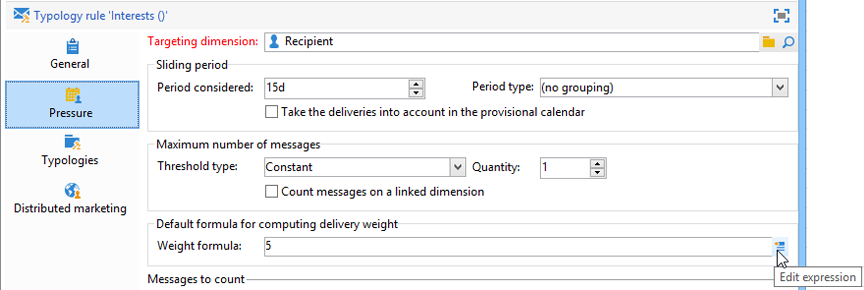

# 壓力規則{#pressure-rules}

通過實施銷售壓力管理，您可以避免在資料庫中過度招徠客戶，也稱為營銷疲勞。 為此，您可以定義每個收件人的最大郵件數。 它還允許您在市場活動之間實施仲裁規則，以便向目標受眾發送最佳資訊。

**壓力** 規則，管理營銷疲勞，例如，將要發給一個群體的信件數量限制為2，選擇最符合一組用戶利益的通信，避免向不滿意的客戶發送簡訊等。

根據定義的閾值和消息權重來選擇市場活動。

* 閾值是在給定期間內為給定接收者授權的最大遞送數。 它可以是設定的，也可以是變數。 它在類型規則設定中設定或計算。 [了解更多資訊](#maximum-number-of-messages)。
* 交付權重使您能夠確定壓力管理框架內的優先交付。 權重最高的消息具有優先順序。 [了解更多資訊](#message-weight)。

仲裁包括確保權重大於正在進行的活動的計畫活動不會導致過多的概況徵集：如果是，則配置檔案將從交貨中排除。

仲裁標準（消息權重和/或閾值）可根據以下兩種類型的資訊而有所不同：

* 收件人首選項，其中包含聲明性資訊：新聞稿訂閱、收件人狀態（客戶或潛在客戶）、
* 收件人行為：購買、訪問的連結等。

在分析階段應用用於定義合格消息的仲裁規則。 對於每個收件人和相關期間，如果以下公式為true，則將發送消息： **（發送的消息數）+（權重較大的消息數）&lt;閾值**。

否則，收件人將 **[!UICONTROL Excluded by arbitration]**。 [了解更多資訊](#exclusion-after-arbitration)。

## 建立壓力規則 {#create-a-pressure-rule}

要使用Adobe Campaign在市場活動之間建立仲裁，請首先建立市場活動類型並定義連結類型規則(**壓力** 規則)。

若要建立與設定 **[!UICONTROL Pressure]** 類型規則，請套用下列步驟：

1. 在市場活動類型規則清單中，選擇 **[!UICONTROL New]** 表徵圖。

   

1. 在 **[!UICONTROL General]** 頁籤，選擇 **壓力** 鍵入規則並輸入其名稱和說明。

   

1. 如果需要，請更改執行順序。 當將多個類型規則應用為 **[!UICONTROL Typology]** 設定後，首先應用下序規則。 [了解更多資訊](apply-rules.md#execution-order)。
1. 在 **[!UICONTROL Calculation parameters]** 部分，如果希望保存目標時間超過下一天重新仲裁執行的時間，請定義頻率。 [了解更多資訊](apply-rules.md#adjust-calculation-frequency)。
1. 按一下 **[!UICONTROL Pressure]** ，然後選擇應用類型規則的日曆期間。

   

   該規則將適用於聯繫日期包括在有關期間內的交貨。

   >[!NOTE]
   >
   >未考慮計畫交貨。

1. 定義用於計算最大消息數的方法。

   該閾值表示在相關期間可發送給接收者的消息的最大數目。

   依照預設，臨界值為常數，您必須指出該規則授權的訊息數量上限。

   

   要定義變數閾值，請選擇 **[!UICONTROL Depends on the recipient]** 值 **[!UICONTROL Type of threshold]** 欄位，然後使用右側的表徵圖開啟表達式編輯器。

   

   有關此內容的詳細資訊，請參閱 [最大消息數](#maximum-number-of-messages)。

1. 指定計算交貨重量的方法。

   每個交貨都具有權重，即表示其優先順序的值：這允許在活動之間進行仲裁。 權值使用在類型規則和/或其屬性中定義的公式計算。 [了解更多資訊](#message-weight)。

1. 預設情況下，所有訊息都將考慮到臨界值計算。的 **[!UICONTROL Restriction]** 頁籤，用於篩選與類型規則相關的消息：

   * 此頁籤的上半部分允許您限制相關收件人。
   * 此頁籤的下半部分允許您過濾要計數的消息。

      在以下示例中，僅在 **新建聯繫人** 資料夾已被考慮，交貨從 **新聞稿** 很擔心。
   

1. 的 **[!UICONTROL Typologies]** 頁籤，用於查看應用此規則或將規則連結到一個或多個現有類型的市場活動類型。 [了解更多資訊](campaign-typologies.md#apply-typologies)。

## 定義閾值和權重 {#define-thresholds-and-weights}

### 最大消息數 {#maximum-number-of-messages}

每個壓力規則定義一個閾值，即在給定時間段內可以發送給一個接收者的消息的最大數量。 一旦達到此臨界值時，在考慮到該期間結束之前，將不再進行傳送。此過程允許您在郵件超過設定的閾值時自動將收件人排除在傳遞之外，從而避免過度請求。

閾值可以是常數，也可以是通過帶變數的公式計算。 這意味著，在給定時間段內，閾值可能會因接收者的不同而有所不同，甚至對於同一接收者也是如此。

>[!CAUTION]
>
>輸入 **0** 因為閾值禁止在所考慮的期間內向目標人口交付所有貨物。

**範例:**

您可以根據收件人所屬的段對授權郵件數進行索引。 這意味著屬於Web段的接收者可接收比其他接收者更多的消息。 安 **[!UICONTROL Iif (@origin='Web', 5, 3)]** 類型公式授權將5封郵件遞送給收件人，將3封郵件遞送給其他段。 配置如下：

要定義閾值，可以使用連結到目標維的維：例如，要包括發送到訪問者表中儲存的收件人配置檔案的郵件(有關訪問者表中的詳細資訊，請參閱（本節）(corvess/using/use-case-creating-a-refer-a-friend-form.md))，或避免每週向與收件人的維連結的同一家庭發送多封郵件（可能涉及多個電子郵件地址）。

為此，請選擇 **[!UICONTROL Count messages on a linked dimension]** ，然後選擇訪問者或聯繫人表。

### 消息權重 {#message-weight}

每個遞送具有表示其優先順序的權重。 預設情況下，交貨的重量設定為5。 壓力規則允許您定義要應用於的交貨的重量。

可以通過公式設定或計算權重以適合接收者。 例如，您可以根據接收方的興趣來定義交貨的權重。

>[!CAUTION]
>
>在類型規則中定義的重量可針對每個交貨單獨重載， **[!UICONTROL Properties]** 頁籤。 按一下 **[!UICONTROL Typology]** 頁籤以選擇市場活動類型，並指定要應用的權重。\
>但是，A類型規則中聲明的權重將不用於計算B類型規則：此重量僅涉及使用A規則的交貨。

**範例:**

在下例中，我們希望將音樂新聞稿的權重與其接受者的傾向得分掛鈎。 操作步驟：

1. 建立新欄位以儲存收件人傾向分數。 那塊地， **@Music** 在這種情況下，將通過調查和線上調查的答案、收集的跟蹤資料等來豐富資訊。
1. 建立一種類型規則以基於此欄位計算消息權重。

   

1. 將此規則應用於具有以下主題的消息：通訊、特別優惠等。 這些交貨的重量，以及其優先程度，將取決於每個接收者的傾向得分。

## 設定期間 {#setting-the-period}

壓力規則在中定義 **n**-day滾動期間。

期間在 **[!UICONTROL Pressure]** 頁籤。 您可以指定天數，並根據需要選擇要應用的分組類型（天、周、月、季度等）。

分組類型允許您擴展 **[!UICONTROL Period considered]** 欄位，以顯示期間日期的整日、日曆周、日曆月或日曆年。

例如，壓力規則定義每週2封郵件的閾值，每個日曆月分組，將阻止在同一週AND內在同一日曆月內傳送2封以上的郵件。 警告，如果期間與兩個月重疊，則計算閾值將考慮這兩個日曆月的交貨量，因此可能會阻止第二個月內的所有新交貨。

>[!CAUTION]
>
>計算閾值時只考慮已發送的交貨。

要將考慮的交貨限制為2週期間，請輸入 **15天** 的 **[!UICONTROL Concerned period]** 欄位：計算時將考慮在應用規則的交貨日期前兩週前交貨的交貨

期間開始日期取決於資料庫的配置方式。

例如，如果您應用15天壓力規則而不將其分組到日期為12/11的交貨，則在11/27和12/12之間將考慮交貨。 如果壓力規則考慮到臨時日曆中的交貨，則將考慮11/27至12/27之間安排的所有交貨。 最後，如果在規則中按日曆月配置分組，則在計算閾值時（從11/1到12/31）將考慮11月和12月的所有交貨。

**常見案例**

要確保未考慮當前日曆周的交貨，並且不要冒風險也考慮計算閾值上週的交貨，請指定 **[!UICONTROL Period considered]** 在「0」處選擇「按日曆周分組」作為 **[!UICONTROL Period type]**。

當期間大於0（例如1）時，計算閾值可以考慮上一天的交貨。 因此，如果上一天與上一個日曆周相對應，並且選定的期間類型是「按日曆周分組」，則計算閾值將考慮上一週的所有時間。

**範例:**

我們希望建立一個壓力規則，該規則將請求限制為每2週的3封郵件，並將分組限制為日曆月。

讓我們舉辦6份同樣重量的通訊，定於2005年5月30日、2006年6月3日、2006年8月、2006年6月12日、2006年2月和2006年30日舉行。

預定於6月12日和30日交付的貨物將不發送：06/12遞送將超過每兩週期間3封郵件的閾值，第30次遞送將超過每日曆月授權通信的閾值。

在分析階段，仲裁將排除這些交貨的所有接收方：

對於同一規則，如果按季度對交貨進行分組，則 **新聞稿第5號** 也會被排除，不會發送。

最後，如果未選擇分組，則僅 **新聞稿第4號** 將不發送，因為它與前三份通訊安排在同一個2週期間。

>[!NOTE]
>
>更改類型規則的定義時，可以建立 **模擬** 控制其對交付的影響，並監測交付對彼此的影響。 [了解更多資訊](campaign-simulations.md)。

## 仲裁後排除 {#exclusion-after-arbitration}

每晚，仲裁通過 **[!UICONTROL Forecasting]** 技術工作流和 **[!UICONTROL Campaign jobs]** 工作流。

的 **[!UICONTROL Forecasting]** 工作流預計算進行中期間（從其起始日期到當前日期）的資料，這允許在分析期間應用類型規則。 它還重新計算每晚仲裁的排除計數器。

因此，對於每個接收方，Adobe Campaign檢查要發送的消息數量是否不超過閾值，同時考慮到在有關期間已發送的消息數量。 此資訊是 **指標**，因為所有計算都在交付時更新。

如果此數超過閾值，則應用市場活動類型中定義的仲裁規則，並將接收人排除在權重較低的市場活動之外。

>[!NOTE]
>
>如果多個交貨的得分相等，則將發送計畫為最早日期的市場活動。

## 使用壓力規則案例 {#use-cases-on-pressure-rules}

### 基於准則調整閾值 {#adapt-the-threshold-based-on-criterion}

我們希望建立一個類型規則，以防止每週向客戶傳遞超過4封郵件，每週向潛在客戶傳遞2封郵件。

要識別客戶和潛在客戶，請使用 **[!UICONTROL Status]** 欄位，其中包含0表示潛在客戶，1表示客戶。

若要建立規則，請套用以下步驟：

1. 新建 **壓力** 類型類型規則。
1. 編輯 **[!UICONTROL Pressure]** 頁籤：的 **[!UICONTROL Maximum number of messages]** 部分，我們要根據每個收件人建立計算閾值的公式。 選擇 **[!UICONTROL Depends on the recipient]** 值 **[!UICONTROL Threshold type]** 欄位，然後按一下 **[!UICONTROL Edit expression]** 權 **[!UICONTROL Formula]** 的子菜單。

   按一下 **[!UICONTROL Advanced parameters]** 按鈕。

   

1. 選擇 **[!UICONTROL Edit the formula using an expression]** 選項 **[!UICONTROL Next]**。

   

1. 在函式清單中，按兩下 **如果** 函式 **[!UICONTROL Others]** 的下界。

   然後選擇收件人 **狀態** 的 **[!UICONTROL Available fields]** 的子菜單。

   

   輸入以下公式： **Iif(@status=0,2,4)**

   

   此公式可讓您在狀態等於 0 時指派值為 2，而所有其他狀態的值為 4。

   按一下 **[!UICONTROL Finish]** 以核准公式。

1. 指明規則將應用的期間：在此情況下為7天，以計數每週的消息數。

   

1. 儲存規則以核准建立。

現在，將您剛剛建立的規則連結到類型學，以便將其應用於交貨。 操作步驟：

1. 建立市場活動類型。
1. 轉到 **[!UICONTROL Rules]** 頁籤 **[!UICONTROL Add]** 按鈕，選擇剛建立的規則。

   

1. 保存類型：是否被添加到現有類型清單中。

要在交貨中使用此類型，請在交貨屬性中選擇 **[!UICONTROL Typology]** 頁籤，如下所示：

>[!NOTE]
>
>可以在傳遞範本中定義類型，以便自動套用至使用此範本建立的所有傳送。

在交貨分析期間，根據已發送給交貨的數量，交貨接收人將從交貨中排除（如果適用）。 要查看此資訊，您可以：

* 查看分析結果：

   

* 編輯交貨並按一下 **[!UICONTROL Delivery]** 頁籤 **[!UICONTROL Exclusions]** 子頁籤：

   

* 按一下 **[!UICONTROL Audit]** ，則 **[!UICONTROL Causes of exclusions]** 子頁籤，顯示排除數和應用的類型規則：

   

### 根據行為計算交貨重量 {#calculate-the-delivery-weight-based-on-behavior}

您可以根據收件人行為定義壓力規則：因此，遞送的重量可以適應不同接受者之間的標準。 例如，您可以根據收件人是否訪問了您的網際網路站點、在上一份新聞簡報的特定部分中按一下、訂閱了資訊服務，甚至根據調查答案、線上遊戲等，決定發送消息。

在以下示例中，我們要建立一個重量為5的交貨。 這種權重通過基於接受者行為的傾向得分來增強：已從此站點訂購的客戶的得分為5，而從未線上訂購的客戶的得分為4。

要執行此類配置，需要使用公式來定義消息權重。 在資料模型中必須能夠獲取有關傾向分數和調查答案的資訊。 在我們的例子中， **傾向** 已添加。

應用以下配置步驟：

1. 新建 **壓力** 類型類型規則。
1. 編輯 **[!UICONTROL Pressure]** 頁籤。 我們想建立一個閾值公式，該公式將基於每個收件人：按一下 **[!UICONTROL Edit expression]** 表徵圖 **[!UICONTROL Weight formula]** 的子菜單。

   

1. 預設情況下，值 **5** 顯示在表達式編輯器的上部。 我們要將每個收件人的傾向得分添加到此權重：將游標置於5的右側，輸入 **+** 字元並選擇 **傾向** 的子菜單。

   

1. 然後為已購買的收件人添加更高的值。 對他們來說，送貨的重量必須增加5，而對其他人來說，只增加4。

   

1. 按一下 **[!UICONTROL Finish]** 保存此規則。
1. 將規則連結到市場活動類型，並在交貨中引用此類型以批准它。

### 僅發送加權最高的消息 {#send-only-the-highest-weighted-messages}

您希望在同一週內向每個收件人發送不超過2封郵件，每天最多只能發送2封郵件，並且您只希望傳遞權重較高的郵件。

為此，您需要為同一接收人安排多個具有不同重量的交貨，並應用壓力規則以排除具有較低重量的交貨。

首先，配置壓力規則。

1. 建立壓力規則。 [了解更多資訊](#create-a-pressure-rule)。
1. 在 **[!UICONTROL General]** 頁籤 **[!UICONTROL Re-apply the rule at the start of personalization]** 的雙曲餘切值。

   

   此選項覆蓋在 **[!UICONTROL Frequency]** 在個性化階段自動應用規則。 [了解更多資訊](apply-rules.md#adjust-calculation-frequency)。

1. 在 **[!UICONTROL Pressure]** 頁籤 **[!UICONTROL 7d]** 的 **[!UICONTROL Period considered]** 和 **[!UICONTROL Grouping per day]** 的 **[!UICONTROL Period type]**。
1. 在 **[!UICONTROL Typologies]** 頁籤，將規則連結到市場活動類型。
1. 儲存您的變更。

現在，為要應用壓力規則的每個交貨建立並配置工作流。

1. 建立促銷活動. [了解更多資訊](../campaigns/marketing-campaign-create.md#create-a-campaign)。
1. 在 **[!UICONTROL Targeting and workflows]** 頁籤，添加 **查詢** 活動。 有關使用本練習的詳細資訊，請參閱 [此部分](../workflow/query.md)。
1. 添加 **[!UICONTROL Email delivery]** 活動並將其開啟。 有關使用本練習的詳細資訊，請參閱 [此部分](../workflow/delivery.md)。
1. 轉到 **[!UICONTROL Approvals]** 頁籤 **[!UICONTROL Delivery properties]** 並禁用所有批准。

   

1. 在 **[!UICONTROL Typology]** 頁籤 **[!UICONTROL Delivery properties]**，引用市場活動類型以應用上的規則。 定義交貨的重量。

   

1. 在交貨中，按一下 **[!UICONTROL Scheduling]** 選擇 **[!UICONTROL Schedule delivery (automatic execution when the scheduled date is reached)]**。 在此示例中，選擇 **[!UICONTROL Use a calculation formula]** 的雙曲餘切值。
1. 將提取日期設定為10分鐘（當前日期+ 10分鐘）。
1. 將聯繫日期設定為下一天（當前日期+ 1天）。

   

   要成功實施壓力規則排除，請確保在聯繫日期和時間之前以及重新應用夜間仲裁之前設定提取日期和時間。 [了解更多資訊](#exclusion-after-arbitration)。

1. 取消選擇 **[!UICONTROL Confirm the delivery before sending]** 的子菜單。
1. 對於要發送的每個交貨，都執行類似的操作。 確保為每個交貨設定所需重量。
1. 運行相關工作流以準備和發送交貨。

當應用夜間仲裁時，將排除相同接收者的重量較低的遞送。 只有重量最重的交貨才考慮發送。 [了解更多資訊](#message-weight)。

考慮到本週早些時候已向相關收件人發送了電子郵件，下表顯示了可再應用兩次交貨的配置示例。

<table> 
 <thead> 
  <tr> 
   <th> 傳遞  </th> 
   <th> 批准  </th> 
   <th> 重量  </th> 
   <th> 提取日期/時間  </th> 
   <th> 聯繫日期  </th> 
   <th> 交貨開始日期/時間  </th> 
   <th> 仲裁工作流執行日期/時間  </th> 
   <th> 交貨狀態  </th> 
   <th> 已發送交貨（日期/時間）  </th> 
  </tr> 
 </thead> 
 <tbody> 
  <tr> 
   <td> 交貨1  </td> 
   <td> 已停用  </td> 
   <td> 5  </td> 
   <td> 下午  </td> 
   <td> 上午8點（下一天）  </td> 
   <td> 2:00  </td> 
   <td> 每晚  </td> 
   <td> 已排除  </td> 
   <td> 已排除  </td> 
  </tr> 
  <tr> 
   <td> 交貨2  </td> 
   <td> 已停用  </td> 
   <td> 10  </td> 
   <td> 下午4:00  </td> 
   <td> 上午9點（第二天）  </td> 
   <td> 2:00  </td> 
   <td> 每晚  </td> 
   <td> 已傳送  </td> 
   <td> 上午9點（第二天）  </td> 
  </tr> 
 </tbody> 
</table>

在兩個交貨的提取日期過後，在兩個交貨的聯繫日期之前重新應用夜間仲裁。 這可以查找已發送的所有交貨（已處理交貨的收件人，通過廣義日誌記錄）或計畫發送的收件人（有資格接收交貨的收件人，通過預測日誌記錄）。

一旦所有發貨和潛在交貨都列在壓力規則所定義的期間，Adobe Campaign就按重量排序，其中最高的是加權。 當達到壓力規則中設定的閾值（此處在同一週內不超過2封電子郵件）時，收件人將被排除在傳遞之外。
