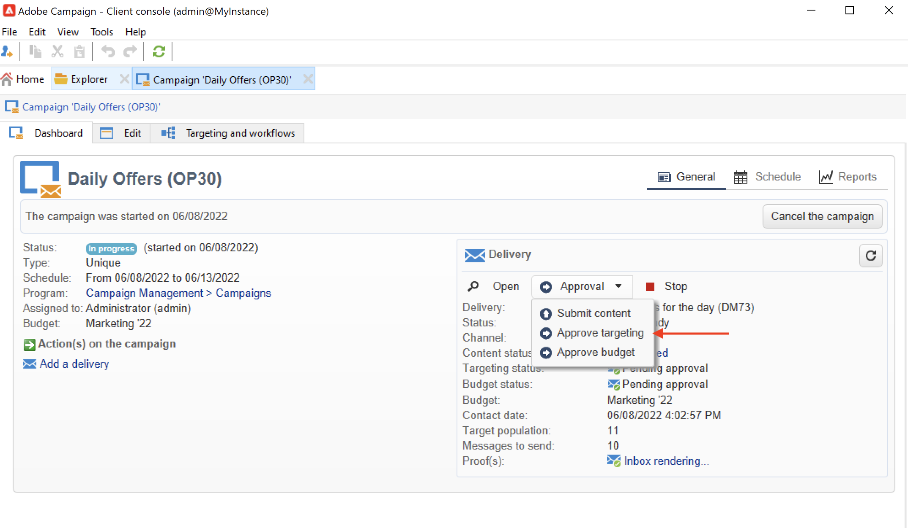
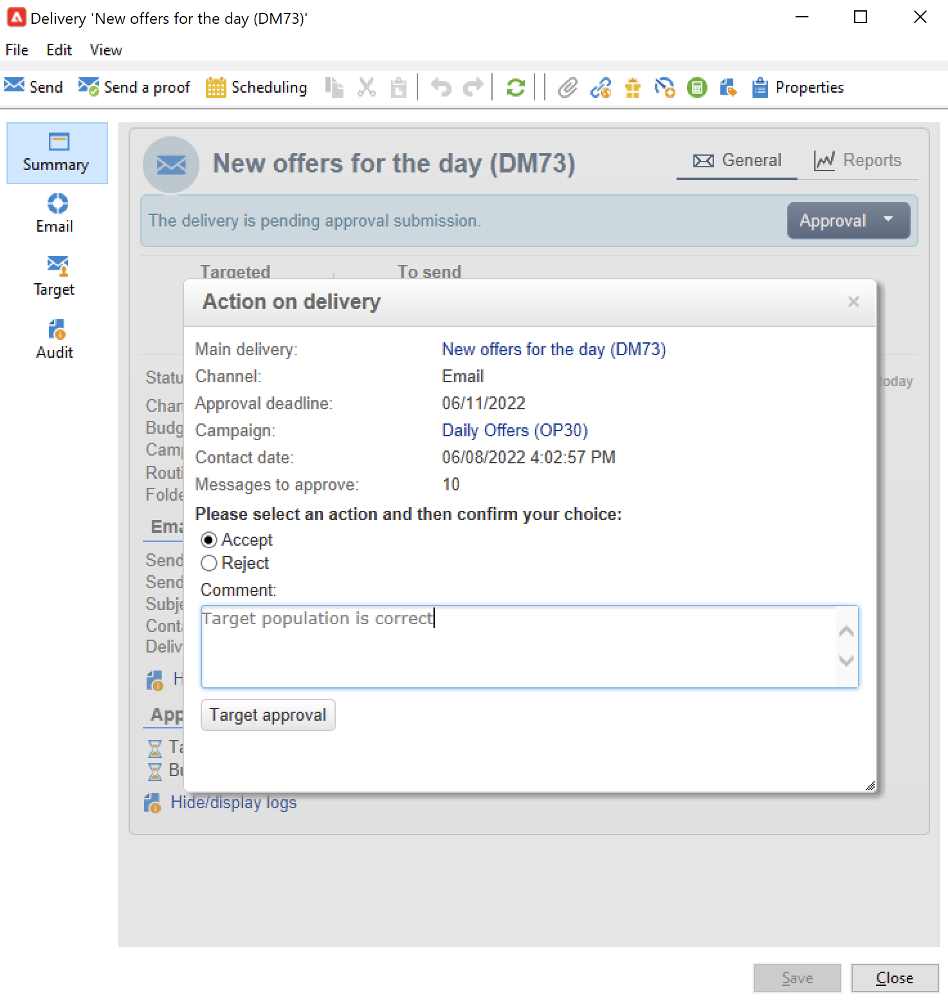
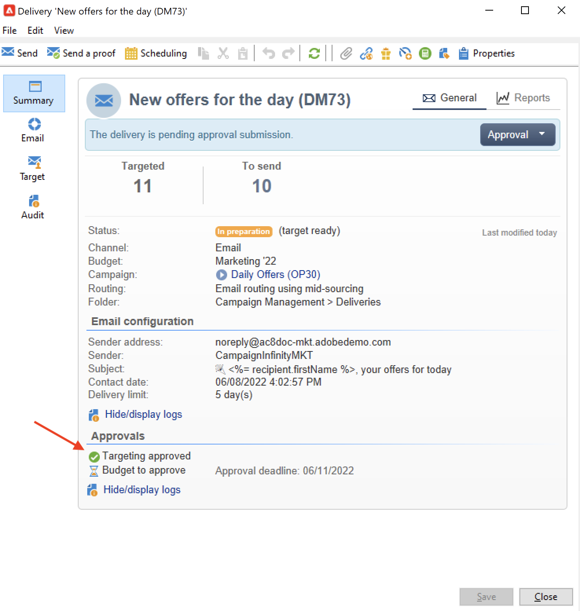
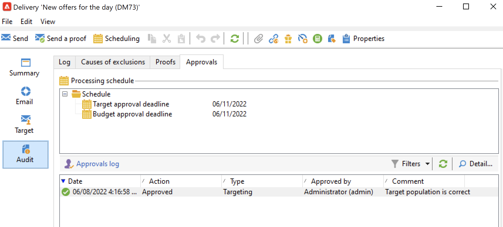
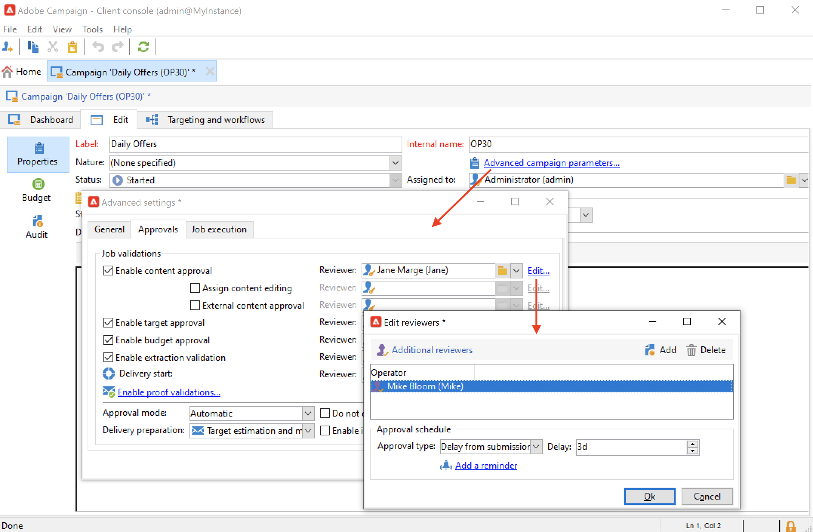

# 設定及管理核准流程 {#approval-marketing-campaigns}

參與建立和批准市場營銷活動的方法和人員特定於每個組織。 活動批准流程涉及協調多個利益相關方：數字營銷人員、遞送經理、內容經理和外部所有者（如合作夥伴或供應商）。

使用Adobe Campaign，您可以為市場活動設定審批流，並在需要採取行動時通知運營商。 您可以為交貨的每個步驟定義審批：目標、內容、預算、提取和證明發送。 當市場活動交付通過各種驗證步驟時，Adobe市場活動會編譯修改和簽收的歷史記錄，包括反饋、評論、更改請求和注釋。

通知消息被發送給被指定為審閱者的Adobe Campaign操作員，以通知他們批准請求。

操作員可以通過以下幾種方式批准：

* 從通知消息。 電子郵件中的連結使操作員通過Web瀏覽器進入市場活動。 連接後，審閱者可以選擇是否批准內容。
   

* 從市場活動控制板。
   

* 從交貨儀表板。
   

操作員可以從審批窗口訪問市場活動和交貨。 他們也可以輸入注釋。

操作員驗證後，該資訊將顯示在市場活動和交貨控制面板以及日誌中。

該資訊也可在交貨的批准日誌和市場活動的批准日記帳中找到。 通過 **[!UICONTROL Edit > Audit > Approvals]** 頁籤。

## 啟用批准{#enable-approvals}

審批通知將發送給對啟用審批的每個流程受影響的操作員。

可以為市場活動模板、每個市場活動或交貨啟用它們。

所有需要審批的任務都通過市場活動模板中  **[!UICONTROL Properties]** > **[!UICONTROL Advanced campaign parameters...]** > **[!UICONTROL Approvals]** 頁籤。 從此頁籤中選擇審閱者或審閱者組。 除非未啟用此選項，否則他們會收到通知。 [了解更多資訊](#approving-processes)。

可以使用此模板建立的每個市場活動以及每個交貨可以分別覆蓋這些設定。 瀏覽 **[!UICONTROL Properties]** 按鈕，然後 **[!UICONTROL Approvals]** 頁籤。

在以下示例中，交付內容不需要批准：

>[!CAUTION]
>
>檢查審閱人是否 **適當權限** 以便批准，並且其安全區定義正確。 [了解更多資訊](#selecting-reviewers)。

交貨的審批流程詳見 [此部分](#review-and-approve-deliveries)。

## 選擇審閱者 {#select-reviewers}

對於每種類型的審批，負責審批的操作員或操作員組都從交貨中的下拉清單中進行選擇。 可以使用 **[!UICONTROL Edit...]** 的子菜單。 此窗口還允許您編輯審批截止時間。 預設情況下，審閱人從提交日期開始有三天時間批准流程。 要添加自動提醒，請使用 **[!UICONTROL Add a reminder]** 的子菜單。

如果未指定審核者，則市場活動所有者負責審批並接收通知。 市場活動所有者在 **[!UICONTROL Edit > Properties]** 頁籤：

所有其他Adobe Campaign運營商 **[!UICONTROL Administrator]** 權限也可以批准作業，但不會接收通知。

>[!NOTE]
>
>預設情況下，如果已定義審批運算子，則市場活動責任人將無法執行審批或啟動交貨。 作為Adobe Campaign管理員，您可以修改此行為並允許市場活動所有者通過建立 **NmsCampaign_Activate_OwnerConfirmation** 選項，設定為 **1**。

如果定義了審閱者清單，則當一個審閱者已批准該作業時，將批准該作業。 然後，市場活動和交付控制面板中不再提供批准連結。 啟用通知發送時，如果另一個審閱者按一下通知消息中的批准連結，則通知他們另一個操作員已批准該作業。

## 審閱和批准交貨 {#review-and-approve-deliveries}

對於您可以批准交貨目標的每個市場活動， [交付內容](#approving-content) 和成本。 可以透過電子郵件形式通知負責核准的 Adobe Campaign 操作者，然後他們可透過主控台或網路連線核准或拒絕核准。[了解更多資訊](#approving-processes)。

對於直接郵寄，Adobe Campaign操作員可以在提取檔案發送到路由器之前查看該檔案，如有必要，他們可以更改格式並重新啟動提取。 [了解更多資訊](#approve-an-extraction-file)。

完成這些驗證階段後，可啟動交付。 [了解更多資訊](marketing-campaign-deliveries.md#starting-a-delivery)。

>[!NOTE]
>
>在市場活動模板中選擇需要審批的流程。 [了解更多資訊](marketing-campaign-templates.md)。

### 批准交貨的步驟 {#approving-processes}

需要批准的階段顯示在市場活動控制面板（通過控制台或Web介面）上。 它們還顯示在交貨跟蹤表和交貨控制板中。

對於市場活動中的每個交貨，您都可以審批以下流程：

* **目標、內容和預算**

   當 **[!UICONTROL Enable target approval]**。 **[!UICONTROL Enable content approval]** 或 **[!UICONTROL Enable budget approval]** 選項在「審批設定」窗口中選擇，相關連結將顯示在市場活動和交貨控制面板中。

   

   >[!NOTE]
   >
   >僅當在審批設定窗口中啟用了目標審批時，預算審批才可用。 只有分析目標後，才顯示預算審批連結。

   如果 **[!UICONTROL Assign content editing]** 或 **[!UICONTROL External content approval]** 選項在批准設定窗口中選中，控制板將顯示 **[!UICONTROL Available content]** 和 **[!UICONTROL External content approval]** 連結。

   內容批准允許您訪問發送的校樣。

* **提取審批（直接郵寄）**

   當 **[!UICONTROL Enable extraction approval]** 在「批准設定」窗口中選擇，在通知路由器之前必須批准提取的檔案。

   的 **[!UICONTROL Approve file]** 選項在市場活動和交付控制板中可用。

   

   可在驗證前預覽輸出檔案。 抽取檔案預覽僅顯示資料示例。 未載入整個檔案。

* **批准關聯的交貨**

   的 **[!UICONTROL Enable individual approval of each associated delivery]** 選項用於與輔助交貨關聯的主交貨。 預設情況下，不會選擇此選項，以便可以執行主交貨的總體批准。 如果選擇此選項，則每個交貨必須單獨審批。

   

>[!NOTE]
>
>在目標工作流中，如果在消息準備過程中出現連結到配置問題的錯誤， **[!UICONTROL Restart message preparation]** 連結顯示在儀表板上。 修復錯誤，並使用此連結在繞過目標階段時重新啟動消息準備。

### 批准內容 {#approve-content}

>[!CAUTION]
>
>要批准內容，必須使用證明週期。 校樣允許您批准資訊、個性化資料的顯示，並檢查連結是否正在工作。
>
>下面詳述的內容批准功能與證明交付有關。

可以配置內容批准週期。 要執行此操作，請選擇 **[!UICONTROL Enable content approval]** 的子菜單。 內容審批週期的主要步驟是：

1. 建立新交貨後，市場活動經理按一下 **[!UICONTROL Submit content]** 連結到市場活動控制面板以啟動內容審批週期。

   >[!NOTE]
   >
   >如果 **[!UICONTROL Enable the sending of proofs]** 選項（用於電子郵件遞送）或 **[!UICONTROL Enable the sending and approval of proofs]** （對於直接郵寄）選項已在批准設定窗口中選擇，將自動發送校樣。

1. 通知電子郵件將發送給負責內容的人員，此人可以選擇是否批准該內容：

   * 通過通知電子郵件：通知電子郵件包含指向已發送的校樣的連結，如果已發送的校樣已發送，則可能包含向各種電子郵件呈現該郵件的連結 **可交付性** 已為此實例啟用載入項。

   * 通過控制台或web介面、交付跟蹤、交付控制板或市場活動控制板。 此市場活動控制面板通過按一下 **[!UICONTROL Inbox rendering...]** 的子菜單。 要查看其內容，請按一下 **[!UICONTROL Detail]** 的子菜單。

1. 通知電子郵件被發送給負責市場活動的人員，通知他們內容是否已被批准。 負責市場活動的人員可以隨時重新啟動內容審批週期。 要執行此操作，請按一下 **[!UICONTROL Content status]** 市場活動控制面板的行（在交貨層），然後按一下 **[!UICONTROL Reset content approval to submit it again]**。

#### 分配內容編輯 {#assign-content-editing}

此選項允許您定義負責內容編輯的人員，如網站管理員。 如果 **[!UICONTROL Assign content editing]** 選項，在建立傳遞和將通知電子郵件發送給負責內容的人員之間添加幾個審批步驟：

1. 建立新交貨後，市場活動負責人按一下 **[!UICONTROL Submit content editing]** 連結以啟動內容編輯週期。

1. 負責內容編輯的人員將收到一封電子郵件，告知他們內容可用。

1. 然後，他們可以登錄到控制台，開啟傳送，並使用簡化嚮導編輯它以更改主題、HTML和文本內容，併發送校樣。

   >[!NOTE]
   >
   >如果 **[!UICONTROL Enable the sending of proofs]** 選項（用於電子郵件遞送）或 **[!UICONTROL Enable the sending and approval of proofs]** （對於直接郵寄）選項已在批准設定窗口中選擇，將自動發送校樣。

1. 一旦負責內容編輯的人員完成對交付內容的任何更改，他們就可以使內容可用。

   為此，他們可以使用：

   * 這樣 **[!UICONTROL Available content]** 連結。
   * 通知消息中的連結。
操作員可以在向市場活動負責人提交內容之前添加註釋。
通知消息允許審閱者批准或拒絕內容。

#### 外部內容審批 {#external-content-approval}

此選項允許您定義負責批准交付呈現的外部操作員，如品牌通信一致性、費率等。 當 **[!UICONTROL External content approval]** 選項，在內容審批和將通知發送給市場活動負責人之間添加幾個審批步驟：

1. 外部內容管理器接收通知電子郵件，通知他們內容已被批准並請求外部批准。
1. 通知電子郵件包含指向發送的校樣的連結，這些校樣允許您查看交付呈現，以及用於批准或拒絕交付內容的按鈕。

這些連結僅在已發送一個或多個校樣時才可用。 否則，僅通過控制台或Web介面提供交付呈現。

### 批准提取檔案 {#approve-an-extraction-file}

對於離線傳送，Adobe Campaign會生成抽取檔案，並根據其設定方式將其發送到路由器。 其內容取決於使用的導出模板。

當內容、目標和預算獲得批准時，交付將更改為 **[!UICONTROL Extraction pending]** 直到啟動市場活動的抽取工作流。

在提取請求日期，建立提取檔案，並將提供狀態更改為 **[!UICONTROL File to approve]**。

您可以查看提取的檔案的內容（通過按一下其名稱）、批准它，或者在必要時更改格式，並使用儀表板上的連結重新啟動提取。

檔案獲得批准後，您可以向路由器發送通知電子郵件。 [了解更多資訊](marketing-campaign-deliveries.md#start-an-offline-delivery)。

## 審批模式 {#approval-modes}

作業可以在市場活動控制板、交貨跟蹤頁籤、交貨控制板或發送到審閱者的電子郵件通知中批准。

### 在儀表板中審核 {#approval-via-the-dashboard}

要通過控制台或Web介面批准作業，請按一下市場活動控制面板上的相應連結。

例如，一旦執行了交貨分析：

1. 選取 **[!UICONTROL Approve targeting]**。

1. 在彈出窗口中，檢查要批准的資訊。
1. 選擇 **[!UICONTROL Accept]** 或 **[!UICONTROL Reject]** 並輸入注釋（如果需要）。 此注釋將顯示在驗證日誌中。
1. 確認您的選擇 **[!UICONTROL Target approval]** 按鈕

如果某個進程已經由其他操作員批准，則該批准連結不可用。

如果流程已被拒絕，則資訊將按如下方式顯示在交貨控制面板中：

### 從通知消息審核 {#approval-via-notification-messages}

從中批准作業 [通知消息](#notifications):

1. 按一下通知中的連結。
1. 登錄Adobe Campaign。
1. 檢查要審批的資訊
1. 選擇 **[!UICONTROL Accept]** 或 **[!UICONTROL Reject]** 並輸入注釋（如果需要）。
1. 驗證. 您的選擇和注釋顯示在驗證日誌中。

>[!NOTE]
>
>如果在流程中引發警告，則通知中將顯示警告。

### 跟蹤審批{#approval-tracking}

在用戶介面中提供批准日誌：

* 在市場活動批准日誌中， **[!UICONTROL Approvals]** 頁籤 **[!UICONTROL Edit > Audit]** 頁籤：

   

* 在市場活動交付日誌中， **[!UICONTROL Deliveries]** 頁籤 **[!UICONTROL Edit > Audit]** 頁籤：

   

* 按一下 **[!UICONTROL Hide/display logs]** 選項 **[!UICONTROL Summary]** 頁籤。

   

* 此資訊也可以通過 **[!UICONTROL Audit > Approvals]** 頁籤：

   

>[!NOTE]
>
>操作員一旦批准或拒絕了作業，其他審閱者就無法再更改它。

### 自動/手動審批 {#automatic-and-manual-approval}

在建立目標工作流時，如果批准是自動（預設模式）,Adobe Campaign將顯示批准連結或在需要批准時立即發送通知。

要選擇審批模式（手動或自動），請按一下 **[!UICONTROL Edit > Properties]** 頁籤，然後按一下 **[!UICONTROL Advanced campaign parameters...]** 最後 **[!UICONTROL Approvals]** 頁籤。
平

>[!NOTE]
>
>審批模式適用於市場活動的所有交貨。

在構建目標工作流時，手動審批允許您避免建立審批連結或自動發送通知。 然後，市場活動控制板提供 **[!UICONTROL Submit targeting for approval]** 連結以手動啟動審批流程。

通過確認消息，您可以授權對為此傳遞選擇的作業進行批准。

然後，批准按鈕將顯示在市場活動控制面板（用於此交貨）、交貨控制面板和交貨跟蹤中。 如果啟用通知，則將並行發送。

啟用批准的這種方法使您能夠在不向審閱者發送虛假通知的情況下進行目標確定。

## 通知 {#notifications}

通知是發送給審閱者的特定電子郵件，用於通知他們某個進程正在等待批准。 當操作員按一下消息中的連結時，將顯示驗證頁，在登錄後，操作員可以查看資訊並批准或拒絕作業。 也可以在審批窗口中輸入注釋。

通知電子郵件的內容可以個性化。 請參閱 [通知內容](#notification-content)。

### 啟用/禁用通知 {#enabling-disabling-notification}

預設情況下，如果在市場活動模板、市場活動或交貨中啟用了相關作業的審批，則會發送通知消息。 但是，可以禁用通知，以僅授權控制台的批准。

為此，請編輯市場活動或市場活動模板的審批窗口( **[!UICONTROL Edit > Properties]** > **[!UICONTROL Advanced campaign parameters...]** > **[!UICONTROL Approvals]** ) **[!UICONTROL Do not enable notification sending]**。

### 通知內容 {#notification-content}

通知內容在特定模板中定義： **[!UICONTROL Notification of validations for the marketing campaign]**。 此模板保存在 **[!UICONTROL Administration > Campaign management > Technical delivery templates]** Adobe Campaign樹的資料夾。
