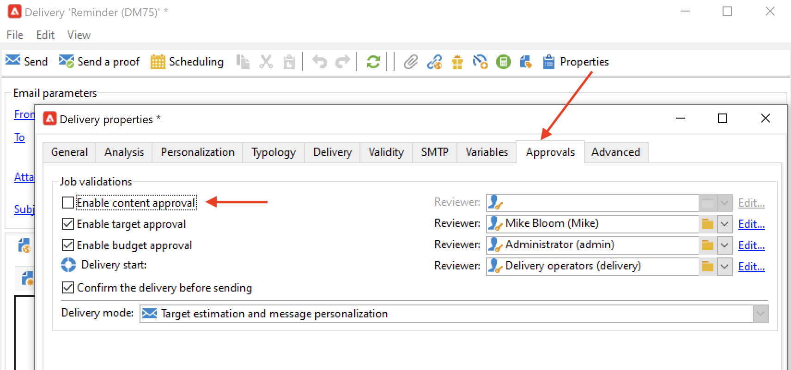
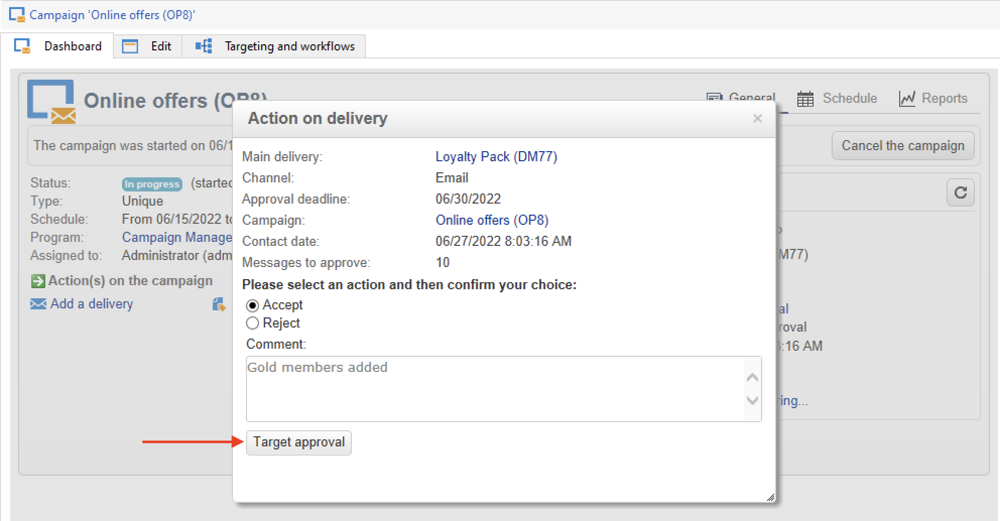

# 設定及管理核准流程 {#approval-marketing-campaigns}

每個組織都有專屬專屬建立和核准行銷活動的方法和人員。 行銷活動核准程式涉及協調多個利害關係人：數位行銷人員、傳遞經理、內容經理以及外部擁有者，例如合作夥伴或供應商。

透過Adobe Campaign，您可以設定行銷活動的核准流程，並在需要動作時通知操作員。 您可以為傳送的每個步驟定義核准：目標定位、內容、預算、摘錄和證明傳送。 當您的行銷活動傳遞通過各種驗證步驟時，Adobe Campaigns會編譯修改和簽核的歷史記錄，包括意見反應、評論、變更請求和評論。

通知訊息會傳送給指定為稽核者的Adobe Campaign操作員，以通知他們核准請求。

操作員可透過數種方式核准：

* 來自通知訊息。 電子郵件中的連結可讓運運算元透過網頁瀏覽器前往Campaign。 連線後，稽核者可以選擇核准或不核准內容。
   

* 從行銷活動控制面板。
   

* 從傳遞控制面板。
   

操作員可以從核准視窗存取行銷活動和傳遞。 他們也可以輸入註解。

操作員驗證後，資訊會顯示在行銷活動和傳遞控制面板以及記錄中。

該資訊也可在傳送的核准記錄以及行銷活動的核准日誌中取得。 這些記錄檔是透過 **[!UICONTROL Edit > Audit > Approvals]** 索引標籤。

## 啟用核准{#enable-approvals}

核准通知會傳送給每個已啟用核准之程式受影響的操作者。

它們可以為行銷活動範本啟用、針對每個行銷活動個別啟用，或針對傳送啟用。

所有需要核准的工作都會透過行銷活動範本中選取  **[!UICONTROL Properties]** > **[!UICONTROL Advanced campaign parameters...]** > **[!UICONTROL Approvals]** 標籤。 會從此標籤中選取稽核者或稽核者群組。 除非未啟用此選項，否則他們會收到通知。 [了解更多](#approving-processes)。

您可以針對使用此範本建立的每個行銷活動覆寫這些設定，也可以針對每個傳送個別覆寫。 瀏覽 **[!UICONTROL Properties]** 的按鈕，然後 **[!UICONTROL Approvals]** 標籤。

在下列範例中，傳遞內容不需要核准：

>[!CAUTION]
>
>檢查檢閱者是否擁有 **適當的許可權** 以進行核准，並確認其安全區域已正確定義。 [了解更多](#selecting-reviewers)。

傳遞的核准程式詳見 [本節](#review-and-approve-deliveries).

## 選取檢閱者 {#select-reviewers}

對於每種核准型別，都會從傳送的下拉式清單中選取負責核准的操作員或操作員群組。 可使用新增更多運運算元 **[!UICONTROL Edit...]** 連結。 此視窗也可讓您編輯核准期限。 依預設，稽核者從提交日期起有三天時間來核准流程。 若要新增自動提醒，請使用 **[!UICONTROL Add a reminder]** 連結。

如果未指定稽核者，則行銷活動擁有者會負責核准並接收通知。 行銷活動擁有者指定於 **[!UICONTROL Edit > Properties]** 行銷活動的索引標籤：

所有其他的Adobe Campaign運運算元，搭配 **[!UICONTROL Administrator]** 許可權也可以核准工作，但不會收到通知。

>[!NOTE]
>
>依預設，如果已定義核准操作員，行銷活動擁有者無法執行核准或開始傳遞。 作為Adobe Campaign管理員，您可以修改此行為，並透過建立 **NmsCampaign_Activate_OwnerConfirmation** 選項，設定為 **1**.

如果已定義稽核者清單，當稽核者核准某個工作時，就會核准該工作。 行銷活動和傳遞控制面板中不再提供核准連結。 啟用通知傳送後，如果其他稽核者按一下通知訊息中的核准連結，系統會通知他們其他操作員已核准該工作。

## 檢閱和核准傳遞 {#review-and-approve-deliveries}

對於您可以核准傳遞目標的每個行銷活動， [傳遞內容](#approving-content) 和成本。 可以透過電子郵件形式通知負責核准的 Adobe Campaign 操作者，然後他們可透過主控台或網路連線核准或拒絕核准。[了解更多](#approving-processes)。

如果是直接郵件傳送，Adobe Campaign操作員可在解壓縮檔案傳送至路由器前檢視解壓縮檔案，並可視需要變更格式及重新啟動解壓縮。 [了解更多](#approve-an-extraction-file)。

完成這些驗證階段後，即可啟動傳送。 [了解更多](marketing-campaign-deliveries.md#starting-a-delivery)。

>[!NOTE]
>
>在行銷活動範本中選取需要核准的程式。 [了解更多](marketing-campaign-templates.md)。

### 核准傳遞的步驟 {#approving-processes}

需要核准的階段會出現在行銷活動控制面板上（透過主控台或網頁介面）。 它們也會顯示在傳送追蹤表格和傳送控制面板上。

對於行銷活動中的每個傳遞，您可以核准以下流程：

* **目標定位、內容和預算**

   當 **[!UICONTROL Enable target approval]**， **[!UICONTROL Enable content approval]** 或 **[!UICONTROL Enable budget approval]** 在「核准設定」視窗中選取選項，相關連結會顯示在「行銷活動」和「傳送」控制面板中。

   

   >[!NOTE]
   >
   >只有在核准設定視窗中啟用目標核準時，才能使用預算核准。 只有在分析目標之後，才會顯示預算核准連結。

   如果 **[!UICONTROL Assign content editing]** 或 **[!UICONTROL External content approval]** 在核准設定視窗中選取選項，儀表板將顯示 **[!UICONTROL Available content]** 和 **[!UICONTROL External content approval]** 連結。

   內容核准可讓您存取已傳送的校樣。

* **摘取核准（直接郵件傳送）**

   時間 **[!UICONTROL Enable extraction approval]** 在核准設定視窗中選取時，擷取的檔案必須先經過核准，才能通知路由器。

   此 **[!UICONTROL Approve file]** 選項適用於行銷活動和傳遞控制面板。

   

   您可以在驗證之前預覽輸出檔案。 擷取檔案預覽只會顯示資料範例。 未載入整個檔案。

* **核准關聯的傳遞**

   此 **[!UICONTROL Enable individual approval of each associated delivery]** 選項適用於與次要傳遞相關聯的一個主要傳遞。 依預設，不會選取此選項，以便執行主要傳送的整體核准。 如果選取此選項，則必須個別核准每個傳遞。

   

>[!NOTE]
>
>在目標定位工作流程中，如果在訊息準備期間發生連結至設定問題的錯誤， **[!UICONTROL Restart message preparation]** 連結會顯示在控制面板上。 修正錯誤，並使用此連結在略過目標階段時重新啟動訊息準備。

### 核准內容 {#approve-content}

>[!CAUTION]
>
>若要核准內容，校訂週期是強制性的。 校樣可讓您核准顯示資訊、個人化資料並檢查連結是否正常運作。
>
>下文詳述的內容核准功能與證明傳送有關。

您可以設定內容核准週期。 若要這麼做，請選取 **[!UICONTROL Enable content approval]** 選項。 內容核准週期的主要步驟如下：

1. 建立新傳送後，行銷活動經理按一下 **[!UICONTROL Submit content]** 行銷活動控制面板上的連結，以開始內容核准週期。

   >[!NOTE]
   >
   >如果 **[!UICONTROL Enable the sending of proofs]** 選項（用於電子郵件傳遞）或 **[!UICONTROL Enable the sending and approval of proofs]** （針對直接郵件傳送）選項已在核准設定視窗中選取，則會自動傳送校樣。

1. 系統會傳送通知電子郵件給負責內容的人，由他們選擇是否核准：

   * 透過通知電子郵件：通知電子郵件包含已傳送校樣的連結，並且如果 **傳遞能力** 此執行個體已啟用附加元件。

   * 透過主控台或網頁介面、傳遞追蹤、傳遞控制面板或行銷活動控制面板。 此行銷活動儀表板可讓您按一下 **[!UICONTROL Inbox rendering...]** 連結。 若要檢視其內容，請按一下 **[!UICONTROL Detail]** 圖示加以顯示。

1. 系統會傳送通知電子郵件給行銷活動的負責人，通知他們內容是否已核准。 行銷活動的負責人可以隨時重新開始內容核准週期。 若要這麼做，請按一下 **[!UICONTROL Content status]** 行銷活動控制面板的行（在傳遞層級），然後按一下 **[!UICONTROL Reset content approval to submit it again]**.

#### 指派內容編輯 {#assign-content-editing}

此選項可讓您定義負責內容編輯的人員，例如網站管理員。 如果 **[!UICONTROL Assign content editing]** 在「核准設定」視窗中選取選項，在建立傳遞與將通知電子郵件傳送給負責內容之人員之間會新增數個核准步驟：

1. 建立新傳送後，行銷活動的負責人按一下 **[!UICONTROL Submit content editing]** 行銷活動控制面板中的連結，以開始內容編輯週期。

1. 負責內容編輯的人員會收到電子郵件，通知他們內容可用。

1. 接著，他們可以登入主控台、開啟傳遞，並使用簡化的精靈進行編輯，以變更主題、HTML和文字內容，以及傳送校樣。

   >[!NOTE]
   >
   >如果 **[!UICONTROL Enable the sending of proofs]** 選項（用於電子郵件傳遞）或 **[!UICONTROL Enable the sending and approval of proofs]** （針對直接郵件傳送）選項已在核准設定視窗中選取，則會自動傳送校樣。

1. 一旦負責內容編輯的人員完成對傳送內容的任何變更，他們就可以提供內容。

   要執行此操作，他們可使用：

   * 此 **[!UICONTROL Available content]** Adobe Campaign主控台中的連結。
   * 通知訊息中的連結。
操作員可在將內容提交至行銷活動負責人之前新增註解。
通知訊息可讓稽核者核准或拒絕內容。

#### 外部內容核准 {#external-content-approval}

此選項可讓您定義負責核准傳遞呈現（例如品牌通訊一致性、費率等）的外部運運算元。 當 **[!UICONTROL External content approval]** 在「核准設定」視窗中選取選項，在內容核准與將通知傳送給行銷活動負責人之間會新增數個核准步驟：

1. 外部內容管理員會收到通知電子郵件，告知他們內容已核准並請求外部核准。
1. 通知電子郵件包含已傳送校樣的連結（可讓您檢視傳遞呈現），以及核准或拒絕傳遞內容的按鈕。

只有在已傳送一或多個校樣時，才可使用這些連結。 否則，傳遞呈現只能透過主控台或Web介面使用。

### 核准擷取檔案 {#approve-an-extraction-file}

離線傳送時，Adobe Campaign會產生擷取檔案，並依據其設定方式傳送至路由器。 其內容取決於所使用的匯出範本。

內容、目標定位和預算獲得核准後，傳遞內容會變更為 **[!UICONTROL Extraction pending]** 直到啟動行銷活動的擷取工作流程為止。

在擷取請求日期，會建立擷取檔案並變更傳遞狀態 **[!UICONTROL File to approve]**.

您可以檢視解壓縮檔案的內容（按一下其名稱）、核准檔案，或視需要變更格式，然後使用控制面板上的連結重新開始解壓縮。

一旦檔案獲得核准，您就可以將通知電子郵件傳送給路由器。 [了解更多](marketing-campaign-deliveries.md#start-an-offline-delivery)。

## 核准模式 {#approval-modes}

可以在行銷活動控制面板、傳遞追蹤標籤、傳遞控制面板，或傳送給稽核者的電子郵件通知中核准工作。

### 在儀表板中核准 {#approval-via-the-dashboard}

若要透過主控台或網頁介面核准工作，請按一下行銷活動控制面板上的適當連結。

例如，執行傳遞分析後：

1. 選取 **[!UICONTROL Approve targeting]**。

1. 在快顯視窗中，檢查要核准的資訊。
1. 選取 **[!UICONTROL Accept]** 或 **[!UICONTROL Reject]** 並視需要輸入註解。 此註解將顯示在驗證記錄中。
1. 使用「 」確認您的選擇 **[!UICONTROL Target approval]** 按鈕。

如果某個程式已由其他操作員核准，則無法使用核准連結。

如果處理已遭拒絕，則會在傳遞控制面板中顯示資訊，如下所示：

### 從通知訊息核准 {#approval-via-notification-messages}

若要核准工作，請執行下列步驟： [通知訊息](#notifications)：

1. 按一下通知中的連結。
1. 登入Adobe Campaign。
1. 檢查要核准的資訊
1. 選取 **[!UICONTROL Accept]** 或 **[!UICONTROL Reject]** 並視需要輸入註解。
1. 驗證. 您的選擇和註解會顯示在驗證記錄中。

>[!NOTE]
>
>如果處理期間出現警告，通知中會顯示警告。

### 追蹤核准{#approval-tracking}

使用者介面中提供核准記錄：

* 在行銷活動核准記錄檔中， **[!UICONTROL Approvals]** 的子標籤 **[!UICONTROL Edit > Audit]** 標籤：

   

* 在行銷活動傳遞記錄檔中， **[!UICONTROL Deliveries]** 的子標籤 **[!UICONTROL Edit > Audit]** 標籤：

   

* 按一下 **[!UICONTROL Hide/display logs]** 的選項 **[!UICONTROL Summary]** 標籤。

   

* 此資訊也可透過 **[!UICONTROL Audit > Approvals]** 每個傳遞的索引標籤：

   

>[!NOTE]
>
>一旦操作員核准或拒絕工作，其他稽核者就無法再變更它。

### 自動/手動核准 {#automatic-and-manual-approval}

建立目標定位工作流程時，如果核准是自動的（預設模式），Adobe Campaign會顯示核准連結，或在需要核準時立即傳送通知。

若要選擇核准模式（手動或自動），請按一下 **[!UICONTROL Edit > Properties]** 行銷活動或行銷活動範本的標籤，然後按一下 **[!UICONTROL Advanced campaign parameters...]** 最後是 **[!UICONTROL Approvals]** 標籤。
par

>[!NOTE]
>
>核准模式會套用至行銷活動的所有傳送。

建立目標定位工作流程時，手動核准可讓您避免自動建立核准連結或傳送通知。 行銷活動控制面板接著提供 **[!UICONTROL Submit targeting for approval]** 連結以手動啟動核准流程。

確認訊息可讓您針對為此傳遞選取的工作，授權核准。

核准按鈕隨即會顯示在行銷活動控制面板（針對此傳遞）、傳遞控制面板及傳遞追蹤中。 如果已啟用通知，則會同時傳送通知。

此啟用核准的方法可讓您進行目標定位，而不會傳送虛假通知給稽核者。

## 通知 {#notifications}

通知是傳送給稽核者的特定電子郵件訊息，以通知他們流程正在等候核准。 當操作員按一下訊息中的連結時，驗證頁面就會顯示，在登入之後，操作員就可以檢視資訊，並核准或拒絕工作。 您也可以在核准視窗中輸入註解。

通知電子郵件的內容可以個人化。 另請參閱 [通知內容](#notification-content).

### 啟用/停用通知 {#enabling-disabling-notification}

根據預設，如果在行銷活動範本、行銷活動或傳遞中啟用相關工作的核准，則會傳送通知訊息。 但是，可以停用通知，以便僅從主控台授權核准。

若要這麼做，請編輯行銷活動或行銷活動範本的核准視窗( **[!UICONTROL Edit > Properties]** > **[!UICONTROL Advanced campaign parameters...]** > **[!UICONTROL Approvals]** 標籤)並選取 **[!UICONTROL Do not enable notification sending]**.

### 通知內容 {#notification-content}

通知內容是在特定範本中定義的： **[!UICONTROL Notification of validations for the marketing campaign]**. 此範本儲存在 **[!UICONTROL Administration > Campaign management > Technical delivery templates]** Adobe Campaign樹的資料夾。
