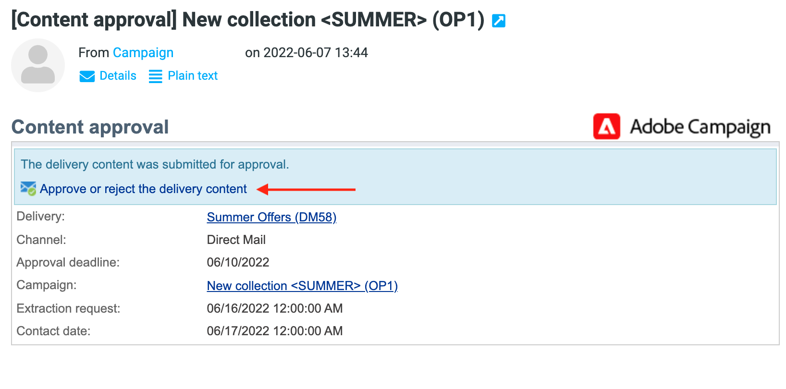
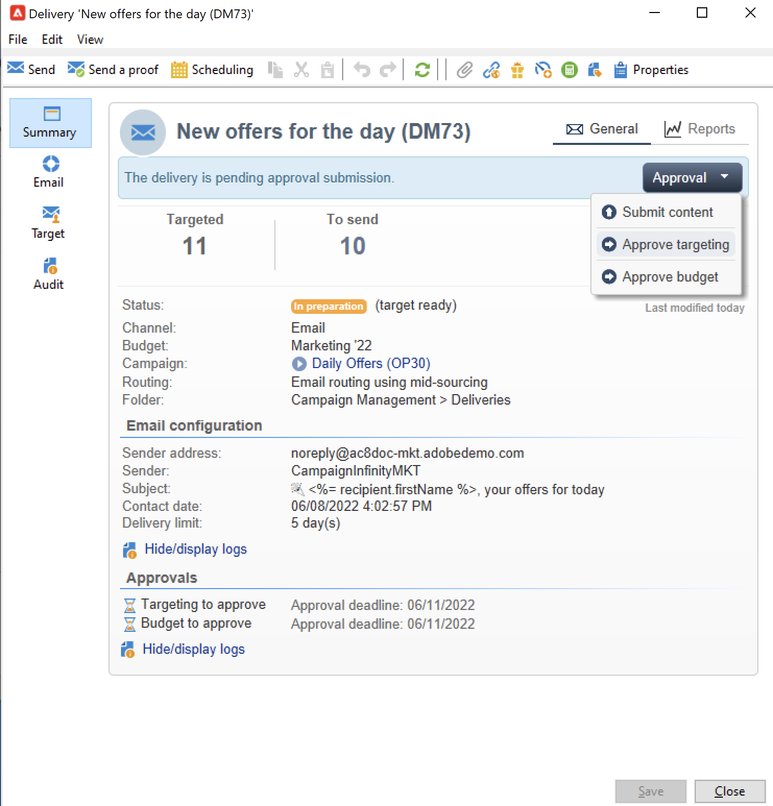

# 設定及管理核准流程 {#approval-marketing-campaigns}

建立和核准行銷活動的方法和人員是每個組織專屬的。 行銷活動核准程式涉及協調多個利害關係人：數位行銷人員、遞送經理、內容經理，以及外部擁有者，例如合作夥伴或供應商。

透過Adobe Campaign，您可以為促銷活動設定核准流程，並在需要動作時通知運算子。 您可以定義傳送每個步驟的核准：鎖定目標、內容、預算、擷取和校樣傳送。 當您的行銷活動傳遞完成各種驗證步驟時，Adobe Campaign會編譯修改和簽核的歷史記錄，包括意見、留言、變更請求和留言。

通知訊息會傳送給指定為審核者的Adobe Campaign運算子，以通知其核准請求。

運算子可透過數種方式進行核准：

* 從通知訊息。 電子郵件中的連結會透過網頁瀏覽器將運算子傳送至Campaign。 連線後，審核者可選擇是否核准內容。
   

* 從促銷活動控制面板。
   

* 從傳送控制面板。
   

營運商可從核准視窗存取促銷活動和傳送。 他們也可以輸入注釋。

運算子進行驗證後，資訊會顯示在促銷活動和傳送控制面板以及記錄中。

此資訊也可在傳送的核准記錄，以及行銷活動的核准日記中取得。 這些記錄檔可透過 **[!UICONTROL Edit > Audit > Approvals]** 頁簽。

## 啟用核准{#enable-approvals}

系統會將核准通知傳送給對每個已啟用核准的程式造成影響的運算子。

可針對促銷活動範本、個別針對每個促銷活動或傳送啟用。

所有需要核准的作業都會透過  **[!UICONTROL Properties]** > **[!UICONTROL Advanced campaign parameters...]** > **[!UICONTROL Approvals]** 標籤。 從此頁簽中選擇審核者或審核者組。 除非未啟用此選項，否則使用者會收到通知。 [了解更多資訊](#approving-processes)。

使用此範本建立的每個促銷活動，以及每個傳送的個別促銷活動，都可以覆寫這些設定。 瀏覽 **[!UICONTROL Properties]** 傳送按鈕，然後 **[!UICONTROL Approvals]** 標籤。

在下列範例中，傳送內容不需要核准：

>[!CAUTION]
>
>檢查審核者是否擁有 **適當權限** ，且其安全區域已正確定義。 [了解更多資訊](#selecting-reviewers)。

傳遞的核准程式在 [本節](#review-and-approve-deliveries).

## 選擇審閱者 {#select-reviewers}

對於每種類型的批准，負責批准的運算子或運算子組將從傳送的下拉清單中選擇。 可使用 **[!UICONTROL Edit...]** 連結。 此窗口還允許您編輯審批截止日期。 依預設，審核者自提交日期起有三天時間核准程式。 要添加自動提醒，請使用 **[!UICONTROL Add a reminder]** 連結。

如果未指定審核者，則促銷活動擁有者負責核准並接收通知。 促銷活動擁有者是在 **[!UICONTROL Edit > Properties]** 行銷活動的標籤：

所有其他Adobe Campaign運算子(含 **[!UICONTROL Administrator]** 權限也可以核准工作，但不會收到通知。

>[!NOTE]
>
>依預設，如果已定義核准運算子，則促銷活動擁有者無法執行核准或啟動傳送。 身為Adobe Campaign管理員，您可以修改此行為，並透過建立 **NmsCampaign_Activate_OwnerConfirmation** 選項，設定為 **1**.

如果定義了審核者清單，則當某個審核者批准該作業時，將批准該作業。 然後，促銷活動和傳送控制面板就不再提供核准連結。 啟用通知發送時，如果另一個審核者按一下通知消息中的批准連結，則通知他們另一個操作員已批准該作業。

## 檢閱及核准傳送 {#review-and-approve-deliveries}

對於每個促銷活動，您可以核准傳送目標， [傳遞內容](#approving-content) 和成本。 可以透過電子郵件形式通知負責核准的 Adobe Campaign 操作者，然後他們可透過主控台或網路連線核准或拒絕核准。[了解更多資訊](#approving-processes)。

對於直接郵件傳遞，Adobe Campaign操作員可以在將解壓縮檔案發送到路由器之前查看該檔案，如有必要，他們可以更改格式並重新啟動解壓縮。 [了解更多資訊](#approve-an-extraction-file)。

完成這些驗證階段後，即可啟動傳送。 [了解更多資訊](marketing-campaign-deliveries.md#starting-a-delivery)。

>[!NOTE]
>
>在促銷活動範本中選取需要核准的程式。 [了解更多資訊](marketing-campaign-templates.md)。

### 核准傳送的步驟 {#approving-processes}

需要核准的階段會顯示在促銷活動控制面板上（透過主控台或網頁介面）。 它們也會出現在傳送追蹤表格和傳送控制面板中。

對於促銷活動中的每個傳送，您可以核准下列程式：

* **目標、內容和預算**

   當 **[!UICONTROL Enable target approval]**, **[!UICONTROL Enable content approval]** 或 **[!UICONTROL Enable budget approval]** 選項，相關連結會顯示在促銷活動和傳送控制面板中。

   

   >[!NOTE]
   >
   >只有在「審批設定」窗口中啟用了目標審批時，才可使用預算審批。 只有分析目標後，才會顯示預算核准連結。

   若 **[!UICONTROL Assign content editing]** 或 **[!UICONTROL External content approval]** 選項，控制面板將顯示 **[!UICONTROL Available content]** 和 **[!UICONTROL External content approval]** 連結。

   內容核准可讓您存取傳送的校樣。

* **提取核准（直接郵件傳送）**

   當 **[!UICONTROL Enable extraction approval]** 在「批准設定」窗口中選中，則必須先批准提取的檔案，然後才能通知路由器。

   此 **[!UICONTROL Approve file]** 選項可在促銷活動和傳送控制面板上使用。

   

   您可以在驗證之前預覽輸出檔案。 擷取檔案預覽只會顯示資料範例。 未載入整個檔案。

* **核准相關傳遞**

   此 **[!UICONTROL Enable individual approval of each associated delivery]** 選項會用於與次要傳送相關聯的主要傳送。 依預設，不會選取此選項，以執行主要傳送的整體核准。 如果選取此選項，則每個傳送都必須個別核准。

   

>[!NOTE]
>
>在目標工作流程中，如果在訊息準備期間發生連結至設定問題的錯誤，則 **[!UICONTROL Restart message preparation]** 連結會顯示在控制面板上。 修正錯誤，並使用此連結在略過定位階段時重新啟動訊息準備。

### 核准內容 {#approve-content}

>[!CAUTION]
>
>若要核准內容，校樣週期是必填的。 校樣可讓您核准資訊、個人化資料的顯示，並檢查連結是否運作中。
>
>下文詳述的內容核准功能與證明傳送有關。

您可以設定內容核准週期。 若要這麼做，請選取 **[!UICONTROL Enable content approval]** 選項。 內容核准週期的主要步驟為：

1. 建立新傳遞後，行銷活動管理員按一下 **[!UICONTROL Submit content]** 連結至促銷活動控制面板，以啟動內容核准週期。

   >[!NOTE]
   >
   >若 **[!UICONTROL Enable the sending of proofs]** 選項（用於電子郵件傳送）或 **[!UICONTROL Enable the sending and approval of proofs]** （針對直接郵件傳送）選項（在核准設定視窗中選取）時，會自動傳送校樣。

1. 系統會傳送通知電子郵件給負責內容的人員，由他們選擇是否要核准：

   * 透過通知電子郵件：通知電子郵件包含已傳送校樣的連結，如果 **傳遞能力** 已為此實例啟用附加元件。

   * 透過主控台或網頁介面、傳遞追蹤、傳遞控制面板或行銷活動控制面板。 此促銷活動控制面板可讓您按一下 **[!UICONTROL Inbox rendering...]** 連結。 若要檢視其內容，請按一下 **[!UICONTROL Detail]** 表徵圖。

1. 系統會傳送通知電子郵件給負責促銷活動的人員，通知他們內容是否已核准。 負責促銷活動的人員可隨時重新啟動內容核准週期。 若要這麼做，請按一下 **[!UICONTROL Content status]** 行（在傳送層級），然後按一下 **[!UICONTROL Reset content approval to submit it again]**.

#### 指派內容編輯 {#assign-content-editing}

此選項可讓您定義負責內容編輯的人員，例如網站管理員。 若 **[!UICONTROL Assign content editing]** 選項，則在傳送建立和傳送通知電子郵件給內容負責人之間會新增數個核准步驟：

1. 建立新傳送後，負責促銷活動的人員會點按 **[!UICONTROL Submit content editing]** 在促銷活動控制面板中連結，以開始內容編輯週期。

1. 負責內容編輯的人員會收到電子郵件，告知他們內容可供使用。

1. 然後，他們就可以登入主控台、開啟傳送，並使用簡化精靈加以編輯，以變更主旨、HTML和文字內容，並傳送校樣。

   >[!NOTE]
   >
   >若 **[!UICONTROL Enable the sending of proofs]** 選項（用於電子郵件傳送）或 **[!UICONTROL Enable the sending and approval of proofs]** （針對直接郵件傳送）選項（在核准設定視窗中選取）時，會自動傳送校樣。

1. 負責內容編輯的人員完成對傳送內容的任何變更後，即可使用該內容。

   若要這麼做，他們可以使用：

   * the **[!UICONTROL Available content]** 在Adobe Campaign主控台中的連結。
   * 通知訊息中的連結。
運算子可以先新增留言，再將內容提交給行銷活動的負責人。
通知訊息可讓審核者核准或拒絕內容。

#### 外部內容核准 {#external-content-approval}

此選項可讓您定義負責核准傳遞轉譯的外部運算子，例如品牌通訊一致性、比率等。 當 **[!UICONTROL External content approval]** 選項，則內容核准和將通知傳送給行銷活動負責人之間會新增數個核准步驟：

1. 外部內容管理員會收到通知電子郵件，告知他們內容已獲核准，並請求外部核准。
1. 通知電子郵件包含傳送之校樣的連結，可讓您檢視傳送呈現，以及核准或拒絕傳送內容的按鈕。

只有已傳送一或多個校樣時，這些連結才可用。 否則，傳遞呈現只能透過主控台或Web介面使用。

### 核准解壓縮檔案 {#approve-an-extraction-file}

對於離線傳遞，Adobe Campaign會產生解壓縮檔案，該檔案會根據設定方式傳送至路由器。 其內容取決於使用的匯出範本。

當內容、目標和預算獲得核准後，傳送會變更為 **[!UICONTROL Extraction pending]** 直到啟動促銷活動的擷取工作流程為止。

提取請求日期時，會建立提取檔案，且傳送狀態變更為 **[!UICONTROL File to approve]**.

您可以檢視擷取的檔案內容（按一下檔案名稱）、核准檔案，或視需要變更格式，然後使用控制面板上的連結重新啟動擷取。

檔案獲得批准後，您就可以向路由器發送通知電子郵件。 [了解更多資訊](marketing-campaign-deliveries.md#start-an-offline-delivery)。

## 核准模式 {#approval-modes}

工作可在行銷活動控制面板、傳遞追蹤索引標籤、傳遞控制面板，或傳送給審核者的電子郵件通知中核准。

### 在控制面板中核准 {#approval-via-the-dashboard}

若要透過主控台或Web介面核准作業，請按一下促銷活動控制面板上的適當連結。

例如，一旦執行傳送分析：

1. 選取 **[!UICONTROL Approve targeting]**。

1. 在快顯視窗中，檢查要核准的資訊。
1. 選擇 **[!UICONTROL Accept]** 或 **[!UICONTROL Reject]** 並視需要輸入注釋。 此注釋將顯示在驗證日誌中。
1. 使用確認您的選擇 **[!UICONTROL Target approval]** 按鈕。

如果某個流程已經由其他操作員批准，則該批准連結不可用。

如果流程遭拒，資訊會顯示在傳送控制面板中，如下所示：

### 從通知訊息核准 {#approval-via-notification-messages}

若要從 [通知訊息](#notifications):

1. 按一下通知中的連結。
1. 登入Adobe Campaign。
1. 檢查要核准的資訊
1. 選擇 **[!UICONTROL Accept]** 或 **[!UICONTROL Reject]** 並視需要輸入注釋。
1. 驗證. 您的選擇和註解會顯示在驗證記錄中。

>[!NOTE]
>
>如果在處理期間引發警告，則通知中會顯示警告。

### 追蹤核准{#approval-tracking}

使用者介面中提供核准記錄：

* 在促銷活動核准記錄中， **[!UICONTROL Approvals]** 的子標籤 **[!UICONTROL Edit > Audit]** 標籤：

   

* 在促銷活動傳送記錄中， **[!UICONTROL Deliveries]** 的子標籤 **[!UICONTROL Edit > Audit]** 標籤：

   

* 您可以按一下 **[!UICONTROL Hide/display logs]** 選項 **[!UICONTROL Summary]** 標籤。

   

* 此資訊也可透過 **[!UICONTROL Audit > Approvals]** 索引標籤：

   

>[!NOTE]
>
>一旦操作員批准或拒絕了某個作業，其他審核者就無法再更改該作業。

### 自動/手動核准 {#automatic-and-manual-approval}

建立目標工作流程時，如果核准是自動（預設模式）,Adobe Campaign會顯示核准連結，或在需要核準時立即傳送通知。

若要選擇核准模式（手動或自動），請按一下 **[!UICONTROL Edit > Properties]** 標籤，然後按一下 **[!UICONTROL Advanced campaign parameters...]** 最後 **[!UICONTROL Approvals]** 標籤。
par

>[!NOTE]
>
>核准模式適用於促銷活動的所有傳送。

建立目標工作流程時，手動核准可讓您避免建立核准連結或自動傳送通知。 然後，促銷活動控制面板會提供 **[!UICONTROL Submit targeting for approval]** 連結以手動啟動核准程式。

確認訊息可讓您授權核准為此傳送選取的作業。

然後核准按鈕會顯示在促銷活動控制面板（針對此傳送）、傳遞控制面板和傳遞追蹤中。 如果啟用通知，則會同時傳送。

此啟用核准的方法可讓您處理鎖定目標作業，而不傳送假通知給審核者。

## 通知 {#notifications}

通知是傳送給審核者的特定電子郵件訊息，以通知他們某個程式正在等待核准。 當操作員按一下消息中的連結時，將顯示驗證頁，在登錄後，操作員可以查看資訊並批准或拒絕作業。 也可以在審批窗口中輸入注釋。

通知電子郵件的內容可個人化。 請參閱 [通知內容](#notification-content).

### 啟用/禁用通知 {#enabling-disabling-notification}

依預設，如果在促銷活動範本、促銷活動或傳送中啟用相關工作的核准，則會傳送通知訊息。 但是，可以禁用通知，以便僅從控制台授權批准。

要執行此操作，請編輯促銷活動或促銷活動範本的核准視窗( **[!UICONTROL Edit > Properties]** > **[!UICONTROL Advanced campaign parameters...]** > **[!UICONTROL Approvals]** 頁簽) **[!UICONTROL Do not enable notification sending]**.

### 通知內容 {#notification-content}

通知內容在特定範本中定義： **[!UICONTROL Notification of validations for the marketing campaign]**. 此範本會儲存在 **[!UICONTROL Administration > Campaign management > Technical delivery templates]** Adobe Campaign樹的資料夾。
