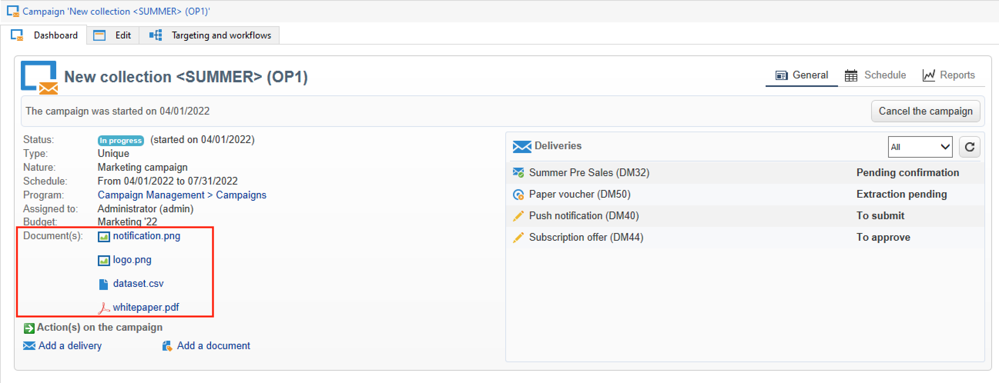

# 管理資產和文檔 {#manage-assets-documents}

您可以將各種單據與市場活動關聯：報告、照片、網頁、圖表等。 這些文檔可以採用任何格式。

在市場活動中，您還可以參考其他項目，如促銷優惠券、與特定品牌或商店相關的特別優惠等。 當這些元素包含在大綱中時，它們可以與直接郵寄相關聯。 [了解更多](#associating-and-structuring-resources-linked-via-a-delivery-outline)。

>[!CAUTION]
>
>此功能專為小型資產和文檔而設計。

<!--
>[!NOTE]
>
>If you are using Campaign Marketing Resource Management module, you can also manage a library of marketing resources that are available for several users for collaborative work. [Learn more](../../mrm/using/managing-marketing-resources.md).
-->

## 添加文檔 {#add-documents}

文檔可以在市場活動層（上下文文檔）或方案層（一般文檔）關聯。

對於競選， **[!UICONTROL Documents]** 頁籤包含：

* 內容所需的所有文檔的清單（模板、影像等） 可以由Adobe Campaign運營商在本地下載，
* 包含路由器資訊的文檔（如果有）。

文檔通過 **[!UICONTROL Edit > Documents]** 頁籤。

您還可以從控制面板中的專用連結將文檔添加到市場活動。

按一下 **[!UICONTROL Detail...]** 表徵圖，查看檔案內容並添加資訊：

在控制面板中，與市場活動關聯的文檔將分組到 **[!UICONTROL Document(s)]** 部分，如下例所示：

也可以從此視圖編輯和修改它們。

## 使用交貨大綱 {#delivery-outlines}

遞送大綱是一組元素（文檔、商店、促銷優惠券等）的結構化組合 由公司建立，並用於特定市場活動。 它用在直接郵寄上。

這些元素按交貨大綱分組，每個交貨大綱都與交貨相關聯；將在發送到 **服務提供者** 才能被附在貨物上。 例如，您可以建立一個交付大綱，該大綱引用一個設備及其使用的營銷手冊。

對於市場活動，交貨大綱允許您根據以下特定標準構造要與交貨關聯的外部要素：相關單位、已授予的促銷優惠、參加當地活動的邀請等。

>[!CAUTION]
>
>交貨大綱僅限於直郵活動。

### 建立交貨大綱 {#create-an-outline}

要建立交貨大綱，請按一下 **[!UICONTROL Delivery outlines]** 頁籤 **[!UICONTROL Edit > Documents]** 頁籤。

>[!NOTE]
>
>如果您看不到此標籤，則此功能不可用於此市場活動，或在您的實例中未啟用直接郵寄。 請參閱 [活動模板配置](marketing-campaign-templates.md#campaign-templates) 或者你的許可協定。

下一步，按一下 **[!UICONTROL Add a delivery outline]** 建立市場活動大綱的層次結構：

1. 按一下右鍵樹的根並選擇 **[!UICONTROL New > Delivery outlines]**。
1. 按一下右鍵剛建立的大綱並選擇 **[!UICONTROL New > Item]** 或 **[!UICONTROL New > Personalization fields]**。

大綱可包含項、個性化欄位和優惠：

* 項目可以是物理文檔，例如，這些文檔在此處引用和描述，並將附加到交貨中。
* 通過個性化欄位，您可以建立與交貨相關的個性化元素，而不是收件人。 因此，可以為特定目標（歡迎優惠、折扣等）建立要在交貨中使用的值。 它們在Adobe Campaign建立，並通過 **[!UICONTROL Import personalization fields...]** 的子菜單。

   

   也可以通過按一下 **[!UICONTROL Add]** 表徵圖。

   

### 選擇大綱 {#select-an-outline}

對於每個交貨，您都可以從為提取大綱保留的節中選擇要關聯的大綱，如下例所示：

選定的輪廓隨後顯示在窗口的下部。 可以使用欄位右側的表徵圖編輯它，或使用下拉清單更改它：

的 **[!UICONTROL Summary]** 的子菜單中，還顯示以下資訊：

### 提取結果 {#extraction-result}

在提取併發送到服務提供商的檔案中，列出大綱的名稱，並在適當情況下列出其特徵（成本、說明等） 根據與服務提供商相關聯的導出模板中的資訊添加到內容。

在以下示例中，與交貨關聯的大綱的標籤、估計成本和說明將添加到提取檔案。

導出模型必須與為相關交貨選擇的服務提供商關聯。 請參閱[本節](providers--stocks-and-budgets.md#creating-service-providers-and-their-cost-structures)。
