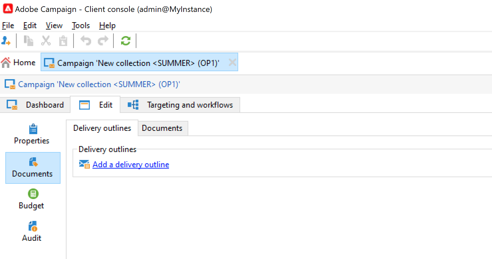

# 管理資產和檔案 {#manage-assets-documents}

您可以將各種檔案與促銷活動建立關聯：報告、照片、網頁、圖表等。 這些文檔可以是任何格式。

在促銷活動中，您也可以參考其他項目，例如促銷優惠券、與特定品牌或商店相關的特別優惠等。 當這些元素包含在大綱中時，它們可以與直接郵件傳送相關聯。 [了解更多資訊](#associating-and-structuring-resources-linked-via-a-delivery-outline)。

>[!CAUTION]
>
>此功能專為小型資產和檔案而設計。

<!--
>[!NOTE]
>
>If you are using Campaign Marketing Resource Management module, you can also manage a library of marketing resources that are available for several users for collaborative work. [Learn more](../../mrm/using/managing-marketing-resources.md).
-->

## 添加文檔 {#add-documents}

可在促銷活動層級（內容檔案）或方案層級（一般檔案）將檔案建立關聯。

對於促銷活動， **[!UICONTROL Documents]** 索引標籤包含：

* 內容（模板、影像等）所需的所有文檔的清單 可由Adobe Campaign營運商在本機下載，
* 包含路由器資訊的文檔（如果有）。

檔案會透過連結至方案或行銷活動 **[!UICONTROL Edit > Documents]** 標籤。

您也可以從控制面板中的專用連結將檔案新增至促銷活動。

按一下 **[!UICONTROL Detail...]** 表徵圖，查看檔案的內容和添加資訊：

在控制面板中，與促銷活動相關聯的檔案會分組在 **[!UICONTROL Document(s)]** 區段，如下列範例：

您也可以從此檢視編輯和修改這些量度。

## 使用傳遞大綱 {#delivery-outlines}

傳遞大綱是一組元素（文檔、商店、促銷優惠券等） 由公司建立，並用於特定促銷活動。 用於直接郵件傳送的情境中。

這些元素會分組在傳送大綱中，每個傳送大綱都與傳送相關聯；會在傳送至的解壓縮檔案中參考 **服務提供者** 以附加至傳遞。 例如，您可以建立傳遞大綱，參考單位及其使用的行銷手冊。

對於促銷活動，傳送大綱可讓您根據特定條件來建構要與傳送相關聯的外部元素：相關單位、已授予的促銷優惠、參加當地活動的邀請等。

>[!CAUTION]
>
>傳送大綱限制為直接郵件促銷活動。

### 建立傳遞大綱 {#create-an-outline}

若要建立傳遞大綱，請按一下 **[!UICONTROL Delivery outlines]** 子標籤 **[!UICONTROL Edit > Documents]** 標籤。

>[!NOTE]
>
>如果您看不到此索引標籤，則此功能無法用於此促銷活動，或您的執行個體中未啟用直接郵件傳送。 請參閱 [行銷活動範本設定](marketing-campaign-templates.md#campaign-templates) 或您的授權合約。

下一步，按一下 **[!UICONTROL Add a delivery outline]** 和建立促銷活動大綱的階層：

1. 按一下右鍵樹的根，然後選擇 **[!UICONTROL New > Delivery outlines]**.
1. 按一下右鍵剛建立的大綱並選擇 **[!UICONTROL New > Item]** 或 **[!UICONTROL New > Personalization fields]**.

大綱可包含項目、個人化欄位和選件：

* 項目可以是實體檔案，例如，此處會參考並說明這些檔案，並會附加至傳送。
* 個人化欄位可讓您建立與傳送相關的個人化元素，而非收件者。 因此，您可以建立要用於特定目標（歡迎優惠、折扣等）之傳送的值 它們會在Adobe Campaign中建立，並透過 **[!UICONTROL Import personalization fields...]** 連結。

   

   也可以按一下 **[!UICONTROL Add]** 表徵圖。

   

### 選擇大綱 {#select-an-outline}

對於每個傳送，可以從為提取大綱保留的節中選擇要關聯的大綱，如下例所示：

然後，所選大綱將顯示在窗口的下部部分。 您可以使用欄位右側的圖示加以編輯，或使用下拉式清單加以變更：

此 **[!UICONTROL Summary]** 傳送的索引標籤也會顯示此資訊：

### 提取結果 {#extraction-result}

在提取併發送到服務提供商的檔案中，大綱的名稱，並在適當時，其特徵（成本、說明等） 根據與服務提供者相關聯的匯出範本中的資訊，將其新增至內容。

在以下示例中，與傳送相關聯的大綱的標籤、估計成本和說明將添加到解壓縮檔案中。

導出模型必須與為相關傳送選擇的服務提供商相關聯。 請參閱[本節](providers--stocks-and-budgets.md#creating-service-providers-and-their-cost-structures)。
