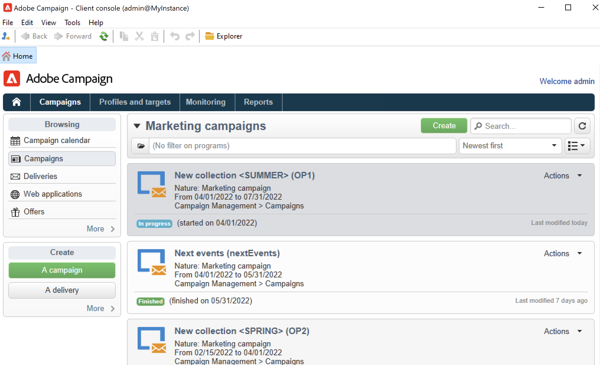

# 建立方案和行銷活動{#create-programs-and-campaigns}

Campaign協調流程元件位於 **[!UICONTROL Campaigns]** 標籤：您可在此處檢視行銷方案和行銷活動的概覽，及其相關元素。

行銷方案由行銷活動組成，行銷活動由傳遞、資源等組成。 有關傳遞、預算、稽核者和連結檔案的所有資訊都會分組在行銷活動中。

 [在影片中探索方案和宣傳活動](#video)

## 使用方案和計畫{#work-with-plan-and-program}

### 建立計畫和方案階層 {#create-plan-and-program}

每個行銷活動都屬於屬於屬於計畫的方案。 所有計畫、方案和行銷活動都可透過 **[!UICONTROL Campaign calendar]** 功能表 **行銷活動** 標籤。

開始建立行銷活動和傳遞之前，請為行銷計畫和方案設定資料夾階層。

1. 按一下 **瀏覽器** 圖示加以存取。
1. 在您要建立計畫的資料夾上按一下滑鼠右鍵。
1. 選取 **新增資料夾> Campaign Management >計畫**.

   

1. 重新命名計畫。
1. 在新建立的計畫上按一下滑鼠右鍵，然後選取 **屬性……**.
1. 在 **一般** 標籤，修改 **內部名稱** 以避免在套件匯出期間出現重複專案。

   

1. 按一下「**儲存**」。
1. 在新建立的計畫上按一下滑鼠右鍵，然後選取 **建立新的&#39;Program&#39;資料夾**.

   

1. 重複上述步驟，重新命名新的程式資料夾及其內部名稱。

### 設定程式 {#edit-a-program}

編輯程式時，請使用下述標籤來瀏覽及設定程式。

* 此 **排程** 索引標籤會根據您在日曆標題中按一下哪個索引標籤，顯示某個月、周或天的方案行事曆。 您可以從此頁面建立行銷活動、方案或任務。 [了解更多](#campaign-calendar)

* 此 **編輯** 索引標籤可讓您個人化方案：名稱、開始和結束日期、預算、連結檔案等。

  

## 使用行銷活動{#work-with-campaigns}

### 建立行銷活動 {#create-a-campaign}

您可以透過行銷活動清單建立行銷活動。 若要顯示此檢視，請選取 **[!UICONTROL Campaigns]** 功能表 **[!UICONTROL Campaigns]** 控制面板，然後按一下 **[!UICONTROL Create]**.

此 **[!UICONTROL Program]** 欄位可讓您選取要附加行銷活動的方案。 此資訊是強制性的。

行銷活動也可以透過行銷活動或方案行事曆來建立。 [了解更多](#campaign-calendar)

在行銷活動建立視窗中，選取行銷活動範本並新增行銷活動的名稱和說明。 您也可以指定行銷活動的開始和結束日期。

按一下 **[!UICONTROL OK]** 以建立行銷活動。 它會新增至方案排程和行銷活動清單。

然後，您可以編輯剛建立的行銷活動並定義其引數。 若要開啟並設定此行銷活動，您可以：

1. 瀏覽行銷活動行事曆，並選取您要顯示的行銷活動，然後按一下 **[!UICONTROL Open]** 連結。
1. 瀏覽 **[!UICONTROL Schedule]** 索引標籤中，選取行銷活動並加以開啟。
1. 瀏覽行銷活動清單，然後按一下要編輯的行銷活動名稱。

所有這些動作都會將您帶往行銷活動控制面板。

存取下列章節，瞭解如何設定行銷活動：

* [新增傳遞](marketing-campaign-deliveries.md)
* [管理資產和檔案](marketing-campaign-assets.md)
* [建立目標對象](marketing-campaign-target.md)
* [設定核准流程](marketing-campaign-approval.md)
* [管理庫存和預算](providers-stocks-and-budgets.md)

### 編輯行銷活動設定 {#campaign-settings}

行銷活動是透過行銷活動範本建立。 您可以設定已選取某些選項且已儲存其他設定的可重複使用範本。

對於每個行銷活動，都提供下列功能：

* 參考檔案和資源：您可以將檔案與行銷活動建立關聯（簡介、報告、影像等）。 支援所有檔案格式。 [了解更多](marketing-campaign-deliveries.md#manage-associated-documents)。
* 定義成本：對於每個行銷活動，Adobe Campaign可讓您定義建立行銷活動時所使用的成本輸入與成本計算結構。 例如：列印成本、使用外部代理商、房間租賃等。 [了解更多](providers-stocks-and-budgets.md#defining-cost-categories)。
* 定義目標：您可以定義行銷活動的可量化目標，例如訂閱者人數、業務量等。 此資訊稍後會用於行銷活動報表。
* 管理種子地址和控制組。 [了解更多](marketing-campaign-deliveries.md#defining-a-control-group)。
* 管理核准：您可以選取要核准的處理方式，並視需要選取複查操作員或操作員群組。 [了解更多](marketing-campaign-approval.md#checking-and-approving-deliveries)。

>[!NOTE]
>
>若要存取及更新行銷活動設定，請瀏覽至 **[!UICONTROL Advanced campaign parameters...]** 中的連結 **[!UICONTROL Edit]** 標籤。

### 監視行銷活動 {#monitor-a-campaign}

針對每個行銷活動，工作、資源和傳遞都會集中在控制面板中。 此介面可讓您管理和協調行銷動作。

透過Adobe Campaign，您可以設定合作流程，以建立和核准行銷活動的各個步驟：核准預算、目標、內容等。 此協調流程的詳細資訊請參閱 [本節](marketing-campaign-approval.md).

>[!NOTE]
>
>行銷活動中可用的元件取決於其範本。 行銷活動範本設定顯示於 [本節](marketing-campaign-templates.md#campaign-templates).

完成行銷活動後，請使用 **[!UICONTROL Reports]** 存取行銷活動報表的連結。

## 行銷活動行事曆 {#campaign-calendar}

行銷活動行事曆顯示所有方案、計畫、行銷活動和傳遞。

若要編輯計畫、方案、行銷活動或傳遞，請在行事曆中瀏覽至其名稱，然後使用 **[!UICONTROL Open]** 連結。 然後它會顯示在新的標籤中，如下所示：

您可以篩選行銷活動行事曆中顯示的資訊。 若要這麼做，請按一下 **[!UICONTROL Filter]** 連結並選取篩選條件。

>[!NOTE]
>
>依日期篩選時，會顯示開始日期晚於指定日期及/或結束日期早於指定日期的所有行銷活動。 日期是使用每個欄位右側的行事曆來選取。

您也可以使用 **[!UICONTROL Search]** 欄位以篩選顯示的專案。

連結至每個專案的圖示可讓您檢視其狀態：已完成、進行中、正在編輯等。

若要篩選要顯示的行銷活動，請按一下 **[!UICONTROL Filter]** 連結並選取要顯示的行銷活動狀態。

瀏覽行事曆時，您也可以建立方案或行銷活動。

當您透過建立行銷活動時 **[!UICONTROL Schedule]** 索引標籤中，此行銷活動會自動連結至相關的方案。 此 **[!UICONTROL Program]** 欄位在此情況下是隱藏的。

## 使用網頁瀏覽器存取Campaign {#use-the-web-interface}

>[!AVAILABILITY]
>
>從Campaign v8.6開始，Campaign可在網頁使用者介面中使用。 大部分的行銷動作都可在此新介面中執行。 [了解更多](../../v8/start/campaign-ui.md#discover-the-user-interface)。

您可以透過網際網路瀏覽器存取部分Adobe Campaign使用者端主控台畫面，以檢視所有行銷活動和傳送，以及資料庫中設定檔的報告和資訊。 您無法從此Web存取建立元件，但根據存取許可權，您可以檢視和/或處理資料庫中的資料。 通常，您可以核准行銷活動內容和目標定位、重新啟動或停止傳送等。

1. 照常透過https://登入`<your instance>:<port>/view/home`.
1. 使用功能表存取概述。

   

除了導覽和檢視行銷活動之外，您還可以執行下列型別的工作：

* 監視執行個體上的活動
* 參與驗證程式，例如，核准或拒絕傳遞內容
* 執行其他快速動作，例如暫停工作流程
* 存取所有報告功能
* 參與論壇討論

此表格總結列出您可從瀏覽器對行銷活動採取的動作：

| 頁面  | 動作 |
| --- | --- |
| 行銷活動、傳遞、優惠方案等清單。 | 刪除清單專案 |
| Campaign | 取消行銷活動 |
| 傳遞 | 核准傳遞內容和目標 提交傳遞內容 確認傳遞 暫停和停止傳遞 |
| 網頁應用程式 | 建立網站應用程式 編輯應用程式內容和屬性 將應用程式內容另存為範本 發佈應用程式 |
| 優惠 | 核准優惠方案內容和資格 停用線上選件 |
| 任務 | 完成任務 取消任務 |
| 行銷資源 | 核准資源 鎖定及解除鎖定資源 |
| 行銷活動套件 | 提交套件以供核准 核准或拒絕套件 取消套裝 |
| 行銷活動訂單 | 建立訂單 接受或拒絕訂單 |
| 庫存 | 刪除庫存行 |
| 優惠方案模擬 | 開始和停止模擬 |
| 目標定位工作流程 | 開始、暫停和停止工作流程 |
| 報告 | 將目前的資料儲存在報告歷史記錄中 |
| 論壇 | 新增討論 回覆討論中的訊息 關注討論內容並取消訂閱 |

### 管理核准

目標或傳遞內容的核准可透過Web存取執行。

您也可以使用通知訊息中包含的連結。 如需詳細資訊，請參閱[本章節](marketing-campaign-approval.md#checking-and-approving-deliveries)。

## 教學課程影片 {#video}

本影片說明如何建立行銷計畫、方案和行銷活動。

>[!VIDEO](https://video.tv.adobe.com/v/333810?quality=12)
