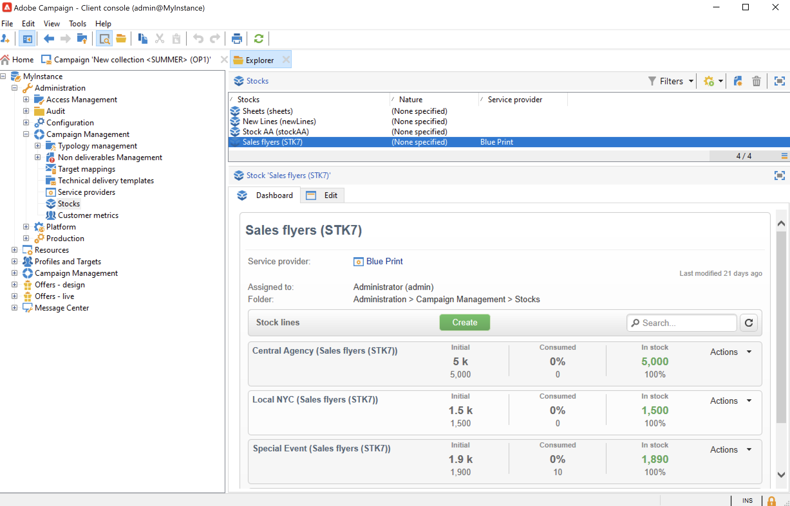

# 行銷活動傳遞 {#marketing-campaign-deliveries}

在行銷活動中協調跨通道傳遞：透過個人化電子郵件、簡訊、推播通知和應用程式內訊息，簡化您與Adobe Campaign的通訊。 您可以使用影片、表情符號或GIF等豐富媒體，並直接加以整合。

您可以透過行銷活動控制面板、行銷活動工作流程，或直接透過傳送概述來建立傳送。 從行銷活動建立傳遞時，會連結至此行銷活動，並在行銷活動層級合併。

## 建立傳遞 {#create-deliveries}

您有兩種方式可將傳遞新增至行銷活動：

* 從行銷活動控制面板中的&#x200B;**[!UICONTROL Add a delivery]**&#x200B;連結。

  

  儲存後，傳送會新增至行銷活動控制面板。

* 在行銷活動工作流程的&#x200B;**[!UICONTROL Targeting and workflows]**&#x200B;索引標籤中，透過新增傳遞來建立。

  

  工作流程開始後，傳送會新增至行銷活動控制面板。

在此頁面](marketing-campaign-approval.md)瞭解如何設定及執行傳遞核准流程[。

## 開始傳遞 {#start-a-delivery}

授與所有核准後，可以傳送傳遞。 傳遞執行程式取決於通道。

* 如需電子郵件或行動裝置頻道傳遞，請參閱[本節](#start-an-online-delivery)

* 如果是直接郵件傳遞，請參閱[本節](#start-an-offline-delivery)

### 開始電子郵件或行動傳送 {#start-an-online-delivery}

在授與所有核准要求後，傳遞狀態就會變更為&#x200B;**[!UICONTROL Pending confirmation]**&#x200B;並可以啟動。 可開始傳送的稽核者會收到傳送已準備開始的通知。

此資訊也會顯示在行銷活動控制面板上。 **[!UICONTROL Confirm delivery]**&#x200B;連結可讓您開始傳遞。

確認傳遞僅限於管理員，以及傳遞或行銷活動屬性中明確提及的運運算元或運運算元群組。 如果未設計運運算元，則管理員和行銷活動所有者可以核准。

不過，您也可以允許行銷活動擁有者確認傳送，即使傳送或行銷活動屬性中已定義特定稽核者亦然。 若要這麼做，請以管理員身分建立&#x200B;**NmsCampaign_Activate_OwnerConfirmation**&#x200B;選項，並將其設定為&#x200B;**1**。 這些選項是從Campaign檔案總管的&#x200B;**[!UICONTROL Administration]** > **[!UICONTROL Platform]** > **[!UICONTROL Options]**&#x200B;資料夾進行管理。

### 開始直接郵件傳送 {#start-an-offline-delivery}

在授予所有核准後，傳遞狀態會變更為&#x200B;**[!UICONTROL Pending extraction]**。 解壓縮檔案是透過專用的[技術工作流程](../workflow/technical-workflows.md)建立的，在預設設定中，當直接郵件傳遞擱置解壓縮時，會自動啟動解壓縮檔案。 處理進行中時，會顯示於控制面板中，並可透過其連結進行編輯。

成功執行擷取工作流程後，必須核准擷取檔案（前提是已在傳送設定中選取擷取檔案核准）。 [了解更多](marketing-campaign-approval.md#approving-an-extraction-file)。

請依照下列步驟驗證內容，並將檔案傳送給提供者：

1. 擷取檔案一經核准，即可產生路由器通知電子郵件的校樣。 此電子郵件訊息是根據傳遞範本所建構。 必須經過核准。

   只有在進階行銷活動引數的&#x200B;**[!UICONTROL Approvals]**&#x200B;索引標籤中啟用了&#x200B;**[!UICONTROL Enable the sending and validation of proofs (Direct mail)]**&#x200B;選項時，才能使用此步驟。

   

1. 按一下&#x200B;**[!UICONTROL Send a proof]**&#x200B;按鈕以建立校樣。

   必須預先定義校樣目標。

   您可以視需要建立儘可能多的校樣。 這些可透過傳遞詳細資料的&#x200B;**[!UICONTROL Direct mail...]**&#x200B;連結存取。

1. 傳遞狀態變更為&#x200B;**[!UICONTROL To submit]**。 按一下&#x200B;**[!UICONTROL Submit proofs]**&#x200B;按鈕以開始核准程式。

1. 傳遞狀態變更為&#x200B;**[!UICONTROL Proof to validate]**，而且按鈕可讓您接受或拒絕核准。

   您可以接受或拒絕此核准，或返回擷取步驟。

1. 校樣獲得核准後，解壓縮檔案會傳送至路由器並完成傳送。

### 預算和成本計算 {#compute-costs-and-stocks}

檔案擷取會啟動兩個程式：預算計算和存量計算。 預算專案會更新。

* **[!UICONTROL Budget]**&#x200B;索引標籤可讓您管理行銷活動的預算。 總成本專案會顯示在行銷活動主要標籤及其所屬方案的&#x200B;**[!UICONTROL Calculated cost]**&#x200B;欄位中。 這些金額也會反映在行銷活動預算中。

  

  實際成本最終將依據路由器提供的資訊計算。 只有實際傳送的訊息才會開立發票。

* 庫存定義於樹狀結構的&#x200B;**[!UICONTROL Administration > Campaign management > Stocks]**&#x200B;節點中。

  

  **[!UICONTROL Administration > Campaign management > Service providers]**&#x200B;節點中的成本結構。

  

  坯件線會顯示在坯件區段中。 若要定義初始坯件，請開啟坯件線。 每次進行交貨時，庫存都會減少。 您可以定義警示等級與通知。

  >[!NOTE]
  >
  >在本節](providers-stocks-and-budgets.md)中進一步瞭解預算[。
