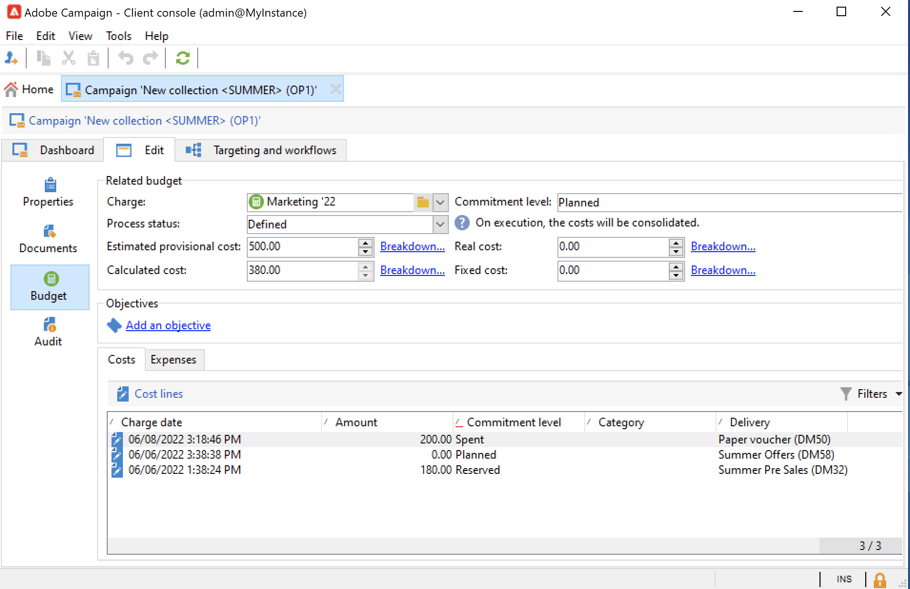

# 行銷活動傳遞 {#marketing-campaign-deliveries}

在市場活動中協調您的跨渠道交貨：通過個性化電子郵件、簡訊、推送通知和應用內消息簡化您與Adobe Campaign的通信。 您可以使用視頻、表情符號或GIF等富媒體，並直接將它們整合。

可通過市場活動控制面板、市場活動工作流或直接通過交貨概覽建立交貨。 從市場活動建立交貨後，交貨將連結到此市場活動並在市場活動級別進行合併。

## 建立傳遞 {#create-deliveries}

您有兩種方法可將交貨添加到市場營銷活動：

* 從 **[!UICONTROL Add a delivery]** 連結。

保存後，交貨即添加到市場活動控制面板。

* 從市場活動工作流，在 **[!UICONTROL Targeting and workflows]** 按鈕。

   

   啟動工作流後，交貨將添加到市場活動控制面板。

瞭解如何設定和執行交貨審批流 [此頁](marketing-campaign-approval.md)。

## 開始交貨 {#start-a-delivery}

一旦獲得所有批准，就可以發送交貨。 交付執行過程取決於渠道。

* 有關電子郵件或移動渠道交付，請參閱 [此部分](#start-an-online-delivery)

* 有關直郵遞送，請參閱 [此部分](#start-an-offline-delivery)

### 啟動電子郵件或移動交付 {#start-an-online-delivery}

一旦授予所有批准請求，交貨狀態將更改為 **[!UICONTROL Pending confirmation]** 可以啟動。 可以啟動傳遞的審閱者會通知已準備啟動傳遞。

該資訊也顯示在市場活動控制面板上。 的 **[!UICONTROL Confirm delivery]** 連結可啟動交貨。

確認交付僅限於管理員以及在交付或市場活動屬性中明確提及的操作員或操作員組。 如果未設計操作員，管理員和市場活動所有者可以批准。

但是，您也可以允許市場活動所有者確認發送，即使在交付屬性或市場活動屬性中定義了特定審核者。 要執行此操作，請以管理員身份建立 **NmsCampaign_Activate_OwnerConfirmation** 選項，並將其設定為 **1**。 這些選項是從 **[!UICONTROL Administration]** > **[!UICONTROL Platform]** > **[!UICONTROL Options]** 的子菜單。

### 啟動直接郵件傳遞 {#start-an-offline-delivery}

一旦所有批准都獲得，交貨狀態將更改為 **[!UICONTROL Pending extraction]**。 提取檔案通過專用的 [技術工作流](../workflow/technical-workflows.md) 在預設配置中，當直郵遞送掛起提取時自動啟動。 當進程正在進行時，該進程將顯示在儀表板中，並可通過其連結進行編輯。

抽取工作流成功執行後，必須批准抽取檔案（前提是在傳遞設定中選擇了抽取檔案批准）。 [了解更多資訊](marketing-campaign-approval.md#approving-an-extraction-file)。

按照以下步驟驗證內容並將檔案發送到提供程式：

1. 一旦提取檔案獲得批准，您就可以生成路由器通知電子郵件的證明。 此電子郵件消息基於傳遞模板構建。 必須批准。

   此步驟僅在 **[!UICONTROL Enable the sending and validation of proofs (Direct mail)]** 選項在中啟用 **[!UICONTROL Approvals]** 頁籤。

   

1. 按一下 **[!UICONTROL Send a proof]** 按鈕。

   證明目標必須事先確定。

   您可以根據需要建立盡可能多的校樣。 通過 **[!UICONTROL Direct mail...]** 交貨詳細資訊的連結。

1. 交貨狀態更改為 **[!UICONTROL To submit]**。 按一下 **[!UICONTROL Submit proofs]** 按鈕啟動審批流程。

1. 交貨狀態更改為 **[!UICONTROL Proof to validate]** 按鈕允許您接受或拒絕批准。

   您可以接受或拒絕此審批，或返回提取步驟。

1. 證明獲得批准後，提取檔案將發送到路由器並完成傳送。

### 預算和成本計算 {#compute-costs-and-stocks}

檔案提取啟動兩個進程：預算計算和庫存計算。 將更新預算條目。

* 的 **[!UICONTROL Budget]** 頁籤，用於管理市場活動的預算。 成本條目的合計顯示在 **[!UICONTROL Calculated cost]** 市場活動主頁籤的欄位及其所屬的程式。 金額也反映在市場活動預算中。

   

   實際成本最終將由路由器提供的資訊計算。 只對實際發送的消息開票。

* 股票於 **[!UICONTROL Administration > Campaign management > Stocks]** 的子目標。

   

   中的成本結構 **[!UICONTROL Administration > Campaign management > Service providers]** 的下界。

   

   坯件行在坯件部分中可見。 要定義初始庫存，請開啟一個庫存行。 每次交貨時，庫存都會減少。 您可以定義預警級別和通知。

   >[!NOTE]
   >
   >瞭解有關預算的更多資訊 [此部分](providers--stocks-and-budgets.md)。
