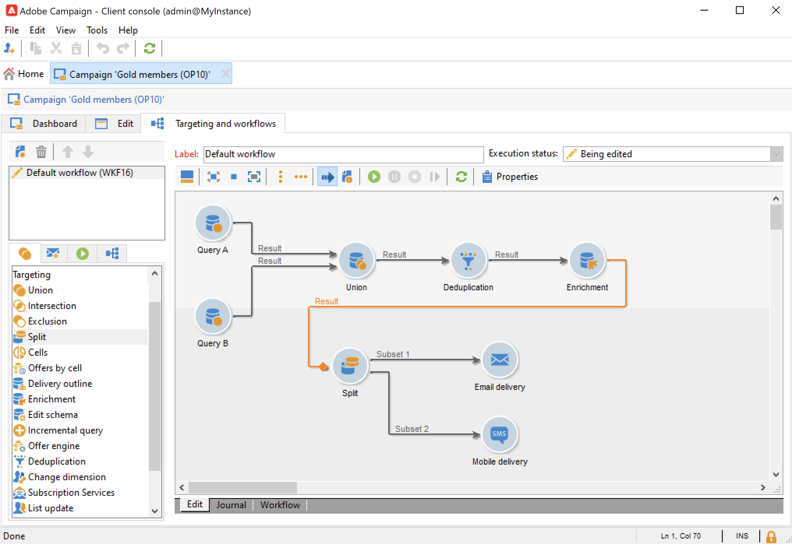

# 選取行銷活動的對象 {#marketing-campaign-deliveries}

在行銷活動中，您可以針對每次傳送定義：

* 目標對象。 您可以將訊息傳送至 [收件者清單](#send-to-a-group) 或建置 [工作流程中的對象](#build-the-main-target-in-a-workflow)
* 控制組。 您可以 [新增控制組](#add-a-control-group) 監視訊息傳遞後的收件者行為
* 種子地址 — 瞭解更多 [本節](../../v8/audiences/test-profiles.md).—>

此資訊中的部分內容可繼承自 [行銷活動範本](marketing-campaign-templates.md#campaign-templates).

<!--
To build the delivery target, you can define filtering criteria for the recipients in the database. This recipient selection mode is presented in [this section](../../delivery/using/steps-defining-the-target-population.md).
-->

## 傳送至群組{#send-to-a-group}

您可以將母體匯入清單，然後在傳遞中鎖定此清單。 要執行此操作，請遵循下列步驟：

1. 編輯傳遞，然後按一下 **[!UICONTROL To]** 用於變更目標母體的連結。
1. 在 **[!UICONTROL Main target]** 索引標籤中，選取 **[!UICONTROL Defined via the database]** 選項並按一下 **[!UICONTROL Add]** 以選取收件者。

   

1. 選擇 **[!UICONTROL A list of recipients]**.

   

1. 按一下 **[!UICONTROL Next]** 以選取清單。

   

   您可以新增篩選條件來縮小目標範圍。

1. 按一下 **[!UICONTROL Finish]** 定義所有條件後，並儲存主要目標。

## 在行銷活動工作流程中建立對象 {#build-the-main-target-in-a-workflow}

傳遞的主要目標也可以在行銷活動工作流程中定義：此圖形環境可讓您使用查詢、測試和運運算元來建立目標：聯合、重複資料刪除、共用等。

>[!IMPORTANT]
>
>在行銷活動中新增的工作流程不可超過28個。 超過此限制後，介面中不會顯示其他工作流程，而且可能會產生錯誤。

### 建立工作流程 {#create-a-targeting-workflow}

您可以透過工作流程中圖形順序的篩選條件組合來建立目標定位。 您可以建立母體和子母體，並根據您的需求將其設為目標。 若要顯示工作流程編輯器，請按一下 **[!UICONTROL Targeting and workflows]** 索引標籤進行編輯。

透過置於工作流程中的一或多個查詢，會從Adobe Campaign資料庫擷取目標母體。 瞭解如何在中建置查詢 [本節](../workflow/query.md).

您可以透過「聯合」、「交集」、「共用」、「排除」等方塊啟動查詢及共用母體。

從工作區左側的清單中選取物件，並連結它們以建構目標。

在圖表中，連結圖表中目標建構所需的目標定位和排程查詢。 您可以在建構期間執行目標定位，以檢查從資料庫擷取的母體。

>[!NOTE]
>
>有關定義查詢的範例和程式的詳情，請參閱 [本節](../workflow/query.md).

編輯器的左側區段包含代表活動的圖形物件庫。 第一個標籤包含目標定位活動，第二個標籤則包含流量控制活動，這些活動偶爾會用來協調目標定位活動。

目標工作流程執行和格式化功能可透過圖表編輯器工具列存取。

>[!NOTE]
>
>可用來建置圖表的活動以及所有顯示和配置功能在中詳細說明 [本節](../workflow/about-workflows.md).

您可以為單一行銷活動建立數個目標工作流程。 若要新增工作流程：

1. 前往工作流程建立區域的左上角區段，按一下滑鼠右鍵，然後選取 **[!UICONTROL Add]**. 您也可以使用 **[!UICONTROL New]** 按鈕的位置。

   

1. 選取 **[!UICONTROL New workflow]** 範本並命名此工作流程。
1. 按一下 **[!UICONTROL OK]** 以確認建立工作流程，然後建立此工作流程的圖表。

### 執行工作流程 {#execute-a-workflow}

目標工作流程可以透過手動啟動 **[!UICONTROL Start]** 按鈕時（前提是您具備適當的許可權）。

可以按照排程（排程器）或事件（外部訊號、檔案匯入等）將目標設定為自動執行。

與執行目標定位工作流程相關的動作（啟動、停止、暫停等） 為 **非同步** 處理程式：命令已儲存，一旦伺服器可供套用，命令就會生效。

工具列圖示可讓您執行定位工作流程的相關動作。

* 啟動或重新啟動

   * 此 **[!UICONTROL Start]** 圖示可讓您啟動目標定位工作流程。 當您按一下此圖示時，所有沒有輸入轉變的活動都會啟動（端點跳轉除外）。

     

     伺服器會將請求列入考量，如其狀態所示： **[!UICONTROL Start as soon as possible]**.

   * 您可以透過適當的工具列圖示重新啟動目標定位工作流程。 此指令在下列情況下可能很有用： **[!UICONTROL Start]** 圖示無法使用，例如正在停止定位工作流程時。 在此情況下，請按一下 **[!UICONTROL Restart]** 圖示以預期重新啟動。 伺服器會將請求列入考量，其狀態顯示為： **[!UICONTROL Restart requested]**.

* 停止或暫停

   * 工具列圖示可讓您停止或暫停進行中的目標定位工作流程。

     當您按一下 **[!UICONTROL Pause]**，作業進行中 **[!UICONTROL are not]** 已暫停，但直到下次重新啟動才會啟動其他活動。

     

     伺服器會考慮該命令，其狀態顯示如下： **[!UICONTROL Pause requested]**.

     您也可以在執行目標工作流程達到特定活動時自動暫停該工作流程。 若要這麼做，請以滑鼠右鍵按一下要暫停目標定位工作流程的活動，然後選取 **[!UICONTROL Enable but do not execute]**.

     

     此設定會以特殊圖示顯示。

     

     >[!NOTE]
     >
     >在進階目標定位行銷活動設計和測試階段，此選項非常有用。

     按一下 **[!UICONTROL Start]** 以繼續執行。

   * 按一下 **[!UICONTROL Stop]** 圖示可停止進行中的執行。

     

     伺服器會考慮該命令，其狀態顯示如下： **[!UICONTROL Stop requested]**.

  您也可以在執行到達活動時自動停止目標定位工作流程。 要執行此操作，請以滑鼠右鍵按一下將停止目標定位工作流程的活動，然後選取 **[!UICONTROL Do not activate]**.

  

  此設定會以特殊圖示顯示。

  

  >[!NOTE]
  >
  >在進階目標定位行銷活動設計和測試階段，此選項非常有用。

* 無條件停止

  在總管中，選取 **[!UICONTROL Administration > Production > Object created automatically > Campaign workflows]** 以存取及處理每個行銷活動工作流程。

  您可以按一下「 」，無條件停止工作流程 **[!UICONTROL Actions]** 圖示並選取 **[!UICONTROL Unconditional]** 停止。 此動作會終止您的行銷活動工作流程。

  

## 新增控制組 {#add-a-control-group}

控制組是不接收傳遞的母體；它可用來追蹤傳遞後的行為，以及行銷活動影響，方法是與接收傳遞的目標母體的行為進行比較。

控制組可從主要目標擷取及/或來自特定群組或查詢。

### 啟用行銷活動的控制組 {#activate-the-control-group-for-a-campaign}

您可以在行銷活動層級定義控制組，在這種情況下，控制組將套用至相關行銷活動的每個傳送。

1. 編輯相關的行銷活動，然後按一下 **[!UICONTROL Edit]** 標籤。
1. 按一下&#x200B;**[!UICONTROL Advanced campaign parameters...]**。

   

1. 選取 **[!UICONTROL Enable and edit control group configuration]** 選項。
1. 按一下 **[!UICONTROL Edit...]** 以設定控制組。

   

有關完整程式的詳情，請參閱 [本節](#extract-the-control-group-from-the-main-target). 進一步瞭解中的控制組 [本節](#add-a-population).

### 啟用傳遞的控制組 {#activate-the-control-group-for-a-delivery}

您可以在傳送層級定義控制組，此時控制組將套用至相關行銷活動的每個傳送。

根據預設，在行銷活動層級定義的控制群組設定會套用至該行銷活動的每次傳遞。 不過，您可以為個別傳遞調整控制組。

>[!NOTE]
>
>如果您已定義行銷活動的控制組，且還將其設定為連結至此行銷活動的傳送，則只會套用為傳送定義的控制組。

1. 編輯相關的傳遞，然後按一下 **[!UICONTROL To]** 連結。
1. 按一下 **[!UICONTROL Control group]** 標籤，然後選取 **[!UICONTROL Enable and edit control group configuration]**.

   

1. 按一下 **[!UICONTROL Edit...]** 以設定控制組。

有關完整程式的詳情，請參閱 [本節](#extract-the-control-group-from-the-main-target).

### 使用新母體作為控制組 {#add-a-population}

您可對控制組使用特定人口。 在這種情況下，請在相關欄位中選取要作為控制組的清單。

此母體可能來自收件者清單，或者您可以透過特定查詢加以定義。

>[!NOTE]
>
>Adobe Campaign查詢編輯器的顯示位置為 [本節](../workflow/query.md).

### 從主要目標擷取控制組 {#extract-the-control-group-from-the-main-target}

您也可以從傳遞的主要目標擷取收件者。 在此情況下，收件者將會從受此設定影響的傳遞動作目標中取得。 此擷取可以是隨機的，也可以是排序收件者的結果。

若要擷取控制組，請啟用行銷活動或傳送的控制組，並選取下列其中一個選項： **[!UICONTROL Activate random sampling]** 或 **[!UICONTROL Keep only the first records after sorting]**.

* 使用 **[!UICONTROL Activate random sampling]** 將隨機抽樣套用至主要母體中的收件者的選項。 如果您然後將臨界值設為100，控制組將由從目標人口隨機選取的100個收件者組成。 隨機抽樣取決於資料庫引擎。
* 使用 **[!UICONTROL Keep only the first records after sorting]** 根據一或多個排序順序定義限制的選項。 如果您選取 **[!UICONTROL Age]** 欄位做為排序標準，然後將100定義為臨界值，控制組將由100個最年輕的收件者組成。 例如，定義包含很少購買的收件者或經常購買的收件者的控制組，並將他們的行為與已聯絡的收件者的行為進行比較，這可能很有趣。

按一下 **[!UICONTROL Next]** 以定義排序順序（如有必要），並選取收件者限制模式。

此設定等同於 **[!UICONTROL Split]** 活動的工作流程，可讓您將目標分割成子集。 控制組是這些子集的其中之一。

### 教學課程影片 {#create-email-video}

此影片說明如何新增控制組至行銷活動。

>[!VIDEO](https://video.tv.adobe.com/v/335606?quality=12)

提供其他Campaign操作說明影片 [此處](https://experienceleague.adobe.com/docs/campaign-learn/tutorials/getting-started/introduction-to-adobe-campaign.html){target="_blank"}.
