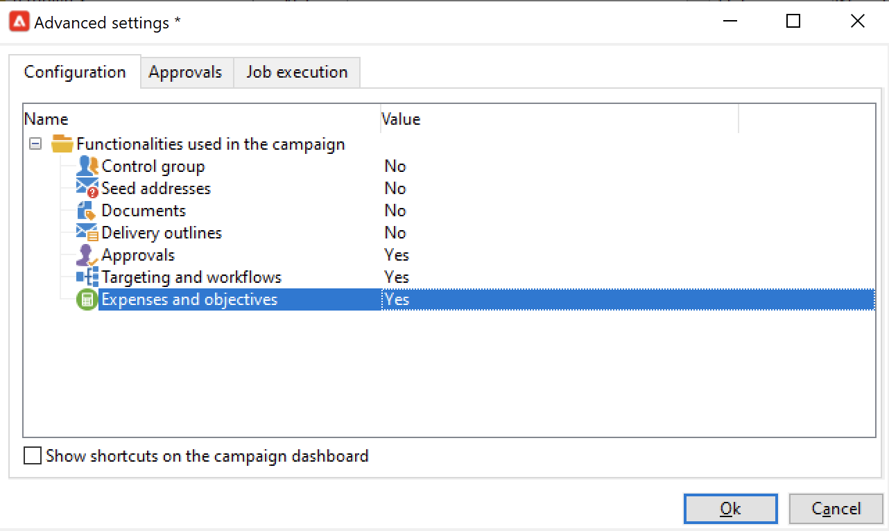

# 建立及設定行銷活動範本 {#campaign-templates}

所有市場營銷活動都基於一個模板，該模板儲存了主要特徵和功能。 市場活動附帶一個內置模板，用於建立市場活動。 此模板已啟用所有功能：文檔、種子地址、批准、交付大綱等

可用功能取決於您的權限、附加程式和Adobe Campaign平台的配置。

>[!NOTE]
>
>按一下 **[!UICONTROL Explorer]** 表徵圖

提供內建範本，以建立尚未定義特定設定的行銷活動。 您可以建立和設定行銷活動範本，然後從這些範本建立行銷活動。

## 建立市場活動模板 {#create-a-campaign-template}

要建立市場活動模板，請執行以下步驟：

1. 開啟市場活動 **瀏覽器**，並瀏覽 **資源>模板>市場活動模板**。
1. 按一下 **新建** 的上界。

您也可以 **重複** 內置模板，以重新使用和調整其配置。 要執行此操作，請按一下右鍵模板並選擇 **重複**。

1. 輸入新市場活動模板的標籤。
1. 按一下 **保存** 重新開啟模板。
1. 在 **編輯** 的子菜單。
1. 選擇 **高級市場活動參數……** 連結以將工作流添加到市場活動模板。

   

1. 更改 **目標和工作流** 值 **是**&#x200B;確認。 瞭解如何在 [此部分](#typology-of-enabled-modules)。
1. 的 **目標和工作流** 頁籤。 按一下 **添加工作流……**，輸入 **標籤** 按一下 **確定**。
1. 根據需要建立工作流。

   

1. 按一下 **保存**。 您的模板現已準備好用於建立新市場活動。

市場活動模板的各個標籤和子標籤允許您訪問其設定，如中所述 [常規配置](#general-configuration)。

## 選擇模組 {#select-modules}

的 **[!UICONTROL Advanced campaign parameters...]** 連結允許您基於此模板為市場活動啟用和禁用職務。 選擇要在基於此模板建立的市場活動中啟用的功能。

如果未選擇功能，則與流程相關的元素（菜單、表徵圖、選項、制表符、子制表符等） 不顯示在模板的介面或基於此模板的市場活動中。 市場活動詳細資訊左側的頁籤和可用頁籤與模板中選擇的功能一致。 例如， **費用和目標** 功能未啟用，相應 **[!UICONTROL Budget]** 頁籤不顯示在基於此模板的市場活動中。

此外，配置窗口的快捷方式被添加到市場活動儀表板。 啟用功能後，直接連結將允許從市場活動控制面板訪問該功能。

### 配置示例

* 例如，使用以下設定：

   

   市場活動控制板顯示：

   

   請注意 **[!UICONTROL Targeting and workflows]** 缺少。

   以下功能可用：

   

   請注意 **[!UICONTROL Budget]** 缺少。

   市場活動高級設定也反映了此配置。

   

   請注意 **[!UICONTROL Approvals]** 頁籤

* 使用此配置：
   

   市場活動控制板顯示：

   

   請注意 **[!UICONTROL Targeting and workflows]** 頁籤，但 **添加文檔** 缺少連結。

   以下功能可用：

   

   請注意 **[!UICONTROL Budget]** 的子菜單。

   市場活動高級設定也反映了此配置。

   

   請注意 **[!UICONTROL Approvals]** 頁籤，但 **[!UICONTROL Control population]** 和 **[!UICONTROL Seed addresses]** 頁籤未啟用。

## 模組類型 {#typology-of-enabled-modules}

* **控制組**

   選擇此模組後，將在模板的高級設定和基於此模板的市場活動中添加附加標籤。 可以通過模板定義配置，也可以針對每個市場活動單獨定義配置。 瞭解有關中的控制組的詳細資訊 [此部分](marketing-campaign-deliveries.md#defining-a-control-group)。

   

* **種子地址**

   選擇此模組後，將在模板的高級設定和基於此模板的市場活動中添加附加標籤。 可以通過模板定義配置，也可以針對每個市場活動單獨定義配置。

   

* **文檔**

   選擇此模組後，將向 **[!UICONTROL Edit]** 的子菜單。 可以從模板中添加附加文檔，也可以為每個市場活動單獨添加附加文檔。 瞭解有關中文檔的詳細資訊 [此部分](marketing-campaign-deliveries.md#manage-associated-documents)。

   

* **傳遞大綱**

   選擇此模組時， **[!UICONTROL Delivery outlines]** 頁籤添加到 **[!UICONTROL Documents]** 的子菜單。 瞭解有關中的交付大綱的詳細資訊 [此部分](marketing-campaign-assets.md#delivery-outlines)。

   

* **目標和工作流**

   選擇 **[!UICONTROL Targeting and workflows]** 模組中，將添加一個頁籤，以便您基於此模板為市場活動建立一個或多個工作流。 也可以根據此模板為每個市場活動單獨配置工作流。瞭解有關市場活動工作流的詳細資訊，請參閱 [此部分](marketing-campaign-deliveries.md#build-the-main-target-in-a-workflow)。

   

   啟用此模組後， **[!UICONTROL Jobs]** 頁籤添加到市場活動的高級設定中，以定義流程執行序列。

* **批准**

   如果啟用 **[!UICONTROL Approvals]**，您可以選擇要審批的流程和負責審批的操作員。 瞭解有關批准的詳細資訊 [此部分](marketing-campaign-approval.md#select-reviewers)。

   

   您可以選擇是否通過 **[!UICONTROL Approvals]** 頁籤。

* **費用和目標**

   選擇此模組時， **[!UICONTROL Budget]** 頁籤將添加到模板和基於此模板的市場活動的詳細資訊中，以便可以選擇關聯的預算。

   

## 模板屬性 {#template-properties}

建立市場活動模板時，需要輸入以下資訊：

* 輸入 **標籤** 的下界：該標籤是必需的，是基於此模板的所有市場活動的預設標籤。
* 選擇市場活動 **性** 從下拉清單中。 此清單中可用的值是保存在 **[!UICONTROL natureOp]** 枚舉。
   <!--
  >[!NOTE]
  >
  >For more information on enumerations, refer to the [Getting Started](../../platform/using/managing-enumerations.md) section.-->

* 選擇 **市場活動類型**:唯一、循環或定期。 預設情況下，市場活動模板適用於唯一的市場活動。 定期市場活動和定期市場活動的詳細資訊請參閱 [此部分](recurring-periodic-campaigns.md)。
* 指定市場活動的持續時間，即市場活動將發生的天數。 在基於此模板建立市場活動時，將自動填充市場活動起始日期和終止日期。

   如果市場活動是經常性的，則必須直接在模板中指定市場活動起始日期和終止日期。

* 指定 **相關計畫** 的下界：基於此模板的市場活動連結到所選方案。

<!--
## Track campaign execution{#campaign-reverse-scheduling}

You can create a schedule for a campaign and track accomplishments, for instance to prepare an event schedule for a specific date. Campaign templates now let you calculate the start date of a task based on the end date of a campaign.

In the task configuration box, go to the **[!UICONTROL Implementation schedule]** area and check the **[!UICONTROL The start date is calculated based on the campaign end date]** box. (Here, "start date" is the task start date). Go to the **[!UICONTROL Start]** field and enter an interval: the task will start this long before the campaign end date. If you enter a period which is longer than the campaign is set to last, the task will begin before the campaign.

When you create a campaign using this template, the task start date will be calculated automatically. However, you can always change it later.-->
