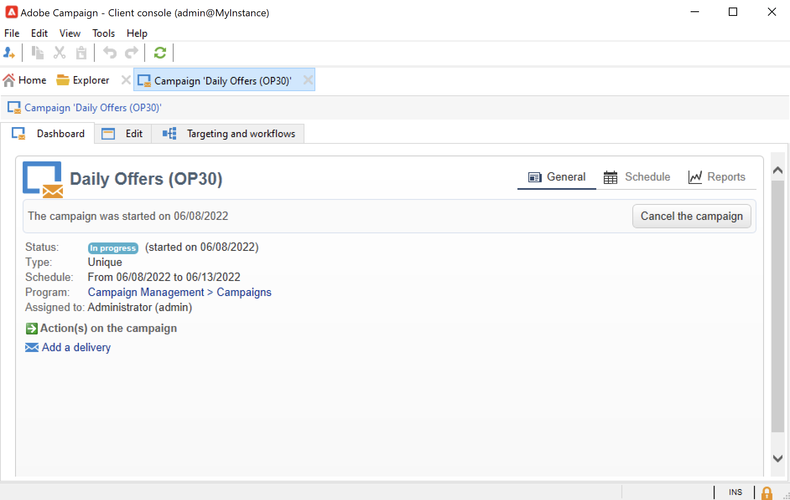
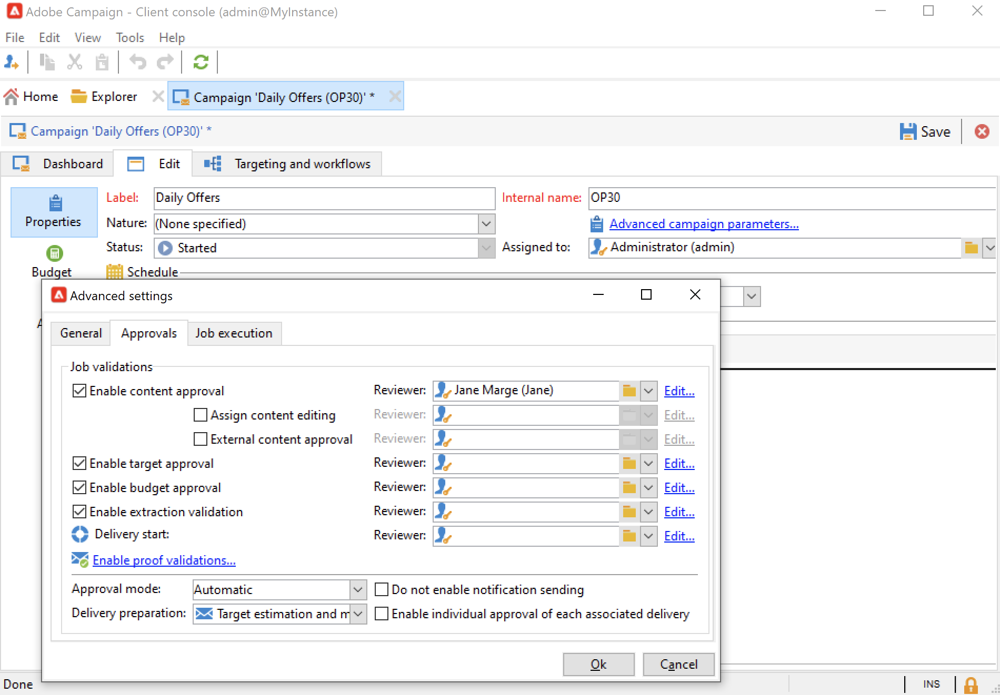

# 建立及設定行銷活動範本 {#campaign-templates}

所有行銷活動都以儲存主要特性和功能的範本為基礎。 Campaign隨附建立行銷活動的內建範本。 此範本已啟用所有功能：檔案、種子地址、核准、傳遞大綱等。

可用功能取決於您的許可權、附加元件和Adobe Campaign平台的設定。

>[!NOTE]
>
>當您按一下首頁上的&#x200B;**[!UICONTROL Explorer]**&#x200B;圖示時，會顯示樹狀結構。

提供內建範本，以建立尚未定義特定設定的行銷活動。 您可以建立和設定行銷活動範本，然後從這些範本建立行銷活動。

## 建立行銷活動範本 {#create-a-campaign-template}

若要建立行銷活動範本，請遵循下列步驟：

1. 開啟Campaign **總管**，並瀏覽至&#x200B;**資源>範本>行銷活動範本**。
1. 按一下範本清單上方工具列中的&#x200B;**新增**。

您也可以&#x200B;**複製**&#x200B;內建範本，以重複使用並調整其組態。 若要這麼做，請在範本上按一下滑鼠右鍵，然後選取&#x200B;**複製**。

1. 輸入新行銷活動範本的標籤。
1. 按一下&#x200B;**儲存**&#x200B;並重新開啟您的範本。
1. 在&#x200B;**編輯**&#x200B;索引標籤中，定義範本屬性。
1. 選取&#x200B;**進階行銷活動引數……**&#x200B;連結，以將工作流程新增至行銷活動範本。

   

1. 將&#x200B;**目標定位和工作流程**&#x200B;值變更為&#x200B;**是**，然後確認。 瞭解如何在[本節](#typology-of-enabled-modules)中新增功能。
1. **目標定位和工作流程**&#x200B;索引標籤已新增至範本。 按一下&#x200B;**新增工作流程……**，輸入&#x200B;**標籤**&#x200B;並按一下&#x200B;**確定**。
1. 根據您的需求建立工作流程。

   

1. 按一下&#x200B;**儲存**。 您的範本現在已準備好用來建立新的行銷活動。

行銷活動範本的各種標籤和子標籤可讓您存取其設定，如[一般設定](#general-configuration)中所述。

## 選取模組 {#select-modules}

**[!UICONTROL Advanced campaign parameters...]**&#x200B;連結可讓您根據此範本為行銷活動啟用和停用工作。 選取您要在根據此範本建立的行銷活動中啟用的功能。

如果未選取功能，則與流程相關的元素（功能表、圖示、選項、標籤、子標籤等）不會出現在範本的介面或根據此範本的行銷活動中。 行銷活動詳細資訊左側的標籤，以及可用的標籤，與範本中選取的功能一致。 例如，**費用和目標**&#x200B;功能未啟用，根據此範本的行銷活動中不會顯示相對應的&#x200B;**[!UICONTROL Budget]**&#x200B;標籤。

此外，設定視窗的捷徑會新增至行銷活動控制面板。 啟用功能時，直接連結可讓您從Campaign控制面板存取功能。

### 設定範例

* 例如，使用下列設定：

  

  行銷活動控制面板會顯示：

  

  請注意，**[!UICONTROL Targeting and workflows]**&#x200B;索引標籤遺失。

  下列功能可供使用：

  

  請注意，**[!UICONTROL Budget]**&#x200B;索引標籤遺失。

  行銷活動進階設定也會反映此設定。

  

  請注意，**[!UICONTROL Approvals]**&#x200B;索引標籤無法使用。

* 使用此設定：
  

  行銷活動控制面板會顯示：

  

  請注意，**[!UICONTROL Targeting and workflows]**&#x200B;索引標籤可用，但缺少&#x200B;**新增檔案**&#x200B;連結。

  下列功能可供使用：

  

  請注意，**[!UICONTROL Budget]**&#x200B;索引標籤可供使用。

  行銷活動進階設定也會反映此設定。

  

  請注意，**[!UICONTROL Approvals]**&#x200B;索引標籤可用，但&#x200B;**[!UICONTROL Control population]**&#x200B;和&#x200B;**[!UICONTROL Seed addresses]**&#x200B;索引標籤未啟用。

## 模組型別 {#typology-of-enabled-modules}

* **控制組**

  選取此模組時，範本的進階設定及根據此範本的行銷活動會新增一個標籤。 可透過範本或為每個行銷活動個別定義設定。 在[本節](marketing-campaign-deliveries.md#defining-a-control-group)中進一步瞭解控制組。

  

* **種子地址**

  選取此模組時，範本的進階設定及根據此範本的行銷活動會新增一個標籤。 可透過範本或為每個行銷活動個別定義設定。

  

* **檔案**

  選取此模組時，範本的&#x200B;**[!UICONTROL Edit]**&#x200B;索引標籤及根據此範本的行銷活動會新增一個索引標籤。 可從範本新增附加檔案，或針對每個促銷活動個別新增。 在[本節](marketing-campaign-deliveries.md#manage-associated-documents)中進一步瞭解檔案。

  

* **傳遞大綱**

  選取此模組時，會將&#x200B;**[!UICONTROL Delivery outlines]**&#x200B;子索引標籤新增至&#x200B;**[!UICONTROL Documents]**&#x200B;索引標籤，以定義行銷活動的傳遞大綱。 在[本節](marketing-campaign-assets.md#delivery-outlines)中進一步瞭解傳遞大綱。

  

* **目標定位和工作流程**

  選取&#x200B;**[!UICONTROL Targeting and workflows]**&#x200B;模組時，會新增索引標籤，讓您根據此範本建立一或多個行銷活動的工作流程。 您也可以根據此範本個別設定每個行銷活動的工作流程。在[本節](marketing-campaign-deliveries.md#build-the-main-target-in-a-workflow)中進一步瞭解行銷活動工作流程。

  

  啟用此模組時，會將&#x200B;**[!UICONTROL Jobs]**&#x200B;索引標籤新增至行銷活動的進階設定，以定義程式執行順序。

* **核准**

  如果啟用&#x200B;**[!UICONTROL Approvals]**，您可以選取要核准的程式以及負責核准的運運算元。 在[本節](marketing-campaign-approval.md#select-reviewers)中進一步瞭解核准。

  

  您可以選擇是否透過&#x200B;**[!UICONTROL Approvals]**&#x200B;索引標籤（範本進階設定區段）啟用程式核准。

* **費用和目標**

  選取此模組時，會根據此範本將&#x200B;**[!UICONTROL Budget]**&#x200B;標籤新增至範本和行銷活動的詳細資訊，以便選取相關預算。

  

## 範本屬性 {#template-properties}

建立行銷活動範本時，需要輸入下列資訊：

* 輸入範本的&#x200B;**標籤**：標籤是必要的，而且是根據此範本的所有行銷活動的預設標籤。
* 從下拉式清單中選取行銷活動&#x200B;**性質**。 此清單中可用的值是儲存在&#x200B;**[!UICONTROL natureOp]**&#x200B;列舉中的值。

  在[此頁面](../../v8/config/enumerations.md)中瞭解如何存取及設定您的分項清單。

* 選取行銷活動&#x200B;**的**&#x200B;型別：唯一、循環或定期。 依預設，行銷活動範本適用於不重複行銷活動。 在[此區段](recurring-periodic-campaigns.md)中詳細說明週期性行銷活動和週期性行銷活動。
* 指定行銷活動的持續時間，即行銷活動將發生的天數。 根據此範本建立行銷活動時，會自動填入行銷活動的開始和結束日期。

  如果行銷活動為週期性，您必須直接在範本中指定行銷活動開始和結束日期。

* 指定範本的&#x200B;**相關方案**：基於此範本的行銷活動已連結至選取的方案。

<!--
## Track campaign execution{#campaign-reverse-scheduling}

You can create a schedule for a campaign and track accomplishments, for instance to prepare an event schedule for a specific date. Campaign templates now let you calculate the start date of a task based on the end date of a campaign.

In the task configuration box, go to the **[!UICONTROL Implementation schedule]** area and check the **[!UICONTROL The start date is calculated based on the campaign end date]** box. (Here, "start date" is the task start date). Go to the **[!UICONTROL Start]** field and enter an interval: the task will start this long before the campaign end date. If you enter a period which is longer than the campaign is set to last, the task will begin before the campaign.

When you create a campaign using this template, the task start date will be calculated automatically. However, you can always change it later.-->
