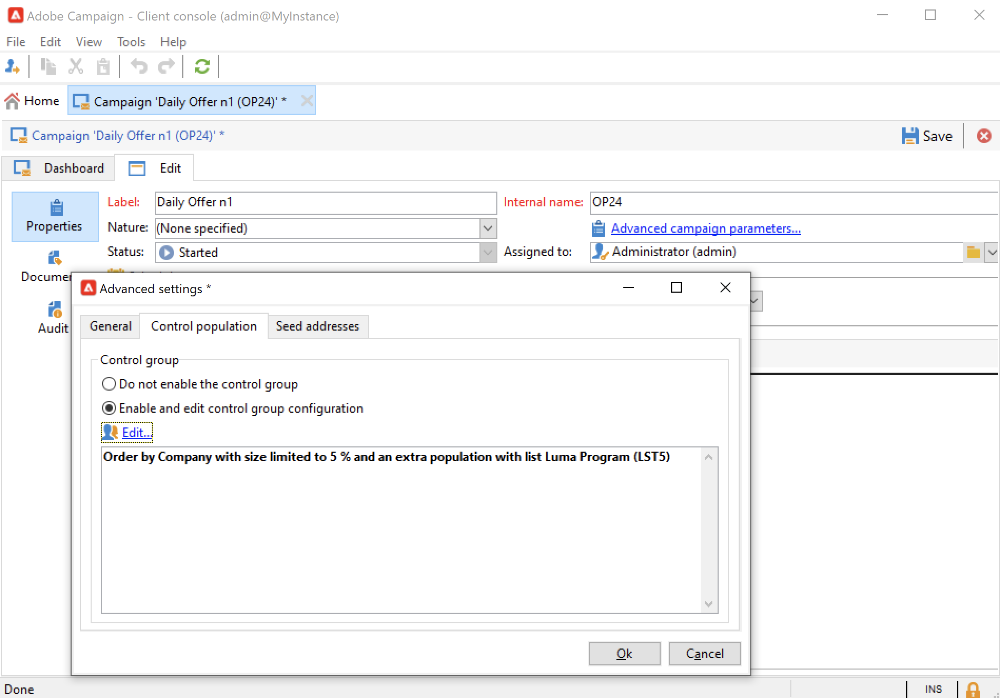
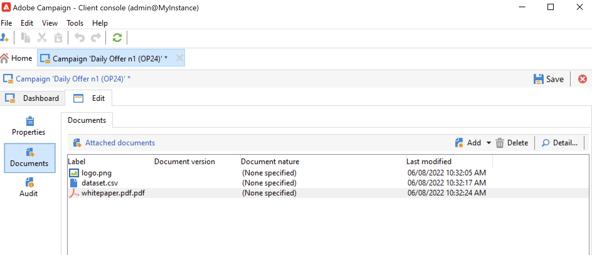
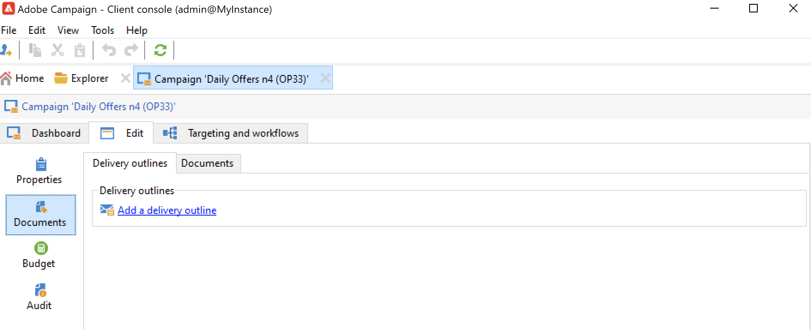

# 建立及設定行銷活動範本 {#campaign-templates}

所有行銷活動都以儲存主要特性和功能的範本為基礎。 Campaign隨附建立行銷活動的內建範本。 此範本已啟用所有功能：檔案、種子地址、核准、傳遞大綱等。

可用功能取決於您的許可權、附加元件和Adobe Campaign平台的設定。

>[!NOTE]
>
>當您按一下 **[!UICONTROL Explorer]** 圖示加以存取。

提供內建範本，以建立尚未定義特定設定的行銷活動。 您可以建立和設定行銷活動範本，然後從這些範本建立行銷活動。

## 建立行銷活動範本 {#create-a-campaign-template}

若要建立行銷活動範本，請遵循下列步驟：

1. 開啟行銷活動 **瀏覽器**，並瀏覽至 **資源>範本>行銷活動範本**.
1. 按一下 **新增** 在範本清單上方的工具列中。

您也可以 **重複** 內建範本，可供重複使用並調整其設定。 若要這麼做，請以滑鼠右鍵按一下範本，然後選取 **複製**.

1. 輸入新行銷活動範本的標籤。
1. 按一下 **儲存** 並重新開啟範本。
1. 在 **編輯** 標籤中，定義範本屬性。
1. 選取 **進階行銷活動引數……** 連結以將工作流程新增至行銷活動範本。

   

1. 變更 **目標定位和工作流程** 值至 **是**.，然後確認。 瞭解如何在中新增功能 [本節](#typology-of-enabled-modules).
1. 此 **目標定位和工作流程** 索引標籤會新增至範本。 按一下 **新增工作流程……**，輸入 **標籤** 並按一下 **確定**.
1. 根據您的需求建立工作流程。

   

1. 按一下「**儲存**」。您的範本現在已準備好用來建立新的行銷活動。

行銷活動範本的各種標籤和子標籤可讓您存取其設定，如所述 [一般設定](#general-configuration).

## 選取模組 {#select-modules}

此 **[!UICONTROL Advanced campaign parameters...]** 連結可讓您根據此範本為行銷活動啟用和停用工作。 選取您要在根據此範本建立的行銷活動中啟用的功能。

如果未選取功能，則與流&#39;b5&#39;7b有關的元素（選單、圖示、選項、標籤、子標籤等） 不會顯示在範本的介面或根據此範本的行銷活動中。 行銷活動詳細資訊左側的標籤，以及可用的標籤，與範本中選取的功能一致。 例如， **費用與目標** 功能未啟用，則對應至 **[!UICONTROL Budget]** 索引標籤不會顯示在以此範本為依據的促銷活動中。

此外，設定視窗的捷徑會新增至行銷活動控制面板。 啟用功能時，直接連結可讓您從Campaign控制面板存取功能。

### 設定範例

* 例如，使用下列設定：

  

  行銷活動控制面板會顯示：

  

  請注意 **[!UICONTROL Targeting and workflows]** 索引標籤遺失。

  下列功能可供使用：

  

  請注意 **[!UICONTROL Budget]** 索引標籤遺失。

  行銷活動進階設定也會反映此設定。

  

  請注意 **[!UICONTROL Approvals]** 索引標籤無法使用。

* 使用此設定：
  

  行銷活動控制面板會顯示：

  

  請注意 **[!UICONTROL Targeting and workflows]** 標籤可用，但 **新增檔案** 缺少連結。

  下列功能可供使用：

  

  請注意 **[!UICONTROL Budget]** 標籤可供使用。

  行銷活動進階設定也會反映此設定。

  

  請注意 **[!UICONTROL Approvals]** 標籤可用，但 **[!UICONTROL Control population]** 和 **[!UICONTROL Seed addresses]** 索引標籤未啟用。

## 模組型別 {#typology-of-enabled-modules}

* **控制組**

  選取此模組時，範本的進階設定及根據此範本的行銷活動會新增一個標籤。 可透過範本或為每個行銷活動個別定義設定。 進一步瞭解中的控制組 [本節](marketing-campaign-deliveries.md#defining-a-control-group).

  

* **種子地址**

  選取此模組時，範本的進階設定及根據此範本的行銷活動會新增一個標籤。 可透過範本或為每個行銷活動個別定義設定。

  

* **文件**

  選取此模組時，會將另一個索引標籤新增至 **[!UICONTROL Edit]** 索引標籤以及以此範本為依據的行銷活動。 可從範本新增附加檔案，或針對每個促銷活動個別新增。 進一步瞭解中的檔案 [本節](marketing-campaign-deliveries.md#manage-associated-documents).

  

* **傳遞大綱**

  選取此模組時， **[!UICONTROL Delivery outlines]** 子索引標籤會新增至 **[!UICONTROL Documents]** 索引標籤以定義行銷活動的傳遞大綱。 瞭解更多關於傳遞大綱，請參閱 [本節](marketing-campaign-assets.md#delivery-outlines).

  

* **目標定位和工作流程**

  當您選取 **[!UICONTROL Targeting and workflows]** 模組，會新增標籤，讓您根據此範本建立一或多個行銷活動的工作流程。 您也可以根據此範本個別設定每個行銷活動的工作流程。若要深入瞭解行銷活動工作流程，請參閱 [本節](marketing-campaign-deliveries.md#build-the-main-target-in-a-workflow).

  

  啟用此模組時， **[!UICONTROL Jobs]** 索引標籤會新增至行銷活動的進階設定，以定義流程執行順序。

* **核准**

  如果您啟用 **[!UICONTROL Approvals]**，您可以選取要核准的程式，以及負責核准的運運算元。 進一步瞭解中的核准 [本節](marketing-campaign-approval.md#select-reviewers).

  

  您可以選擇是否透過 **[!UICONTROL Approvals]** 「範本進階設定」區段的「 」標籤。

* **費用和目標**

  選取此模組時， **[!UICONTROL Budget]** 索引標籤會新增至範本的詳細資訊，以及根據此範本的行銷活動，以便選取關聯的預算。

  

## 範本屬性 {#template-properties}

建立行銷活動範本時，需要輸入下列資訊：

* 輸入 **標籤** 範本的：標籤為必填欄位，且是所有根據此範本的行銷活動的預設標籤。
* 選取行銷活動 **性質** 下拉式清單中的。 此清單中的可用值是儲存在 **[!UICONTROL natureOp]** 分項清單。

瞭解如何在中存取及設定您的分項清單 [此頁面](../../v8/config/ui-settings.md#enumerations).

* 選取 **行銷活動型別**：唯一、循環或定期。 依預設，行銷活動範本適用於不重複行銷活動。 循環和定期行銷活動的詳細資訊，請參見 [本節](recurring-periodic-campaigns.md).
* 指定行銷活動的持續時間，即行銷活動將發生的天數。 根據此範本建立行銷活動時，會自動填入行銷活動的開始和結束日期。

  如果行銷活動為週期性，您必須直接在範本中指定行銷活動開始和結束日期。

* 指定 **相關程式** 範本的：根據此範本的行銷活動會連結至選取的方案。

<!--
## Track campaign execution{#campaign-reverse-scheduling}

You can create a schedule for a campaign and track accomplishments, for instance to prepare an event schedule for a specific date. Campaign templates now let you calculate the start date of a task based on the end date of a campaign.

In the task configuration box, go to the **[!UICONTROL Implementation schedule]** area and check the **[!UICONTROL The start date is calculated based on the campaign end date]** box. (Here, "start date" is the task start date). Go to the **[!UICONTROL Start]** field and enter an interval: the task will start this long before the campaign end date. If you enter a period which is longer than the campaign is set to last, the task will begin before the campaign.

When you create a campaign using this template, the task start date will be calculated automatically. However, you can always change it later.-->
