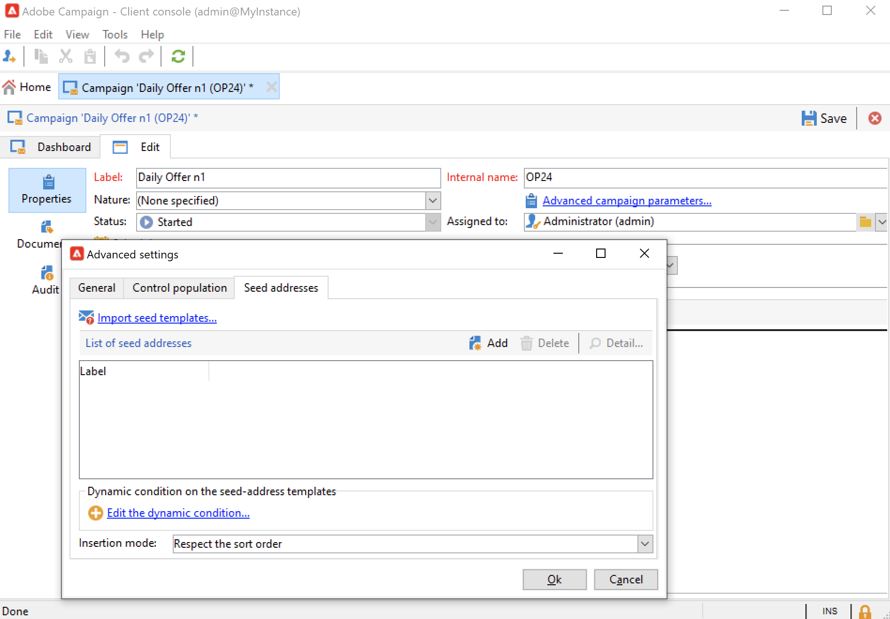

# 建立及設定行銷活動範本 {#campaign-templates}

所有行銷活動都以範本為基礎，範本會儲存主要特徵和功能。 Campaign隨附內建的範本，可建立行銷活動。 此範本已啟用所有功能：檔案、種子地址、核准、傳送大綱等

可用的功能取決於您的權限、附加元件和Adobe Campaign平台的設定。

>[!NOTE]
>
>當您按一下 **[!UICONTROL Explorer]** 表徵圖。

提供內建範本，以建立尚未定義特定設定的行銷活動。 您可以建立和設定行銷活動範本，然後從這些範本建立行銷活動。

## 建立行銷活動範本 {#create-a-campaign-template}

若要建立促銷活動範本，請遵循下列步驟：

1. 開啟促銷活動 **瀏覽器**，並瀏覽 **資源>範本>行銷活動範本**.
1. 按一下 **新增** 在模板清單上方的工具欄中。

您也可以 **重複** 內建範本，可重複使用並調整其設定。 若要這麼做，請以滑鼠右鍵按一下範本，然後選取 **複製**.

1. 輸入新促銷活動範本的標籤。
1. 按一下 **儲存** 並重新開啟您的範本。
1. 在 **編輯** 頁簽，定義模板屬性。
1. 選擇 **進階促銷活動參數……** 連結以新增工作流程至您的行銷活動範本。

   

1. 變更 **目標定位與工作流程** 值 **是**..，並確認。 了解如何在 [本節](#typology-of-enabled-modules).
1. 此 **目標定位與工作流程** 標籤。 按一下 **添加工作流……**，請輸入 **標籤** 按一下 **確定**.
1. 根據您的需求建立工作流程。

   

1. 按一下 **儲存**. 您的範本現在已可用來建立新促銷活動。

促銷活動範本的各種標籤和子標籤可讓您存取其設定，如 [一般配置](#general-configuration).

## 選擇模組 {#select-modules}

此 **[!UICONTROL Advanced campaign parameters...]** 連結可讓您根據此範本來啟用和停用促銷活動的工作。 在根據此範本建立的促銷活動中，選取您要啟用的功能。

如果未選擇功能，則與進程相關的元素（菜單、表徵圖、選項、頁簽、子頁簽等） 請勿顯示在範本的介面中，或顯示在根據此範本的促銷活動中。 行銷活動詳細資料左側的標籤和可用的標籤符合範本中選取的功能。 例如， **費用和目標** 功能，則會 **[!UICONTROL Budget]** 標籤不會根據此範本顯示在促銷活動中。

此外，設定視窗的捷徑會新增至促銷活動控制面板。 啟用功能後，直接連結即可從促銷活動控制面板提供存取權。

### 設定範例

* 例如，使用下列設定：

   

   促銷活動控制面板顯示：

   

   請注意， **[!UICONTROL Targeting and workflows]** 標籤遺失。

   可使用下列功能：

   

   請注意， **[!UICONTROL Budget]** 標籤遺失。

   促銷活動進階設定也會反映此設定。

   

   請注意， **[!UICONTROL Approvals]** 標籤無法使用。

* 使用此配置：
   

   促銷活動控制面板顯示：

   

   請注意， **[!UICONTROL Targeting and workflows]** 標籤可用，但 **添加文檔** 連結遺失。

   可使用下列功能：

   

   請注意， **[!UICONTROL Budget]** 標籤。

   促銷活動進階設定也會反映此設定。

   

   請注意， **[!UICONTROL Approvals]** 標籤可用，但 **[!UICONTROL Control population]** 和 **[!UICONTROL Seed addresses]** 標籤未啟用。

## 模組的類型 {#typology-of-enabled-modules}

* **控制組**

   選取此模組時，會在範本的進階設定以及根據此範本的促銷活動中，新增另一個索引標籤。 設定可透過範本定義，或針對每個促銷活動個別定義。 進一步了解中的控制群組 [本節](marketing-campaign-deliveries.md#defining-a-control-group).

   

* **種子地址**

   選取此模組時，會在範本的進階設定以及根據此範本的促銷活動中，新增另一個索引標籤。 設定可透過範本定義，或針對每個促銷活動個別定義。

   

* **文件**

   選取此模組時，會將其他索引標籤新增至 **[!UICONTROL Edit]** 範本的標籤，以及根據此範本的促銷活動。 可從範本新增附加的檔案，或針對每個促銷活動個別新增附加的檔案。 深入了解 [本節](marketing-campaign-deliveries.md#manage-associated-documents).

   

* **傳遞大綱**

   選取此模組時， **[!UICONTROL Delivery outlines]** 子標籤 **[!UICONTROL Documents]** 標籤，以定義促銷活動的傳送大綱。 進一步了解傳遞大綱，請參閱 [本節](marketing-campaign-assets.md#delivery-outlines).

   

* **目標定位和工作流程**

   選取 **[!UICONTROL Targeting and workflows]** 模組中，系統會新增標籤，讓您根據此範本為促銷活動建立一或多個工作流程。 您也可以根據此範本為每個行銷活動個別設定工作流程。進一步了解行銷活動工作流程，請參閱 [本節](marketing-campaign-deliveries.md#build-the-main-target-in-a-workflow).

   

   此模組啟用時， **[!UICONTROL Jobs]** 索引標籤會新增至促銷活動的進階設定，以定義程式執行順序。

* **核准**

   如果您啟用 **[!UICONTROL Approvals]**，您可以選取要核准的程式，以及負責核准的運算子。 進一步了解核准 [本節](marketing-campaign-approval.md#select-reviewers).

   

   您可以選擇是否通過 **[!UICONTROL Approvals]** 頁簽。

* **費用和目標**

   選取此模組時， **[!UICONTROL Budget]** 索引標籤會新增至範本和促銷活動的詳細資訊，以便選取相關的預算。

   

## 範本屬性 {#template-properties}

建立促銷活動範本時，您需要輸入下列資訊：

* 輸入 **標籤** 範本中：標籤是必填的，且是根據此範本所有促銷活動的預設標籤。
* 選擇促銷活動 **性質** 從下拉式清單中。 此清單中可用的值是儲存在 **[!UICONTROL natureOp]** 枚舉。

了解如何存取和設定您的分項清單，位於 [Campaign Classicv7檔案](https://experienceleague.adobe.com/docs/campaign-classic/using/getting-started/administration-basics/managing-enumerations.html){target="_blank"}.

* 選取 **促銷活動類型**:唯一、循環或週期。 依預設，促銷活動範本會套用至不重複的促銷活動。 循環和定期促銷活動在 [本節](recurring-periodic-campaigns.md).
* 指定促銷活動的持續時間，即促銷活動將發生的天數。 根據此範本建立促銷活動時，促銷活動開始和結束日期將自動填入。

   如果促銷活動是重複的，您必須直接在範本中指定促銷活動的開始和結束日期。

* 指定 **相關方案** 範本中：根據此範本的促銷活動會連結至選取的方案。

<!--
## Track campaign execution{#campaign-reverse-scheduling}

You can create a schedule for a campaign and track accomplishments, for instance to prepare an event schedule for a specific date. Campaign templates now let you calculate the start date of a task based on the end date of a campaign.

In the task configuration box, go to the **[!UICONTROL Implementation schedule]** area and check the **[!UICONTROL The start date is calculated based on the campaign end date]** box. (Here, "start date" is the task start date). Go to the **[!UICONTROL Start]** field and enter an interval: the task will start this long before the campaign end date. If you enter a period which is longer than the campaign is set to last, the task will begin before the campaign.

When you create a campaign using this template, the task start date will be calculated automatically. However, you can always change it later.-->
