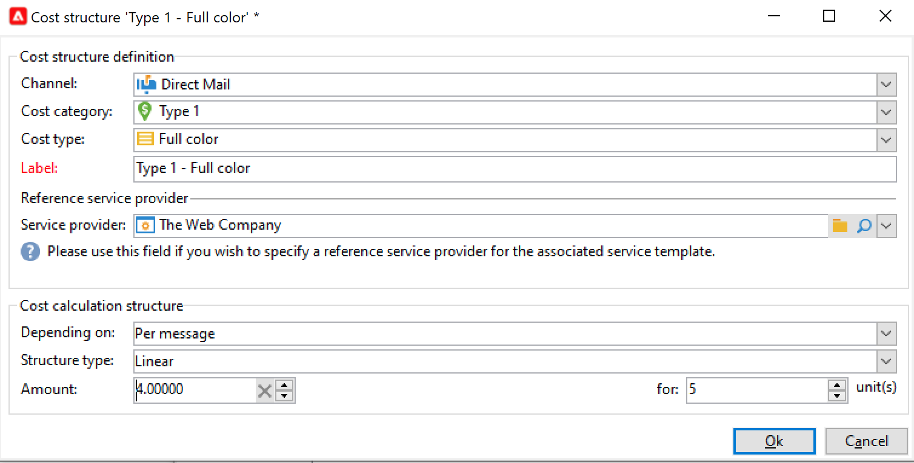

# 供應商、庫存和預算{#providers-stocks-and-budgets}

Adobe Campaign允許您定義服務提供商，這些服務提供商將參與市場活動中進行的工作。 有關服務提供者和相關費用結構的資訊由Adobe Campaign管理員從主要視角定義。 服務提供商從交貨中被引用，其成本結構允許計算與此交貨相關的成本以及管理相關庫存。

## 建立服務提供商及其成本結構 {#create-service-providers-and-their-cost-structures}

每個服務提供商都保存在包含聯繫人詳細資訊、服務模板和相關作業的檔案中。

在中配置服務提供程式 **[!UICONTROL Administration > Campaign management]** 市場活動瀏覽器的資料夾。

在遞送期間執行的作業由服務提供商執行，特別是用於直接郵件和移動通道。 例如，這些服務提供商可以參與打印或分發消息。 這些作業涉及特定於每個服務提供商的配置和成本。 服務提供商的配置涉及四個階段：

1. 在Adobe Campaign建立服務提供商。 [了解更多](#add-a-service-provider)

1. 定義關聯服務模板的成本類別和結構。 [了解更多](#define-cost-categories)

1. 進程的配置。 [了解更多](#configure-processes-associated-with-a-service)。

1. 在市場活動級別引用服務提供商。 [了解更多](#associate-a-service-with-a-campaign)。

### 建立服務提供商及其成本類別 {#create-a-service-provider-and-its-cost-categories}

#### 添加服務提供程式 {#add-a-service-provider}

您可以根據需要為交貨建立盡可能多的服務提供商。 添加服務提供程式的步驟如下：

1. 按一下 **[!UICONTROL New]** 按鈕
1. 在窗口的下半部分，指定服務提供商的名稱和聯繫人詳細資訊。

   

1. 按一下 **[!UICONTROL Save]** 按鈕，將服務提供商添加到清單中。

#### 定義成本類別 {#define-cost-categories}

您現在可以將服務模板與每個服務提供商關聯。 在這些模板中，您必須首先確定成本類別和必要時確定相關庫存。 然後，您可以通過成本結構為每個類別建立成本計算規則。 [了解更多](#define-the-cost-structure)。

成本類別是包含一組符合交付類型（電子郵件、直郵、簡訊等）條件的成本的實體。 成本類別在與服務提供商關聯的服務模板中分組。 每個服務提供商都可以引用一個或多個服務模板。

要建立服務模板並定義其內容，請執行以下步驟：

1. 在 **[!UICONTROL Services]** 頁籤，按一下 **[!UICONTROL Add]** 按鈕並輸入服務模板的名稱。

   

1. 為每種流程類型（通過直接郵件/電子郵件/等方式交付）建立成本類別。 或任務)。 要執行此操作，請按一下 **[!UICONTROL Cost categories]** 的 **[!UICONTROL Add]** 按鈕，然後輸入每個成本類別的參數。

   

   * 為此成本類別輸入標籤，然後選擇相關流程類型： **[!UICONTROL Direct mail]**。 **[!UICONTROL Email]**。 **[!UICONTROL Mobile]**&#x200B;的子菜單。
   * 按一下 **[!UICONTROL Add]** 按鈕來定義與此類別關聯的成本類型。
   * 如有必要，將庫存行與每種成本類型關聯，以便使用的數量將自動與現有庫存相關。

      >[!NOTE]
      >
      >在 **[!UICONTROL Stock management]** 的下界。 [了解更多](#stock-and-order-management)。

1. 您可以為此成本類別預選一個值，該值是服務提供商成本類別中的預設值（而不是空的）。 為此，請啟用 **是** 的上界 **[!UICONTROL Selected]** 類型的列：

   

   在交貨層，預設情況下將選擇該值。

### 定義成本結構 {#define-the-cost-structure}

對於每種類型的成本，成本結構指定要應用的計算規則。

按一下 **[!UICONTROL Cost structure]** 頁籤，以配置每個成本類別和類型的成本計算。 按一下 **[!UICONTROL Add]** 並輸入成本結構。

* 要建立成本結構，請從下拉清單中選擇消息類型和有關的成本類別，以及將應用計算規則的成本類型。 這些下拉清單的內容來自通過 **[!UICONTROL Cost categories]** 頁籤。

   必須為成本結構分配標籤。 預設情況下，它具有以下交貨大綱： **成本類別 — 成本類型**。

   但是，您可以更名它：在 **[!UICONTROL Label]** 的子菜單。

* 成本計算公式在窗口的下部定義。

   此公式可以是固定的（對於任意數目的消息），也可以根據消息數計算。

   當它取決於消息數時，成本計算結構可以是 **[!UICONTROL Linear]**。 **[!UICONTROL Linear by threshold]**&#x200B;或 **[!UICONTROL Constant by threshold]**。

#### 線性結構 {#linear-structure}

如果消息（或消息批）的金額始終相同，而不考慮消息總數，則選擇 **[!UICONTROL Linear]** 並輸入每條消息的成本。

如果此金額適用於郵件批，請指定 **[!UICONTROL for]** 的子菜單。

#### 依閾值劃分的線性結構 {#linear-structure-by-threshold}

如果按閾值應用每個消息的金額，則必須定義 **[!UICONTROL Linear by threshold]** 計算結構。 在此類成本結構中，每條消息的成本為0.13，例如，如果消息總數介於1到100之間，則成本為0.12，從100到1000條消息，或0.11，超過1000條消息。

配置如下：

要添加閾值，請按一下 **[!UICONTROL Add]** 按鈕。

#### 按閾值劃分的常數結構 {#constant-structure-by-threshold}

最後，您可以根據消息總數配置成本計算。 要執行此操作，請選擇 **[!UICONTROL Constant by threshold]** 計算結構。 例如，將1到100封郵件的成本設定為固定金額12.00,100.00,101到1000封郵件的傳遞為100.00，超過1000封郵件的任何傳遞為500.00，不管總數是多少。

### 配置與服務關聯的作業 {#configure-processes-associated-with-a-service}

您可以通過 **[!UICONTROL Jobs]** 頁籤。 本部分用於配置向路由器發送資訊的過程。

* 的 **[!UICONTROL File extraction]** 部分指明選擇此服務時用於交貨的導出模板。 可以在 **[!UICONTROL Extraction file]** 的子菜單。 該欄位右側的按鈕允許您插入變數。

* 的 **[!UICONTROL Notification email]** 部分，用於指定在檔案發送後通知服務提供商的模板。 選擇用於建立警報消息的模板和收件人組。

   預設情況下，通知消息的傳遞模板將保存在 **[!UICONTROL Administration > Campaign management > Technical delivery templates]** 資料夾，可從常規視圖訪問。

* 的 **[!UICONTROL Post-processing]** 部分，用於選擇在交貨獲得批准後要啟動的工作流。 如果輸入了工作流模板，將自動建立工作流實例，並在批准生效後立即啟動。 例如，此工作流可以將抽取檔案發送到外部服務提供商進行處理。

### 將服務與市場活動關聯 {#associate-a-service-with-a-campaign}

服務提供商與市場活動交付相關聯。 在傳遞模板中引用這些模板，以便在通過此模板建立的傳遞中提供其服務。

選擇服務時，與遞送類型（直郵、電子郵件等）對應的成本類別 在中心表中自動指示，並且已定義的處理選項。

>[!NOTE]
>
>如果在選擇服務時未顯示任何成本類別，則表示未為此類型的流程定義成本類別。 例如，對於電子郵件傳遞，如果沒有 **[!UICONTROL Email]** 類型成本類別已定義，將不顯示任何類別，選擇服務將無效。

* 對於直郵遞送，您可以從配置窗口中選擇服務。

   

* 對於在移動頻道或電話上傳送，應用相同的選擇模式。
* 對於電子郵件傳遞，從 **[!UICONTROL Advanced]** 頁籤，如下例所示：

   

的 **[!UICONTROL Amount to surcharge]** 列，您可以在交貨或相關任務的上下文中為此類別添加成本。

您可以在定義交貨的成本類別期間定義成本類型的必備選擇。 要執行此操作，請選擇 **[!UICONTROL A cost type must be selected]**。

## 庫存和訂單管理 {#stock-and-order-management}

成本類型可與庫存行關聯，以處理預警、跟蹤供應和發放訂單。

在Adobe Campaign建立庫存和訂單管理，並在供應不足時通知操作人員，以執行以下程式：

1. 關聯服務提供商的庫建立和引用。 [了解更多](#create-a-stock)。

1. 添加庫存行。 [了解更多](#add-stock-lines)。

1. 通知操作員發生警報。 [了解更多](#alert-operators)。

1. 訂單和供應。 [了解更多](#orders)。

### 股票管理 {#stock-management}

如果庫存不足或達到最小閾值，Adobe Campaign可以通知一組運算子。 庫存水準可通過 **[!UICONTROL Stocks]** 連結 **[!UICONTROL Campaigns]** 頁籤 **[!UICONTROL Other choices]** 的子菜單。

#### 建立庫 {#creating-a-stock}

應用以下步驟建立新庫：

1. 按一下 **[!UICONTROL Create]** 按鈕。
1. 輸入股票的標籤，然後從下拉清單中選擇與其關聯的服務提供商。 [了解更多](#create-service-providers-and-their-cost-structures)。

#### 添加庫存行 {#add-stock-lines}

一種坯料，包括各種坯料線。 庫存行包含交貨將消耗的資源的初始數量。 每個庫存行均指明已衝減的數量、庫存數量和訂購數量。

建立庫時，按一下 **[!UICONTROL Stock lines]** 頁籤。

建立庫存後，使用其操控板建立和監視庫存行。

按一下 **[!UICONTROL Create]** 按鈕

* 指示庫存中最初的數量 **[!UICONTROL Initial stock]** 的子菜單。 的 **[!UICONTROL Consumed]** 和 **[!UICONTROL In stock]** 欄位將自動計算並隨市場活動進展而更新。

   

* 指示應從中向運算子發出訂單庫存警報的閾值 **[!UICONTROL Alert level]** 的子菜單。 當達到預警級別時，使用此庫存交貨的審批窗口中將顯示一則警告消息。

#### 將庫存與成本類別關聯 {#associate-a-stock-with-cost-categories}

對於給定的服務提供商，在服務中，庫存行可以由成本類別之一引用，如下所示：

### 庫存跟蹤 {#stock-tracking}

#### 警報運算子 {#alert-operators}

當交貨中引用的庫存不足時，將顯示警報。 例如，在批准抽取檔案時，將顯示以下警報：

#### 訂單 {#orders}

的 **[!UICONTROL Orders]** 「子標籤」用於查看當前訂單並保存新訂單。

要保存訂單，請編輯目標庫存行，按一下 **[!UICONTROL Add]** 按鈕並指定交貨日期和訂購數量。

>[!NOTE]
>
>一旦達到交貨日期，訂購的庫存行將自動消失，並且在 **[!UICONTROL Volume on order]** 欄位添加到 **[!UICONTROL Tracking]** 頁籤。 此數量將自動添加到庫存量。

的 **[!UICONTROL Consumptions]** 頁籤包含每個市場活動所消耗的卷。 根據執行的交貨自動輸入此標籤中的資訊。 按一下 **[!UICONTROL Edit]** 按鈕開啟與此相關的活動。

## 計算預算 {#calculate-budgets}

### 原則 {#principle}

為交付和市場活動管理成本。 根據進度，這些費用將分配到預算。

市場活動的交付成本在市場活動層合併，並且方案的所有市場活動的成本都傳遞到與其關聯的方案。 專用報告使您能夠跟蹤整個平台或每個計畫和每個計畫的預算。

### 實作 {#implementation}

在市場活動中，選擇預算時，必須輸入初始金額。 計算的成本將根據輸入的金額（支出、預計、保留、承諾）的承付水準自動更新。

<!--
See [Calculating amounts](../../mrm/using/controlling-costs.md#calculating-amounts).

>[!NOTE]
>
>The procedure for creating budgets is presented in [Creating a budget](../../mrm/using/controlling-costs.md#creating-a-budget).
-->
