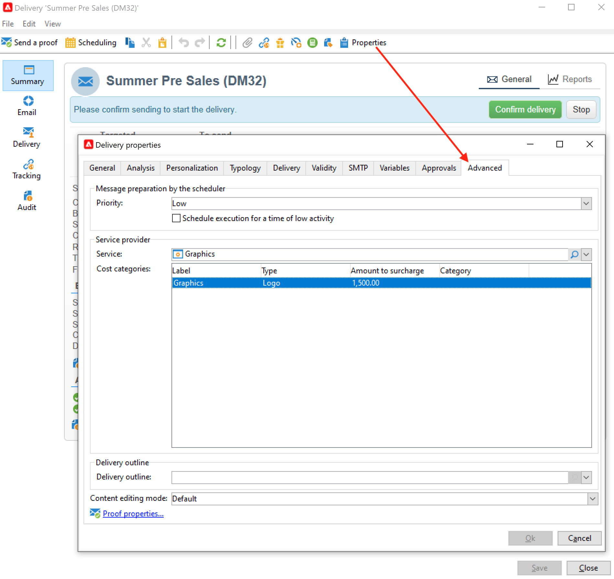
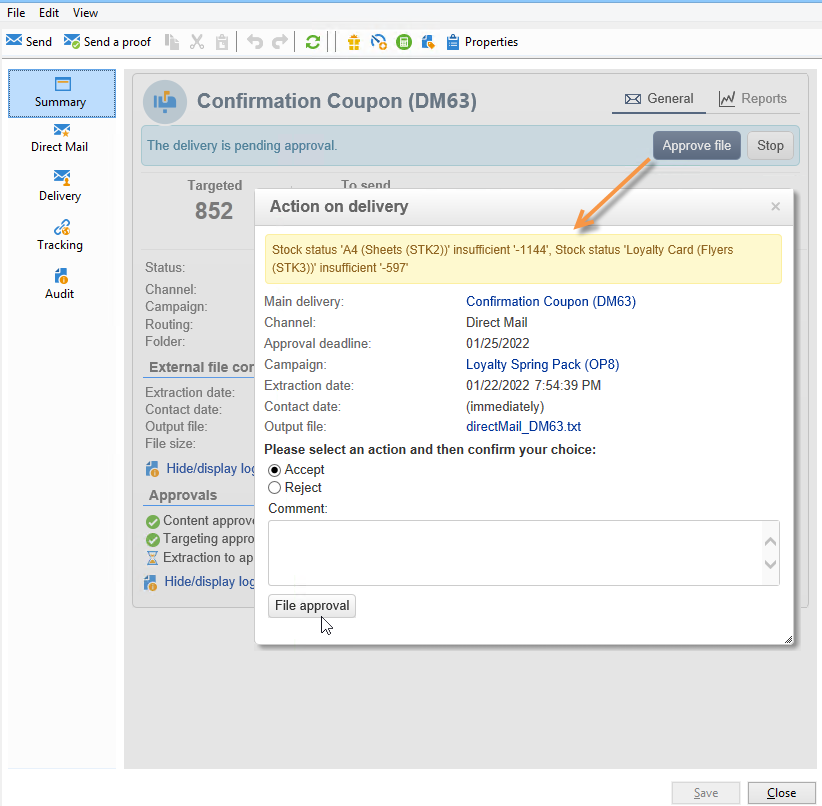

# 供應商、庫存和預算{#providers-stocks-and-budgets}

Adobe Campaign可讓您定義要參與行銷活動中執行之作業的服務提供者。 有關服務提供商和相關成本結構的資訊由Adobe Campaign管理員從主視圖中定義。 服務提供者從交付中被引用，其成本結構允許計算與此交付相關的成本以及有關庫存的管理。

## 建立服務提供商及其成本結構 {#create-service-providers-and-their-cost-structures}

每個服務提供商將保存在包含聯繫詳細資訊、服務模板和相關作業的檔案中。

服務提供者可在 **[!UICONTROL Administration > Campaign management]** Campaign檔案總管的資料夾。

傳送期間執行的作業由服務提供者執行，尤其是直接郵件和行動通道。 例如，這些服務提供商可以參與打印或分發消息。 這些作業涉及每個服務提供商特有的配置和成本。 服務提供商的配置涉及四個階段：

1. 在Adobe Campaign中建立服務提供者。 [了解更多](#add-a-service-provider)

1. 定義相關服務模板的成本類別和結構。 [了解更多](#define-cost-categories)

1. 流程配置。 [了解更多資訊](#configure-processes-associated-with-a-service)。

1. 在促銷活動層級參考服務提供者。 [了解更多資訊](#associate-a-service-with-a-campaign)。

### 建立服務提供商及其成本類別 {#create-a-service-provider-and-its-cost-categories}

#### 添加服務提供程式 {#add-a-service-provider}

您可以視需要為傳送建立任意數量的服務提供者。 添加服務提供程式的步驟如下：

1. 按一下 **[!UICONTROL New]** 按鈕。
1. 在窗口的下半部分，指定服務提供商的名稱和聯繫人詳細資訊。

   

1. 按一下 **[!UICONTROL Save]** 按鈕，將服務提供商添加到清單中。

#### 定義成本類別 {#define-cost-categories}

您現在可以將服務模板與每個服務提供商關聯。 在這些模板中，您必須首先確定成本類別，並在必要時確定相關庫存。 然後，您可以通過成本結構為每個類別建立成本計算規則。 [了解更多資訊](#define-the-cost-structure)。

成本類別是包含一組符合傳送類型（電子郵件、直接郵件、簡訊等）的成本的實體。 成本類別按與服務提供商相關的服務模板分組。 每個服務提供商都可以參考一個或多個服務模板。

要建立服務模板並定義其內容，請執行以下步驟：

1. 在 **[!UICONTROL Services]** 頁簽，按一下 **[!UICONTROL Add]** 按鈕，然後輸入服務模板的名稱。

   

1. 為每種流程類型（通過直接郵件/電子郵件等傳送）建立成本類別。 或任務)。 若要這麼做，請按一下 **[!UICONTROL Cost categories]** 標籤 **[!UICONTROL Add]** 按鈕，然後輸入每個成本類別的參數。

   

   * 為此成本類別輸入標籤，並選擇相關流程類型： **[!UICONTROL Direct mail]**, **[!UICONTROL Email]**, **[!UICONTROL Mobile]**、等
   * 按一下 **[!UICONTROL Add]** 按鈕，定義與此類別關聯的成本類型。
   * 如有必要，將庫存行與每種成本類型關聯，以便使用的數量與現有庫存自動相關。

      >[!NOTE]
      >
      >庫存行在 **[!UICONTROL Stock management]** 節點。 [了解更多資訊](#stock-and-order-management)。

1. 您可以為此成本類別預選值，該值是服務提供商成本類別中的預設值（而不是空值）。 要執行此操作，請啟用 **是** 選項 **[!UICONTROL Selected]** 欄，以取得相關類別的類型：

   

   在傳送層級，預設會選取值。

### 定義成本結構 {#define-the-cost-structure}

對於每種成本類型，成本結構指定要應用的計算規則。

按一下 **[!UICONTROL Cost structure]** 頁簽來配置每個成本類別和類型的成本計算。 按一下 **[!UICONTROL Add]** 並輸入成本結構。

* 要建立成本結構，請從下拉清單中選擇消息類型和相關成本類別，以及將應用計算規則的成本類型。 這些下拉式清單的內容來自透過 **[!UICONTROL Cost categories]** 標籤。

   必須為成本結構分配標籤。 預設情況下，它具有以下傳遞大綱： **成本類別 — 成本類型**.

   不過，您可以重新命名：直接在 **[!UICONTROL Label]** 欄位。

* 成本計算公式定義在窗口的下部。

   此公式可以固定（適用於任何數量的訊息），或根據訊息數量計算。

   當取決於報文數量時，成本計算結構可以是 **[!UICONTROL Linear]**, **[!UICONTROL Linear by threshold]**，或 **[!UICONTROL Constant by threshold]**.

#### 線性結構 {#linear-structure}

如果無論訊息總數為何，訊息（或訊息批次）的金額一律相同，請選取 **[!UICONTROL Linear]** 並輸入每條消息的成本。

如果此金額適用於批次訊息，請指定 **[!UICONTROL for]** 欄位。

#### 依臨界值的線性結構 {#linear-structure-by-threshold}

如果金額是依每則訊息的臨界值套用，您必須定義 **[!UICONTROL Linear by threshold]** 計算結構。 在此類型的成本結構中，每條消息的成本為0.13，例如，如果消息總數介於1到100之間，則成本為0.12，從100到1000條消息，或從1000條消息到1000條消息的成本為0.11。

設定如下：

若要新增臨界值，請按一下 **[!UICONTROL Add]** 按鈕。

#### 按閾值的常數結構 {#constant-structure-by-threshold}

最後，您可以根據訊息總數來設定成本計算。 若要這麼做，請選取 **[!UICONTROL Constant by threshold]** 計算結構。 例如，1到100條報文的成本將設定為固定金額12.00,100.00,101到1000條報文的傳送為100.00，超過1000條報文的任何傳送為500.00，無論總數如何。

### 配置與服務關聯的作業 {#configure-processes-associated-with-a-service}

您可以通過 **[!UICONTROL Jobs]** 標籤。 通過本節，可以配置向路由器發送資訊的過程。

* 此 **[!UICONTROL File extraction]** 節指示在選擇此服務時用於傳送的導出模板。 您可以在 **[!UICONTROL Extraction file]** 欄位。 欄位右側的按鈕可讓您插入變數。

* 此 **[!UICONTROL Notification email]** 區段可讓您指定在傳送檔案後通知服務提供者的範本。 選取用於建立警報訊息的範本和收件者群組。

   依預設，通知訊息的傳送範本會儲存在 **[!UICONTROL Administration > Campaign management > Technical delivery templates]** 資料夾，可從「一般」檢視存取。

* 此 **[!UICONTROL Post-processing]** 區段可讓您選取傳遞核准後啟動的工作流程。 如果輸入了工作流模板，則將自動建立工作流實例，並在批准生效後立即啟動。 例如，此工作流程可將解壓縮檔案傳送至外部服務提供者進行處理。

### 將服務與促銷活動關聯 {#associate-a-service-with-a-campaign}

服務提供者與促銷活動傳送相關聯。 傳遞範本會參照這些範本，以在透過此範本建立的傳遞中提供其服務。

選取服務時，與傳送類型（直接郵件、電子郵件等）對應的成本類別 中央表格中會自動指出，並附上已定義的處理選項。

>[!NOTE]
>
>如果在選擇服務時未顯示任何成本類別，則表示未為此類流程定義任何成本類別。 例如，對於電子郵件傳送，若否 **[!UICONTROL Email]** 類型成本類別已定義，將不顯示任何類別，選擇服務將無效。

* 對於直接郵件傳送，您可以從設定視窗中選取服務。

   

* 若是在行動裝置頻道或電話上傳送，則會套用相同的選擇模式。
* 對於電子郵件傳送，從 **[!UICONTROL Advanced]** 標籤，如下列範例所示：

   

此 **[!UICONTROL Amount to surcharge]** 欄可讓您在傳送或相關任務的內容中新增此類別的成本。

在定義交貨的成本類別期間，您可以定義成本類型的必備選擇。 要執行此操作，請選取 **[!UICONTROL A cost type must be selected]**.

## 庫存和訂單管理 {#stock-and-order-management}

成本類型可與庫存行關聯，以便處理警報、跟蹤供應和啟動訂單。

在Adobe Campaign中設定庫存和訂單管理，以及在供應不足而要執行交貨時通知操作員的過程如下：

1. 關聯服務提供商的庫存建立和引用。 [了解更多資訊](#create-a-stock)。

1. 添加庫存行。 [了解更多資訊](#add-stock-lines)。

1. 在出現警報時通知操作員。 [了解更多資訊](#alert-operators)。

1. 訂單和供應。 [了解更多資訊](#orders)。

### 股票管理 {#stock-management}

如果庫存不足或達到最低臨界值，Adobe Campaign可以警告一組運算子。 庫存水準可透過 **[!UICONTROL Stocks]** 連結 **[!UICONTROL Campaigns]** 標籤 **[!UICONTROL Other choices]** 導航區域的連結。

#### 建立庫存 {#creating-a-stock}

應用以下步驟建立新庫存：

1. 按一下 **[!UICONTROL Create]** 按鈕。
1. 輸入庫存標籤，然後從下拉清單中選擇與其關聯的服務提供商。 [了解更多資訊](#create-service-providers-and-their-cost-structures)。

#### 添加庫存行 {#add-stock-lines}

一種存貨，包括各種存貨線。 庫存行包含交付將消耗的初始資源數量。 每個庫存行指明衝減的數量、庫存數量和訂購數量。

建立庫存時，按一下 **[!UICONTROL Stock lines]** 頁簽以添加新行。

建立庫存後，使用其控制面板建立和監控庫存行。

按一下 **[!UICONTROL Create]** 按鈕以添加新庫存行。

* 指明 **[!UICONTROL Initial stock]** 欄位。 此 **[!UICONTROL Consumed]** 和 **[!UICONTROL In stock]** 欄位會隨著促銷活動進行而自動計算並更新。

   

* 指示應從哪個閾值向操作員發出訂單庫存警報 **[!UICONTROL Alert level]** 欄位。 當達到警報級別時，使用此庫存的傳遞的審批窗口中將顯示警告消息。

#### 將庫存與成本類別關聯 {#associate-a-stock-with-cost-categories}

對於指定的服務提供商，在服務中，庫存行可以由成本類別之一引用，如下所示：

### 股票追蹤 {#stock-tracking}

#### 警報運算子 {#alert-operators}

當傳送中參考的庫存不足時，會顯示警報。 例如，核准解壓縮檔案時，會顯示下列警報：

#### 訂單 {#orders}

此 **[!UICONTROL Orders]** 子索引標籤可讓您檢視目前訂單並儲存新訂單。

要保存訂單，請編輯目標庫存行，按一下 **[!UICONTROL Add]** 按鈕並指定交貨日期和訂貨數量。

>[!NOTE]
>
>一旦達到交貨日期，訂購的庫存行就會自動消失，而在 **[!UICONTROL Volume on order]** 欄位已新增至 **[!UICONTROL Tracking]** 標籤。 此數量會自動添加到庫存量。

此 **[!UICONTROL Consumptions]** 索引標籤包含每個促銷活動的使用量。 系統會根據執行的傳送自動輸入此索引標籤的資訊。 按一下 **[!UICONTROL Edit]** 按鈕，開啟有關的活動。

## 計算預算 {#calculate-budgets}

### 原則 {#principle}

傳遞和行銷活動的成本均可管理。 根據進展情況，這些費用將分配給預算。

促銷活動的傳送成本會在促銷活動層級合併，而方案的所有促銷活動成本會傳遞至與其相關聯的方案。 專用報告可讓您追蹤整個平台或每個計畫和每個方案的預算。

### 實作 {#implementation}

在促銷活動中，當您選取預算時，必須輸入初始金額。 計算成本將根據輸入金額（支出、預計、保留、承諾）的承諾水準自動更新。

<!--
See [Calculating amounts](../../mrm/using/controlling-costs.md#calculating-amounts).

>[!NOTE]
>
>The procedure for creating budgets is presented in [Creating a budget](../../mrm/using/controlling-costs.md#creating-a-budget).
-->
