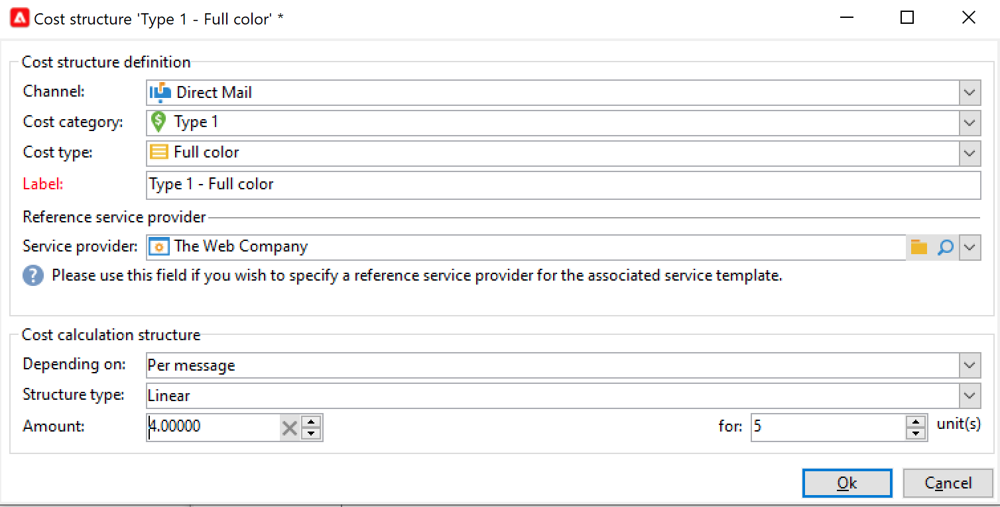
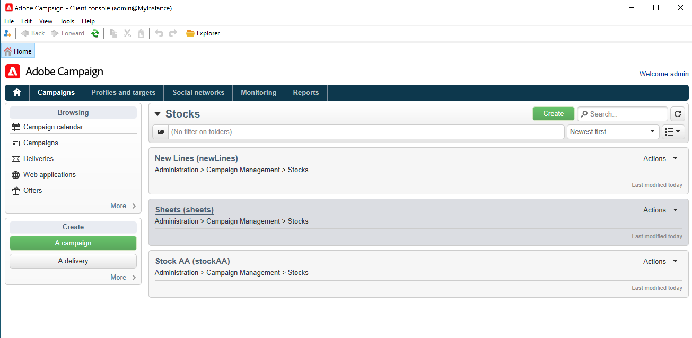

# 供應商、庫存和預算{#providers-stocks-and-budgets}

Adobe Campaign可讓您定義服務提供者，讓他們參與促銷活動內所執行的工作。 有關服務提供者與相關成本結構的資訊，由Adobe Campaign管理員從主檢視中定義。 服務提供者會從交貨中參考，其成本結構可讓您計算與此交貨相關的成本以及相關的存貨管理。

## 建立服務提供者及其成本結構 {#create-service-providers-and-their-cost-structures}

每個服務提供者都會儲存在檔案中，內含連絡人詳細資料、服務範本及相關工作。

已在Campaign檔案總管的&#x200B;**[!UICONTROL Administration > Campaign management]**&#x200B;資料夾中設定服務提供者。

傳遞期間執行的工作由服務提供商執行，尤其是直接郵件和行動頻道。 例如，這些服務提供者可參與列印或分發訊息。 這些工作涉及每個服務提供者特有的設定和成本。 服務提供者的設定涉及四個階段：

1. 在Adobe Campaign中建立服務提供者。 [了解更多](#add-a-service-provider)

1. 定義關聯服務樣版的成本分類與結構。 [了解更多](#define-cost-categories)

1. 流程的設定。 [了解更多](#configure-processes-associated-with-a-service)。

1. 在行銷活動層級參考服務提供者。 [了解更多](#associate-a-service-with-a-campaign)。

### 建立服務提供者及其成本類別 {#create-a-service-provider-and-its-cost-categories}

#### 新增服務提供者 {#add-a-service-provider}

您可以視需要為傳遞建立儘可能多的服務提供者。 新增服務提供者的程式如下：

1. 按一下服務提供者清單上方的&#x200B;**[!UICONTROL New]**&#x200B;按鈕。
1. 在視窗的下半部分，指定服務提供者的名稱和聯絡詳細資訊。

   

1. 按一下&#x200B;**[!UICONTROL Save]**&#x200B;按鈕，將服務提供者新增至清單。

#### 定義成本類別 {#define-cost-categories}

您現在可以將服務範本與每個服務提供者建立關聯。 在這些範本中，您必須先識別成本類別，並視需要識別相關的存貨。 然後，您可以透過成本結構建立每個分類的成本計算規則。 [了解更多](#define-the-cost-structure)。

成本類別是包含一組成本的實體，符合傳送型別（電子郵件、直接郵件、簡訊等）。 成本類別會分組在與服務提供者相關的服務範本中。 每個服務提供者都可以參考一或多個服務範本。

若要建立服務範本並定義其內容，請遵循下列步驟：

1. 在服務提供者的&#x200B;**[!UICONTROL Services]**&#x200B;標籤中，按一下&#x200B;**[!UICONTROL Add]**&#x200B;按鈕並輸入服務範本的名稱。

   

1. 針對每種處理型別（透過直接郵件/電子郵件/等傳遞），建立成本類別。 或任務)。 若要這麼做，請按一下「**[!UICONTROL Cost categories]**」標籤，然後按「**[!UICONTROL Add]**」按鈕，然後輸入每個成本類別的引數。

   

   * 輸入此成本類別的標籤，並選取相關處理程式的型別： **[!UICONTROL Direct mail]**、**[!UICONTROL Email]**、**[!UICONTROL Mobile]**&#x200B;等。
   * 按一下&#x200B;**[!UICONTROL Add]**&#x200B;按鈕以定義與此類別關聯的成本型別。
   * 必要時，將存貨明細行與每種成本型態相關聯，以便使用的數量會自動與現有存貨相關聯。

     >[!NOTE]
     >
     >庫存行定義於&#x200B;**[!UICONTROL Stock management]**&#x200B;節點中。 [了解更多](#stock-and-order-management)。

1. 您可以預先選取此成本類別的值，這是服務提供者成本類別的預設值（而非空白值）。 若要這麼做，請針對相關類別型別啟用&#x200B;**[!UICONTROL Selected]**&#x200B;欄中的&#x200B;**是**&#x200B;選項：

   

   在傳遞層級，預設會選取值。

### 定義成本結構 {#define-the-cost-structure}

對於每種成本型別，成本結構會指定要套用的計算規則。

按一下&#x200B;**[!UICONTROL Cost structure]**&#x200B;標籤，為每個成本類別和型別設定成本計算。 按一下&#x200B;**[!UICONTROL Add]**&#x200B;並輸入成本結構。

* 若要建立成本結構，請從下拉式清單中選取訊息型別與相關的成本分類，以及計算規則將套用的成本型別。 這些下拉式清單的內容來自透過&#x200B;**[!UICONTROL Cost categories]**&#x200B;索引標籤輸入的資訊。

  您必須為成本結構指定標籤。 依預設，它具有下列傳遞大網： **成本類別 — 成本型別**。

  不過，您可以重新命名：直接在&#x200B;**[!UICONTROL Label]**&#x200B;欄位中輸入所需的值。

* 成本計算公式定義於視窗的下半部。

  此公式可固定（適用於任何數量的訊息）或根據訊息數量計算。

  當它取決於訊息數目時，成本計算結構可以是&#x200B;**[!UICONTROL Linear]**、**[!UICONTROL Linear by threshold]**&#x200B;或&#x200B;**[!UICONTROL Constant by threshold]**。

#### 線性結構 {#linear-structure}

如果無論訊息總數為何，訊息（或訊息批次）的金額始終相同，請選取&#x200B;**[!UICONTROL Linear]**&#x200B;並輸入每則訊息的成本。

如果此金額適用於批次訊息，請在&#x200B;**[!UICONTROL for]**&#x200B;欄位中指定相關的訊息數目。

#### 線性結構（依臨界值） {#linear-structure-by-threshold}

如果金額依臨界值套用至每則訊息，您必須定義&#x200B;**[!UICONTROL Linear by threshold]**&#x200B;計算結構。 在此型別的成本結構中，舉例來說，如果訊息總數介於1到100之間，則每則訊息的費用為0.13，而從100到1000則訊息的費用為0.12，或在1000則訊息之後為0.11。

設定如下：

若要新增臨界值，請按一下清單右側的&#x200B;**[!UICONTROL Add]**&#x200B;按鈕。

#### 依據臨界值的常數結構 {#constant-structure-by-threshold}

最後，您可以根據訊息總數來設定成本計算。 若要這麼做，請選取&#x200B;**[!UICONTROL Constant by threshold]**&#x200B;計算結構。 例如，1到100則訊息的成本將設定為固定數量12.00,101到1000則訊息的成本將設定為100.00，超過1000則訊息的任何傳送的成本將設定為500.00，無論總數為何。

### 設定與服務相關聯的工作 {#configure-processes-associated-with-a-service}

您可以透過&#x200B;**[!UICONTROL Jobs]**&#x200B;索引標籤，關聯與服務提供者關聯的程式資訊。 本節可讓您設定傳送資訊給路由器的設定。

* **[!UICONTROL File extraction]**&#x200B;區段會指出選取此服務時用於傳遞的匯出範本。 您可以在&#x200B;**[!UICONTROL Extraction file]**&#x200B;欄位中指出輸出檔案的名稱。 欄位右側的按鈕可讓您插入變數。

* **[!UICONTROL Notification email]**&#x200B;區段可讓您指定在傳送檔案後通知服務提供者的範本。 選取用來建立警示訊息和收件者群組的範本。

  依預設，通知訊息的傳遞範本儲存在&#x200B;**[!UICONTROL Administration > Campaign management > Technical delivery templates]**&#x200B;資料夾中，此資料夾可從一般檢視存取。

* **[!UICONTROL Post-processing]**&#x200B;區段可讓您選取在核准傳遞後要啟動的工作流程。 如果輸入工作流程範本，則會自動建立工作流程例項，並在核准生效後立即啟動。 例如，此工作流程可將擷取檔案傳送至外部服務提供者進行處理。

### 將服務與行銷活動建立關聯 {#associate-a-service-with-a-campaign}

服務提供者與行銷活動傳遞相關聯。 在傳遞範本中會參考這些對象，以便在透過此範本建立的傳遞中提供其服務。

選取服務時，與傳送型別（直接郵件、電子郵件等）相對應的成本類別 會連同已定義的處理選項自動在中央表格中標示。

>[!NOTE]
>
>如果選取服務時未顯示成本分類，則表示未針對此型態的處理定義成本分類。 例如，對於電子郵件傳遞，如果未定義&#x200B;**[!UICONTROL Email]**&#x200B;型別成本類別，則不會顯示任何類別，且選取服務不會有任何效果。

* 如果是直接郵件傳送，您可以從設定視窗中選取服務。

  

* 針對行動裝置頻道上的傳遞，會套用相同的選取模式。
* 針對電子郵件傳遞，服務是從傳遞屬性的&#x200B;**[!UICONTROL Advanced]**&#x200B;索引標籤中選取，如下列範例所示：

  

**[!UICONTROL Amount to surcharge]**&#x200B;欄可讓您在相關傳遞或任務的內容中，為此類別新增成本。

在定義交貨的成本類別時，您可以定義成本型態的必要選擇。 若要這麼做，請選取&#x200B;**[!UICONTROL A cost type must be selected]**。

## 庫存與訂單管理 {#stock-and-order-management}

成本型態可與存貨明細行相關聯，以處理警示、追蹤供給及啟動訂單。

在Adobe Campaign中設定存貨與訂單管理，以及在要執行交貨的供給不足時提醒操作員的程式如下：

1. 建立庫存及參考相關服務提供者。 [了解更多](#create-a-stock)。

1. 新增坯件線。 [了解更多](#add-stock-lines)。

1. 在警示事件中通知運運算元。 [了解更多](#alert-operators)。

1. 訂單與供給。 [了解更多](#orders)。

### 庫存管理 {#stock-management}

如果庫存耗盡或達到最小臨界值，Adobe Campaign可以提醒一組操作員。 可透過導覽區域的&#x200B;**[!UICONTROL Other choices]**&#x200B;連結，透過&#x200B;**[!UICONTROL Campaigns]**&#x200B;標籤的&#x200B;**[!UICONTROL Stocks]**&#x200B;連結存取庫存量。

#### 建立庫存 {#creating-a-stock}

套用下列步驟來建立新庫存：

1. 按一下庫存清單上方的&#x200B;**[!UICONTROL Create]**&#x200B;按鈕。
1. 輸入庫存的標籤，並從下拉式清單中選取與其關聯的服務提供者。 [了解更多](#create-service-providers-and-their-cost-structures)。

#### 新增庫存行 {#add-stock-lines}

坯件包含各種坯件線。 庫存明細行包含交貨要消耗之資源的初始數量。 每個存貨明細行會指出已沖銷數量、存貨數量及訂購數量。

建立坯件時，按一下「**[!UICONTROL Stock lines]**」標籤以新增線。

建立坯件後，請使用其圖示板來建立及監控坯件線。

按一下&#x200B;**[!UICONTROL Create]**&#x200B;按鈕以新增庫存行。

* 在&#x200B;**[!UICONTROL Initial stock]**&#x200B;欄位中指出最初庫存的數量。 **[!UICONTROL Consumed]**&#x200B;和&#x200B;**[!UICONTROL In stock]**&#x200B;欄位會自動計算並隨著行銷活動進度更新。

  

* 在&#x200B;**[!UICONTROL Alert level]**&#x200B;欄位中指出操作員應收到警示以訂購庫存的臨界值。 達到警示等級時，使用此存貨的交貨之核准視窗中會顯示警告訊息。

#### 將存貨與成本類別建立關聯 {#associate-a-stock-with-cost-categories}

對於指定的服務提供者，在服務中，存貨明細行可由其中一個成本類別參考，如下所示：

### 庫存追蹤 {#stock-tracking}

#### 警示運運算元 {#alert-operators}

當傳遞中參考的庫存不足時，會顯示警報。 例如，在核准摘取檔案時，會顯示下列警報：

#### 訂單 {#orders}

**[!UICONTROL Orders]**&#x200B;子標籤可讓您檢視目前訂單並儲存新訂單。

若要儲存訂單，請編輯目標存貨明細行，按一下「**[!UICONTROL Add]**」按鈕，並指定交貨日期與訂購數量。

>[!NOTE]
>
>一旦到達交貨日期，訂購的存貨明細行就會自動消失，而且在&#x200B;**[!UICONTROL Volume on order]**&#x200B;欄位中輸入的數量會新增至&#x200B;**[!UICONTROL Tracking]**&#x200B;標籤。 此數量會自動新增到庫存體積中。

**[!UICONTROL Consumptions]**&#x200B;索引標籤包含每個行銷活動使用的磁碟區。 此索引標籤的資訊會根據執行的傳遞自動輸入。 按一下&#x200B;**[!UICONTROL Edit]**&#x200B;按鈕以開啟相關行銷活動。

## 計算預算 {#calculate-budgets}

### 原則 {#principle}

針對傳遞和行銷活動管理成本。 根據進度，這些成本會分配至預算。

行銷活動的傳遞成本會在行銷活動層級合併，而方案的所有行銷活動的成本都會傳遞至與其關聯的方案。 專用報告可讓您追蹤整個平台或每個計畫與每個方案的預算。

### 實施 {#implementation}

在行銷活動中，當您選取預算時，必須輸入初始金額。 已計算的成本將根據所輸入金額的履約承諾層次（費用、預期、預留、已承諾）自動更新。

<!--
See [Calculating amounts](../../mrm/using/controlling-costs.md#calculating-amounts).

>[!NOTE]
>
>The procedure for creating budgets is presented in [Creating a budget](../../mrm/using/controlling-costs.md#creating-a-budget).
-->
