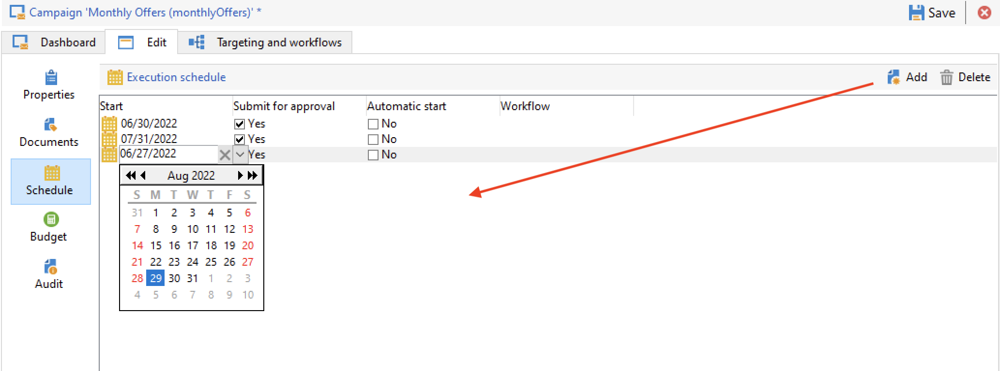

# 定期市場活動 {#recurring-and-periodic-campaigns}

A **循環活動** 是基於特定模板的市場活動，其工作流配置為根據關聯的計畫執行。 在每個執行上複製目標，並跟蹤各種進程和目標群體。  配置後，定期市場活動將自動建立新工作流（通過複製工作流模板）並運行它。 例如，如果您需要向受眾部門發送每月提醒，請配置定期市場活動，以便在每年年初建立12個工作流，每個月建立一個。 [了解更多](#create-a-recurring-campaign)

A **定期活動** 是基於特定模板的市場活動，允許您根據執行計畫建立市場活動實例。 根據模板計畫中定義的頻率，根據定期市場活動模板自動建立市場活動實例。 [了解更多](#create-a-periodic-campaign)

## 建立定期市場活動 {#create-a-recurring-campaign}

根據定義要執行的工作流模板和執行計畫的特定模板建立週期性市場活動。

### 為定期市場活動建立模板 {#create-the-campaign-template}

要為定期市場活動建立模板，請執行以下步驟：

1. 開啟市場活動瀏覽器並瀏覽到 **[!UICONTROL Resources > Templates > Campaign templates]**。
1. 複製內置 **[!UICONTROL Recurring campaign]** 的下界。
   
1. 輸入模板名稱和市場活動持續時間。
1. 對於此類活動， **[!UICONTROL Schedule]** 的子菜單。 使用此標籤可以定義基於此模板的市場活動的執行日期。
   

   執行計畫的配置模式與 **[!UICONTROL Scheduler]** 工作流的對象。 [了解更多](../workflow/scheduler.md)。

   >[!CAUTION]
   >
   >執行計畫配置必須謹慎執行。 定期市場活動複製其模板的工作流，具體取決於指定的計畫。 此操作可以使資料庫過載。

1. 在 **[!UICONTROL Create in advance for]** 欄位，以建立所指示期間的相應工作流。
1. 在 **[!UICONTROL Targeting and workflows]** 頁籤，根據此模板設計要在市場活動中使用的工作流模板。 此工作流通常包含目標參數和一個或多個交貨。

   >[!NOTE]
   >
   >此工作流必須另存為循環工作流模板。 為此，請編輯工作流屬性並選擇 **[!UICONTROL Recurring workflow template]** 的上界 **[!UICONTROL Execution]** 頁籤。

   

### 建立定期市場活動 {#create-the-recurring-campaign}

要根據模板中定義的計畫建立定期市場活動並執行其工作流，您必須：

1. 根據定期市場活動模板建立新市場活動。
1. 在 **[!UICONTROL Schedule]** 頁籤。 市場活動計畫允許您為每個行輸入自動工作流建立或執行起始日期。

   對於每個行，您可以添加以下附加選項：

   * 啟用 **[!UICONTROL To be approved]** 選項以強制工作流中的交貨審批請求。
   * 啟用 **[!UICONTROL To be started]** 選項，以在達到開始日期後啟動工作流。

   的 **[!UICONTROL Create in advance for]** 欄位中，您可以建立包含輸入期間的所有工作流。

   於執行 **[!UICONTROL Jobs on campaigns]** 工作流，專用工作流是根據市場活動計畫中定義的事件建立的。 因此為每個執行日期建立工作流。

1. 定期工作流是從市場活動中存在的工作流模板自動建立的。 從 **[!UICONTROL Targeting and workflows]** 頁籤

   

   循環工作流實例的標籤由其模板標籤和工作流編號組成，其中的#字元。

   根據計畫建立的工作流將自動與 **[!UICONTROL Workflow]** 列 **[!UICONTROL Schedule]** 頁籤。

   

   每個工作流都可以通過此頁籤進行編輯。

   >[!NOTE]
   >
   >與工作流關聯的計畫行的起始日期可通過工作流的變數使用以下語法獲得：\
   >`$date(instance/vars/@startPlanningDate)`

## 建立定期市場活動 {#create-a-periodic-campaign}

定期市場活動是基於特定模板的市場活動，您可以根據執行計畫建立市場活動實例。 根據模板計畫中定義的頻率，根據定期市場活動模板自動建立市場活動實例。

### 建立市場活動模板 {#create-the-campaign-template-1}

1. 開啟市場活動瀏覽器並瀏覽到 **[!UICONTROL Resources > Templates > Campaign templates]**。
1. 複製內置 **[!UICONTROL Periodic campaign]** 的下界。
1. 輸入模板的屬性。

   >[!NOTE]
   >
   >分配了模板的操作員必須具有在所選程式中建立市場活動的適當權限。

1. 建立與此模板關聯的工作流。 此工作流在模板建立的每個定期市場活動中重複。

   >[!NOTE]
   >
   >此工作流是工作流模板。 無法從市場活動模板執行。

1. 完成其執行計畫以作為定期市場活動模板：按一下 **[!UICONTROL Add]** 按鈕並定義起始日期和終止日期，或通過連結填寫執行計畫。

   >[!CAUTION]
   >
   >定期市場活動模板根據上述定義的計畫建立新市場活動。 因此，必須仔細完成，以避免Adobe Campaign資料庫超載。

1. 一旦達到執行開始日期，將自動建立匹配市場活動。 它承擔了模板的所有特徵。

   每個市場活動都可以通過模板計畫進行編輯。

   每個定期市場活動都包含相同的元素。 建立後，將作為標準市場活動進行管理。
