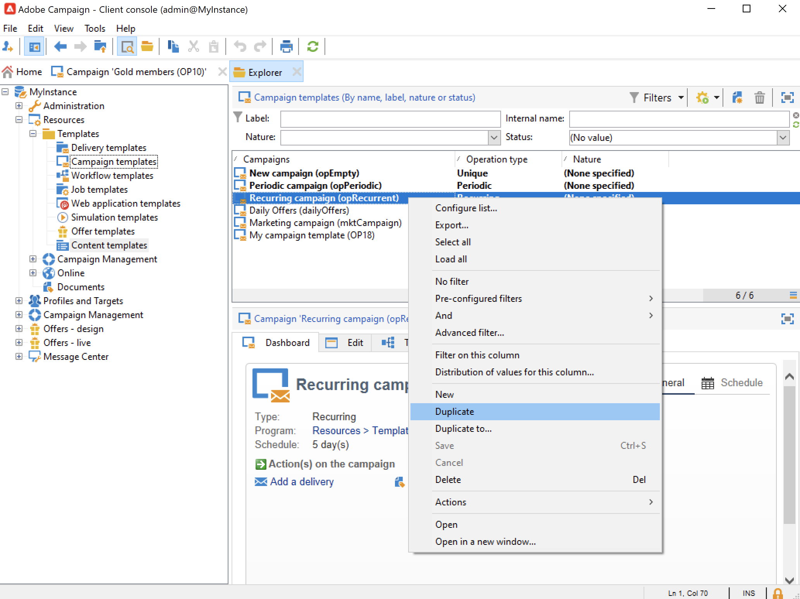

# 週期性和定期的促銷活動 {#recurring-and-periodic-campaigns}

A **循環行銷活動** 是以特定範本為基礎的促銷活動，其工作流程設定為根據關聯排程執行。 目標定位會在每次執行時重複，且會追蹤各種程式和目標母體。  設定後，循環促銷活動會自動建立新的工作流程（複製工作流程範本）並加以執行。 例如，如果您需要每月傳送提醒給對象區段，請設定週期性促銷活動，以便在每年年初建立12個工作流程，每月各一個。 [了解更多](#create-a-recurring-campaign)

A **定期促銷活動** 是根據特定範本的促銷活動，可讓您根據執行排程建立促銷活動例項。 根據範本排程中定義的頻率，會根據定期促銷活動範本自動建立促銷活動例項。 [了解更多](#create-a-periodic-campaign)

## 建立循環促銷活動 {#create-a-recurring-campaign}

循環促銷活動是從定義要執行的工作流程範本和執行排程的特定範本建立。

### 為循環促銷活動建立範本 {#create-the-campaign-template}

若要建立循環促銷活動的範本，請遵循下列步驟：

1. 開啟Campaign檔案總管並瀏覽至 **[!UICONTROL Resources > Templates > Campaign templates]**.
1. 複製內建 **[!UICONTROL Recurring campaign]** 範本。
   
1. 輸入範本名稱和促銷活動期間。
1. 對於此類型的促銷活動， **[!UICONTROL Schedule]** 標籤，以建立範本執行排程。 使用此索引標籤可根據此範本定義促銷活動的執行日期。
   

   執行計畫的配置模式與 **[!UICONTROL Scheduler]** 工作流程的物件。 [了解更多資訊](../workflow/scheduler.md)。

   >[!CAUTION]
   >
   >執行排程設定必須謹慎執行。 根據指定的排程，循環促銷活動會複製其範本的工作流程。 此操作可能會使資料庫過載。

1. 在 **[!UICONTROL Create in advance for]** 欄位，以針對所指出的期間建立對應的工作流程。
1. 在 **[!UICONTROL Targeting and workflows]** 頁簽，根據此範本設計要用於促銷活動的工作流程範本。 此工作流程通常包含目標參數以及一或多個傳送。

   >[!NOTE]
   >
   >此工作流程必須儲存為循環工作流程範本。 要執行此操作，請編輯工作流屬性並選取 **[!UICONTROL Recurring workflow template]** 選項 **[!UICONTROL Execution]** 標籤。

   

### 建立循環促銷活動 {#create-the-recurring-campaign}

若要建立週期性促銷活動並根據範本中定義的排程執行其工作流程，您必須：

1. 根據您的循環促銷活動範本建立新促銷活動。
1. 填入工作流程執行排程，位於 **[!UICONTROL Schedule]** 標籤。 促銷活動排程可讓您輸入每行的自動工作流程建立或執行開始日期。

   您可以為每行新增下列其他選項：

   * 啟用 **[!UICONTROL To be approved]** 選項，強制在工作流程中傳送核准請求。
   * 啟用 **[!UICONTROL To be started]** 選項，在達到開始日期時啟動工作流程。

   此 **[!UICONTROL Create in advance for]** 欄位可讓您建立涵蓋所輸入期間的所有工作流程。

   於 **[!UICONTROL Jobs on campaigns]** 工作流程，則會根據行銷活動排程中定義的發生次數，建立專用的工作流程。 因此，會為每個執行日期建立工作流程。

1. 循環工作流程會從行銷活動中出現的工作流程範本自動建立。 它們可從 **[!UICONTROL Targeting and workflows]** 標籤。

   

   循環工作流實例的標籤由其模板標籤和工作流編號組成，其中的#字元介於兩者之間。

   從排程建立的工作流程會自動與 **[!UICONTROL Workflow]** 欄 **[!UICONTROL Schedule]** 標籤。

   

   您可以從此索引標籤編輯每個工作流程。

   >[!NOTE]
   >
   >與工作流關聯的計畫行的開始日期可通過工作流的變數使用以下語法：\
   >`$date(instance/vars/@startPlanningDate)`

## 建立定期促銷活動 {#create-a-periodic-campaign}

定期促銷活動是根據特定範本的促銷活動，可讓您根據執行排程建立促銷活動例項。 根據範本排程中定義的頻率，會根據定期促銷活動範本自動建立促銷活動例項。

### 建立促銷活動範本 {#create-the-campaign-template-1}

1. 開啟Campaign檔案總管並瀏覽至 **[!UICONTROL Resources > Templates > Campaign templates]**.
1. 複製內建 **[!UICONTROL Periodic campaign]** 範本。
1. 輸入模板的屬性。

   >[!NOTE]
   >
   >指派範本的運算子必須擁有適當權限，才能在選取的方案中建立促銷活動。

1. 建立與此範本相關聯的工作流程。 此工作流程會在範本建立的每個定期促銷活動中重複。

   >[!NOTE]
   >
   >此工作流程是工作流程範本。 無法從促銷活動範本執行。

1. 完成循環促銷活動範本的執行排程：按一下 **[!UICONTROL Add]** 按鈕並定義開始和結束日期，或透過連結填入執行排程。

   >[!CAUTION]
   >
   >定期促銷活動範本會根據上述定義的排程建立新促銷活動。 因此，必須謹慎完成，以避免超載Adobe Campaign資料庫。

1. 一旦達到執行開始日期，就會自動建立相符的促銷活動。 它具有其模板的所有特性。

   可透過範本排程編輯每個促銷活動。

   每個定期促銷活動都包含相同的元素。 建立後，就會以標準促銷活動來管理。
