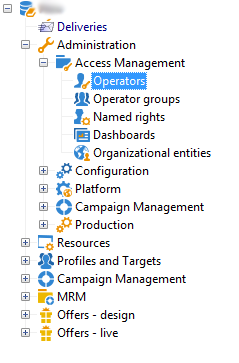

# 開始使用分散式行銷{#about-distributed-marketing}

Adobe Campaign提供 **分散式行銷** 中央實體（總部、行銷部門等）之間實施合作活動的應用程式 本地實體 (銷售地點、地區代理等)。 此合作基於共用工作區，稱為 **[!UICONTROL list of campaign packages]**，即可將集中建立的行銷活動範本和執行個體提供給本機實體。

中央實體提供本機實體可使用的行銷活動。 行銷活動由代表本機或合作行銷活動的套件具體化。 若要使用行銷活動，本機實體必須對其進行排序，並且該訂單必須經過核准。

>[!CAUTION]
>
>分散式行銷模組是 **Campaign** 選項。 請檢查您的授權合約。

## 術語 {#terminology}

* **中央實體**

   中央實體由行銷人員組成，負責指定通訊並協助當地實體執行其行銷活動。

   分散式行銷模組可讓中央實體：

   * 為本機實體設定行銷活動套件
   * 提高本地實體在客戶/潛在客戶溝通、目標定位、內容等選擇上的自主程度。
   * 管理及控制成本、
   * 處理代理商網路。

* **本地實體**

   本地實體可以是特定本地營運商（國家或地區經理、品牌經理等）的代理商、商店或群組。

   分散式行銷可讓本地實體擁有更多自主權，同時最佳化執行成本。

* **本土化**

   本地化是本機實體修改行銷活動目標和內容的容量。 本地化可能的等級取決於行銷活動的型別及其實作。

* **行銷活動套件清單**

   行銷活動套件清單包含本機實體可用的行銷活動。

* **行銷活動套件**

   由中央實體建立的範本（或行銷活動例項），可供一組本機實體使用。

* **本機行銷活動**

   本機行銷活動是從清單中參照的範本建立的例項 **[!UICONTROL campaign packages]** 搭配 **特定執行排程**. 其目標是使用由中央實體設定和設定的行銷活動範本，滿足本機通訊需求。

   本地實體的自主程度取決於所使用的實作。

   請參閱 [建立本機行銷活動](creating-a-local-campaign.md).

* **合作行銷活動**

   合作行銷活動是行銷活動，其 **執行排程已定義** 由中央實體執行，而本機實體可使用該中央實體。 每個本機實體的內容都相同，但會共用成本。 若要參加，本地實體需訂閱合作行銷活動。

   * **[!UICONTROL Collaborative campaign (by form)]**：建議用於涉及最多300個本地實體的行銷活動。 本機實體可輸入預先定義的引數，以用於網路表單中的目標定位和內容個人化。 表單可以是Adobe Campaign表單或外部表單（外部網路使用者端）。 功能管理員可以根據整合商定義的表單範本來定義及設定表單。 若要訂購行銷活動，本機實體只需要網頁存取權。
   * **[!UICONTROL Collaborative campaign (by campaign)]**：建議針對數十個當地實體進行行銷活動。 此型別的行銷活動會為每個本機實體建立子行銷活動。 一旦 **[!UICONTROL collaborative campaign (by campaign)]** 中央實體已核准，則本機實體可使用該行銷活動，並可對其進行修改。 執行會在父行銷活動和子行銷活動之間自動同步。 本機實體必須具備執行個體的存取權，才能訂購行銷活動並參與其中。
   * **[!UICONTROL Collaborative campaign (by target approval)]**：針對數千個本地實體的行銷活動建議使用。 本機實體會接收由中央實體預先定義的聯絡人清單。 本機實體會透過網路表單，根據行銷活動內容決定是否保留特定聯絡人。 從選取的連絡人清單推斷出本機圖元。 若要參與行銷活動，本機實體只需要網頁存取權。
   * **[!UICONTROL Collaborative campaign (simple)]**：此模式可確保與舊版的特定執行程式相容。

   請參閱 [建立合作行銷活動](creating-a-collaborative-campaign.md).

**訂購行銷活動套件**

如果本機實體註冊促銷活動，則會將此動作設為訂單，重新分組與促銷活動本地化相關的所有資訊。

## 工作區 {#workspace}

行銷活動套件清單可從 **行銷活動** 標籤：按一下 **[!UICONTROL Campaign packages]** 連結。

此視窗可讓所有當地營運商檢視其當地代理商可用的行銷活動。

若是中央代理商，此視窗會顯示行銷活動套件清單中可用的所有套件，並提供編輯清單的其他連結。

## 運運算元和實體 {#operators-and-entities}

首先，請透過 **[!UICONTROL Access management]** 資料夾。

### 運算子 {#operators}

您需要建立中央和本機運運算元。

中央運運算元必須屬於 **[!UICONTROL Central management]** 操作員群組或具有 **[!UICONTROL CENTRAL]** 具名權利。

本機運運算元必須屬於 **[!UICONTROL Local management]** 操作員群組或具有 **[!UICONTROL LOCAL]** 具名權利。 它們也必須連結至其本機實體。

### 組織實體 {#organizational-entities}

若要建立組織實體，請按一下 **[!UICONTROL Administration > Access management > Organizational entities]** 資料夾，然後按一下 **[!UICONTROL New]** 圖示加以識別。

每個組織實體都包含識別資訊（標籤、內部名稱、聯絡資訊等） 與訂單核准流程中涉及的群組。 這些在 **[!UICONTROL Notifications and approvals]** 區段位於 **[!UICONTROL General]** 標籤。

* 定義套件通知群組：此群組中的操作員將在每次將新套件新增到行銷活動套件清單和每次行銷活動可用時收到通知。
* 選取負責核准訂單的稽核者群組，即負責核准由當地實體訂購之行銷活動的稽核者。
* 最後，選取負責核准本機行銷活動（目標、內容、預算等）的稽核者群組。 根據範本，在訂購行銷活動時可將此群組新增至。

>[!NOTE]
>
>核准流程會顯示在中 [核准流程](creating-a-local-campaign.md#approval-process) 區段。

## 實作 {#implementation}

分散式行銷活動由中央實體建立和發佈。 如有需要，本機實體和中央實體均可使用這些變數。

實作程式取決於使用的行銷活動套件型別和本機實體委派層級。

### Integrator工作 {#integrator-side}

1. 建立本機實體。
1. 將收件者與管理本機實體的操作者連結。

   

1. 指定本機實體的許可權和瀏覽規則
1. 指定行銷活動本地化所需的欄位集：

   * 目標定義和大小上限，
   * 內容定義，
   * 執行排程（聯絡日期和摘取日期）， **僅適用於本機運運算元**，
   * 包含所有必要額外欄位的訂單結構描述擴充功能。

1. 建立網路表單(Adobe或外部網路)，讓您顯示本地化引數、評估目標和預算，以及預覽內容並核准訂單。

   對象 **合作行銷活動（依目標核准）**，建立要儲存每個本機實體核准的表格。

### 功能管理員任務 {#functional-administrator-side}

建立每個行銷活動時，必須執行這些步驟。

1. 使用行銷活動當地語系化使用的欄位更新表單。
1. 從適當的行銷活動範本（合作行銷活動）建立執行個體，或複製行銷活動範本（本機行銷活動）。
1. 使用本地化欄位和表單參考資料設定行銷活動。
1. 發佈行銷活動。

### 本機操作員任務 {#local-operator-side}

必須對每個行銷活動執行這些步驟。

1. 收到行銷活動套件可用性的通知後，請指定行銷活動的位置（選用）。
1. 評估目標、預算等。
1. 預覽行銷活動內容。
1. 訂購行銷活動。
