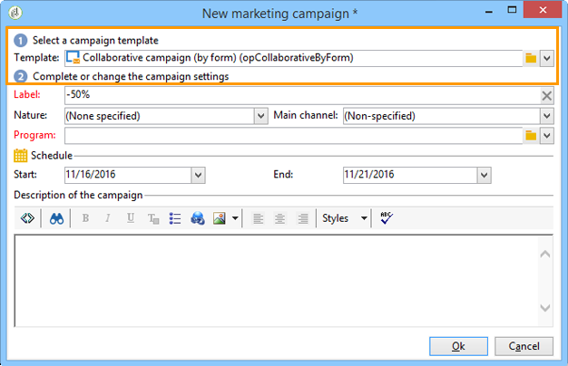
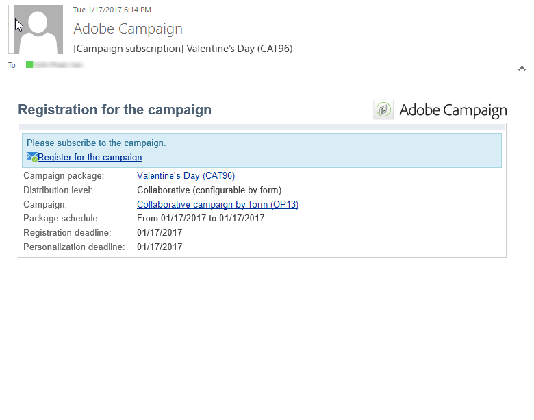

# 建立協作行銷活動{#creating-a-collaborative-campaign-intro}

中央實體根據 **分佈式營銷** 市場活動模板。 請參見[此頁面](about-distributed-marketing.md#collaborative-campaign)。

## 建立協作行銷活動 {#creating-a-collaborative-campaign}

要配置協作市場活動，請按一下 **[!UICONTROL Campaign management > Campaigns]** 資料夾，然後 **[!UICONTROL New]** 表徵圖

>[!NOTE]
>
>除 **[!UICONTROL collaborative campaigns (by campaign)]**，這些活動可通過web介面進行配置和執行。

協作市場活動資料庫的配置過程與本地市場活動模板的配置過程類似。 下面詳細說明了不同類型的協作活動的規格。

### 依表單 {#by-form}

要建立協作市場活動（按窗體）, **[!UICONTROL Collaborative campaign (by form)]** 必須選擇模板。

在 **[!UICONTROL Edit]** 頁籤 **[!UICONTROL Advanced campaign parameters...]** 訪問連結 **分佈式營銷** 頁籤。

選擇 **按窗體** Web介面。 此類型的介面允許您建立個性化欄位，這些欄位將在訂購市場活動時由本地實體使用。 請參閱 [建立本地市場活動（按窗體）](examples.md#creating-a-local-campaign--by-form-)。

保存您的活動。 您現在可以從 **市場活動包** 的 **活動** ，按一下 **[!UICONTROL Create]** 按鈕

的 **[!UICONTROL Campaign Package]** 「視圖」允許您使用本地市場活動模板（現成或複製），以及協作市場活動的參考市場活動，以便為不同的組織實體建立市場活動。

### 按活動 {#by-campaign}

要建立協作市場活動（按市場活動）, **[!UICONTROL Collaborative campaign (by campaign) (opCollaborativeByCampaign)]** 必須選擇模板。

訂購市場活動時，本地實體可以完成由中心實體預定義的標準，並在訂購市場活動之前評估市場活動。

一次訂單 **協作市場活動（按市場活動）** 由中心實體批准，為本地實體建立子市場活動。 一旦可用，本地實體就可以修改：

* 市場活動流程，
* 類型規則，
* 和個性化欄位。

本地實體執行子市場活動。 中央實體執行父市場活動。

中心實體可以查看與 **協作市場活動（按市場活動）** 從此儀表板(通過 **[!UICONTROL List of associated campaigns]** 連結)。

### 依據目標核准 {#by-target-approval}

要建立協作市場活動（按目標審批）, **[!UICONTROL Collaborative campaign (by target approval)]** 必須選擇模板。

>[!NOTE]
>
>在此模式下，中心實體不需要指定本地實體。

市場活動工作流必須整合 **本地批准** 鍵入活動。 活動參數如下：

* **[!UICONTROL Action to perform]** : 目標核准通知.
* **[!UICONTROL Distribution context]** : 明確.
* **[!UICONTROL Data distribution]** :本地實體分發。

**本地實體分配** 必須建立類型資料分發。 資料分發模板允許您限制分組值清單中的記錄數。 在 **[!UICONTROL Resources > Campaign management > Data distribution]**，按一下 **[!UICONTROL New]** 表徵圖 **[!UICONTROL Data distribution]**。 有關資料分發的詳細資訊，

選擇 **目標維** 和 **[!UICONTROL Distribution field]**。 對於 **[!UICONTROL Assignment type]**&#x200B;選中 **本地實體**。

在 **[!UICONTROL Distribution]** 頁籤，為每個本地實體添加一個欄位並指定值。

你可以再加一秒 **目標審批** 在 **交貨** 鍵入activity以配置報告。

在市場活動建立通知消息中，本地實體接收已由中心實體參數預定義的聯繫人清單。

本地實體可以根據市場活動內容刪除某些聯繫人。

### 簡單 {#simple}

要建立簡單的協作市場活動， **[!UICONTROL Collaborative campaign (simple)]** 必須選擇模板。

## 建立協作市場活動包 {#creating-a-collaborative-campaign-package}

要使市場活動可供本地實體使用，中央實體必須建立市場活動包。

應用以下步驟：

1. 在 **[!UICONTROL Navigation]** 的 **市場活動** 的 **[!UICONTROL Campaign packages]** 的子菜單。
1. 按一下 **[!UICONTROL Create]** 按鈕。
1. 窗口頂部的部分允許您選擇 **[!UICONTROL New collaborative package (mutualizedEmpty)]** 的下界。
1. 選擇參考市場活動。
1. 指定市場活動包的標籤、資料夾和執行計畫。

### 日期 {#dates}

起始日期和終止日期定義市場活動一攬子清單中市場活動的可見性期間。

對於 **協作活動**，中心實體必須指定註冊和個性化截止時間。

>[!NOTE]
>
>的 **[!UICONTROL Personalization deadline]** 允許中央實體選擇一個截止時間，本地實體必須在該截止時間之前傳送要用於配置市場活動的文檔（電子錶格、影像）。 這不是強制選項。 單方面跨越此日期不會影響促銷活動的實施。

### 對象 {#audience}

在建立協作市場活動後，中心實體必須指定每個市場活動所涉及的本地實體。

>[!CAUTION]
>
>**[!UICONTROL Simple, by form and by campaign collaborative campaign kits]** 未指定相關本地實體的，方可批准。

### 審批模式 {#approval-modes}

對於 **協作活動**，您可以指定訂單審批模式。

在手動模式下，本地實體需要訂閱市場活動才能參與。

在自動模式中，預訂本地實體用於市場活動。 它可以取消市場活動訂閱或修改其參數，而無需中央實體的批准。

### 通知 {#notifications}

通知的配置與本地實體的通知相同。 請參閱[本節](creating-a-local-campaign.md#notifications)。

## 訂購市場活動 {#ordering-a-campaign}

當將協作市場活動添加到市場活動包清單時，通知屬於由中央實體定義的受眾的本地實體( **協作市場活動（按目標批准）** 沒有預定義的受眾)。 發送的消息包含一個連結，您可以註冊市場活動，如下所示：

此消息還使本地實體可以查看由建立包的中央運算子輸入的說明以及連結到市場活動的文檔。 這些資訊不屬於活動本身，儘管它們提供了關於它的更多資訊。

一旦本地操作員通過Web介面登錄，他們就可以向要訂購的協作市場活動輸入個性化資訊：

當地單位辦結登記後，通過電子郵件通知中央單位批准訂單。

有關詳細資訊，請參閱 [審批流程](creating-a-local-campaign.md#approval-process) 的子菜單。

## 批准訂單 {#approving-an-order}

批准協作市場活動包訂單的過程與在本地市場活動中批准協作市場活動包訂單的過程相同。 請參閱[本節](creating-a-local-campaign.md#approving-an-order)。
