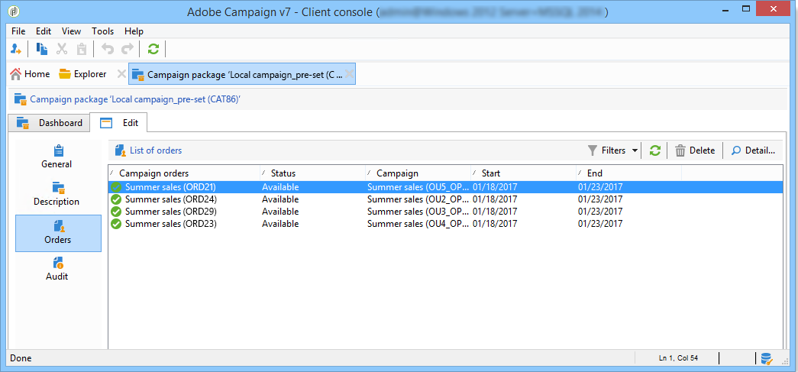

# 建立本機行銷活動{#creating-a-local-campaign}

本機行銷活動是從包含&#x200B;**特定執行排程**&#x200B;的&#x200B;**[!UICONTROL campaign packages]**&#x200B;清單中參考的範本建立的執行個體。 其目的在於使用由中央實體設定和設定的行銷活動範本，滿足本機通訊需求。 實作本機作業的主要階段如下：

中央實體&#x200B;**的**

1. 建立本機行銷活動範本。
1. 從範本建立行銷活動套件。
1. 發佈行銷活動套件。
1. 正在核准訂單。

本機實體的&#x200B;****

1. 訂購行銷活動。
1. 執行行銷活動。

## 建立本機行銷活動範本 {#creating-a-local-campaign-template}

若要建立行銷活動套件，您必須先透過&#x200B;**[!UICONTROL Resources > Templates]**&#x200B;節點建立&#x200B;**行銷活動範本**。

若要建立新的本機範本，請複製預設的&#x200B;**[!UICONTROL Local campaign (opLocal)]**&#x200B;範本。

為行銷活動範本命名，並完成可用的欄位。

在行銷活動視窗中，按一下&#x200B;**[!UICONTROL Edit]**&#x200B;標籤，然後按一下&#x200B;**[!UICONTROL Advanced campaign parameters...]**&#x200B;連結。

### 介面型別 {#web-interface}

在&#x200B;**分散式行銷**&#x200B;標籤中，您可以選擇介面型別，並指定當本機實體下訂單時要輸入的預設值和引數。

介面對應於由本機實體在訂購行銷活動時填寫的表單。

選取要套用至從範本建立之行銷活動的介面型別：

可用的介面型別有四種：

* **[!UICONTROL By brief]** ：本機實體必須提供說明，以便說明行銷活動設定。 訂單獲得核准後，中央實體會設定並執行整個行銷活動。

  

* **[!UICONTROL By form]** ：本機實體可存取網路表單，其中他們可以使用個人化欄位編輯內容、目標、其大小上限，以及建立和擷取日期（視使用的範本而定）。 本機實體可以評估目標並預覽此網路表單的內容。

  

  提供的表單是在Web應用程式中指定的，必須從範本&#x200B;**[!UICONTROL Advanced campaign parameters...]**&#x200B;連結的&#x200B;**[!UICONTROL web Interface]**&#x200B;欄位從下拉式清單中選取。 請參閱[建立本機行銷活動（依表單）](examples.md#creating-a-local-campaign--by-form-)。

  >[!NOTE]
  >
  >此範例中使用的Web應用程式為範例。 您必須建立特定的網頁應用程式才能使用表單。

  

* **[!UICONTROL By external form]** ：本機實體可存取其外部網路(非Adobe Campaign)中的行銷活動引數。 這些引數與&#x200B;**本機行銷活動（依表單）**&#x200B;的引數相同。
* **[!UICONTROL Pre-set]** ：本機實體使用預設表單訂購行銷活動，但不進行當地語系化。

  

### 預設值 {#default-values}

選取要由本機實體完成的&#x200B;**[!UICONTROL Default values]**。 例如：

* 聯絡與解壓縮日期，
* 目標特性（年齡區段等）。

完成&#x200B;**[!UICONTROL Parent marketing program]**&#x200B;和&#x200B;**[!UICONTROL Charge]**&#x200B;欄位。

### 核准 {#approvals}

從&#x200B;**[!UICONTROL Advanced parameters for campaign entry]**&#x200B;連結中，您可以指定稽核者數目上限。

訂購行銷活動時，檢閱者將由本機實體輸入。

如果您不想要為行銷活動命名稽核者，請輸入0。

### 文件 {#documents}

您可以允許本機實體運運算元連結檔案（文字檔案、試算表、影像、行銷活動說明等） 至本機行銷活動。 **[!UICONTROL Advanced parameters for campaign entry...]**&#x200B;連結可讓您限制檔案數目。 若要這麼做，只要在&#x200B;**[!UICONTROL Number of documents]**&#x200B;欄位中輸入允許的最大數目即可。

訂購行銷活動套件時，表單會建議連結範本中對應欄位所指示數量的檔案。

如果您不想顯示檔案上傳欄位，請在&#x200B;**[!UICONTROL Number of documents]**&#x200B;欄位中輸入&#x200B;**[!UICONTROL 0]**。

>[!NOTE]
>
>可透過勾選&#x200B;**[!UICONTROL Do not display the page used to enter the campaign parameters]**&#x200B;來停用&#x200B;**[!UICONTROL Advanced parameters for campaign entry]**。

### 工作流程 {#workflow}

在&#x200B;**[!UICONTROL Targeting and workflows]**&#x200B;索引標籤中，建立行銷活動工作流程，以收集&#x200B;**[!UICONTROL Advanced campaign parameters...]**&#x200B;中指定的&#x200B;**[!UICONTROL Default values]**&#x200B;並建立傳遞。

按兩下&#x200B;**[!UICONTROL Query]**&#x200B;活動，以根據指定的&#x200B;**[!UICONTROL Default values]**&#x200B;進行設定。

### 傳遞 {#delivery}

在&#x200B;**[!UICONTROL Audit]**&#x200B;索引標籤中，按一下&#x200B;**[!UICONTROL Detail...]**&#x200B;圖示以檢視所選傳遞的&#x200B;**[!UICONTROL Scheduling]**。

**[!UICONTROL Scheduling]**&#x200B;圖示可讓您設定傳送的聯絡人及執行日期。

如有必要，請設定傳遞的大小上限：

找出傳送的HTML。 例如，在&#x200B;**[!UICONTROL Delivery > Current order > Additional fields]**&#x200B;中，使用&#x200B;**[!UICONTROL Age segment]**&#x200B;欄位來根據目標年齡尋找傳遞。

儲存您的行銷活動範本。 您現在可以從&#x200B;**[!UICONTROL Campaigns]**&#x200B;索引標籤的&#x200B;**[!UICONTROL Campaign packages]**&#x200B;檢視中按一下&#x200B;**[!UICONTROL Create]**&#x200B;按鈕來使用它。

>[!NOTE]
>
>行銷活動範本及其一般設定在[此頁面](../campaigns/marketing-campaign-templates.md)中有詳細說明。

## 建立行銷活動套件 {#creating-the-campaign-package}

為了讓本機實體可使用行銷活動範本，需將其新增至清單。 為此，中央機構需要建立新套件。

應用以下步驟：

1. 在&#x200B;**行銷活動**&#x200B;頁面的&#x200B;**[!UICONTROL Navigation]**&#x200B;區段中，按一下&#x200B;**[!UICONTROL Campaign packages]**&#x200B;連結。
1. 按一下 **[!UICONTROL Create]** 按鈕。

   

1. 視窗上方的區段可讓您選取[先前](#creating-a-local-campaign-template)指定的行銷活動套件範本。

   根據預設，**[!UICONTROL New local campaign package (localEmpty)]**&#x200B;範本用於本機行銷活動。

1. 指定行銷活動套件的標籤、資料夾和執行排程。

### 日期 {#dates}

開始和結束日期定義行銷活動套件清單中的行銷活動可見期間。

可用日期是促銷活動可供本機實體（訂購）使用的日期。

>[!CAUTION]
>
>如果本機實體未在截止日期前預留行銷活動，則將無法使用。

此資訊可在傳送給當地代理機構的通知訊息中找到，如下所示：

### 對象 {#audience}

對於本機行銷活動，中央實體可以透過檢查&#x200B;**[!UICONTROL Limit the package to a set of local entities]**&#x200B;來指定涉及的本機實體。

### 其他設定 {#additional-settings}

儲存封裝後，中央實體可以從&#x200B;**[!UICONTROL Edit]**&#x200B;索引標籤編輯它。

從&#x200B;**[!UICONTROL General]**&#x200B;索引標籤，中央實體可以：

* 從&#x200B;**[!UICONTROL Approval parameters...]**&#x200B;連結設定行銷活動套件檢閱者，
* 檢閱執行排程，
* 新增或刪除本機實體。

>[!NOTE]
>
>依預設，每個實體只能訂購&#x200B;**本機行銷活動**&#x200B;一次。
>   
>核取&#x200B;**[!UICONTROL Enable multiple creation]**&#x200B;選項，以允許從行銷活動套件建立數個本機行銷活動。

### 通知 {#notifications}

當行銷活動可用或達到註冊截止日期時，會傳送訊息給本機通知群組的操作者。 如需詳細資訊，請參閱[組織實體](about-distributed-marketing.md#organizational-entities)。

## 訂購行銷活動 {#ordering-a-campaign}

行銷活動套件一經核准且開始實作期間後，即可供本機實體存取。 本機實體會收到電子郵件，通知他們新的行銷活動套件可供使用（一旦達到可用日期）。

>[!NOTE]
>
>如果在建立行銷活動套件時指定了某些本機實體，則這些實體將是唯一會收到通知的實體。 如果未指定本機實體，則所有本機實體都會收到通知。

若要使用中央實體提供的行銷活動，本機實體必須加以排序。

若要訂購行銷活動，請執行下列步驟：

1. 按一下通知訊息中的&#x200B;**[!UICONTROL Order campaign]**，或Adobe Campaign中對應的按鈕。

   輸入您的ID和密碼以訂購行銷活動。 介面是由網頁應用程式中定義的一組頁面所組成。

1. 在第一頁輸入必要資訊（訂購標籤和註解），然後按一下&#x200B;**[!UICONTROL Next]**。

   

1. 完成可用引數並核准訂單。

1. 系統會傳送通知給本機實體所屬之組織實體的經理，以核准此訂單。

   

1. 資訊會傳回至本機與中央實體。 雖然本機實體只能檢視自己的訂單，但中央實體可以檢視任何本機實體的所有訂單，如下所示：

   

   操作員可以顯示訂單詳細資料：

   

   **[!UICONTROL Edit]**&#x200B;索引標籤包含本機實體在訂購行銷活動時輸入的資訊。

   

1. 訂單必須由中央實體核准才能完成。

   

   如需詳細資訊，請參閱[核准程式](#approval-process)區段。

1. 接著，本機操作員會收到此行銷活動可用的通知：可以在&#x200B;**行銷活動**&#x200B;索引標籤內的行銷活動套件清單中找到行銷活動可用性。 然後可以使用行銷活動。 如需詳細資訊，請參閱[存取行銷活動](accessing-campaigns.md)。

   **[!UICONTROL Start targeting with order approval]**&#x200B;選項可讓本機實體在核准訂單後立即執行行銷活動。

   

## 核准訂單 {#approving-an-order}

若要確認行銷活動訂單，中央實體必須核准它。

透過&#x200B;**行銷活動**&#x200B;索引標籤存取的&#x200B;**[!UICONTROL Campaign orders]**&#x200B;總覽可讓您檢視行銷活動訂單的狀態並核准它們。

>[!NOTE]
>
>本地實體可以變更訂單，直到核准為止。

### 核准流程 {#approval-process}

#### 電子郵件通知 {#email-notification}

當行銷活動由本機實體訂購時，其稽核者會收到電子郵件通知，如下所示：

>[!NOTE]
>
>選取的檢閱者會顯示在[檢閱者](#reviewers)區段中。 他們可以接受或拒絕訂單。

#### 透過使用者端主控台核准 {#approving-via-the-adobe-campaign-console}

您也可以在行銷活動訂單總覽中，透過使用者端主控台核准訂單。 若要核准訂單，請選取訂單並按一下&#x200B;**[!UICONTROL Approve the order]**。

>[!NOTE]
>
>在行銷活動推出日期之前，您仍可編輯及重新設定行銷活動。 本機實體也可以按一下&#x200B;**[!UICONTROL Cancel]**&#x200B;按鈕來拒絕行銷活動。

#### 建立行銷活動 {#creating-a-campaign}

行銷活動訂單獲得核准後，即可由本機實體設定及執行。

如需詳細資訊，請參閱[存取行銷活動](accessing-campaigns.md)。

### 拒絕核准 {#rejecting-an-approval}

負責核准的操作員可以拒絕訂單或行銷活動套件。

若複查者拒絕訂單，系統會自動將相關通知傳送給相關當地實體：它會顯示拒絕核准之操作員所輸入的註解。

資訊會顯示在行銷活動套件清單頁面或行銷活動訂單頁面上。 如果他們能存取Adobe Campaign使用者端主控台，本機實體就會收到此拒絕的通知。

他們可以在行銷活動套件的&#x200B;**[!UICONTROL Edit]**&#x200B;索引標籤中檢視相關註解。

### 檢閱者 {#reviewers}

每次需要核準時，稽核者都會收到電子郵件通知。

對於每個本機實體，會針對行銷活動訂單核准和行銷活動核准選取稽核者。 如需選取本機檢閱者的詳細資訊，請參閱[組織實體](about-distributed-marketing.md#organizational-entities)。

>[!NOTE]
>
>若要讓此選取成為可能，訂單核准必須尚未生效。

### 取消訂單 {#canceling-an-order}

中央代理商可以使用訂單儀表板上的&#x200B;**[!UICONTROL Delete]**&#x200B;按鈕取消訂單。

這會取消&#x200B;**[!UICONTROL Campaign orders]**&#x200B;檢視中的行銷活動。
