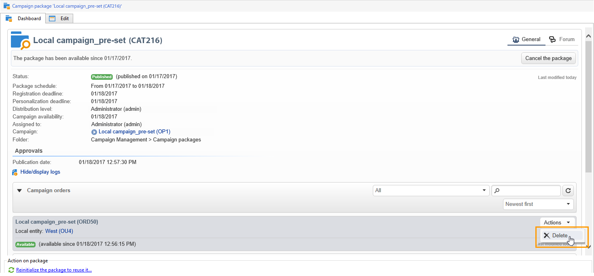

# 建立本機行銷活動{#creating-a-local-campaign}

本地市場活動是根據清單中引用的模板建立的實例 **[!UICONTROL campaign packages]** 帶 **特定執行計畫**。 其目的是使用由中央實體設定和配置的活動模板來滿足本地通信需求。 實施本地業務的主要階段如下：

**對於中央實體**

1. 建立本地市場活動模板。
1. 從模板建立市場活動包。
1. 發佈促銷活動包。
1. 審批訂單。

**對於本地實體**

1. 訂購市場活動。
1. 執行市場活動。

## 建立本地市場活動模板 {#creating-a-local-campaign-template}

要建立市場活動包，必須首先建立 **活動模板** 通過 **[!UICONTROL Resources > Templates]** 的下界。

要建立新的本地模板，請複製預設模板 **[!UICONTROL Local campaign (opLocal)]** 的下界。

命名市場活動模板並填寫可用欄位。

在市場活動窗口中，按一下 **[!UICONTROL Edit]** ，然後按一下 **[!UICONTROL Advanced campaign parameters...]** 的子菜單。

### 網頁介面 {#web-interface}

在 **分佈式營銷** 頁籤，您可以選擇Web介面的類型並指定當本地實體下訂單時要輸入的預設值和參數。

Web介面對應於在訂購市場活動時由本地實體填寫的表單。

選擇要應用於從模板建立的市場活動的Web介面類型：

可用的Web介面有四種類型：

* **[!UICONTROL By brief]** :本地實體必須提供描述市場活動配置的說明。 一旦該訂單被批准，中央實體將整個市場活動配置和執行。

   

* **[!UICONTROL By form]** :本地實體有權訪問Web表單，在該表單中，根據使用的模板，他們可以編輯內容、目標、其最大大小，以及使用個性化欄位建立和提取日期。 本地實體可以評估目標並預覽此Web表單中的內容。

   

   提供的表單是在Web應用程式中指定的，必須從 **[!UICONTROL web Interface]** 的 **[!UICONTROL Advanced campaign parameters...]** 的子菜單。 請參閱 [建立本地市場活動（按窗體）](examples.md#creating-a-local-campaign--by-form-)。

   >[!NOTE]
   >
   >此示例中使用的Web應用程式就是一個示例。 必須建立特定Web應用才能使用表單。

   

* **[!UICONTROL By external form]** :地方實體有權訪問其外聯網(而非Adobe Campaign)中的活動參數。 這些參數與 **本地活動（按形式）**。
* **[!UICONTROL Pre-set]** :本地實體使用預設表單訂購市場活動，而不本地化它。

   

### 預設值 {#default-values}

選擇 **[!UICONTROL Default values]** 由本地實體完成。 例如：

* 聯繫和提取日期，
* 目標特徵（年齡段等）。

完成 **[!UICONTROL Parent marketing program]** 和 **[!UICONTROL Charge]** 的子菜單。

### 核准 {#approvals}

從 **[!UICONTROL Advanced parameters for campaign entry]** 連結，可指定最大審閱者數。

訂購市場活動時，審閱者將由本地實體輸入。

如果不想為市場活動指定審閱人，請輸入0。

### 文件 {#documents}

您可以允許本地實體運算子連結文檔（文本檔案、電子錶格、影像、市場活動說明等） 建立訂單時的本地市場活動。 的 **[!UICONTROL Advanced parameters for campaign entry...]** 連結可以限制文檔數。 要執行此操作，只需輸入在 **[!UICONTROL Number of documents]** 的子菜單。

在訂購市場活動包時，表單建議連結模板中相應欄位中指示的文檔數。

如果不想顯示文檔上載欄位，請輸入 **[!UICONTROL 0]** 的 **[!UICONTROL Number of documents]** 的子菜單。

>[!NOTE]
>
>的 **[!UICONTROL Advanced parameters for campaign entry]** 可通過檢查 **[!UICONTROL Do not display the page used to enter the campaign parameters]**。

### 工作流程 {#workflow}

在 **[!UICONTROL Targeting and workflows]** 頁籤，建立收集 **[!UICONTROL Default values]** 在 **[!UICONTROL Advanced campaign parameters...]** 並建立交貨。

按兩下 **[!UICONTROL Query]** 活動，以根據指定的 **[!UICONTROL Default values]**。

### 傳遞 {#delivery}

在 **[!UICONTROL Audit]** 頁籤 **[!UICONTROL Detail...]** 表徵圖 **[!UICONTROL Scheduling]** 的子菜單。

的 **[!UICONTROL Scheduling]** 表徵圖，用於配置交貨的聯繫人和執行日期。

如有必要，請配置交貨的最大大小：

找到您交貨的HTML。 例如，在 **[!UICONTROL Delivery > Current order > Additional fields]**，使用 **[!UICONTROL Age segment]** 欄位以根據目標的年齡來定位交貨。

保存您的市場活動模板。 您現在可以從 **[!UICONTROL Campaign packages]** 的 **[!UICONTROL Campaigns]** ，按一下 **[!UICONTROL Create]** 按鈕

>[!NOTE]
>
>市場活動模板及其一般配置在 [此頁](../campaigns/marketing-campaign-templates.md)。

## 建立市場活動包 {#creating-the-campaign-package}

要使市場活動模板可供本地實體使用，需要將其添加到清單中。 為此，中央機構需要建立新的一攬子計畫。

應用以下步驟：

1. 在 **[!UICONTROL Navigation]** 的 **市場活動** 的 **[!UICONTROL Campaign packages]** 的子菜單。
1. 按一下 **[!UICONTROL Create]** 按鈕。

   

1. 窗口上方的部分允許您選擇 [先前](#creating-a-local-campaign-template) 指定的市場活動包模板。

   預設情況下， **[!UICONTROL New local campaign package (localEmpty)]** 模板用於本地市場活動。

1. 指定市場活動包的標籤、資料夾和執行計畫。

### 日期 {#dates}

起始日期和終止日期定義市場活動一攬子清單中市場活動的可見性期間。

可用性日期是市場活動可用於本地實體（按訂單）的日期。

>[!CAUTION]
>
>如果本地實體未在截止日期之前預留市場活動，則將無法使用它。

此資訊在發送給本地機構的通知消息中找到，如下所示：

### 對象 {#audience}

對於本地市場活動，中心實體可以通過檢查 **[!UICONTROL Limit the package to a set of local entities]**。

### 其他設定 {#additional-settings}

保存包後，中央實體可從 **[!UICONTROL Edit]** 頁籤。

從 **[!UICONTROL General]** 頁籤中，中心實體可以：

* 從 **[!UICONTROL Approval parameters...]** 連結，
* 查看執行計畫，
* 添加或刪除本地實體。

>[!NOTE]
>
>預設情況下，每個實體都可以 **本地活動** 只有一次。
>   
>檢查 **[!UICONTROL Enable multiple creation]** 選項，以允許從市場活動包建立多個本地市場活動。

### 通知 {#notifications}

當市場活動可用或達到註冊截止時間時，將向本地通知組的操作員發送消息。 有關此內容的詳細資訊，請參閱 [組織實體](about-distributed-marketing.md#organizational-entities)。

## 訂購市場活動 {#ordering-a-campaign}

一旦市場活動包獲得批准並且其實施期已開始，當地實體便可訪問它們。 本地實體收到一封電子郵件，告知他們有新的促銷活動包（一旦達到其可用日期）。

>[!NOTE]
>
>如果在建立市場活動包時指定了某些本地實體，則它們將是唯一接收通知的實體。 如果未指定本地實體，則所有本地實體將收到通知。

要使用中央實體提供的市場活動，本地實體必須對其進行訂購。

要訂購市場活動，請執行以下操作：

1. 按一下 **[!UICONTROL Order campaign]** 在通知消息中，或在Adobe Campaign的相應按鈕中。

   輸入您的ID和密碼以訂購市場活動。 該介面由在Web應用程式中定義的一組頁面組成。

1. 在第一頁（訂單標籤和注釋）中輸入必要資訊，然後按一下 **[!UICONTROL Next]**。

   

1. 完成可用參數並批准訂單。

1. 向本地實體所屬的組織實體的經理發送通知以批准此訂單。

   

1. 資訊將返回給本地和中央實體。 雖然本地實體只能查看其自己的訂單，但中心實體可以按任何本地實體查看所有訂單，如下所示：

   

   操作員可以顯示訂單詳細資訊：

   

   的 **[!UICONTROL Edit]** 頁籤包含訂購市場活動時由本地實體輸入的資訊。

   

1. 訂單必須經中央實體批准才能定稿。

   

   有關詳細資訊，請參閱 [審批流程](#approval-process) 的子菜單。

1. 然後，通知本地運營商市場活動可用：市場活動可用性可在市場活動包清單中找到 **市場活動** 頁籤。 然後可以使用該市場活動。 有關此內容的詳細資訊，請參閱 [訪問市場活動](accessing-campaigns.md)。

   的 **[!UICONTROL Start targeting with order approval]** 選項允許本地實體在訂單獲得批准後立即運行市場活動。

   

## 批准訂單 {#approving-an-order}

要確認促銷活動訂單，中央實體必須批准它。

的 **[!UICONTROL Campaign orders]** 概述，通過 **市場活動** 頁籤，用於查看市場活動訂單的狀態並審批它們。

>[!NOTE]
>
>本地實體可對訂單進行更改，直到其獲得批准。

### 審批流程 {#approval-process}

#### 電子郵件通知 {#email-notification}

當市場活動由本地實體訂購時，其審閱者會通過電子郵件通知，如下所示：

>[!NOTE]
>
>選擇審閱者顯示在 [審閱者](#reviewers) 的子菜單。 他們可以接受或拒絕訂單。

#### 通過Adobe Campaign控制台批准 {#approving-via-the-adobe-campaign-console}

也可以在市場活動訂單概覽中通過控制台批准訂單。 要批准訂單，請選擇訂單，然後按一下 **[!UICONTROL Approve the order]**。

>[!NOTE]
>
>市場活動仍可編輯和重新配置，直到市場活動可用日期。 通過按一下 **[!UICONTROL Cancel]** 按鈕

#### 建立行銷活動 {#creating-a-campaign}

一旦市場活動訂單被批准，它就可由本地實體配置和執行。

有關此內容的詳細資訊，請參閱 [訪問市場活動](accessing-campaigns.md)。

### 拒絕批准 {#rejecting-an-approval}

負責審批的操作員可以拒絕訂單或市場活動包。

如果審閱者拒絕訂單，則相關通知將自動發送給相關的本地實體：它顯示拒絕審批的操作員輸入的注釋。

資訊顯示在市場活動包清單頁或市場活動訂單頁上。 如果他們有權訪問Adobe Campaign控制台，則本地實體將被告知此拒絕。

他們可以查看市場活動包中的相關注釋 **[!UICONTROL Edit]** 頁籤。

### 審閱者 {#reviewers}

每次需要批准時，審閱人都會通過電子郵件通知。

對於每個本地實體，為市場活動訂單批准和市場活動批准選擇審閱者。 有關選擇本地審閱者的詳細資訊，請參閱 [組織實體](about-distributed-marketing.md#organizational-entities)。

>[!NOTE]
>
>要使此選擇成為可能，訂單審批必須尚未生效。

### 取消訂單 {#canceling-an-order}

中央機構可使用 **[!UICONTROL Delete]** 按鈕。

這將取消 **[!UICONTROL Campaign orders]** 的子菜單。
