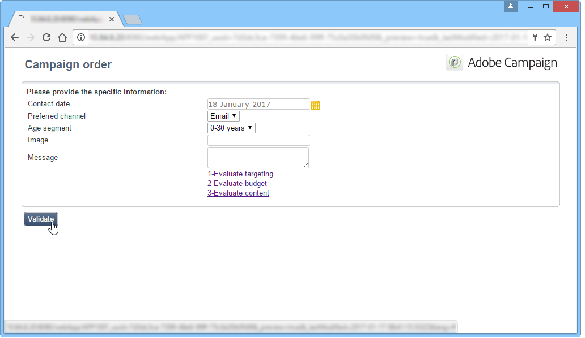
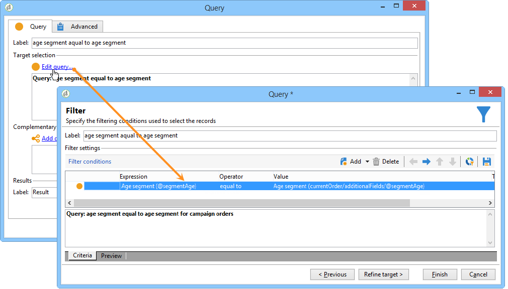

# 建立本機行銷活動{#creating-a-local-campaign}

本機行銷活動是從清單中參照的範本建立的例項 **[!UICONTROL campaign packages]** 搭配 **特定執行排程**. 其目標是使用由中央實體設定和設定的行銷活動範本，滿足本機通訊需求。 實作本機作業的主要階段如下：

**中央實體**

1. 建立本機行銷活動範本。
1. 從範本建立行銷活動套件。
1. 發佈行銷活動套件。
1. 正在核准訂單。

**針對本機實體**

1. 訂購行銷活動。
1. 執行行銷活動。

## 建立本機行銷活動範本 {#creating-a-local-campaign-template}

若要建立行銷活動套件，您必須先建立 **行銷活動範本** 透過 **[!UICONTROL Resources > Templates]** 節點。

若要建立新的本機範本，請複製預設值 **[!UICONTROL Local campaign (opLocal)]** 範本。

為行銷活動範本命名，並填寫可用欄位。

在行銷活動視窗中，按一下 **[!UICONTROL Edit]** 標籤，然後按一下 **[!UICONTROL Advanced campaign parameters...]** 連結。

### 網頁介面 {#web-interface}

在 **分散式行銷** 標籤上，您可以選擇Web介面的型別，並指定當本機實體下訂單時要輸入的預設值和引數。

Web介面對應於在訂購行銷活動時要由本機實體填寫的表單。

選取要套用至從範本建立之行銷活動的網頁介面型別：

可用的網頁介面有四種型別：

* **[!UICONTROL By brief]** ：本機實體必須提供說明，其中說明行銷活動設定。 訂單獲得核准後，中央實體會設定並執行整個行銷活動。

   

* **[!UICONTROL By form]** ：本機實體可存取網路表單，其中他們可以使用個人化欄位編輯內容、目標、其大小上限，以及建立和擷取日期（視使用的範本而定）。 本機實體可以評估目標並預覽此網路表單的內容。

   

   提供的表單是在Web應用程式中指定的，必須在下拉式清單中從 **[!UICONTROL web Interface]** 範本中的欄位 **[!UICONTROL Advanced campaign parameters...]** 連結。 請參閱 [建立本機行銷活動（依表單）](examples.md#creating-a-local-campaign--by-form-).

   >[!NOTE]
   >
   >此範例中使用的Web應用程式就是一個範例。 您必須建立特定的網頁應用程式才能使用表單。

   

* **[!UICONTROL By external form]** ：本機實體可存取其外部網路(非Adobe Campaign)中的促銷活動引數。 這些引數與 **本地行銷活動（依表單）**.
* **[!UICONTROL Pre-set]** ：本機實體使用預設表單訂購行銷活動，而不進行當地語系化。

   

### 預設值 {#default-values}

選取 **[!UICONTROL Default values]** 將由本機實體完成。 例如：

* 聯絡和擷取日期，
* 目標特性（年齡區段等）。

完成 **[!UICONTROL Parent marketing program]** 和 **[!UICONTROL Charge]** 欄位。

### 核准 {#approvals}

從 **[!UICONTROL Advanced parameters for campaign entry]** 連結，您可以指定稽核者數目上限。

排序行銷活動時，檢閱者將由本機實體輸入。

如果您不想為行銷活動的稽核者命名，請輸入0。

### 文件 {#documents}

您可以允許本機實體運運算元連結檔案（文字檔案、試算表、影像、行銷活動說明等） 至本機行銷活動。 此 **[!UICONTROL Advanced parameters for campaign entry...]** 連結可讓您限制檔案數量。 要執行此操作，只需輸入 **[!UICONTROL Number of documents]** 欄位。

訂購行銷活動套件時，表單會建議連結範本中對應欄位所指示數量的檔案。

如果您不想顯示檔案上傳欄位，請輸入 **[!UICONTROL 0]** 在 **[!UICONTROL Number of documents]** 欄位。

>[!NOTE]
>
>此 **[!UICONTROL Advanced parameters for campaign entry]** 可透過檢查來停用 **[!UICONTROL Do not display the page used to enter the campaign parameters]**.

### 工作流程 {#workflow}

在 **[!UICONTROL Targeting and workflows]** 索引標籤中，建立行銷活動工作流程，以收集 **[!UICONTROL Default values]** 指定於 **[!UICONTROL Advanced campaign parameters...]** 和建立傳遞。

按兩下 **[!UICONTROL Query]** 活動，以根據指定的進行設定 **[!UICONTROL Default values]**.

### 傳遞 {#delivery}

在 **[!UICONTROL Audit]** 索引標籤，按一下 **[!UICONTROL Detail...]** 圖示以檢視 **[!UICONTROL Scheduling]** 用於選取的傳遞。

此 **[!UICONTROL Scheduling]** 圖示可讓您設定傳送的聯絡人及執行日期。

如有必要，請設定傳遞的大小上限：

找到您的傳遞HTML。 例如，在 **[!UICONTROL Delivery > Current order > Additional fields]**，使用 **[!UICONTROL Age segment]** 根據目標年齡尋找傳送的欄位。

儲存您的行銷活動範本。 您現在可以從以下位置使用它： **[!UICONTROL Campaign packages]** 在中檢視 **[!UICONTROL Campaigns]** 索引標籤中，按一下 **[!UICONTROL Create]** 按鈕。

>[!NOTE]
>
>行銷活動範本及其一般設定會在中詳細說明 [此頁面](../campaigns/marketing-campaign-templates.md).

## 建立行銷活動套件 {#creating-the-campaign-package}

若要讓本機實體可使用行銷活動範本，需將其新增至清單。 為此，中央機構需要建立新的套件。

應用以下步驟：

1. 在 **[!UICONTROL Navigation]** 區段於 **行銷活動** 頁面，按一下 **[!UICONTROL Campaign packages]** 連結。
1. 按一下 **[!UICONTROL Create]** 按鈕。

   

1. 視窗上方的區段可讓您選取 [先前](#creating-a-local-campaign-template) 指定的行銷活動套件範本。

   根據預設， **[!UICONTROL New local campaign package (localEmpty)]** 範本用於本機行銷活動。

1. 指定行銷活動套件的標籤、資料夾和執行排程。

### 日期 {#dates}

開始和結束日期會在行銷活動套件清單中定義行銷活動的可見度期間。

可用日期是促銷活動可供本機實體使用（訂購）的日期。

>[!CAUTION]
>
>如果本機實體未在截止日期前預留行銷活動，則將無法使用。

此資訊可在傳送給當地代理商的通知訊息中找到，如下所示：

### 對象 {#audience}

對於本機行銷活動，中央實體可透過核取以指定相關的本機實體。 **[!UICONTROL Limit the package to a set of local entities]**.

### 其他設定 {#additional-settings}

儲存封裝後，中央實體便可從編輯 **[!UICONTROL Edit]** 標籤。

從 **[!UICONTROL General]** 索引標籤中，中央實體可以：

* 從設定campaign套件檢閱者 **[!UICONTROL Approval parameters...]** 連結，
* 檢閱執行排程，
* 新增或刪除本機實體。

>[!NOTE]
>
>依預設，每個實體都可以排序 **本地行銷活動** 僅一次。
>   
>檢查 **[!UICONTROL Enable multiple creation]** 可允許從行銷活動套件建立數個本機行銷活動的選項。

### 通知 {#notifications}

當行銷活動可用或達到註冊截止日期時，會傳送訊息給本機通知群組的操作員。 有關詳細資訊，請參閱 [組織實體](about-distributed-marketing.md#organizational-entities).

## 訂購行銷活動 {#ordering-a-campaign}

行銷活動套件一經核准且開始實作期間後，即可供本機實體存取。 本機實體會收到電子郵件，通知他們新的行銷活動套件可供使用（一旦達到可用日期）。

>[!NOTE]
>
>如果在建立行銷活動套件時指定了某些本機實體，則這些實體將是唯一接收通知的實體。 如果未指定本機實體，則所有本機實體都會收到通知。

若要使用中央實體提供的行銷活動，本機實體必須加以排序。

若要訂購行銷活動，請執行下列步驟：

1. 按一下 **[!UICONTROL Order campaign]** 或Adobe Campaign中對應的按鈕中設定。

   輸入您的ID和密碼以訂購行銷活動。 介面是由網頁應用程式中定義的一組頁面所組成。

1. 在第一頁輸入必要的資訊（訂單標籤和註解），然後按一下 **[!UICONTROL Next]**.

   

1. 完成可用引數並核准訂單。

1. 會傳送通知給本機實體所屬組織實體的經理，以核准此訂單。

   

1. 資訊會傳回至本機與中央實體。 雖然本機實體只能檢視自己的訂單，但中央實體可以檢視任何本機實體的所有訂單，如下所示：

   

   操作員可以顯示訂單詳細資料：

   

   此 **[!UICONTROL Edit]** 索引標籤包含由本機實體在訂購行銷活動時輸入的資訊。

   

1. 訂單必須由中央實體核准才能完成。

   

   如需詳細資訊，請參閱 [核准流程](#approval-process) 區段。

1. 接著，本機運運算元會收到行銷活動可用的通知：行銷活動可用性可在內的行銷活動套件清單中找到。 **行銷活動** 標籤。 然後可以使用行銷活動。 有關詳細資訊，請參閱 [存取行銷活動](accessing-campaigns.md).

   此 **[!UICONTROL Start targeting with order approval]** 選項可讓本機實體在核准訂單後立即執行行銷活動。

   

## 核准訂單 {#approving-an-order}

若要確認行銷活動訂單，中央實體必須核准它。

此 **[!UICONTROL Campaign orders]** 概述，存取： **行銷活動** 索引標籤可讓您檢視行銷活動訂單的狀態並核准它們。

>[!NOTE]
>
>本地實體可以變更訂單，直到訂單獲得核准為止。

### 核准流程 {#approval-process}

#### 電子郵件通知 {#email-notification}

當行銷活動由本機實體訂購時，其稽核者會收到電子郵件通知，如下所示：

>[!NOTE]
>
>選擇稽核者會出現在 [檢閱者](#reviewers) 區段。 他們可以接受或拒絕訂單。

#### 透過Adobe Campaign主控台核准 {#approving-via-the-adobe-campaign-console}

您也可以在行銷活動訂單總覽中，透過主控台核准訂單。 若要核准訂單，請選取訂單並按一下 **[!UICONTROL Approve the order]**.

>[!NOTE]
>
>在行銷活動推出日期之前，仍可編輯及重新設定行銷活動。 本機實體也可以按一下 **[!UICONTROL Cancel]** 按鈕。

#### 建立行銷活動 {#creating-a-campaign}

行銷活動訂單獲得核准後，即可由本機實體進行設定及執行。

有關詳細資訊，請參閱 [存取行銷活動](accessing-campaigns.md).

### 拒絕核准 {#rejecting-an-approval}

負責核准的操作員可以拒絕訂單或行銷活動套件。

如果複查者拒絕訂單，系統會自動將相關通知傳送給相關的當地實體：它會顯示拒絕核准的運運算元所輸入的註解。

資訊會顯示在行銷活動套件清單頁面或行銷活動訂單頁面上。 如果他們能存取Adobe Campaign主控台，本機實體就會收到此拒絕的通知。

他們可以檢視行銷活動套件中的相關註解 **[!UICONTROL Edit]** 標籤。

### 檢閱者 {#reviewers}

每次需要核準時，稽核者都會收到電子郵件通知。

對於每個本機實體，會選取稽核者以進行行銷活動訂單核准和行銷活動核准。 如需有關選取本機檢閱者的詳細資訊，請參閱 [組織實體](about-distributed-marketing.md#organizational-entities).

>[!NOTE]
>
>若要讓此選取成為可能，訂單核准必須尚未生效。

### 取消訂單 {#canceling-an-order}

中央機構可使用以下工具取消訂單： **[!UICONTROL Delete]** 按鈕，位於訂單控制面板上。

這會取消中的行銷活動 **[!UICONTROL Campaign orders]** 檢視。
