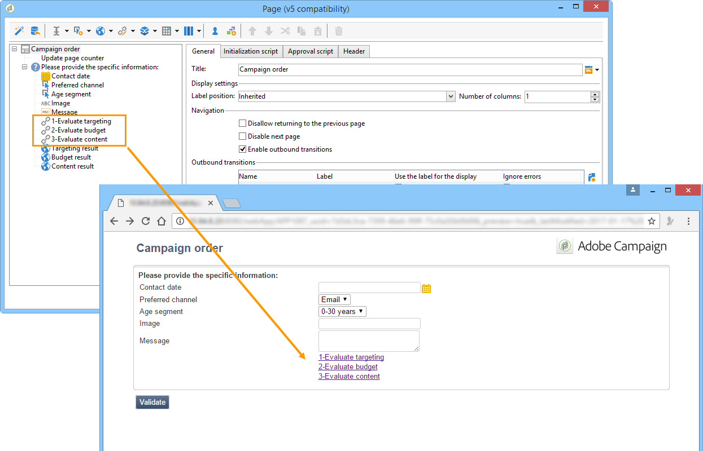
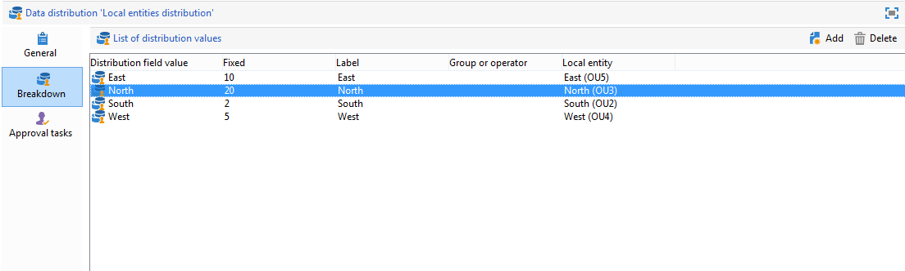
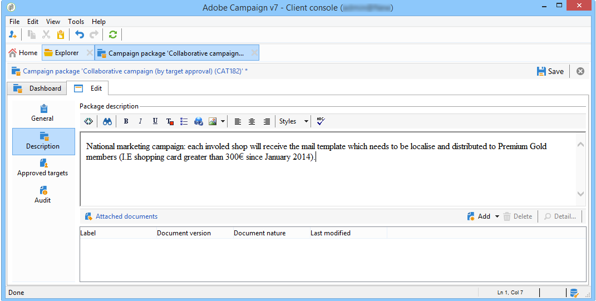
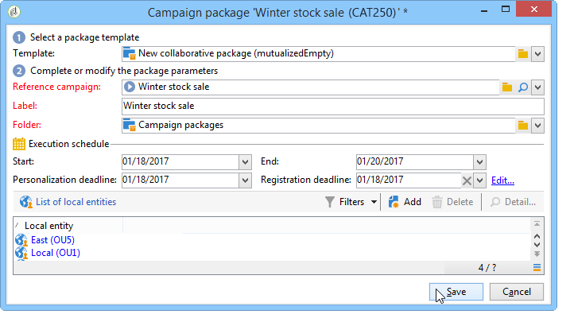
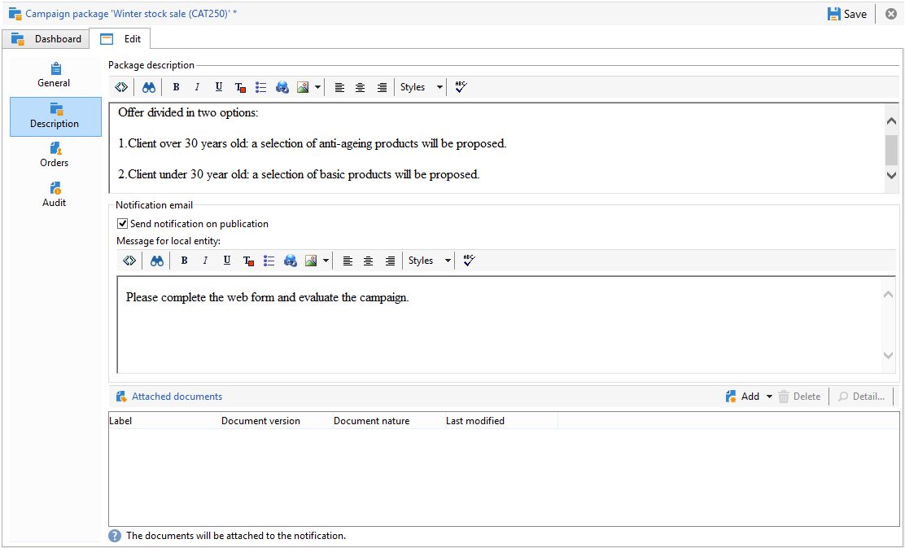

# 分散式行銷範例{#distributed-marketing-samples}


## 建立本機行銷活動（依表單） {#creating-a-local-campaign--by-form-}

此 **依表單** 型別web介面涉及使用 **網頁應用程式**. 根據設定，此Web應用程式可包含任何型別的已定義個人化元素。 例如，您可以建議連結以評估目標、預算、內容等。 透過專用API。

>[!NOTE]
>
>此範例中使用的網頁應用程式，並非隨Adobe Campaign提供的現成網頁應用程式。 若要在行銷活動中使用表單，您必須建立專用的Web應用程式。

建立行銷活動範本時，按一下 **[!UICONTROL Zoom]** 圖示( **[!UICONTROL Web interface]** 的選項 **[!UICONTROL Advanced campaign parameters...]** 存取網頁應用程式詳細資料的連結。


>[!NOTE]
>
>Web應用程式引數只能在行銷活動範本中使用。

在 **[!UICONTROL Edit]** 索引標籤中，選取 **行銷活動訂單** 活動，並開啟它以存取其內容。


在此範例中， **行銷活動訂單** 活動包括：

* 要由本地實體在訂單期間輸入的欄位，

  

* 可讓本地實體評估行銷活動的連結（例如目標、預算、內容等），

  

* 可讓您計算並顯示這些評估結果的指令碼。

  

在此範例中，使用下列API：

* 對於目標評估，

  ```
  var res = nms.localOrder.EvaluateTarget(ctx.localOrder);
  ```

* 對於預算評估，

  ```
  var res = nms.localOrder.EvaluateDeliveryBudget(ctx.@deliveryId, NL.XTK.parseNumber(ctx.@compt));
  ```

* 對於內容評估，

  ```
  var res = nms.localOrder.EvaluateContent(ctx.localOrder, ctx.@deliveryId, "html", resSeed.@id);
  ```

## 建立合作行銷活動（依目標核准） {#creating-a-collaborative-campaign--by-target-approval-}

### 簡介 {#introduction}

您是一家大型服裝品牌的行銷經理，該品牌在美國各地擁有一家線上商店和幾家精品店。 春天到了，您決定建立特別優惠方案，將給予最佳客戶目錄中所有裙子50%的優惠。

此優惠方案主要針對您美國店舖的最佳客戶，也就是說自今年初以來已花費超過$300的客戶。

因此，您決定使用分散式行銷來建立合作行銷活動（依目標核准），這可讓您選取商店的最佳客戶（依區域分組），這些客戶將收到包含特殊優惠方案的電子郵件傳遞。

此範例的第一部分說明接收行銷活動建立通知的本地實體，以及如何使用它來評估行銷活動並進行訂購。

此範例的第二部分說明如何建立您的行銷活動。

步驟如下：

**針對本機實體**

1. 使用行銷活動建立通知來存取中央實體選取的聯絡人清單。
1. 選取聯絡人並核准參與率。

**對於中央實體：**

1. 建立 **[!UICONTROL Data distribution]** 活動。
1. 建立合作行銷活動。
1. 發佈行銷活動。

### 本機實體側 {#local-entity-side}

1. 已選擇參與行銷活動的本機實體將會收到電子郵件通知。

   

1. 按一下 **[!UICONTROL Access your contact list and approve targeting]** 連結，則本機實體可（透過網頁瀏覽器）存取為促銷活動選取的使用者端清單。

   

1. 本機實體會從清單中取消檢查某些連絡人，因為自年初以來，已就類似的選件與他們聯絡。

   

檢查通過後，行銷活動就會自動開始。

### 中央實體側 {#central-entity-side}

#### 建立資料發佈活動 {#creating-a-data-distribution-activity}

1. 若要設定合作行銷活動（依目標核准），您必須先建立 **[!UICONTROL Data distribution activity]**. 按一下 **[!UICONTROL New]** 圖示於 **[!UICONTROL Resources > Campaign management > Data distribution]** Campaign檔案總管的資料夾。

   

1. 在 **[!UICONTROL General]** 標籤，您必須指定：

   * 此 **[!UICONTROL Targeting dimension]**. 此處 **資料分佈** 執行於 **收件者**.
   * 此 **[!UICONTROL Distribution type]**. 您可以選擇 **固定大小** 或 **百分比形式的大小**.
   * 此 **[!UICONTROL Assignment type]**. 選取 **本地實體** 選項。
   * 此 **[!UICONTROL Distribution type]**. 在此，它是 **[!UICONTROL Origin (@origin)]** 「收件者」表格中顯示的欄位，可讓您識別連絡人與本機實體之間的關係。
   * 此 **[!UICONTROL Approval storage]** 欄位。 選取 **在本地核准收件者** 選項。

1. 在 **[!UICONTROL Breakdown]** 標籤，指定：

   * 此 **[!UICONTROL Distribution field value]**，對應於即將推出的行銷活動中涉及的本機實體。
   * 本地實體 **[!UICONTROL label]**.
   * 此 **[!UICONTROL Size]** （固定或百分比）。 此 **0預設值** 涉及選取連結至本機實體的所有收件者。

   

1. 儲存您的新資料分佈。

#### 建立協作行銷活動 {#creating-a-collaborative-campaign}

1. 從 **[!UICONTROL Campaign management > Campaign]** Campaign檔案總管的資料夾，建立新的 **[!UICONTROL collaborative campaign (by target approval)]**.
1. 在 **[!UICONTROL Targeting and workflows]** 標籤，為您的行銷活動建立工作流程。 這必須包含 **Split** 活動所在的 **[!UICONTROL Record count limitation]** 由以下定義 **[!UICONTROL Data distribution]** 活動。

   

1. 新增 **[!UICONTROL Local approval]** 動作，您可在此指定：

   * 將在通知中傳送給本機實體的訊息內容，
   * 核准提醒，
   * 行銷活動的預期處理。

   

1. 儲存您的記錄。

#### 發佈行銷活動 {#publishing-the-campaign}

您現在可以新增 **行銷活動套件** 從 **[!UICONTROL Campaigns]** 標籤。

1. 選擇您的 **[!UICONTROL Reference campaign]**. 在 **[!UICONTROL Edit]** 標籤中，您可以選取 **[!UICONTROL Approval mode]** 用於您的行銷活動：

   * 在 **手動** 模式，如果本機實體接受來自中央實體的邀請，則會參與促銷活動。 如果他們想要且需要經理的核准以確認其參與促銷活動，則可以刪除預先選取的聯絡人。
   * 在 **自動** 模式，則本機實體必須參與行銷活動，除非他們從行銷活動取消註冊。 他們不需要核准就可以刪除連絡人。

   

1. 在 **[!UICONTROL Description]** 索引標籤上，您可以新增行銷活動的說明，以及任何要傳送至本機實體的檔案。

   

1. 核准您的行銷活動套件，然後啟動您的工作流程以發佈套件，並讓它可用於套件清單中的所有本機實體。

   

## 建立合作行銷活動（依表單） {#creating-a-collaborative-campaign--by-form-}

### 簡介 {#introduction-1}

您是一家大型化妝品牌的行銷經理，該品牌在美國各地擁有一家線上商店和幾家精品店。 為了卸除冬季庫存，並為新庫存騰出空間，您決定建立特別優惠方案，以兩種客戶類別為目標：30歲以上的客戶，您將向其提供年齡敏感的護膚產品；以及30歲以下的客戶，您將向其提供更基本的護膚產品。

因此，您決定使用分散式行銷來建立合作行銷活動（依表單），可讓您依年齡範圍從不同的商店選取客戶。 這些客戶將收到電子郵件傳遞，內含已根據其年齡範圍進行個人化的特殊優惠。

此範例的第一部分說明接收行銷活動建立通知的本地實體，以及如何使用它來評估行銷活動並進行訂購。

此範例的第二部分說明如何建立您的行銷活動。

步驟如下：

**針對本機實體**

1. 使用行銷活動建立通知來存取線上表單。
1. 個人化行銷活動（目標、內容、傳遞量）。
1. 檢查這些欄位，並視需要加以變更。
1. 核准您的參與。
1. 本機實體（或中央實體）的管理員會核准您的設定和參與。

**對於中央實體：**

1. 建立合作行銷活動。
1. 設定 **[!UICONTROL Advanced campaign parameters...]** 如同您在本機行銷活動中所使用的方式。
1. 設定行銷活動工作流程和傳送，就像您設定本機行銷活動一樣。
1. 更新網路表單。
1. 建立行銷活動套件並發佈。

### 本機實體側 {#local-entity-side-1}

1. 選取要參與行銷活動的本地實體會收到電子郵件通知，通知他們已參與行銷活動。

   

1. 本機實體完成個人化表單，然後他們：

   * 評估目標和預算，
   * 預覽傳遞內容，
   * 核准其參與率。

     

1. 負責驗證訂單的操作員核准其參與。

   

### 中央實體側 {#central-entity-side-1}

1. 若要實施合作行銷活動（依表單），您必須使用下列專案建立行銷活動： **合作行銷活動（依表單）** 範本。

   

1. 在行銷活動的 **[!UICONTROL Edit]** 索引標籤，按一下 **[!UICONTROL Advanced campaign parameters...]** 將其設定為本機行銷活動的連結。 請參閱 [建立本機行銷活動（依表單）](#creating-a-local-campaign--by-form-).

   

1. 設定行銷活動工作流程與網頁表單。 請參閱 [建立本機行銷活動（依表單）](#creating-a-local-campaign--by-form-).
1. 指定執行排程和相關本機實體，以建立您的Campaign套件。

   

1. 選擇中的核准模式，完成套件設定 **[!UICONTROL Edit]** 標籤。

   

1. 從 **[!UICONTROL Description]** 索引標籤中，您可以輸入campaign套件說明、發佈套件時傳送給本機實體的通知訊息，並將任何資訊性檔案附加至campaign套件。

   

1. 核准套件以發佈。

   
