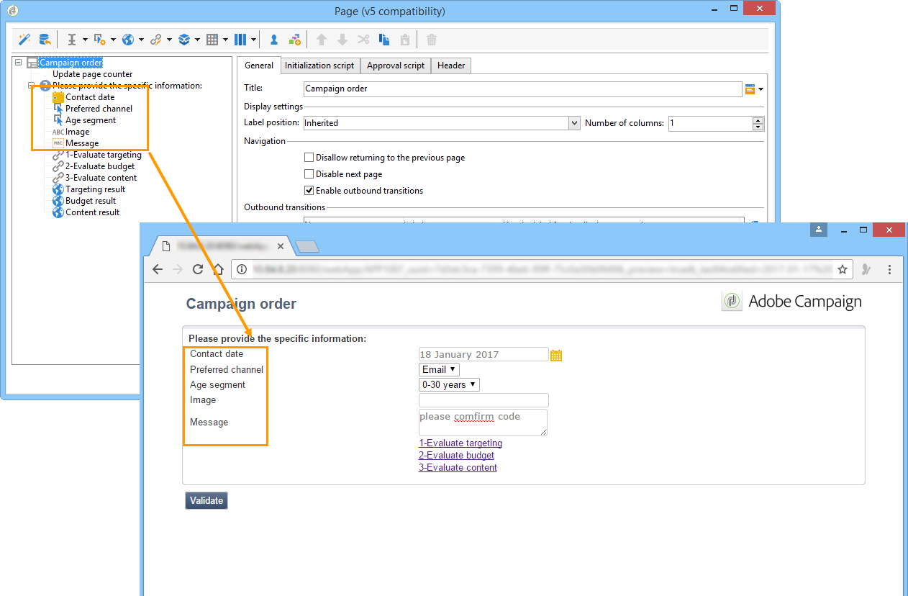
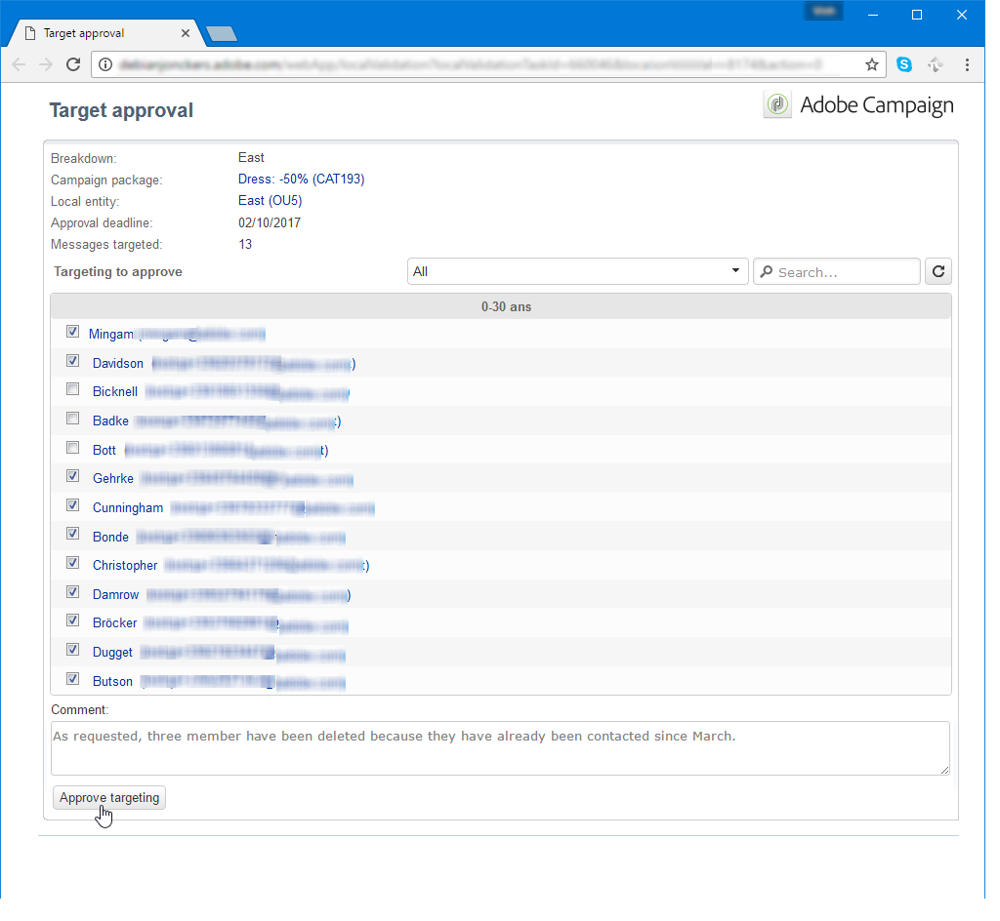
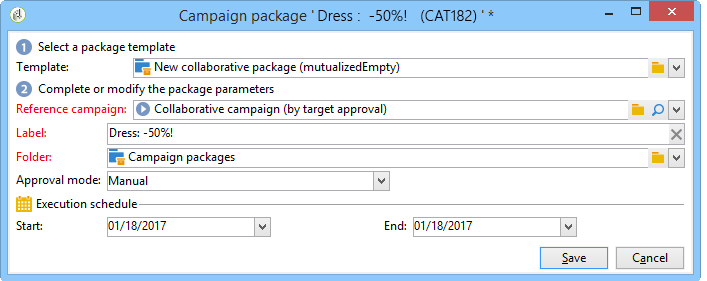

# 分佈式營銷示例{#distributed-marketing-samples}


## 建立本地市場活動（按窗體） {#creating-a-local-campaign--by-form-}

的 **按窗體** 類型web介面涉及使用 **Web應用**。 根據配置，此Web應用程式可以包含任何類型的已定義個性化元素。 例如，您可以建議連結來評估目標、預算、內容等。 通過專用API。

>[!NOTE]
>
>此示例中使用的Web應用程式不是隨Adobe Campaign隨附而來的Web應用程式。 要在市場活動中使用表單，必須建立專用Web應用程式。

建立市場活動模板時，按一下 **[!UICONTROL Zoom]** 表徵圖 **[!UICONTROL Web interface]** 選項 **[!UICONTROL Advanced campaign parameters...]** 連結以訪問Web應用程式的詳細資訊。


>[!NOTE]
>
>Web應用程式參數僅在市場活動模板中可用。

在 **[!UICONTROL Edit]** 頁籤 **市場活動訂單** 並開啟它以訪問其內容。


在此示例中， **市場活動訂單** 活動包括：

* 要由本地實體在訂單期間輸入的欄位，

   

* 允許本地實體評估市場活動的連結（如目標、預算、內容等）,

   

* 用於計算和顯示這些評估結果的指令碼。

   

在本示例中，使用了以下API:

* 對於目標評估，

   ```
   var res = nms.localOrder.EvaluateTarget(ctx.localOrder);
   ```

* 對於預算評價，

   ```
   var res = nms.localOrder.EvaluateDeliveryBudget(ctx.@deliveryId, NL.XTK.parseNumber(ctx.@compt));
   ```

* 對於內容評估，

   ```
   var res = nms.localOrder.EvaluateContent(ctx.localOrder, ctx.@deliveryId, "html", resSeed.@id);
   ```

## 建立協作市場活動（按目標審批） {#creating-a-collaborative-campaign--by-target-approval-}

### 簡介 {#introduction}

你是一家大型服裝品牌的營銷經理，該品牌在美國各地設有一家線上商店和幾家精品店。 現在春天到來了，你決定特別出價，讓你最好的客戶把你的服裝目錄里所有服裝的50%都拿去。

此優惠針對的是您美國商店中最好的客戶，即自年初以來已花費超過300美元的客戶。

因此，您決定使用「分佈式市場營銷」建立協作市場活動（按目標審批），以允許您選擇您商店的最佳客戶（按區域分組），這些客戶將接收包含特別優惠的電子郵件遞送。

本實例的第一部分說明了接收市場活動建立通知的本地實體，以及它們如何使用它來評估市場活動並訂購市場活動。

本示例的第二部分說明了如何建立市場活動。

步驟如下：

**對於本地實體**

1. 使用市場活動建立通知可以訪問由中心實體選擇的聯繫人清單。
1. 選擇聯繫人並批准參與。

**對於中央實體：**

1. 建立 **[!UICONTROL Data distribution]** 的子菜單。
1. 建立協作市場活動。
1. 發佈市場活動。

### 本地實體側 {#local-entity-side}

1. 已選擇參與市場活動的本地實體將收到電子郵件通知。

   

1. 按一下 **[!UICONTROL Access your contact list and approve targeting]** 連結時，本地實體（通過web瀏覽器）被授予對為市場活動選擇的客戶端清單的訪問權限。

   

1. 本地實體取消檢查清單中的某些聯繫人，因為自年初以來，已聯繫他們尋求類似的報價。

   

一旦支票獲得批准，市場活動就可以自動啟動。

### 中央實體側 {#central-entity-side}

#### 建立資料分發活動 {#creating-a-data-distribution-activity}

1. 要設定協作市場活動（按目標審批），必須首先建立 **[!UICONTROL Data distribution activity]**。 按一下 **[!UICONTROL New]** 的 **[!UICONTROL Resources > Campaign management > Data distribution]** 市場活動瀏覽器的資料夾。

   

1. 在 **[!UICONTROL General]** 頁籤，必須指定：

   * 這樣 **[!UICONTROL Targeting dimension]**。 這裡 **資料分佈** 執行 **收件人**。
   * 這樣 **[!UICONTROL Distribution type]**。 您可以選擇 **固定大小** 或 **按百分比大小**。
   * 這樣 **[!UICONTROL Assignment type]**。 選擇 **本地實體** 的雙曲餘切值。
   * 這樣 **[!UICONTROL Distribution type]**。 這裡，是 **[!UICONTROL Origin (@origin)]** 「收件人」表中的欄位，用於標識聯繫人與本地實體之間的關係。
   * 的 **[!UICONTROL Approval storage]** 的子菜單。 選擇 **收件人的本地批准** 的雙曲餘切值。

1. 在 **[!UICONTROL Breakdown]** 頁籤，指定：

   * 這樣 **[!UICONTROL Distribution field value]**&#x200B;這與參與即將開展的活動的當地實體相對應。
   * 本地實體 **[!UICONTROL label]**。
   * 這樣 **[!UICONTROL Size]** （固定或百分比）。 的 **0預設值** 包括選擇連結到本地實體的所有收件人。

   

1. 保存新資料分發。

#### 建立協作行銷活動 {#creating-a-collaborative-campaign}

1. 從 **[!UICONTROL Campaign management > Campaign]** 市場活動瀏覽器的資料夾，建立新 **[!UICONTROL collaborative campaign (by target approval)]**。
1. 在 **[!UICONTROL Targeting and workflows]** 頁籤。 這必須包含 **拆分** 其中 **[!UICONTROL Record count limitation]** 由 **[!UICONTROL Data distribution]** 的子菜單。

   

1. 添加 **[!UICONTROL Local approval]** 可以指定的操作：

   * 將發送到通知中的本地實體的消息內容，
   * 批准通知，
   * 市場活動的預期處理。

   

1. 保存記錄。

#### 發佈市場活動 {#publishing-the-campaign}

現在可以添加 **活動包** 從 **[!UICONTROL Campaigns]** 頁籤。

1. 選擇 **[!UICONTROL Reference campaign]**。 在 **[!UICONTROL Edit]** 的子菜單。 **[!UICONTROL Approval mode]** 要用於您的市場活動：

   * 在 **手動** 模式，如果本地實體接受中央實體的邀請，則它們將參與市場活動。 如果他們想要，他們可以刪除預選的聯繫人，並且需要經理批准以確認他們參與市場活動。
   * 在 **自動** 模式下，本地實體必須參與市場活動，除非它們從市場活動中註銷自己。 他們可以刪除聯繫人，而無需批准。

   

1. 在 **[!UICONTROL Description]** 頁籤，您可以添加市場活動的說明以及要發送到本地實體的任何文檔。

   

1. 批准您的市場活動包，然後啟動工作流以發佈該包，並使其可用於包清單中的所有本地實體。

   

## 建立協作市場活動（按表單） {#creating-a-collaborative-campaign--by-form-}

### 簡介 {#introduction-1}

你是一家大型化妝品品牌的營銷經理，該品牌在美國各地設有一家線上商店和幾家精品店。 要卸載冬季庫存並為新庫存騰出空間，您決定建立一項特別優惠，以針對兩個客戶類別：30歲以上的人，你將向他們提供年齡敏感的護膚產品，以及30歲以下的人，你將向他們提供更基本的護膚產品。

因此，您決定使用「分佈式市場營銷」建立協作市場活動（按表單），該活動允許您按年齡範圍從不同的商店中選擇客戶。 這些客戶將收到一封電子郵件，其特別優惠將根據其年齡範圍進行個性化。

本實例的第一部分說明了接收市場活動建立通知的本地實體，以及它們如何使用它來評估市場活動並訂購市場活動。

本示例的第二部分說明了如何建立市場活動。

步驟如下：

**對於本地實體**

1. 使用市場活動建立通知訪問聯機表單。
1. 個性化市場活動（目標、內容、交付量）。
1. 檢查這些欄位並在必要時更改它們。
1. 批准您的參與。
1. 本地實體（或中央實體）的經理批准您的配置和參與。

**對於中央實體：**

1. 建立協作市場活動。
1. 配置 **[!UICONTROL Advanced campaign parameters...]** 就像你參加當地競選一樣。
1. 按本地市場活動的方式配置市場活動工作流和交付。
1. 更新Web表單。
1. 建立市場活動包並發佈它。

### 本地實體側 {#local-entity-side-1}

1. 被選擇參加該活動的本地實體收到電子郵件通知，通知它們參與該活動。

   

1. 本地實體完成個性化表單，然後：

   * 評估目標和預算，
   * 預覽交付內容，
   * 批准他們的參與。

      

1. 負責驗證訂單的運營商批准其參與。

   

### 中央實體側 {#central-entity-side-1}

1. 要實施協作市場活動（按表單），您必須使用 **協作市場活動（按表單）** 的下界。

   

1. 在競選中 **[!UICONTROL Edit]** 頁籤 **[!UICONTROL Advanced campaign parameters...]** 連結將其配置為本地市場活動。 請參閱 [建立本地市場活動（按窗體）](#creating-a-local-campaign--by-form-)。

   

1. 配置市場活動工作流和Web表單。 請參閱 [建立本地市場活動（按窗體）](#creating-a-local-campaign--by-form-)。
1. 通過指定執行計畫和涉及的本地實體來建立市場活動包。

   

1. 通過在中選擇批准模式來完成包配置 **[!UICONTROL Edit]** 頁籤。

   

1. 從 **[!UICONTROL Description]** 頁籤，您可以輸入市場活動包說明、在發佈該包時要發送到本地實體的通知消息，以及將任何資訊文檔附加到市場活動包。

   

1. 批准包以發佈它。

   
