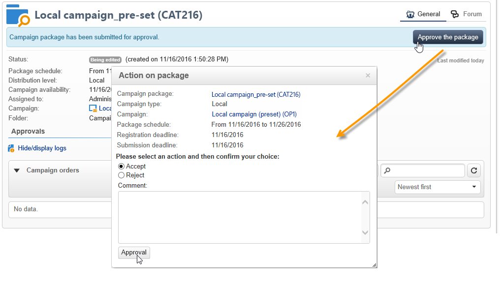

# 發佈行銷活動套件{#publishing-the-campaign-package}

中央實體運運算元會發佈他們想要提供給中本地實體的行銷活動 **[!UICONTROL list of campaign packages]**.

在行銷活動套件清單中發佈行銷活動套件之前，必須先由中央實體核准行銷活動套件。 要執行此操作，您可以透過 **[!UICONTROL Approval parameters]** 行銷活動套件中的連結。

## 指派稽核者 {#assigning-a-reviewer}

若要選取稽核者，請按一下 **[!UICONTROL Approval parameters]** 從campaign套件連結並從下拉式清單中選擇相關的稽核者。

接著，您可以按一下「 」，開始核准程式 **[!UICONTROL Submit for approval]**.

然後會傳送通知訊息給檢閱者，以確認此行銷活動套件的可用性。 該訊息包含透過網頁存取接受或拒絕核准的連結。

>[!NOTE]
>
>在組織實體層級，您也可以指定稽核者來核准訂單。 有關詳細資訊，請參閱 [組織實體](about-distributed-marketing.md#organizational-entities).

## 新增其他稽核者 {#adding-other-reviewers}

您可以從以下位置新增其他稽核者： **[!UICONTROL Edit...]** 連結，可在行銷活動套件中找到 **[!UICONTROL Approval parameters...]** 標籤。

## 核准期間 {#approval-periods}

依預設，稽核者可在提交日期起的三天內處理核准。

在編輯稽核者視窗中，您也可以設定提醒，以在行銷活動套件未核準時傳送一或多則訊息。 若要這麼做，請按一下 **[!UICONTROL Add reminder]** 連結，然後 **[!UICONTROL Add]** 按鈕。

可以在指定日期傳送提醒和/或 **x** 提交日期後幾天。 可以在提醒表的第一欄中設定提醒型別。 在以下範例中，稽核者將在2014年1月29日的收到提醒訊息，即在 **[!UICONTROL Date]** 欄，以及核准期結束前一天（即提交核准日期後兩天）的第二個提醒。

定義好封裝且提交封裝以供核准後，執行排程會顯示在 **[!UICONTROL Audit]** 標籤。 它會顯示根據先前設定計算出的處理截止日期，以及所有已設定提醒的日期。

## 透過Adobe Campaign主控台核准 {#approving-via-the-adobe-campaign-console}

如果未指定稽核者或如果通知的操作者均未核准該套件，則 **[!UICONTROL Approve the package]** 按鈕可讓您直接從行銷活動套件進行核准 **[!UICONTROL Dashboard]** 或來自套件概觀。

核准後，行銷活動會發佈、新增到清單中，並在達到可用日期後立即供本地實體使用。 如果在建立行銷活動時指定了本機實體，則會傳送訊息給通知群組中的操作員，讓他們知道行銷活動可用。 如果事先未指定實體，則預設情況下，所有本機實體都可使用促銷活動。 有關詳細資訊，請參閱 [組織實體](about-distributed-marketing.md#organizational-entities).
