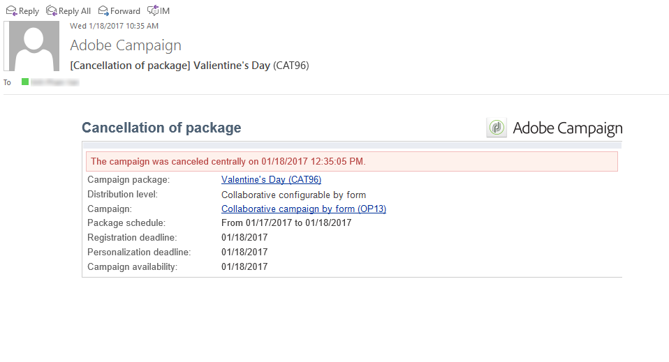

# 追蹤行銷活動{#tracking-a-campaign}

中央實體操作員可以跟蹤市場活動包清單中的市場活動訂單。

這樣，他們就可以：

* [篩選器包](#filter-packages)。
* [編輯包](#edit-packages)。
* [取消包](#cancel-a-package)。
* [重新初始化包](#reinitializing-a-package)。

## 篩選器包 {#filter-packages}

從 **[!UICONTROL Campaigns]** 頁籤，可以顯示 **[!UICONTROL Campaign packages]** 重組所有現有的分佈式市場營銷活動。 您可以篩選此清單，以便它僅顯示已發佈、延遲、待定審批等的市場活動。 為此，請按一下此視圖上半部分的連結，或使用 **[!UICONTROL Filter list]** 連結並選擇要顯示的市場活動包狀態。

## 編輯包 {#edit-packages}

的 **[!UICONTROL Campaign packages]** 的子菜單。

此摘要顯示以下資訊：標籤、市場活動類型，以及從中建立市場活動的名稱和資料夾。

按一下包名稱以編輯它。 您還可以按其本地實體及其狀態查看訂單。

此資訊也在 **[!UICONTROL Campaign orders]** 查看其中列出所有訂單。

中心運算子可以編輯訂單。 有兩種方法：

1. 操作員可以按一下訂單名稱來編輯它：這將顯示訂單詳細資訊。

   

   的 **[!UICONTROL Edit > General]** 頁籤用於查看本地實體在訂購市場活動時輸入的資訊。

   

1. 操作員可以按一下市場活動包標籤來編輯它並更改某些設定。

   

## 取消包 {#cancel-a-package}

中央實體可以隨時取消促銷包。

按一下 **[!UICONTROL Cancel]** 在活動包中 **[!UICONTROL Dashboard]**。

的 **[!UICONTROL Comment]** 欄位中的「取消」。

對於 **地方宣傳**，取消包會將其從可用市場營銷市場活動清單中刪除。

對於 **協作活動**，取消程式包會觸發大量操作：

1. 與此包相關的任何訂單均被取消，

   

1. 參考市場活動被取消，所有活動流程（工作流、交貨）都停止，

   

1. 通知將發送給所有有關的本地實體。

   

如果需要，中央實體仍可訪問和重新初始化已取消的包（見下文）。 只有當地實體獲得批准並啟動後，才會再次向它們提供這些服務。 以下顯示了包重新初始化過程。

## 重新初始化包 {#reinitializing-a-package}

已經發佈的市場活動包可以重新初始化、修改並可供本地實體使用。

1. 選擇相關包。
1. 按一下 **[!UICONTROL Reinitialize the package to reuse it]** 按一下 **[!UICONTROL OK]**。

   

1. 按一下 **[!UICONTROL Save]** 按鈕以批准包重新初始化。

   

1. 包狀態更改為 **[!UICONTROL Being edited]**。 再次修改、批准和發佈它以將其還原到市場活動包清單。

>[!NOTE]
>
>您還可以重新初始化已取消的市場活動包。
