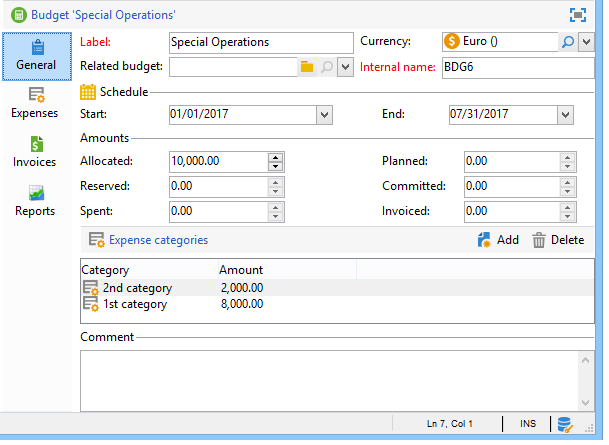
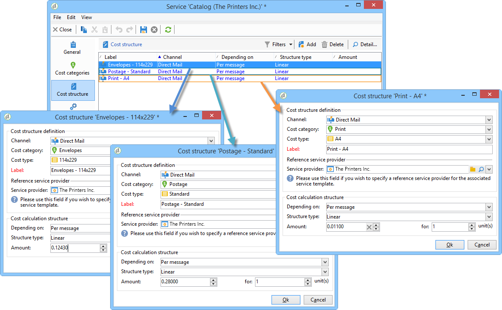

# 控制成本{#controlling-costs}

Adobe Campaign允許您控制已計畫、已提交和已開票的市場營銷成本，並使用「市場營銷資源管理」模組按類別細分這些成本。

市場活動各個流程的已承諾成本將從市場推廣部門預先定義的預算中扣除。 這些金額可分為幾類，以使資訊更可讀，並提供更詳細的營銷投資報告。

預算的管理和跟蹤集中在Adobe Campaign樹的一個專用節點中。 這樣，您就可以監視從同一視圖和所有預算分配、保留、提交和支出的金額。

必須使用以下步驟來使用MRM實施預算管理：

1. 定義預算。 [了解更多](#creating-a-budget)。

1. 定義成本計算方法：為服務提供商定義成本結構。 [了解更多](../campaigns/providers--stocks-and-budgets.md)。

1. 定義市場活動成本（交貨/任務）:交貨和任務產生的成本將單獨或全局輸入市場活動模板。 [了解更多](../campaigns/marketing-campaign-deliveries.md#compute-costs-and-stocks)。

1. 合併：根據任務進度、交貨和促銷活動等情況，計算成本並轉入相應預算。 當市場活動的建立足夠提前時，市場活動預算的進展狀態可更改為 **[!UICONTROL Specified]**。 然後，系統會自動輸入程式的計算成本，並使用市場活動上計算的成本。 [了解更多](#cost-commitment--calculation-and-charging)。

## 建立預算 {#creating-a-budget}

要建立預算，請執行以下步驟：

1. 瀏覽到 **[!UICONTROL Campaign management > Budgets]** 市場活動瀏覽器的資料夾。
1. 按一下 **[!UICONTROL New]** 表徵圖，命名並保存預算。
1. 輸入初始金額：指示相關欄位中的已分配金額。 其它金額將自動輸入。 [了解更多](#calculating-amounts)。
1. 通過輸入起始日期和終止日期來定義有效期。 此資訊僅指示性。
1. 為市場活動、任務等建立分配給此預算的成本的支出類別。 可以連結。 [了解更多](#expense-categories)。

>[!NOTE]
>
>您可以選擇相關預算。 如需詳細資訊，請參閱[本章節](#linking-a-budget-to-another)。

### 計算金額 {#calculating-amounts}

每個預算都由初始金額定義，該金額將從計畫或執行各種市場活動、交貨或與它們相關的任務的成本中減少。 金額的狀態（計畫、保留、承諾、支出或開票）取決於成本類型和市場活動、交貨或任務中定義的承付款級別。

>[!NOTE]
>
>為類別輸入的金額必須與在 **[!UICONTROL Allocated]** 的子菜單。

對於活動，根據承諾的級別，可以計畫、承諾或預留成本以備將來採取行動。

>[!CAUTION]
>
>建立市場活動時，進度狀態為 **[!UICONTROL Budget]** 必須設定為 **[!UICONTROL Defined]** 在執行時需要考慮的費用。 如果狀態為 **[!UICONTROL Being edited]**&#x200B;不合併。
>   
>選項 **[!UICONTROL Commitment level]** 表示在將費用計入預算之前對未來的預測。 根據市場活動、任務或交貨的進展，您可以決定分配更高或更低的承付款水準(1)。 計畫，2 保留，3。 已提交)。

例如，網路促銷活動的估計計畫費用為45 000歐元。

對於市場活動，當預算建立狀態設定為 **[!UICONTROL Defined]**，市場活動的實際成本（如果沒有，則計算成本）將結轉到預算合計中。

根據活動預算的承付金額，將在 **[!UICONTROL Planned]**。 **[!UICONTROL Reserved]** 或 **[!UICONTROL Committed]** 的子菜單。

可以修改承諾級別：

* 的 **活動** 級別，在 **[!UICONTROL Budget]** ，在 **[!UICONTROL Edit]** 頁籤。 這是配置預算、成本和費用的地方。
* 的 **任務** 級別，在 **[!UICONTROL Expenses and revenues]** 的子菜單。

當預算為 **[!UICONTROL Reserved]**，將自動為已計費預算執行更新。

該過程在任務級別相同。

當支出產生髮票並支付發票時，其金額隨後輸入 **[!UICONTROL Invoiced]** 的子菜單。

### 費用類別 {#expense-categories}

這些金額可以分為若干費用類別，以便更好地讀取資料，並更詳細地報告營銷投資。 在建立預算期間，通過 **[!UICONTROL Budgets]** 的子目標。

要添加類別，請按一下 **[!UICONTROL Add]** 按鈕。

您可以從現有類別中選擇一個類別，或直接在欄位中輸入新類別來定義新類別。 當您確認輸入時，會顯示一條確認消息，讓您將此類別添加到現有類別清單中，並在必要時將其與「自然」關聯。 此資訊將用於預算報告。

### 將預算連結到其他預算 {#linking-a-budget-to-another}

您可以將預算與主預算相連結。 為此，請在 **[!UICONTROL related budget]** 欄位。

將在主預算中添加一個附加標籤，以顯示相關預算的清單。

這一資訊被轉交給預算報告。

## 添加支出行 {#adding-expense-lines}

支出行將自動添加到預算。 它們是在交貨分析期間和任務完成時建立的。

對於每個市場活動、交貨或任務，生成的成本將分組在預算的支出行中，這些支出行將計入其中。 這些費用行根據相關服務提供商的成本行建立並通過相關的成本結構計算。

因此，每個支出行包含以下資訊：

* 市場活動及其相關的交付或任務
* 根據成本架構或估計臨時成本計算
* 交付或相關任務的實際成本
* 相應的發票行（僅限MRM）
* 按成本類別計算的成本清單（如果存在成本結構）

在上例中，編輯的支出行包含為 **新卡** 交貨 **忠誠春裝** 競選。 編輯交貨時， **[!UICONTROL Direct Mail]** 頁籤，用於查看如何計算支出行。

此交付的成本計算基於為相關服務提供商選擇的成本類別：

根據所選擇的成本類別，應用相應的成本結構以計算成本行。 在本示例中，對於相關服務提供商，成本結構如下：

>[!NOTE]
>
>成本類別及結構呈列於 [此頁](../campaigns/providers--stocks-and-budgets.md#create-a-service-provider-and-its-cost-categories)

## 成本承擔、計算及收費 {#cost-commitment--calculation-and-charging}

可以為交貨和任務提交成本。 根據與其相關的過程的進度，更新成本的狀態。

### 成本計算流程 {#cost-calculation-process}

成本分為三類：

1. 預估佈建成本

   估計臨時費用是對活動過程費用的估計。 只要正在編輯，輸入的金額就不會合併。 它肯定 **[!UICONTROL Specified]** 要在計算中考慮的金額的狀態。

   此金額是手動輸入的，可以細分為幾個支出類別。 要降低成本，請按一下 **[!UICONTROL Breakdown...]** 連結，然後 **[!UICONTROL Add]** 按鈕。

   

   您可以將每個成本與一個類別關聯，以便以後可以在相關預算和預算報表中查看按費用類別列出的成本細分。

1. 計算成本

   計算的成本取決於相關要素（市場活動、交付、任務等） 及其狀態（正在編輯、正在進行、已完成）。 無論如何，如果指定了實際成本，則計算成本將使用此金額。

   如果未提供實際成本，則適用以下規則：

   * 對於正在編輯的市場活動，計算的成本是市場活動的估計臨時成本，如果未定義此成本，則計算的成本將是市場活動交付和任務的所有臨時成本的總和。 如果市場活動完成，市場活動的計算成本將是所有計算成本的總和。
   * 對於尚未分析的交付，計算成本為估計臨時成本。 如果已執行分析，則計算的成本將是從服務提供成本結構計算的所有成本和目標接收人數的總和。
   * 對於正在執行的任務，計算的成本使用估計的臨時成本。 如果任務完成，則計算的成本將是從服務提供商成本結構計算的所有成本和完成天數的總和。
   * 對於市場營銷計畫，與方案一樣，計算的成本是為市場活動計算的成本的總和。 如果沒有具體說明這些費用，計算的費用將使用估計的臨時費用。

   >[!NOTE]
   >
   >的 **[!UICONTROL Breakdown]** 連結允許您查看計算的詳細資訊和上次成本計算日期。

1. 實際成本

   實際成本是手動輸入的，如有必要，將細分為不同的費用類別。

### 計算和計費 {#calculation-and-charging}

成本通過成本結構計算，並計入在有關市場活動、交貨或任務中選定的預算。

可以通過預算審批對提交至市場活動的金額執行檢查。 可以在市場活動中建立其他檢查點樣式的任務，以設定其他批准。 請參閱 [任務類型](creating-and-managing-tasks.md#types-of-task)。

### 範例 {#example}

我們將建立一個市場活動，它包括：

* 使用服務提供商的成本結構的直郵遞送
* 具有固定成本的任務
* 每日成本的任務

#### 步驟1 — 建立預算 {#step-1---creating-the-budget}

1. 通過 **[!UICONTROL Campaign management > Budgets]** 的下界。

1. 定義10,000歐元的預算(以 **[!UICONTROL Allocated]** 的 **[!UICONTROL Amounts]** 的子菜單。 在窗口的下部添加兩個支出類別：

#### 步驟2 — 配置服務提供商並定義成本結構 {#step-2---configuring-the-service-provider-and-defining-the-cost-structures}

1. 從中建立具有其成本結構的服務提供商和服務模板 **[!UICONTROL Administration > Campaigns]** 的下界。 如需詳細資訊，請參閱[本章節](../campaigns/providers--stocks-and-budgets.md#create-a-service-provider-and-its-cost-categories)。

   對於直郵遞送，建立成本類別 **[!UICONTROL Envelopes]** （類型114x229和162x229）, **[!UICONTROL Postage]** 和 **[!UICONTROL Print]** （類型A3和A4）。 然後建立以下成本結構：

   

1. 添加固定成本（在成本類別中），其計算是固定的，其金額為空（在相應的成本結構中），並且將為每個交貨單獨指定。

   

   對於任務，請建立以下兩個成本類別：

   * **[!UICONTROL Room reservation]** （小房間和大房間）, **固定** 300歐元和500歐元的成本結構：

   

   * **[!UICONTROL Creation]** (**內容模板** 類型) **日** 成本結構300歐元：

   

#### 步驟3 — 在市場活動中計入預算 {#step-3---charging-the-budget-in-the-campaign}

1. 建立市場活動並選擇在步驟1中建立的預算。

   >[!NOTE]
   >
   >預設情況下，為方案選擇的預算將應用於方案中的所有市場活動。

   

1. 指定估計臨時成本，細目如下：

   

1. 按一下 **[!UICONTROL Ok]** 然後 **[!UICONTROL Save]** 確認此資訊。 然後，使用估計的臨時費用更新市場活動的計算成本。

#### 步驟4 — 建立直郵遞送 {#step-4---creating-the-direct-mail-delivery}

1. 為市場活動建立工作流並定位查詢活動以選擇目標（警告，必須指定收件人的郵政地址）。

1. 建立直郵遞送並選擇在步驟2中建立的服務提供商：成本類別將自動顯示。

1. 覆蓋信封的成本並添加固定成本。 同時選擇與這些成本相關的類別。

   

   >[!NOTE]
   >
   >如果未使用其中一個成本類別，則不會生成任何費用。

1. 啟動剛建立的工作流以啟動分析並計算成本。

   

1. 如果為此市場活動啟用了預算審批，請從控制面板中審批預算。 您可以檢查成本類別的審批。

   

與交貨相關的支出行將添加到 **[!UICONTROL Edit > Budget]** 頁籤 編輯它以查看計算的詳細資訊。

為交貨計算的成本將使用以下資訊更新：

編輯計算的成本時，您可以檢查成本細分以及成本計算的狀態和日期。

#### 步驟5 — 建立任務 {#step-5---creating-tasks}

在此活動中，我們將添加成本結構所針對的兩項任務 [建立早](#step-2---configuring-the-service-provider-and-defining-the-cost-structures)。

要執行此操作，請在市場活動控制板中按一下 **[!UICONTROL Add a task]** 按鈕 命名任務並按一下 **[!UICONTROL Save]**。

1. 然後，該任務將添加到任務清單。 必須編輯它才能配置它。

1. 在 **[!UICONTROL Properties]** 頁籤，選擇服務和相應的成本類別：

   

1. 接下來，按一下 **[!UICONTROL Expenses and revenue]** 表徵圖並指定估計的臨時成本。

   

   保存任務後，將使用為估計臨時成本輸入的值指定計算成本。

   任務完成時（狀態） **[!UICONTROL Finished]** )，計算的成本將自動更新為大房間的成本，如在其成本結構中輸入的那樣。 此成本也顯示在細分的此類別中。

1. 然後，按照同一步驟建立第二個任務；計畫超過五天並與先前建立的成本結構相關。

   

   任務完成後，將使用相關成本結構中的值指定計算的成本，即，在本例中為1500歐元（5天x 300歐元）:

   

#### 步驟6 — 更新市場活動預算狀態 {#step-6---update-the-campaign-budget-status}

配置市場活動後，可以通過將其設定為 **[!UICONTROL Specified]**。 然後，市場活動的計算成本將指明交貨的計算成本和市場活動任務的總和：

#### 預算核准 {#budget-approval}

激活審批後，您可以通過特殊連結從市場活動控制面板中審批預算。 當目標工作流啟動且需要批准直郵遞送時，將顯示此連結。

然後，您可以按一下該連結以授予或拒絕批准，或者如果已為此市場活動激活通知，則使用通知電子郵件中的連結。

當預算獲得批准並交付完成時，成本將通過特殊技術工作流自動上載。

## 訂單和發票 {#orders-and-invoices}

在MRM的上下文中，您可以向服務提供商保存訂單並開具發票。 這些訂單和發票的整個生命週期可通過Adobe Campaign介面管理。

### 訂單建立 {#order-creation}

要向服務提供商保存新訂單，請按一下 **[!UICONTROL MRM > Orders]** 的子目錄，然後按一下 **[!UICONTROL New]** 按鈕

指定訂單編號、相關服務提供商和訂單總額。

### 簽發和跟蹤發票 {#issuing-and-tracking-invoices}

對於每個服務提供商，您可以保存發票並定義其狀態和計費的預算。

發票建立並儲存在 **[!UICONTROL MRM > Invoices]** Adobe Campaign樹的節點。

發票由發票行組成，發票行的總額允許自動計算金額。 這些行是從 **[!UICONTROL Invoice lines]** 頁籤。 它們可以與訂單關聯，以便將資訊上載到訂單。

每個服務提供商的發票顯示在 **[!UICONTROL Invoices]** 頁籤：

的 **[!UICONTROL Details]** 頁籤，以顯示發票的內容。

按一下 **[!UICONTROL Add]** 的子菜單。
