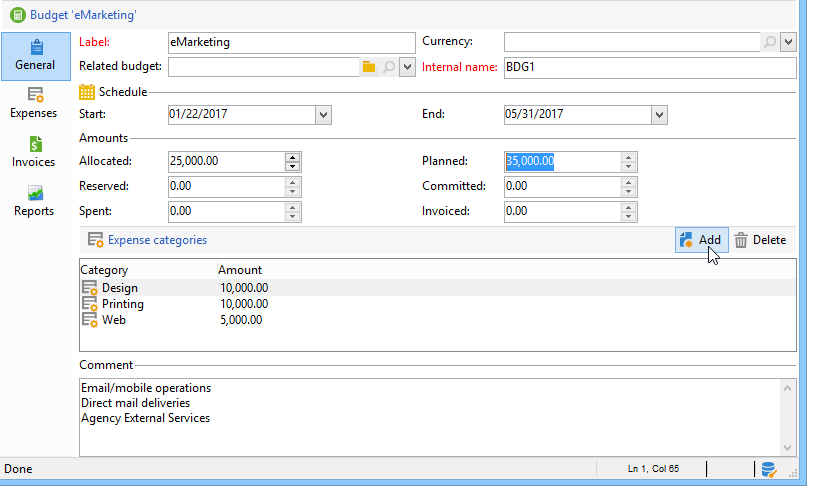

# 控制成本{#controlling-costs}

Adobe Campaign可讓您控制已排程、已確認及已開立商業發票的行銷成本，並使用行銷資源管理模組依類別細分。

針對行銷活動的各種處理所認定的成本，會記入行銷部門預先定義的預算。 金額可以細分為數個類別，讓資訊更容易閱讀，並提供行銷投資的更詳細報表。

預算的管理和追蹤都集中在Adobe Campaign樹的專用節點中。 這可讓您監控從相同檢視及所有預算中配置、保留、承諾及支出的金額。

必須套用下列步驟，才能使用MRM實作預算管理：

1. 定義預算。 [了解更多](#creating-a-budget)。

1. 定義成本計算方法：為服務提供者定義成本結構。 [了解更多](../campaigns/providers-stocks-and-budgets.md)。

1. 定義行銷活動成本（傳送/任務） ：傳送和任務產生的成本會針對行銷活動範本個別或全域輸入。 [了解更多](../campaigns/marketing-campaign-deliveries.md#compute-costs-and-stocks)。

1. 合併：根據任務、傳遞和行銷活動的進度狀態，將計算成本並傳遞至對應的預算。 當行銷活動的建立已足夠進階時，行銷活動預算的進度狀態可以變更為&#x200B;**[!UICONTROL Specified]**。 然後會自動輸入方案的已計算成本，以及促銷活動上已計算的成本。 [了解更多](#cost-commitment--calculation-and-charging)。

## 建立預算 {#creating-a-budget}

若要建立預算，請遵循下列步驟：

1. 瀏覽至Campaign檔案總管的&#x200B;**[!UICONTROL Campaign management > Budgets]**&#x200B;資料夾。
1. 按一下&#x200B;**[!UICONTROL New]**&#x200B;圖示，命名並儲存預算。
1. 輸入初始金額：在相關欄位中指出配置的金額。 其他金額會自動輸入。 [了解更多](#calculating-amounts)。
1. 輸入開始與結束日期以定義有效期間。 此資訊僅供參考。
1. 建立費用類別，將行銷活動、任務等成本指派給此預算。 可連結。 [了解更多](#expense-categories)。

>[!NOTE]
>
>您可以選取相關預算。 如需詳細資訊，請參閱[本章節](#linking-a-budget-to-another)。
>

### 計算金額 {#calculating-amounts}

每個預算由初始金額定義，在排程或執行後，初始金額將從各種行銷活動、傳遞或與其相關的任務的成本中扣除。 金額的狀態（計畫、預留、確認、花費或開立商業發票）取決於成本型態與行銷活動、交貨或作業中定義的履約承諾層次。

>[!NOTE]
>
>為類別輸入的金額必須符合在&#x200B;**[!UICONTROL Allocated]**&#x200B;欄位中定義的預算信封。

對於行銷活動，根據承諾程度，可以為未來動作計畫、承諾或保留成本。

>[!CAUTION]
>
>建立行銷活動時，**[!UICONTROL Budget]**&#x200B;中的進度狀態必須設為&#x200B;**[!UICONTROL Defined]**，執行時才會考慮成本。 如果狀態為&#x200B;**[!UICONTROL Being edited]**，則不會合併成本。
>   
>選項&#x200B;**[!UICONTROL Commitment level]**&#x200B;代表將成本記入預算之前對未來的預測。 根據行銷活動、任務或傳遞的進度，您可以決定指派較高或較低的承諾層次(1)。 已計畫，2. 保留， 3. 已認可)。

例如，網路行銷活動的預計計畫成本為45,000歐元。

對於行銷活動，當預算建立狀態設定為&#x200B;**[!UICONTROL Defined]**&#x200B;時，行銷活動的實際成本（或如果沒有計算成本）將結轉至預算總計。

根據行銷活動預算的承諾水準，金額將輸入到&#x200B;**[!UICONTROL Planned]**、**[!UICONTROL Reserved]**&#x200B;或&#x200B;**[!UICONTROL Committed]**&#x200B;欄位中。

可修改承諾等級：

* 在&#x200B;**行銷活動**&#x200B;層級的&#x200B;**[!UICONTROL Budget]**&#x200B;視窗中，可在&#x200B;**[!UICONTROL Edit]**&#x200B;索引標籤中找到。 這是設定預算、成本和費用的位置。
* 在&#x200B;**工作**&#x200B;層級的&#x200B;**[!UICONTROL Expenses and revenues]**&#x200B;視窗中。

當預算為&#x200B;**[!UICONTROL Reserved]**&#x200B;時，會自動針對已計費預算執行更新。

作業層次的程式相同。

當費用性列管產生商業發票且已支付商業發票時，其金額會輸入&#x200B;**[!UICONTROL Invoiced]**&#x200B;欄位。

### 費用類別 {#expense-categories}

這些金額可以分散在數個費用類別中，以提高資料的可讀性，並更詳細地報告行銷投資。 費用類別是在預算建立期間透過樹狀結構的&#x200B;**[!UICONTROL Budgets]**&#x200B;節點定義的。

若要新增類別，請按一下視窗下方的&#x200B;**[!UICONTROL Add]**&#x200B;按鈕。

您可以從現有類別中選取類別，或直接在欄位中輸入以定義新類別。 當您確認輸入時，確認訊息可讓您將此類別新增到現有類別的清單中，並在必要時將其與性質建立關聯。 此資訊將用於預算報表。

### 將預算連結至其他預算 {#linking-a-budget-to-another}

您可以將預算連結至主要預算。 若要這麼做，請在次要預算的&#x200B;**[!UICONTROL related budget]**&#x200B;欄位中選取主要預算。

主要預算將新增一個額外標籤，以顯示相關預算的清單。

此資訊會結轉至預算報表。

## 新增費用行 {#adding-expense-lines}

費用行會自動新增至預算。 它們是在傳遞分析期間以及任務完成時建立的。

對於每個行銷活動、傳遞或任務，產生的成本會分組到其費用計入的預算費用明細行中。 這些費用明細行是根據相關服務提供者的成本明細行所建立，並透過相關的成本結構來計算。

因此，每個費用明細行都包含下列資訊：

* 行銷活動及其相關的傳遞或任務
* 根據成本結構或預估臨時成本計算的金額
* 相關傳遞或任務的實際成本
* 對應的發票明細行（僅限MRM）
* 依成本分類計算的成本清單（如果存在成本結構）

在上述範例中，編輯的費用行包含針對&#x200B;**忠誠度春季套裝**&#x200B;行銷活動的&#x200B;**新卡片**&#x200B;傳遞計算的成本。 編輯傳遞時，**[!UICONTROL Direct Mail]**&#x200B;索引標籤可讓您檢視費用行的計算方式。

此交貨的成本計算是以相關服務提供者選取的成本類別為基礎：

根據選取的成本分類，會套用對應的成本結構，以計算成本明細行。 在此範例中，對於相關的服務提供者，成本結構如下：

>[!NOTE]
>
>在[此頁面](../campaigns/providers-stocks-and-budgets.md#create-a-service-provider-and-its-cost-categories)中顯示成本類別和結構

## 成本承諾、計算及收費 {#cost-commitment--calculation-and-charging}

可針對傳遞和工作確認成本。 系統會根據與其相關的處理進度，更新成本狀態。

### 成本計算過程 {#cost-calculation-process}

成本分為三個類別：

1. 預估佈建成本

   預估臨時成本是行銷活動流程的成本預估值。 只要正在編輯，輸入金額就不會合併。 輸入的金額必須具有&#x200B;**[!UICONTROL Specified]**&#x200B;狀態，才能在計算中列入考量。

   此金額以手動方式輸入，並可劃分為數個費用類別。 若要計算成本，請按一下&#x200B;**[!UICONTROL Breakdown...]**&#x200B;連結，然後按&#x200B;**[!UICONTROL Add]**&#x200B;按鈕以定義新金額。

   

   您可以將每個成本與分類產生關聯，以便稍後在相關預算與預算報表中檢視依費用分類的成本細目。

1. 計算成本

   計算的成本取決於相關的元素（行銷活動、傳遞、任務等） 及其狀態（正在編輯、進行中、已完成）。 在任何情況下，如果指定了實際成本，則計算的成本將使用此金額。

   如果未提供實際成本，則套用下列規則：

   * 對於正在編輯的行銷活動，計算的成本是行銷活動的預估臨時成本，如果未定義此成本，則計算的成本將是行銷活動的所有傳遞與工作的臨時成本總和。 如果行銷活動結束，行銷活動的已計算成本將是所有已計算成本的總和。
   * 對於尚未分析的傳遞，計算的成本為預估臨時成本。 如果已經執行分析，則計算的成本將會是從服務提供成本結構和目標收件者人數計算的所有成本總和。
   * 對於進行中的工作，計算成本會使用預估臨時成本。 如果作業已完成，則計算成本將是根據服務提供者成本結構計算的所有成本與完成天數的總和。
   * 針對行銷計畫（與方案一樣），計算成本是針對行銷活動計算的成本總和。 如果未指定這些成本，則計算的成本將使用預估的臨時成本。

   >[!NOTE]
   >
   >**[!UICONTROL Breakdown]**&#x200B;連結可讓您檢視計算的詳細資訊和上次成本計算日期。

1. 實際成本

   實際成本是手動輸入，必要時可細分為不同的費用類別。

### 計算與收費 {#calculation-and-charging}

成本透過成本結構計算，並計入相關行銷活動、傳遞或任務中所選的預算。

您可以透過預算核准，對已承諾給行銷活動的金額執行檢查。 您可在行銷活動中建立其他查核點樣式的工作，以設定其他核准。 檢視[工作型別](creating-and-managing-tasks.md#types-of-task)。

### 範例 {#example}

我們將透過以下方式建立行銷活動：

* 使用服務提供者的成本結構的直接郵件傳遞
* 具有固定成本的任務
* 具有每日成本的任務

#### 步驟1 — 建立預算 {#step-1---creating-the-budget}

1. 透過&#x200B;**[!UICONTROL Campaign management > Budgets]**&#x200B;節點建立新預算。

1. 在&#x200B;**[!UICONTROL Amounts]**&#x200B;區段的&#x200B;**[!UICONTROL Allocated]**&#x200B;欄位中定義10,000歐元的預算。 在視窗的下半部新增兩個費用類別：

#### 步驟2 — 設定服務提供者並定義成本結構 {#step-2---configuring-the-service-provider-and-defining-the-cost-structures}

1. 從&#x200B;**[!UICONTROL Administration > Campaigns]**&#x200B;節點建立具有成本結構的服務提供者與服務範本。 如需詳細資訊，請參閱[本章節](../campaigns/providers-stocks-and-budgets.md#create-a-service-provider-and-its-cost-categories)。

   如果是直接郵件傳遞，請建立成本類別&#x200B;**[!UICONTROL Envelopes]** （型別114x229和162x229）、**[!UICONTROL Postage]**&#x200B;和&#x200B;**[!UICONTROL Print]** （型別A3和A4）。 然後建立下列成本結構：

   

1. 新增固定成本（在成本類別中），其計算是固定的，且金額為空白（在相應的成本結構中），並將針對每次交貨個別指定。

   

   針對作業，建立下列兩個成本類別：

   * **[!UICONTROL Room reservation]** （小房間與大房間），具有&#x200B;**固定**&#x200B;成本結構，金額為300與500歐元：

   

   * **[!UICONTROL Creation]** （**內容範本**&#x200B;型別），具有300歐元的&#x200B;**每日**&#x200B;成本結構：

   

#### 步驟3 — 計入行銷活動中的預算 {#step-3---charging-the-budget-in-the-campaign}

1. 建立行銷活動並選取在步驟1建立的預算。

   >[!NOTE]
   >
   >依預設，為方案選取的預算會套用至方案中的所有行銷活動。

   

1. 指定預估布建成本，包含明細：

   

1. 按一下&#x200B;**[!UICONTROL Ok]**，然後按&#x200B;**[!UICONTROL Save]**&#x200B;以確認此資訊。 行銷活動的已計算成本隨後會以預估臨時成本更新。

#### 步驟4 — 建立直接郵件傳送 {#step-4---creating-the-direct-mail-delivery}

1. 建立行銷活動的工作流程，並定位查詢活動以選取目標（警告，必須指定收件者郵寄地址）。

1. 建立直接郵件傳遞，並選取在步驟2中建立的服務提供者：成本類別會自動顯示。

1. 覆寫信封的成本並新增固定成本。 同時選取與這些成本有關的類別。

   

   >[!NOTE]
   >
   >如果未使用其中一個成本類別，則不會產生任何費用。

1. 啟動您剛建立的工作流程，以啟動分析並計算成本。

   

1. 如果已為此行銷活動啟用預算核准，請從儀表板核准預算。 您可以檢查成本類別的核准。

   

有關傳遞的費用行已新增至行銷活動的&#x200B;**[!UICONTROL Edit > Budget]**&#x200B;索引標籤中。 編輯以檢視計算的詳細資訊。

針對傳遞計算的成本會更新為以下資訊：

編輯已計算的成本時，您可以檢查成本細目以及成本計算的狀態和日期。

#### 步驟5 — 建立任務 {#step-5---creating-tasks}

對於此行銷活動，我們將新增成本結構為[且建立時間較早](#step-2---configuring-the-service-provider-and-defining-the-cost-structures)的兩個任務。

若要這麼做，請在行銷活動控制面板中按一下&#x200B;**[!UICONTROL Add a task]**&#x200B;按鈕。 命名工作並按一下&#x200B;**[!UICONTROL Save]**。

1. 然後將任務新增至任務清單。 您必須編輯它以進行設定。

1. 在&#x200B;**[!UICONTROL Properties]**&#x200B;索引標籤中，選取服務與對應的成本類別：

   

1. 接著，按一下任務的&#x200B;**[!UICONTROL Expenses and revenue]**&#x200B;圖示，並指定預估的臨時成本。

   

   儲存工作後，會使用為預估臨時成本輸入的值指定計算成本。

   任務完成時（狀態&#x200B;**[!UICONTROL Finished]** ），計算的成本會自動更新為大型房間的成本，如同其成本結構中所輸入。 在劃分中，此成本也會顯示在此類別中。

1. 接著，根據相同的程式建立第二個作業；排程超過五天並與先前建立的成本結構相關。

   

   當任務完成時，計算成本會以相關成本結構的值指定，例如，範例中為1500歐元（5天x 300歐元）：

   

#### 步驟6 — 更新行銷活動預算狀態 {#step-6---update-the-campaign-budget-status}

設定行銷活動時，可透過將其設定為&#x200B;**[!UICONTROL Specified]**&#x200B;來更新其狀態。 然後行銷活動的計算成本將指出傳遞的計算成本與行銷活動的任務總和：

#### 預算核准 {#budget-approval}

啟用核準時，特殊連結可讓您從行銷活動控制面板核准預算。 當目標工作流程已啟動且需要核准直接郵件傳送時，會顯示此連結。

然後，您可以按一下連結以授予或拒絕核准，或者如果已為此行銷活動啟用通知，則使用通知電子郵件中的連結。

預算通過核准且傳遞完成時，成本會透過特殊技術工作流程自動上傳。

## 訂單與發票 {#orders-and-invoices}

在MRM的情境下，您可以與服務提供者儲存訂單並簽發發票。 您可以透過Adobe Campaign介面管理這些訂單與發票的整個生命週期。

### 訂單建立 {#order-creation}

若要儲存與服務提供者的新訂單，請按一下樹狀結構的&#x200B;**[!UICONTROL MRM > Orders]**&#x200B;節點，然後按一下&#x200B;**[!UICONTROL New]**&#x200B;按鈕。

指定訂單編號、相關的服務提供者，以及訂單的總金額。

### 發行及追蹤發票 {#issuing-and-tracking-invoices}

您可以針對每個服務提供者，儲存商業發票，並定義其狀態與費用預算。

在Adobe Campaign樹狀結構的&#x200B;**[!UICONTROL MRM > Invoices]**&#x200B;節點中建立並儲存發票。

商業發票由商業發票明細行組成，其總計允許自動計算金額。 這些行是從&#x200B;**[!UICONTROL Invoice lines]**&#x200B;索引標籤手動建立的。 它們可以與訂單相關聯，以將資訊上傳至訂單。

每個服務提供者的商業發票會顯示在設定檔的&#x200B;**[!UICONTROL Invoices]**&#x200B;標籤中：

**[!UICONTROL Details]**&#x200B;標籤可讓您顯示發票的內容。

按一下&#x200B;**[!UICONTROL Add]**&#x200B;以建立新發票。
