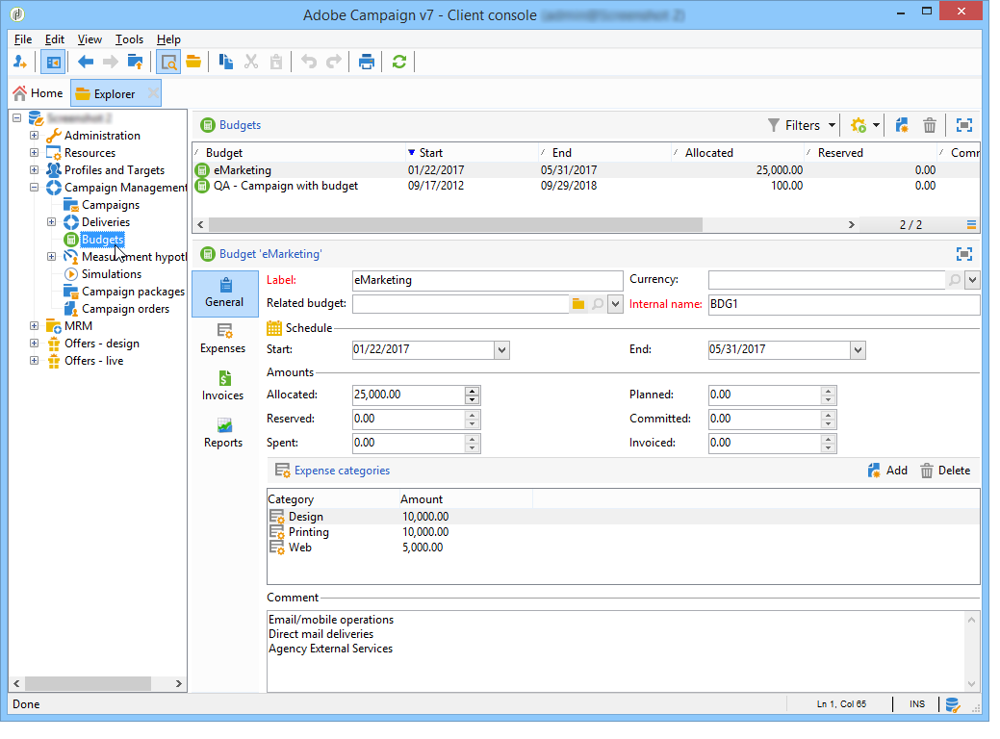
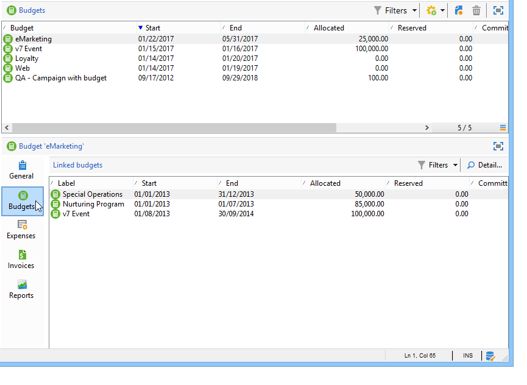
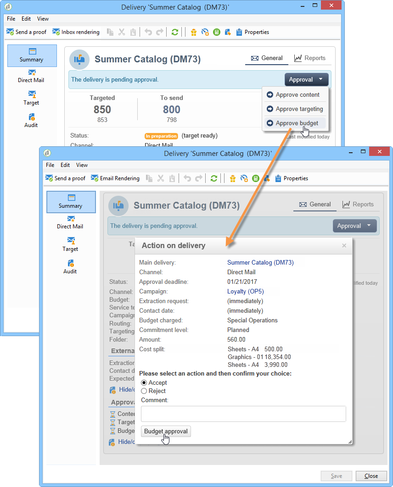

# 控制成本{#controlling-costs}

Adobe Campaign可讓您控制已排程、已提交和已開票的行銷成本，並使用「行銷資源管理」模組依類別加以劃分。

行銷部門預先定義的預算中，會計入行銷活動各個流程的承諾成本。 這些金額可細分為數個類別，讓資訊更容易閱讀，並提供行銷投資的更詳細報告。

預算的管理與追蹤會集中在Adobe Campaign樹狀結構的專用節點中。 這可讓您監控來自相同檢視和所有預算的已分配、保留、已承諾和花費金額。

使用MRM實施預算管理必須套用下列步驟：

1. 定義預算。 [了解更多資訊](#creating-a-budget)。

1. 定義成本計算方法：為服務提供商定義成本結構。 [了解更多資訊](../campaigns/providers--stocks-and-budgets.md)。

1. 定義促銷活動成本（傳送/任務）:傳送和任務產生的成本會個別或全域輸入行銷活動範本。 [了解更多資訊](../campaigns/marketing-campaign-deliveries.md#compute-costs-and-stocks)。

1. 合併：根據任務、交付和促銷活動的進度狀態，將計算成本並傳遞至相應的預算。 當促銷活動的建立足夠進階時，可將促銷活動預算的進度狀態變更為 **[!UICONTROL Specified]**. 然後，將自動輸入方案的計算成本，以及在促銷活動上計算的成本。 [了解更多資訊](#cost-commitment--calculation-and-charging)。

## 建立預算 {#creating-a-budget}

要建立預算，請執行以下步驟：

1. 瀏覽至 **[!UICONTROL Campaign management > Budgets]** Campaign檔案總管的資料夾。
1. 按一下 **[!UICONTROL New]** 圖示，命名並儲存預算。
1. 輸入初始金額：在相關欄位中指明分配的金額。 系統會自動輸入其他金額。 [了解更多資訊](#calculating-amounts)。
1. 輸入開始和結束日期以定義有效期。 此資訊僅表示性。
1. 建立為促銷活動、任務等分配給此預算的成本的支出類別。 可以連結。 [了解更多資訊](#expense-categories)。

>[!NOTE]
>
>您可以選取相關預算。 如需詳細資訊，請參閱[本章節](#linking-a-budget-to-another)。

### 計算金額 {#calculating-amounts}

每個預算都由初始金額定義，該金額將在計畫或執行促銷活動、傳送或與其相關的任務的成本中減少。 金額的狀態（計畫、保留、承諾、花費或開票）取決於成本類型和在促銷活動、交付或任務中定義的承諾級別。

>[!NOTE]
>
>為類別輸入的金額必須與 **[!UICONTROL Allocated]** 欄位。

對於行銷活動，可根據承諾程度來規劃、承諾或預留成本，以供未來行動使用。

>[!CAUTION]
>
>建立促銷活動時，進度狀態為 **[!UICONTROL Budget]** 必須設為 **[!UICONTROL Defined]** 執行費用。 如果狀態為 **[!UICONTROL Being edited]**，成本不會合併。
>   
>選項 **[!UICONTROL Commitment level]** 指在將費用列入預算前，對未來費用的預測。 根據促銷活動、任務或傳送的進度，您可以決定指派較高或較低的承諾等級(1)。 計畫2。 保留，3。 已提交)。

例如，網路促銷活動的預計計畫成本為45,000歐元。

對於促銷活動，當預算建立狀態設為 **[!UICONTROL Defined]**，則促銷活動的實際成本（若無，則計算成本）將轉入預算總計中。

根據促銷活動預算的承諾量，金額將輸入 **[!UICONTROL Planned]**, **[!UICONTROL Reserved]** 或 **[!UICONTROL Committed]** 欄位。

承諾級別可以修改：

* 在 **行銷活動** 級別，在 **[!UICONTROL Budget]** 窗口，在 **[!UICONTROL Edit]** 標籤。 這是配置預算、成本和費用的地方。
* 在 **任務** 級別，在 **[!UICONTROL Expenses and revenues]** 窗口。

預算為 **[!UICONTROL Reserved]**，則會自動對已支付的預算執行更新。

在任務級別上，該過程相同。

當支出產生髮票且已支付發票時，其金額將輸入 **[!UICONTROL Invoiced]** 欄位。

### 費用類別 {#expense-categories}

這些金額可以分散在數個費用類別中，以便更容易閱讀資料，並更詳細地報告行銷投資。 支出類別在建立預算時通過 **[!UICONTROL Budgets]** 樹的節點。

若要新增類別，請按一下 **[!UICONTROL Add]** 按鈕。

您可以從現有類別中選取類別，或直接在欄位中輸入新類別以定義新類別。 確認輸入時，確認訊息可讓您將此類別新增至現有類別清單，並視需要將其與「自然」建立關聯。 這些資訊將用於預算報告。

### 將預算連結到另一個預算 {#linking-a-budget-to-another}

您可以將預算連結到主預算。 要執行此操作，請選取 **[!UICONTROL related budget]** 次預算欄位。

主預算中將添加一個附加標籤，以顯示相關預算的清單。

這些資訊將轉存到預算報告中。

## 添加費用行 {#adding-expense-lines}

費用行會自動添加到預算中。 這些變數會在傳遞分析期間和任務完成時建立。

對於每個促銷活動、交付或任務，生成的成本將按預算的支出行分組，這些支出行將被計入。 這些費用行根據相關服務提供商的成本行建立，並通過相關的成本結構計算。

因此，每個支出行包含以下資訊：

* 促銷活動及其相關的傳遞或任務
* 根據成本結構或估計臨時成本計算的金額
* 交付或相關任務的實際成本
* 對應的發票行（僅MRM）
* 按成本類別計算的成本清單（如果存在成本結構）

在上例中，編輯的費用行包含 **新卡** 傳送 **忠誠春季包** 行銷活動。 編輯傳送時， **[!UICONTROL Direct Mail]** 頁簽，您可以查看費用行的計算方式。

此交付的成本計算基於為有關服務提供商選擇的成本類別：

根據所選成本類別，應用相應的成本結構以計算成本行。 在本例中，對於相關服務提供商，成本結構如下：

>[!NOTE]
>
>成本類別及結構於 [本頁](../campaigns/providers--stocks-and-budgets.md#create-a-service-provider-and-its-cost-categories)

## 成本承諾、計算及收費 {#cost-commitment--calculation-and-charging}

可承諾交付和任務的成本。 根據與其相關的過程的進度，更新成本的狀態。

### 成本計算過程 {#cost-calculation-process}

成本分為三類：

1. 預估佈建成本

   估計的臨時費用是宣傳過程費用的估計。 只要正在編輯，輸入的金額就不會合併。 肯定有 **[!UICONTROL Specified]** 在計算中要考慮的輸入金額的狀態。

   此金額是手動輸入，可細分為數個費用類別。 若要降低成本，請按一下 **[!UICONTROL Breakdown...]** 連結，然後 **[!UICONTROL Add]** 按鈕來定義新金額。

   

   您可以將每個成本與某個類別關聯，以便以後可以在相關預算和預算報表中查看按費用類別列出的成本細分。

1. 計算成本

   計算的成本取決於相關元素（促銷活動、傳送、任務等） 及其狀態（正在編輯、進行中、已完成）。 在任何情況下，如果指定了實際成本，則計算成本將使用此金額。

   如果未提供實際成本，則適用下列規則：

   * 對於正在編輯的促銷活動，計算成本是促銷活動的估計臨時成本，如果未定義此成本，則計算成本將是傳送和促銷活動任務的所有臨時成本的總和。 如果促銷活動完成，則促銷活動的計算成本將是所有計算成本的總和。
   * 對於尚未分析的交付，計算成本為估計臨時成本。 如果已執行分析，則計算成本將是從服務提供成本結構計算的所有成本和目標接收者數量的總和。
   * 對於正在進行的任務，計算成本使用估計的臨時成本。 如果任務完成，則計算成本將是從服務提供商成本結構計算的所有成本和完成天數的總和。
   * 對於行銷計畫，至於方案，計算成本是為行銷活動計算的成本總和。 如果沒有指定這些費用，計算的費用將使用估計的臨時費用。

   >[!NOTE]
   >
   >此 **[!UICONTROL Breakdown]** 連結可讓您檢視計算的詳細資訊和上次成本計算日期。

1. 實際成本

   實際成本是手動輸入的，如果需要，則會細分為不同的費用類別。

### 計算和計費 {#calculation-and-charging}

成本通過成本結構計算，並計入在相關促銷活動、交付或任務中選擇的預算。

您可以透過預算核准，對提交至促銷活動的金額執行檢查。 可以在促銷活動中建立其他查核點樣式的工作，以設定其他核准。 請參閱 [任務類型](creating-and-managing-tasks.md#types-of-task).

### 範例 {#example}

我們將使用：

* 使用服務提供商的成本結構的直接郵件傳送
* 具有固定成本的任務
* 每日成本的任務

#### 步驟1 — 建立預算 {#step-1---creating-the-budget}

1. 透過 **[!UICONTROL Campaign management > Budgets]** 節點。

1. 在 **[!UICONTROL Allocated]** 欄位 **[!UICONTROL Amounts]** 區段。 在窗口的下部添加兩個支出類別：

#### 步驟2 — 配置服務提供商並定義成本結構 {#step-2---configuring-the-service-provider-and-defining-the-cost-structures}

1. 從 **[!UICONTROL Administration > Campaigns]** 節點。 如需詳細資訊，請參閱[本章節](../campaigns/providers--stocks-and-budgets.md#create-a-service-provider-and-its-cost-categories)。

   對於直接郵件傳遞，請建立成本類別 **[!UICONTROL Envelopes]** （類型114x229和162x229）, **[!UICONTROL Postage]** 和 **[!UICONTROL Print]** （類型A3和A4）。 然後建立以下成本結構：

   

1. 添加固定成本（在成本類別中），其計算是固定的，其金額為空（在相應的成本結構中），並且將為每個交貨單獨指定。

   

   對於任務，請建立以下兩個成本類別：

   * **[!UICONTROL Room reservation]** （小房間和大房間）, **固定** 300歐元和500歐元的費用結構：

   

   * **[!UICONTROL Creation]** (**內容範本** 類型)，使用 **每日** 300歐元的成本結構：

   

#### 步驟3 — 在促銷活動中扣除預算 {#step-3---charging-the-budget-in-the-campaign}

1. 建立促銷活動並選取步驟1中建立的預算。

   >[!NOTE]
   >
   >依預設，為方案選取的預算會套用至方案中的所有促銷活動。

   

1. 指定預計的臨時成本，並加以劃分：

   

1. 按一下 **[!UICONTROL Ok]** 然後 **[!UICONTROL Save]** 確認此資訊。 然後，將使用估計臨時成本更新該促銷活動的計算成本。

#### 步驟4 — 建立直接郵件傳送 {#step-4---creating-the-direct-mail-delivery}

1. 為促銷活動建立工作流程並定位查詢活動以選取目標（警告，必須指定收件者郵遞區號）。

1. 建立直接郵件傳送，並選取在步驟2中建立的服務提供者：系統會自動顯示成本類別。

1. 覆蓋信封的成本並添加固定成本。 也選擇與這些成本有關的類別。

   

   >[!NOTE]
   >
   >如果未使用其中一個成本類別，則不會產生任何費用。

1. 啟動您剛建立的工作流程以啟動分析並計算成本。

   

1. 如果已為此促銷活動啟用預算核准，請從控制面板核准預算。 您可以檢查成本類別的審批。

   

有關傳送的費用行會新增至 **[!UICONTROL Edit > Budget]** 標籤。 編輯它以查看計算的詳細資訊。

傳送的計算成本會更新為下列資訊：

在編輯計算成本時，您可以檢查成本細分以及成本計算的狀態和日期。

#### 步驟5 — 建立任務 {#step-5---creating-tasks}

在此活動中，我們將添加成本結構為的兩個任務 [已建立較早](#step-2---configuring-the-service-provider-and-defining-the-cost-structures).

若要這麼做，請在促銷活動控制面板中，按一下 **[!UICONTROL Add a task]** 按鈕。 為任務命名，然後按一下 **[!UICONTROL Save]**.

1. 然後，任務將添加到任務清單中。 您必須編輯它才能進行設定。

1. 在 **[!UICONTROL Properties]** 頁簽，選擇服務和相應的成本類別：

   

1. 下一步，按一下 **[!UICONTROL Expenses and revenue]** 表徵圖，並指定估計臨時成本。

   

   在保存任務後，將指定計算成本，並輸入估計臨時成本的值。

   任務完成時（狀態） **[!UICONTROL Finished]** )，則計算的成本將自動更新為在成本結構中輸入的Large Room的成本。 此成本也會顯示在劃分的此類別中。

1. 接下來，根據同一過程建立第二個任務；排程超過五天，且與先前建立的成本結構相關。

   

   完成任務後，計算成本將以相關成本結構中的值指定，例如，在本例中為1500歐元（5天x 300歐元）:

   

#### 步驟6 — 更新促銷活動預算狀態 {#step-6---update-the-campaign-budget-status}

設定促銷活動時，可將其設定為 **[!UICONTROL Specified]**. 然後，促銷活動的計算成本會指出傳送的計算成本與促銷活動任務的總和：

#### 預算核准 {#budget-approval}

啟用核准後，特殊連結可讓您從促銷活動控制面板核准預算。 當目標工作流程啟動且需要核准直接郵件傳送時，就會顯示此連結。

然後，您可以按一下連結來授與或拒絕核准，或者如果已針對此促銷活動啟動通知，則使用通知電子郵件中的連結。

當預算獲得核准且傳送完成時，成本會透過特殊的技術工作流程自動上傳。

## 訂單和發票 {#orders-and-invoices}

在MRM的上下文中，您可以向服務提供商保存訂單並開具發票。 這些訂單和發票的整個生命週期均可透過Adobe Campaign介面管理。

### 訂單建立 {#order-creation}

若要與服務提供者儲存新訂單，請按一下 **[!UICONTROL MRM > Orders]** 樹的節點，然後按一下 **[!UICONTROL New]** 按鈕。

指定訂單編號、相關服務提供商和訂單的總金額。

### 開具和跟蹤發票 {#issuing-and-tracking-invoices}

對於每個服務提供商，您可以保存發票並定義其狀態和費用預算。

發票會建立並儲存在 **[!UICONTROL MRM > Invoices]** Adobe Campaign樹的節點。

發票由發票行組成，發票行的合計允許自動計算金額。 這些行會從 **[!UICONTROL Invoice lines]** 標籤。 它們可與訂單關聯，以便將資訊上傳至訂單。

每個服務提供商的發票顯示在 **[!UICONTROL Invoices]** 頁簽中：

此 **[!UICONTROL Details]** 索引標籤可讓您顯示發票的內容。

按一下 **[!UICONTROL Add]** 建立新發票。
