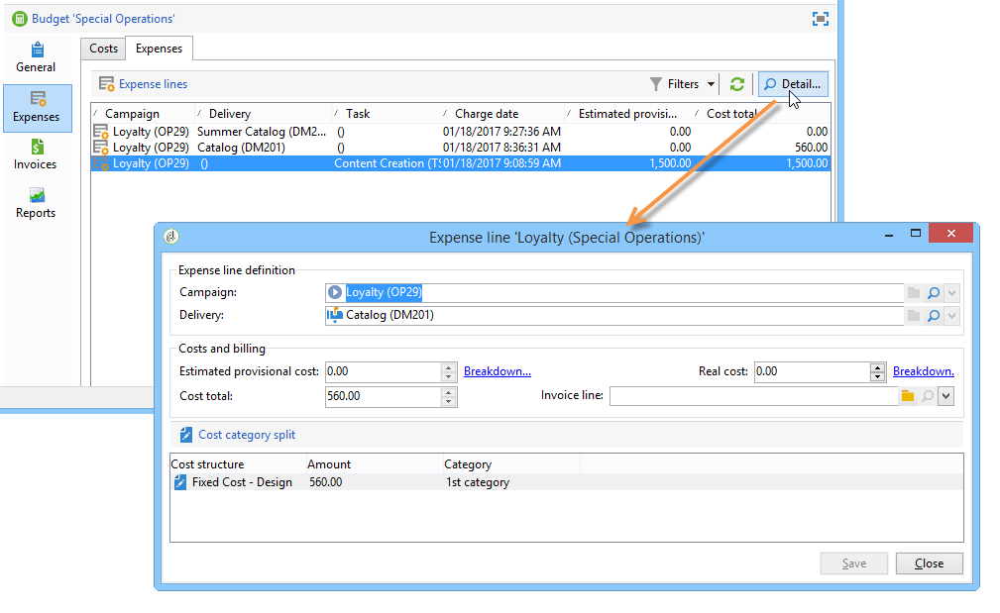
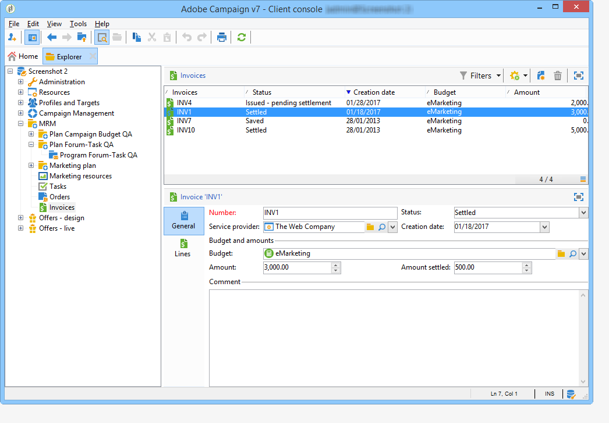

# 控制成本{#controlling-costs}

Adobe Campaign可讓您控制已排程、已確認及已開立商業發票的行銷成本，並使用行銷資源管理模組依類別加以劃分。

針對行銷活動的各種程式所認定的成本，會記入行銷部門預先定義的預算。 金額可以細分為數個類別，讓資訊更容易閱讀，並提供更詳細的行銷投資報表。

預算的管理和追蹤集中在Adobe Campaign樹狀結構的專用節點中。 這可讓您監控從相同檢視及所有預算中配置、預留、承諾及支出的金額。

必須套用下列步驟，才能使用MRM實作預算管理：

1. 定義預算。 [了解更多](#creating-a-budget)。

1. 定義成本計算方法：為服務提供者定義成本結構。 [了解更多](../campaigns/providers--stocks-and-budgets.md)。

1. 定義行銷活動成本（傳送/任務） ：傳送和任務產生的成本會針對行銷活動範本個別或全域輸入。 [了解更多](../campaigns/marketing-campaign-deliveries.md#compute-costs-and-stocks)。

1. 合併：根據任務、傳遞和行銷活動的進度狀態，將計算成本並傳遞至對應的預算。 當行銷活動的建立足夠進階時，行銷活動預算的進度狀態可以變更為 **[!UICONTROL Specified]**. 然後，系統會自動輸入方案的已計算成本，以及促銷活動上已計算的成本。 [了解更多](#cost-commitment--calculation-and-charging)。

## 建立預算 {#creating-a-budget}

若要建立預算，請遵循下列步驟：

1. 瀏覽至 **[!UICONTROL Campaign management > Budgets]** Campaign檔案總管的資料夾。
1. 按一下 **[!UICONTROL New]** 圖示、命名並儲存預算。
1. 輸入初始金額：在相關欄位中指出配置的金額。 其他金額會自動輸入。 [了解更多](#calculating-amounts)。
1. 輸入開始和結束日期，以定義有效期間。 此資訊僅供參考。
1. 建立費用類別，將行銷活動、任務等的成本指派給此預算。 可以連結。 [了解更多](#expense-categories)。

>[!NOTE]
>
>您可以選取相關預算。 如需詳細資訊，請參閱[本章節](#linking-a-budget-to-another)。

### 計算金額 {#calculating-amounts}

每個預算由初始金額定義，在排程或執行後，初始金額將從各種行銷活動、傳遞或與其相關的任務的成本中減少。 金額的狀態（計畫、預留、確認、花費或開立商業發票）取決於成本型態與行銷活動、交貨或作業中定義的承諾層次。

>[!NOTE]
>
>為分類輸入的金額必須與 **[!UICONTROL Allocated]** 欄位。

對於行銷活動，根據承諾程度，可以為未來行動計畫、承諾或預留成本。

>[!CAUTION]
>
>建立行銷活動時，進度狀態位於 **[!UICONTROL Budget]** 必須設定為 **[!UICONTROL Defined]** 執行時要考慮的成本。 如果狀態為 **[!UICONTROL Being edited]**，則不會合併成本。
>   
>選項 **[!UICONTROL Commitment level]** 代表將成本計入預算前對未來的預測。 根據行銷活動、任務或傳遞的進度，您可以決定指派較高或較低的承諾層次(1)。 計畫，2. 保留， 3. 已認可)。

例如，網路行銷活動的預估計畫成本為45,000歐元。

針對行銷活動，當預算建立狀態設定為 **[!UICONTROL Defined]**，行銷活動的實際成本（或如果沒有，則計算成本）將結轉至預算總計。

根據行銷活動預算的承諾程度，金額將輸入於 **[!UICONTROL Planned]**， **[!UICONTROL Reserved]** 或 **[!UICONTROL Committed]** 欄位。

可修改承諾等級：

* 在 **行銷活動** 層級，在 **[!UICONTROL Budget]** 視窗，可在 **[!UICONTROL Edit]** 標籤。 這是設定預算、成本和費用的位置。
* 在 **任務** 層級，在 **[!UICONTROL Expenses and revenues]** 視窗。

當預算為 **[!UICONTROL Reserved]**，系統會自動針對計費預算執行更新。

作業層級的程式相同。

當費用性列管產生商業發票且已支付商業發票時，其金額會輸入至 **[!UICONTROL Invoiced]** 欄位。

### 費用類別 {#expense-categories}

這些金額可以分成數個費用類別，以提高資料的可讀性，並更詳細地報告行銷投資。 費用類別是在預算建立期間透過以下方式定義的： **[!UICONTROL Budgets]** 樹狀結構的節點。

若要新增類別，請按一下 **[!UICONTROL Add]** 按鈕。

您可以從現有類別中選取類別，或直接在欄位中輸入來定義新類別。 當您確認輸入時，確認訊息可讓您將此類別新增到現有類別的清單中，並在必要時將其與性質相關聯。 此資訊將用於預算報表。

### 將預算連結至另一個預算 {#linking-a-budget-to-another}

您可以將預算連結至主要預算。 若要這麼做，請選取下列專案中的主要預算： **[!UICONTROL related budget]** 次要預算的欄位。

主預算會新增一個額外標籤，以顯示相關預算清單。

此資訊會結轉至預算報表。

## 新增費用行 {#adding-expense-lines}

費用明細行會自動新增至預算。 它們是在傳遞分析期間以及任務完成時建立的。

對於每個行銷活動、傳遞或任務，產生的成本會分組到它們所計入的預算費用明細行中。 這些費用明細行是根據相關服務提供者的成本明細行建立，並透過相關的成本結構計算。

因此，每個費用明細行包含下列資訊：

* 行銷活動及其相關的傳遞或任務
* 根據成本結構或預估臨時成本計算的金額
* 相關傳遞或任務的實際成本
* 對應的商業發票明細行（僅限MRM）
* 依成本分類計算的成本清單（如果存在成本結構）

在上述範例中，編輯的費用行包含為計算的成本 **新卡片** 的傳遞 **忠誠度春季套裝** 行銷活動。 編輯傳遞時， **[!UICONTROL Direct Mail]** 索引標籤可讓您檢視費用行的計算方式。

此交貨的成本計算是以相關服務提供者選取的成本類別為基礎：

根據選取的成本分類，會套用對應的成本結構，以計算成本明細行。 在此範例中，針對相關服務提供者，成本結構如下：

>[!NOTE]
>
>成本類別與結構呈列於 [此頁面](../campaigns/providers--stocks-and-budgets.md#create-a-service-provider-and-its-cost-categories)

## 成本承諾、計算及收費 {#cost-commitment--calculation-and-charging}

可以針對傳遞和任務確認成本。 系統會根據與其相關的處理進度，更新成本狀態。

### 成本計算過程 {#cost-calculation-process}

成本分為三個類別：

1. 預估佈建成本

   預估臨時成本是行銷活動流程的成本預估值。 只要正在編輯，輸入金額就不會合併。 它必須具有 **[!UICONTROL Specified]** 計算時要考慮的輸入金額的狀態。

   此金額是手動輸入，可細分為數個費用類別。 若要削減成本，請按一下 **[!UICONTROL Breakdown...]** 連結，然後 **[!UICONTROL Add]** 按鈕以定義新金額。

   

   您可以將每個成本與分類產生關聯，以便日後在相關預算與預算報表中檢視依費用分類的成本細目。

1. 計算成本

   計算的成本取決於相關元素（行銷活動、傳遞、任務等） 及其狀態（正在編輯、進行中、已完成）。 在任何情況下，如果指定了實際成本，則計算的成本將使用此金額。

   如果未提供實際成本，則套用下列規則：

   * 對於正在編輯的行銷活動，計算的成本是行銷活動的預估臨時成本，如果未定義此成本，則計算的成本將是行銷活動的所有傳遞與任務臨時成本的總和。 如果行銷活動完成，行銷活動的已計算成本將是所有已計算成本的總和。
   * 對於尚未分析的傳遞，計算的成本為預估臨時成本。 如果已經執行分析，則計算的成本將會是從服務提供成本結構計算的所有成本以及目標收件者人數的總和。
   * 對於進行中的任務，計算成本會使用預估的臨時成本。 如果作業已完成，則計算成本將是根據服務提供者成本結構計算的所有成本與已完成天數的總和。
   * 行銷計畫與方案一樣，計算成本是行銷活動計算成本的總和。 如果未指定這些成本，則計算的成本將使用預估的臨時成本。

   >[!NOTE]
   >
   >此 **[!UICONTROL Breakdown]** 連結可讓您檢視計算的詳細資訊和上次成本計算日期。

1. 實際成本

   實際成本是手動輸入，必要時可細分為不同的費用類別。

### 計算與收費 {#calculation-and-charging}

成本會透過成本結構計算，並計入相關行銷活動、傳遞或任務中所選的預算。

可透過預算核准，對已承諾給行銷活動的金額執行檢查。 可在行銷活動中建立其他查核點樣式任務，以設定其他核准。 另請參閱 [任務型別](creating-and-managing-tasks.md#types-of-task).

### 範例 {#example}

我們將使用下列專案建立行銷活動：

* 使用服務提供者的成本結構的直接郵件傳遞
* 具有固定成本的任務
* 具有每日成本的任務

#### 步驟1 — 建立預算 {#step-1---creating-the-budget}

1. 透過建立新預算 **[!UICONTROL Campaign management > Budgets]** 節點。

1. 定義10,000歐元的預算於 **[!UICONTROL Allocated]** 的欄位 **[!UICONTROL Amounts]** 區段。 在視窗的下半部新增兩個費用類別：

#### 步驟2 — 設定服務提供者並定義成本結構 {#step-2---configuring-the-service-provider-and-defining-the-cost-structures}

1. 從建立服務提供者及其成本結構的服務範本 **[!UICONTROL Administration > Campaigns]** 節點。 如需詳細資訊，請參閱[本章節](../campaigns/providers--stocks-and-budgets.md#create-a-service-provider-and-its-cost-categories)。

   如果是直接郵件傳遞，請建立成本類別 **[!UICONTROL Envelopes]** （型別114x229和162x229）， **[!UICONTROL Postage]** 和 **[!UICONTROL Print]** （型別A3和A4）。 然後建立下列成本結構：

   

1. 新增固定成本（在成本類別中），其計算是固定的，且金額為空白（在相應的成本結構中），並將針對每次交貨個別指定。

   

   針對作業，建立下列兩個成本類別：

   * **[!UICONTROL Room reservation]** （小房間和大房間），具有 **固定** 金額為300與500歐元的成本結構：

   

   * **[!UICONTROL Creation]** (**內容範本** type)，含 **每日** 成本結構為300歐元：

   

#### 步驟3 — 記入行銷活動中的預算 {#step-3---charging-the-budget-in-the-campaign}

1. 建立行銷活動，並選取在步驟1中建立的預算。

   >[!NOTE]
   >
   >依預設，為方案選取的預算會套用至方案中的所有行銷活動。

   

1. 指定預估臨時成本，並包含細目：

   

1. 按一下 **[!UICONTROL Ok]** 然後 **[!UICONTROL Save]** 以確認此資訊。 然後會以預估臨時成本更新行銷活動的計算成本。

#### 步驟4 — 建立直接郵件傳送 {#step-4---creating-the-direct-mail-delivery}

1. 建立行銷活動的工作流程，並定位查詢活動以選取目標（警告，必須指定收件者的郵寄地址）。

1. 建立直接郵件傳遞，並選取在步驟2中建立的服務提供者：成本類別會自動顯示。

1. 覆寫信封的成本並新增固定成本。 同時選取與這些成本有關的類別。

   

   >[!NOTE]
   >
   >如果未使用其中一個成本類別，則不會產生任何費用。

1. 啟動您剛建立的工作流程，以啟動分析並計算成本。

   

1. 如果此行銷活動已啟用預算核准，請從儀表板核准預算。 您可以檢查成本類別的核准。

   

與傳遞相關的費用行已新增至 **[!UICONTROL Edit > Budget]** 索引標籤進行識別。 編輯它以檢視計算的詳細資訊。

針對傳遞計算的成本會更新為以下資訊：

編輯已計算的成本時，您可以檢查成本細目以及成本計算的狀態和日期。

#### 步驟5 — 建立任務 {#step-5---creating-tasks}

在此行銷活動中，我們將新增成本結構為的兩個任務 [建立時間較早](#step-2---configuring-the-service-provider-and-defining-the-cost-structures).

若要這麼做，請在行銷活動控制面板中，按一下 **[!UICONTROL Add a task]** 按鈕。 為任務命名，然後按一下 **[!UICONTROL Save]**.

1. 然後，任務會新增到任務清單中。 您必須編輯它才能進行設定。

1. 在 **[!UICONTROL Properties]** 頁標，選取服務與對應的成本分類：

   

1. 接下來，按一下 **[!UICONTROL Expenses and revenue]** 圖示並指定預估的臨時成本。

   

   儲存任務後，會使用為預估臨時成本輸入的值來指定計算成本。

   任務完成時(狀態 **[!UICONTROL Finished]** )，計算出的成本會依成本結構中所輸入的「大型空間」成本自動更新。 此成本也會顯示在劃分的此類別中。

1. 接下來，根據相同的程式建立第二個工作；排程超過五天，並與先前建立的成本結構相關。

   

   當任務完成時，計算成本會以相關成本結構的值指定，例如，在我們的範例中為1500歐元（5天x 300歐元）：

   

#### 步驟6 — 更新行銷活動預算狀態 {#step-6---update-the-campaign-budget-status}

設定行銷活動時，可透過將其設定為來更新其狀態 **[!UICONTROL Specified]**. 行銷活動的已計算成本接著會指出傳遞已計算成本與行銷活動任務的總和：

#### 預算核准 {#budget-approval}

啟用核準時，特殊連結可讓您從行銷活動控制面板核准預算。 當目標定位工作流程已啟動且需要核准直接郵件傳送時，會顯示此連結。

然後，您可以按一下連結以授予或拒絕核准，或如果通知已針對此行銷活動啟動，則使用通知電子郵件中的連結。

預算獲得核准且完成傳遞後，成本會透過特殊的技術工作流程自動上傳。

## 訂單與商業發票 {#orders-and-invoices}

在MRM的環境中，您可以與服務供應商儲存訂單並簽發發票。 您可以透過Adobe Campaign介面管理這些訂單與商業發票的整個生命週期。

### 訂單建立 {#order-creation}

若要與服務提供者儲存新訂單，請按一下 **[!UICONTROL MRM > Orders]** 樹狀結構節點，然後按一下 **[!UICONTROL New]** 按鈕。

指定訂單編號、相關的服務提供者，以及訂單的總金額。

### 核發及追蹤發票 {#issuing-and-tracking-invoices}

您可以針對每個服務提供者，儲存商業發票，並定義其狀態與費用預算。

商業發票會建立並儲存在 **[!UICONTROL MRM > Invoices]** Adobe Campaign樹的節點。

商業發票由商業發票明細行組成，其總計允許自動計算金額。 這些明細行是手動建立自 **[!UICONTROL Invoice lines]** 標籤。 它們可以與訂單相關聯，以將資訊上傳至訂單。

每個服務提供者的商業發票會顯示在 **[!UICONTROL Invoices]** 設定檔的索引標籤：

此 **[!UICONTROL Details]** 索引標籤可讓您顯示發票的內容。

按一下 **[!UICONTROL Add]** 以建立新商業發票。
