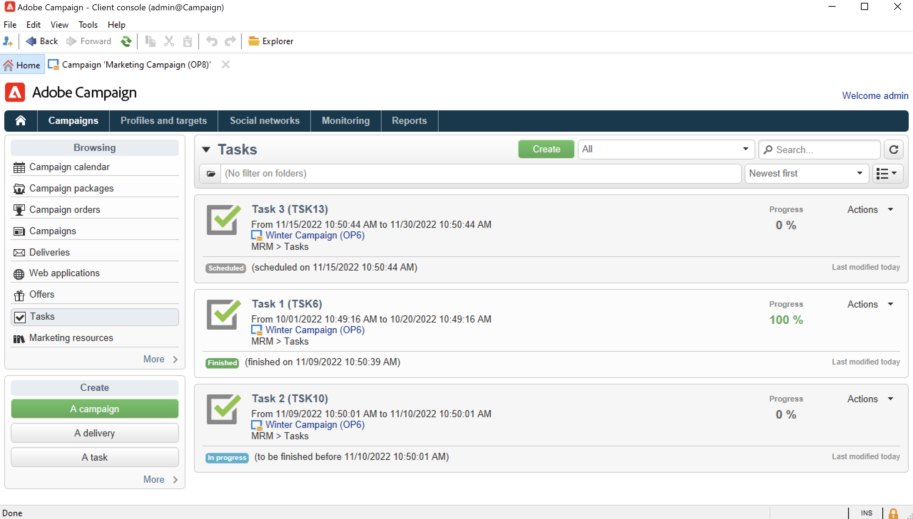
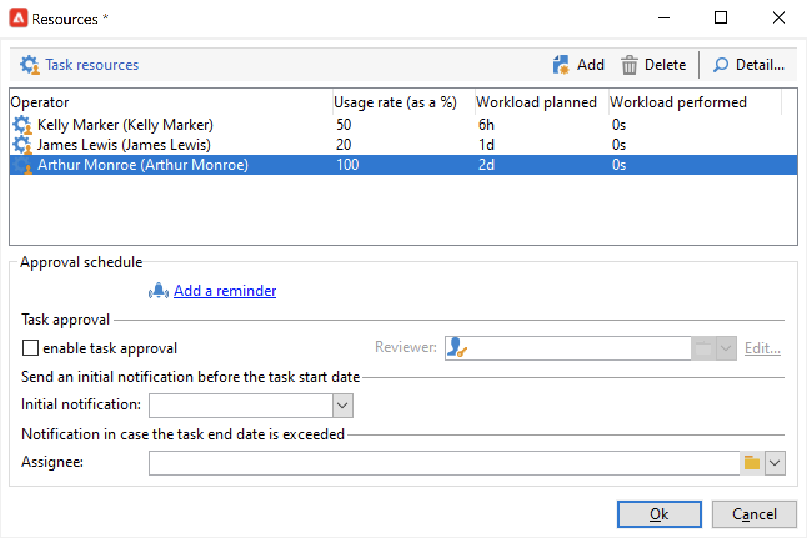
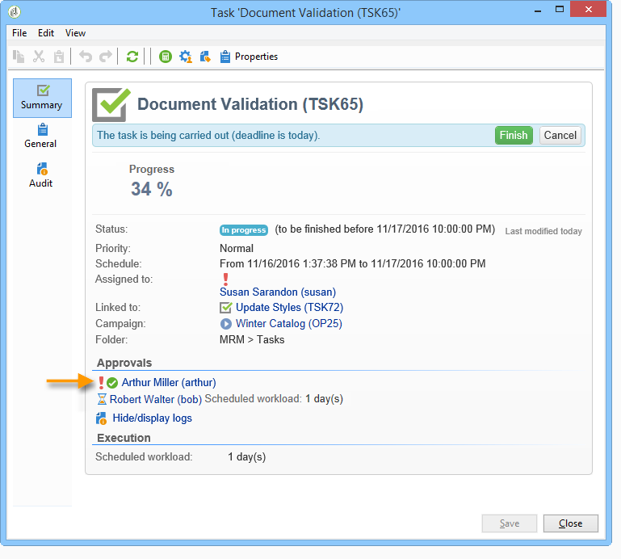

# 建立及管理設定檔{#creating-and-managing-tasks}

Adobe Campaign 可讓您直接在應用程式中建立任務並管理其完整的生命週期. 方案和行銷活動實作可以細分為指派給Adobe Campaign操作員或外部服務提供者的任務。 此作業模式可讓您建立包含所有方案參與者和外部參與者的開放式共同作業環境。

您可以從任務清單或行銷活動儀表板建立、檢視和監控任務。 您也可以在行銷計畫、方案和行銷活動的排程中檢視和追蹤這些活動。

任務會附加至行銷活動，且可以具有相依性，即相關任務。 每個任務都有狀態、優先順序、預估負載和相關成本。

所有任務都會分組在清單中，可透過以下方式存取： **行銷活動** 標籤。 有關詳細資訊，請參閱 [存取任務](#accessing-tasks).

它們可以顯示在所屬方案的排程中。

## 存取任務 {#accessing-tasks}

### 顯示任務 {#displaying-tasks}

任務會顯示在可透過存取的任務清單中 **[!UICONTROL Campaigns]** 標籤。

您可以檢視目前運運算元的所有工作。

有關詳細資訊，請參閱 [任務的執行狀態](#execution-status-of-a-task) 和 [任務的進度狀態](#progress-status-of-a-task).

### 篩選任務 {#filtering-tasks}

當您顯示此檢視時，系統會自動篩選該檢視，以便只顯示 **目前操作員任務**. 您也可以使用視窗上半部分的欄位來篩選任務。

### 編輯任務 {#editing-tasks}

按一下任務以進行編輯。

## 建立新任務 {#creating-a-new-task}

若要建立任務，請遵循下列步驟：

1. 瀏覽至 **[!UICONTROL Tasks]** 中的連結 **[!UICONTROL Campaigns]** 標籤並按一下 **[!UICONTROL Create]**.

   

1. 輸入任務名稱，並選取其連結的行銷活動。
1. 設定開始和結束日期。
1. 按一下 **[!UICONTROL Save]** 以建立任務。

   

您也可以透過行銷活動的控制面板建立任務：在此情況下，會自動連結至從中建立任務的行銷活動。

建立任務後，任務會新增至行銷活動排程、行銷活動控制面板和任務清單。 若要編輯任務，請從任務清單中按一下其名稱，或從排程或行銷活動控制面板中選取該任務，然後按一下 **[!UICONTROL Open]**.

建立之後，您可以透過定義以下專案來設定任務：

* 管理者和參與者。 [了解更多](#manager-and-participants)
* 建立排程。 [了解更多](#execution-schedule)
* 承諾成本。 [了解更多](#expenses-and-revenues)

您也可以新增 [檢閱者](#reviewers) 和 [參考檔案](#documents-referenced).

任務生命週期顯示於 [本節](#life-cycle).

### 經理與參與者 {#manager-and-participants}

依預設，任務會指派給建立它的運運算元。 當該任務需要動作時，會通知此運運算元。

您可以從中選擇不同的運運算元 **[!UICONTROL Assigned to]** 下拉式清單。

>[!NOTE]
>
>操作員管理的詳細資訊，請參閱 [本節](../../v8/start/gs-permissions.md).
>
>只允許負責任務的操作員將其關閉。

您可以指定更多參與執行工作的運運算元。 不允許這些運運算元關閉任務：他們只能核准指派給他們的任務。

若要新增任務運運算元，請遵循下列步驟：

1. 按一下 **[!UICONTROL Resources]** 圖示加以檢視。

   

1. 按一下 **[!UICONTROL Add]** 並選取相關的運運算元。
1. 輸入使用率：此比率代表工作執行期間指派給運運算元的工作負載。 此比率僅供參考，並以百分比表示。

   

   例如，對於執行排程設定為10天的任務，使用率為50%的運運算元將會在此任務上動員10天的工作時間的一半。

   對於每個運運算元，您可以輸入排程工作負載與實際工作負載。 這些持續時間也僅供參考。

1. 您可以透過以下網址設定提醒： **[!UICONTROL Add a reminder...]** 連結。 將會在任務結束日期之前傳送電子郵件通知給所有參與任務的操作員。

   

1. 您也可以在工作開始之前傳送通知。 若要進行此設定，請選取 **[!UICONTROL Initial notification]** 欄位。
1. 當到達結束日期且任務未關閉時，可以傳送通知給受指派人或受指派人群組(在 **[!UICONTROL Assignee]** 下拉式清單。

操作員儀表板可讓您檢查其工作量（其他正在進行的任務）。

### 任務核准 {#reviewers}

除了參與者之外，您還可以定義在任務關閉後稽核任務的操作者。

若要這麼做，請按一下 **[!UICONTROL Enable task approval]** 下方的選項 **[!UICONTROL Resources]** 視窗。 這可以是個別運運算元、一組運運算元或運運算元清單。

若要指定運運算元清單，請按一下 **[!UICONTROL Edit...]** 連結至第一個檢閱者的右側，並視需要新增運運算元，如下所示：

您可以在設定視窗的下半部定義任務的核准排程。 依預設，稽核者從提交日期起有三天時間來核准任務。 您也可以新增提醒，提醒會在核准期限之前自動傳送給相關操作員。

即使已指派其他操作員進行核准，負責此工作的人員仍可指派自己進行核准。 如果尚未定義稽核者，則會將通知傳送給負責任務的人。 所有其他的Adobe Campaign運運算元，搭配 **[!UICONTROL Administrator]** 許可權也可以核准任務。 但是，他們不會收到通知。

### 引用的檔案 {#documents-referenced}

您可以新增 [檔案和行銷資源](managing-marketing-resources.md) 至任務。

若要執行此動作：

1. 開啟工作並按一下 **[!UICONTROL Documents]** 圖示加以檢視。

   

1. 按一下 **[!UICONTROL Add]** 並選取要新增至您工作的檔案。 對行銷資源套用相同的程式。

參考的檔案會新增至傳送給工作相關操作員的通知中。 它們也會新增到任務控制面板上。

### 執行排程 {#execution-schedule}

任務的有效期顯示在 **[!UICONTROL Start]** 和 **[!UICONTROL End]** 欄位。 排定的負載表示在期間內要執行的工作負載。 以天或小時表示。

>[!NOTE]
>
>任務的生命週期會顯示在中 [生命週期](#life-cycle).

此 **[!UICONTROL Workload performed]** 欄位也以天和小時表示，可讓您手動更新與排程工作負載相關的任務進度。

此 **[!UICONTROL Progress status]** 會根據相關操作員執行的任務自動更新任務的（以百分比表示）。 可以手動輸入。

您可在任務儀表板中檢視此資訊。

它也會顯示在行銷活動標籤中。

如果已達到任務執行排程結束日期，但任務尚未完成，則任務將 **[!UICONTROL Late]**. 警告訊息也會顯示給警示操作者。

有關詳細資訊，請參閱 [任務的進度狀態](#progress-status-of-a-task).

### 費用與收入 {#expenses-and-revenues}

您可以定義每個作業的相關費用與預測收入。 系統會計算這些值，然後針對附加任務的行銷活動將其合併。

若要指定此資訊，請按一下 **[!UICONTROL Expenses and revenue]** 圖示加以檢視。

依預設，記入的預算是附加任務的行銷活動的預算。 它會顯示在任務詳細資訊中。

>[!NOTE]
>
>如需有關費用與預算的詳細資訊，請參閱 [本節](../campaigns/providers--stocks-and-budgets.md#cost-commitment--calculation-and-charging).

在此視窗中，您也可以定義要達成的目標。 目標以任務的預測收入表示。

### 服務提供者 {#service-providers}

外部服務提供者可以參與任務管理。

要執行此操作，請編輯工作屬性並選取相關的服務提供者。 與服務提供者相關的成本類別會自動列在視窗的中央區段中。

選取與工作執行相關的成本類別。 若要這麼做，請選取成本型態，並視需要新增附加費金額。

>[!NOTE]
>
>管理預算與成本的方法顯示於 [控制成本](controlling-costs.md).

選取服務提供者時，它會顯示在工作儀表板中：

### 延遲任務 {#late-tasks}

如果任務已達到其結束日期，但其狀態未變更為，則任務會延遲 **[!UICONTROL Finished]**. 依預設，當任務延遲時，不會警告運運算元。 您可以設定通知電子郵件的傳送：即使操作員未參與工作，也可以通知所有操作員。

前往 **[!UICONTROL Resources]** 方塊並將運運算元新增至 **[!UICONTROL Assignation]** 欄位。 若要通知幾個人，請選取一組操作員。

### 初始通知 {#initial-notifications}

當您建立或修改具有未來開始日期的任務時，Adobe Campaign會提供傳送電子郵件給負責任務的人，讓他們知道何時開始。

不過，如果您要建立的任務還有很長的路要走，最好在任務開始前排程要傳送的通知。 例如，如果工作在一個月內開始，您可以在工作開始前一週通知負責人員。

若要排程通知，請前往 **[!UICONTROL Resources]** 方塊並使用 **[!UICONTROL Initial notification]** 欄位。

* 針對行銷活動內的任務，選取特定的日期和時間。
* 對於行銷活動範本內的任務，通知時間以任務開始前的剩餘時間表示(例如，如果您在 **[!UICONTROL Initial notification]** 欄位)，電子郵件將在任務開始日期2天前傳送。

如果您已排程通知，當您儲存任務時，Adobe Campaign仍會提供立即傳送通知的優惠。 您可以決定傳送，這不會取代排程通知。

### 連結至方案的任務 {#task-linked-to-a-program}

您可以直接在方案中建立任務，以管理與其整體組織而非特定行銷活動相關的動作（例如，討論方案中即將開展行銷活動之主題的會議）。 該任務將顯示在方案排程中。

若要建立直接連結至方案的工作：

1. 開啟方案排程：在首頁上，前往 **[!UICONTROL Campaigns > Browse > Other choices > Programs]**. 整個方案排程會在視窗的右側部分開啟。
1. 在排程中，按一下所需的程式：畫面會隨即顯示其中程式的視窗。
1. 在此視窗中，按一下 **[!UICONTROL Open]**. 程式排程隨即開啟。
1. 按一下 **[!UICONTROL Add]** 按鈕於排程上方，然後按一下 **[!UICONTROL Add a task]**.

### 操作員可用性 {#operator-availability}

在任務儀表板中，操作員名稱旁的圖示表示操作員已在任務所涵蓋的期間處理另一個任務或事件。 運運算元負責或參與的任務會出現在 **[!UICONTROL Assigned to]** 欄位或任務中 **[!UICONTROL Resources]** 方塊。

### 工作流程中的任務 {#task-in-a-workflow}

使用 **[!UICONTROL Task]** 行銷活動工作流程中的元素可讓您根據任務是否核准來定義兩個案例。

在行銷活動工作流程中， **[!UICONTROL Task]** 活動可在以下位置找到： **[!UICONTROL Flow control]** 標籤。

## 任務型別 {#types-of-task}

當您透過行銷活動建立任務時，可以建立特定任務。 在選取的範本中定義任務型別。

可以排程下列工作：

* [控制任務](#control-tasks)，
* [分組任務](#grouping-task),
* [分組任務](#grouping-task),
* [通知任務](#notification-task).

>[!NOTE]
>
>**[!UICONTROL Control task]** 和 **[!UICONTROL Grouping]** 可以建立任務 **僅限** 透過campaign控制面板。\
>它們會顯示在指派給它們的運運算元的工作圖中。 另請參閱 [存取任務](#accessing-tasks).

### 控制任務 {#control-tasks}

A **[!UICONTROL Control task]** 連結至傳遞核准：目標定位、內容、擷取檔案、預算或校訂的核准。

任務建立後，即會新增至行銷活動控制面板。

然後您可以編輯並指定其引數。

### 行銷資源建立任務 {#marketing-resource-creation-task}

行銷資源建立任務可用於管理行銷資源的建立和發佈。 如果您是透過任務而非透過資源本身管理資源，您可以：

* 透過行銷活動控制資源建立流程。
* 檢視排程中的資源建立程式。
* 管理資源建立程式（提醒、通知）。
* 計算並控制連結至資源建立的成本。
* 透過任務核准和發佈資源（如果已啟用相關選項）。

#### 任務與其連結資源之間的互動 {#interaction-between-the-task-and-its-linked-resource}

行銷資源建立任務會與連結至它的資源互動。 這表示：

* 資源建立排程和連結至該排程的成本會透過任務來管理。
* 操作員可在資源上正常運作（下載或上傳、鎖定和解除鎖定）：這不會影響工作。
* 資源核准和發佈可透過任務執行：如果 **[!UICONTROL Publish the marketing resource]** 選項啟用，則資源會在任務完成後自動核准和發佈。 如果未啟用該選項，則任務和資源不會互動：對一個專案執行操作不會影響另一個專案。

   您可以使用一系列連結的任務來定義完整的核准週期。 檢查 **[!UICONTROL Publish the marketing resource]** 僅用於最後一個任務的選項：所有任務都需要完成，才能發佈資源。 此外，當您建立子行銷資源任務時，系統會自動在子任務中選取資源。

   * **透過資源**：如果您提交資源以供核准或核准，這些動作將不會影響任務。
   * **透過任務**：如果 **[!UICONTROL Publish the marketing resource]** 選項時，資源會在任務完成後自動核准和發佈（請參閱上文）。 如果未核取該選項，則任務和資源不會互動：對一個專案執行操作不會影響另一個專案。

#### 設定行銷資源建立任務 {#configuring-a-marketing-resource-creation-task}

檢閱任務的人不必是檢閱資源中定義內容的同一個人。 但是，如果 **[!UICONTROL Publish the marketing resource]** 核取選項（見下文），任務稽核者被授權核准資源內容，因為完成任務會自動核准資源（如果未定義稽核者，則為任務管理員）。

在 **[!UICONTROL Marketing resource]** 欄位，定義您要透過此任務管理的資源。 您可以：

* 選取現有資源：下拉式清單會提供所有具有狀態的資源 **[!UICONTROL Being edited]**.
* 建立資源：按一下 **[!UICONTROL Select the link]** 圖示，然後按一下 **[!UICONTROL Create]** 圖示。

此 **[!UICONTROL Publish the marketing resource]** 選項可讓您自動發佈資源：一旦任務完成 **[!UICONTROL Finished]**，資源的狀態會自動切換為 **[!UICONTROL Published]**，即使作業未提交核准或未獲核准，包括完成任務的檢閱者不是資源中定義的內容檢閱者。

此 **[!UICONTROL Publish the resource]** 按鈕變為可用，資源發佈稽核者會收到通知電子郵件，通知他們按鈕已準備好發佈。 在 **[!UICONTROL Edit > Tracking]** 標籤，任務檢閱者的檢閱和發佈會變得可見。 如果已定義資源後處理工作流程，則會立即執行。

### 群組任務 {#grouping-task}

此 **[!UICONTROL Grouping task]** 「型別」任務可讓您將數個任務分組，並同步管理其進度和核准。

群組任務沒有連結的費用或資源。

分組到分組任務的所有任務都可以在自己的儀表板上看到。 這可讓您篩選任務清單，以僅顯示您感興趣的任務。

分組任務有一個連結，可讓您輕鬆建立分組任務。

若要根據分組任務建立分組任務，請前往行銷活動控制面板，按一下分組任務的名稱以顯示其說明，然後按一下 **[!UICONTROL Add a task]**.

不過，如果您已建立要連結至分組任務的任務，則可透過 **[!UICONTROL Linked to]** 的欄位 **[!UICONTROL Properties]** 方塊。

### 通知任務 {#notification-task}

通知任務可讓您排程電子郵件傳送（傳送給操作員、一組操作員、服務提供者等）。 這可讓您排程提醒，例如，通知某人行銷活動即將完成，或在行銷活動開始之前傳送檔案，以便操作員進行準備。 這表示您可以追蹤行銷活動或方案中的通訊，並更密切地關注已執行的動作。

#### 生命週期 {#life-cycle}

通知任務不需要核准。 這表示它們的生命週期比標準任務的生命週期更簡單：

通知任務可以有下列狀態：

* **[!UICONTROL Scheduled]** 直到傳送電子郵件為止
* **[!UICONTROL In progress]** 傳送電子郵件後並直到到達結束日期為止
* **[!UICONTROL Finished]** 一旦到達結束日期。

#### 設定 {#configuration}

建立期間，必須在任務中輸入下列元素：

* **[!UICONTROL Assigned to]** ：將收到電子郵件的操作員或操作員群組。 如果您在傳送電子郵件後重新指派任務，則不會將電子郵件傳送給新運運算元（若要發生這種情況，您需要重新初始化任務並變更其開始日期）。
* **任務開始日期**：傳送通知電子郵件的日期。 此日期必須在未來錄製任務時發生。
* **任務結束日期**：任務狀態變更的日期 **[!UICONTROL Finished]**. 依預設，結束日期與開始日期相同。 不過，為任務指派持續時間可讓您表示運運算元必須在排程中執行的時間量（如有必要）。
* **[!UICONTROL Description]** ：此處輸入的文字會出現在通知電子郵件的內文中。

   

您可以將附件新增至工作及通知電子郵件。 若要這麼做，請按一下 **[!UICONTROL Documents]** 圖示加以檢視。

## 生命週期 {#life-cycle-1}

### 任務之間的連結 {#links-between-tasks}

此 **[!UICONTROL Properties]** 每個任務中的按鈕可讓您定義行銷活動中任務之間的連結。 您可以使用分組任務將任務分割為子任務(請參閱 [連結的任務](#linked-tasks))，或定義任務之間的相依性(請參閱 [分組任務](#grouping-tasks))。

#### 連結的任務 {#linked-tasks}

使用 **[!UICONTROL Linked task]** 將任務與分組任務相關聯的欄位。 另請參閱 [任務型別](#types-of-task).

在下列範例中，目標定位的核准會分成四個子任務。

每個子任務都是連結至主要任務的標準任務。

#### 群組任務 {#grouping-tasks}

使用 **[!UICONTROL Grouped to]** 使任務的執行取決於另一個任務的執行的欄位。

任務之間的相依性以行銷活動控制面板中的箭頭表示。

若為分組任務，Adobe Campaign會自動將父任務的結束日期指派給子任務，作為開始日期。 例如，如果 **建立邀請** 任務於10月15日下午3:30結束， **傳送邀請電子郵件** 子任務將於10月15日下午3:30開始。

此外，如果您延遲父系任務的結束，其某些子系任務可能會受到影響：這些是子系任務，其狀態為 **[!UICONTROL Scheduled]** 且其開始日期早於父系任務的新結束日期。 任務的持續時間保持不變。 如果子任務的開始日期晚於父任務的新結束日期，則子任務不受影響。

**範例**

排定於10月9日下午5點結束的父系任務有兩個子系任務，即任務A和任務B。任務A排定於10月10日下午2點開始，任務B排定於10月12日上午8點開始。

讓我們延遲父系任務：現在於10月11日下午1點結束。 只有任務A會延遲，10月11日下午1點開始。

### 任務的執行狀態 {#execution-status-of-a-task}

任務狀態可在任務地圖中檢視。 任務的執行狀態會根據運運算元動作自動更新。

任務可以是： **[!UICONTROL Scheduled]**， **[!UICONTROL In progress]**， **[!UICONTROL Finished]**， **[!UICONTROL Canceled]**， **[!UICONTROL Pending approval]** 或 **[!UICONTROL Rejected]**.

* 建立任務時，它 **[!UICONTROL Scheduled]** 若其開始日期為未來。 它會保持此狀態，直到到達開始日期為止。
* 啟動後，任務會變成 **[!UICONTROL In progress]**. 當任務負責人關閉任務時，它會變更為 **[!UICONTROL Finished]**.
* 如果已定義稽核者，任務將為 **[!UICONTROL Pending approval]** 一旦負責該檔案的人關閉它，直到稽核者核准它為止。 如果稽核者拒絕，任務將為 **[!UICONTROL Rejected]**.
* 任務負責人可透過儀表板或 **[!UICONTROL Task map]** 按一下 **[!UICONTROL Cancel]** 按鈕。
* 若要排程工作，請輸入未來的開始日期。 然後，您可以傳送第一則通知給與執行任務有關的Adobe Campaign操作員。 另請參閱 [完成任務生命週期](#complete-task-life-cycle).

>[!NOTE]
>
>* 任務狀態會自動更新。
>* 即使有效期已完成，未關閉的任務仍會出現在進行中的任務清單中。 警告會通知操作員任務已延遲。
>

### 任務的進度狀態 {#progress-status-of-a-task}

除了其執行狀態之外，任務還可以與進度狀態相關聯： **[!UICONTROL Late]**， **[!UICONTROL To approve]**， **[!UICONTROL To do today]** 或 **[!UICONTROL To do this week]**. 此資訊會根據工作排程自動輸入。

您可以依程式或進度狀態來篩選工作清單。

有關詳細資訊，請參閱 [存取任務](#accessing-tasks).

### 完成任務生命週期 {#complete-task-life-cycle}

以下為負責人員已定義參與者和稽核者之完整任務生命週期的階段。

1. 負責人建立任務並輸入各個欄位。 有關詳細資訊，請參閱 [建立新任務](#creating-a-new-task).

   建立和編輯任務時 **排程於未來時間** （只要未到達任務開始日期），就可以傳送通知給參與者和管理者，讓他們知道已排程新任務。

   

   若要傳送第一個通知，請按一下 **[!UICONTROL Yes]**. 此通知會告訴他們下一個任務的相關資訊，並包含內容的詳細資訊以及到截止日期前的剩餘天數。

   當任務建立並排程於未來時，其狀態為 **[!UICONTROL Scheduled]**.

1. 在任務開始日期時，負責人和參與者會收到通知，告知他們任務已開始。 其狀態變更為 **[!UICONTROL In progress]**.
1. 完成指派給他們的區段後，參與者可以核准任務：

   * 透過通知電子郵件。
   * 透過使用者端主控台或Web介面，在任務儀表板中。

      

1. 每次參與者核准工作時，任務的進度狀態都會更新。

   

1. 稽核者會收到通知電子郵件，告知他們操作員已完成指派給他們的區段。

   他們可以追蹤任務控制面板上的進度。

   

1. 一旦負責任務的人判斷任務已完成，他們可以使用任務啟動時傳送的通知電子郵件中的連結、使用者端主控台或介面將其關閉。

   

   >[!NOTE]
   >
   >任務負責人可以隨時關閉任務，即使缺少核准也是如此。 進度狀態會自動變更為100%。

1. 任務狀態變更為 **[!UICONTROL To approve]**，系統會傳送通知給稽核者。

   他們透過通知電子郵件、使用者端主控台或網頁介面核准任務。

   他們可以透過行銷活動儀表板採取行動：

   

   他們也可以使用任務核准按鈕：

   

   >[!NOTE]
   >
   >任務狀態只會變更為 **[!UICONTROL To approve]** 如果您已啟用 **[!UICONTROL Enable task validation]** 中的選項 **[!UICONTROL Resources]** 工作視窗。\
   >如果稽核者拒絕該任務，其狀態會變更為 **[!UICONTROL Rejected]**，則任務生命週期會自動重新啟動。

1. 任務狀態變更為 **[!UICONTROL Finished]**. 會傳送通知給每個相關人員。

   >[!NOTE]
   >
   >一旦任務完成，其生命週期可以由負責該任務的人重新初始化。 若要這麼做，請開啟工作並按一下 **[!UICONTROL Reset task to execute it again...]** 控制面板底部的連結。
