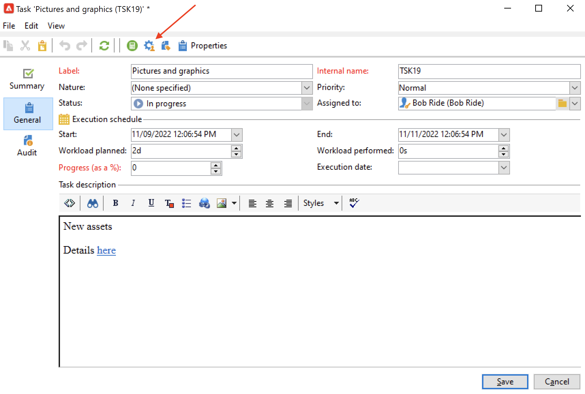
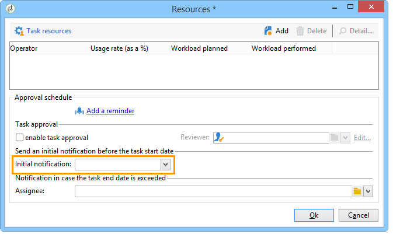
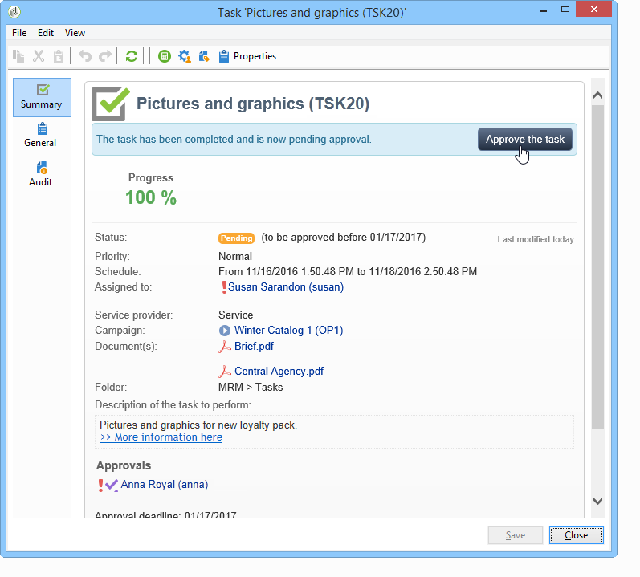

# 建立及管理設定檔{#creating-and-managing-tasks}

Adobe Campaign 可讓您直接在應用程式中建立任務並管理其完整的生命週期. 方案和活動實施可分解為分配給Adobe Campaign運營商或外部服務提供商的任務。 通過此操作模式，您可以建立一個包括所有方案參與者和外部參與者的開放協作環境。

可以從任務清單或市場活動控制面板建立、查看和監視任務。 也可以在市場營銷計畫、計畫和市場活動的計畫中查看和跟蹤這些計畫。

任務已附加到市場活動，並且可以具有相關性，即關聯任務。 每個任務都具有狀態、優先順序、估計負載和相關成本。

所有任務都分組到可通過 **市場活動** 頁籤。 有關此內容的詳細資訊，請參閱 [訪問任務](#accessing-tasks)。

它們可以顯示在它們所屬的程式的計畫中。

## 訪問任務 {#accessing-tasks}

### 顯示任務 {#displaying-tasks}

這些任務顯示在可通過 **[!UICONTROL Campaigns]** 頁籤。

可以查看當前運算子的所有任務。

有關此內容的詳細資訊，請參閱 [任務的執行狀態](#execution-status-of-a-task) 和 [任務的進度狀態](#progress-status-of-a-task)。

### 篩選任務 {#filtering-tasks}

當顯示此視圖時，系統會自動篩選它，以便僅顯示 **當前操作員任務**。 也可以使用窗口上部分的欄位篩選任務。

### 編輯任務 {#editing-tasks}

按一下任務以編輯它。

## 建立新任務 {#creating-a-new-task}

要建立任務，請執行以下步驟：

1. 瀏覽到 **[!UICONTROL Tasks]** 連結 **[!UICONTROL Campaigns]** 頁籤 **[!UICONTROL Create]**。

   

1. 輸入任務的名稱，並選擇它連結到的市場活動。
1. 設定開始日期和結束日期。
1. 按一下 **[!UICONTROL Save]** 的子菜單。

   

您還可以通過市場活動的控制面板建立任務：在這種情況下，它會自動連結到建立它的市場活動。

建立任務後，它將添加到市場活動計畫、市場活動控制面板和任務清單中。 要編輯任務，請從任務清單中按一下其名稱，或從計畫或市場活動控制面板中選擇它，然後按一下 **[!UICONTROL Open]**。

建立後，您可以通過定義：

* 經理和參與者。 [了解更多](#manager-and-participants)
* 建立計畫。 [了解更多](#execution-schedule)
* 已承諾的成本。 [了解更多](#expenses-and-revenues)

也可以添加 [審核](#reviewers) 和 [參考文檔](#documents-referenced)。

任務生命週期在 [此部分](#life-cycle)。

### 經理和參與者 {#manager-and-participants}

預設情況下，任務將分配給建立該任務的操作員。 當該任務需要操作時，會通知此運算子。

可以從 **[!UICONTROL Assigned to]** 的子菜單。

>[!NOTE]
>
>操作員管理詳見 [此部分](../../v8/start/gs-permissions.md)。
>
>只允許負責任務的操作員關閉它。

您可以指定執行任務時涉及的更多運算子。 不允許這些運算子關閉任務：他們只能批准分配給他們的任務。

要添加任務運算子，請執行以下步驟：

1. 按一下 **[!UICONTROL Resources]** 表徵圖

   

1. 按一下 **[!UICONTROL Add]** 選擇相關的運算子。
1. 輸入使用率：這表示在任務執行期間分配給操作員的工作量。 此比率僅表示，以百分比表示。

   

   例如，對於執行時間表設定為10天的任務，在10天內，其使用率為50%的操作員將在此任務上調動其一半工作時間。

   對於每個操作員，您可以輸入計畫的工作量和實際的工作量。 這些持續時間也僅供參考。

1. 您可以從 **[!UICONTROL Add a reminder...]** 的子菜單。 在任務結束日期之前，將向任務中涉及的所有操作員發送電子郵件通知。

   

1. 您還可以在任務開始之前發送通知。 要設定此設定，請在 **[!UICONTROL Initial notification]** 的子菜單。
1. 當到達結束日期且任務未關閉時，可以向在 **[!UICONTROL Assignee]** 的下界。

操作儀面板允許您檢查其工作量（其他正在執行的任務）。

### 任務審批 {#reviewers}

除了參與者，您還可以定義操作員，這些操作員將在任務關閉後複查任務。

要執行此操作，請按一下 **[!UICONTROL Enable task approval]** 的 **[!UICONTROL Resources]** 的子菜單。 這可以是單個運算子、一組運算子或運算子清單。

要指定運算子清單，請按一下 **[!UICONTROL Edit...]** 連結到第一個審閱者的右側，並根據需要添加盡可能多的運算子，如下所示：

您可以在配置窗口的下半部分定義任務的審批計畫。 預設情況下，審閱人從提交日期開始有三天時間批准任務。 您還可以添加提醒，提醒將在批准截止時間之前自動發送給相關操作員。

即使已指派其他操作員來批准該任務，任務負責人也可以為自己分配該任務。 如果尚未定義審核者，則通知將發送給負責此任務的人員。 所有其他Adobe Campaign運營商 **[!UICONTROL Administrator]** 權限也可以批准該任務。 但是，它們不會收到通知。

### 引用的文檔 {#documents-referenced}

可以添加 [文檔和市場營銷資源](managing-marketing-resources.md) 任務。

要執行此操作，請執行以下操作：

1. 開啟任務，然後按一下 **[!UICONTROL Documents]** 表徵圖

   

1. 按一下 **[!UICONTROL Add]** 並選擇要添加到任務中的文檔。 對市場營銷資源應用相同的流程。

將引用的文檔添加到發送給任務中涉及的操作員的通知中。 它們也會添加到任務儀表板中。

### 執行計畫 {#execution-schedule}

任務的有效期在 **[!UICONTROL Start]** 和 **[!UICONTROL End]** 的子菜單。 計畫的負載表示在該期間要執行的工作負載。 它以天或小時表示。

>[!NOTE]
>
>任務的生命週期在 [生命週期](#life-cycle)。

的 **[!UICONTROL Workload performed]** 欄位也以天數和小時數表示，允許您手動更新任務相對於計畫工作量的進度。

的 **[!UICONTROL Progress status]** 根據涉及的操作員執行的任務自動更新任務的百分比。 可以手動輸入。

可以在任務儀表板中查看此資訊。

它也可在市場活動標籤中看到。

如果任務執行計畫結束日期已達，但任務尚未完成，則任務將 **[!UICONTROL Late]**。 警告消息也將顯示給警報運算子。

有關此內容的詳細資訊，請參閱 [任務的進度狀態](#progress-status-of-a-task)。

### 支出和收入 {#expenses-and-revenues}

您可以為每個任務定義相關費用和預測收入。 這些將被計算，然後合併任務所附的市場活動。

要指定此資訊，請按一下 **[!UICONTROL Expenses and revenue]** 表徵圖

預設情況下，計費的預算是任務附加到的市場活動的預算。 它顯示在任務詳細資訊中。

>[!NOTE]
>
>有關費用和預算的詳細資訊，請參閱 [此部分](../campaigns/providers--stocks-and-budgets.md#cost-commitment--calculation-and-charging)。

在此窗口中，您還可以定義要達到的目標。 目標以任務的預測收入表示。

### 服務提供者 {#service-providers}

外部服務提供商可以參與任務的管理。

為此，請編輯任務屬性並選擇相關的服務提供商。 與服務提供商關聯的成本類別將自動列在窗口的中央部分。

選擇與執行任務相關的成本類別。 為此，請選擇成本類型，並在必要時添加附加費金額。

>[!NOTE]
>
>管理預算及成本之方法呈列於 [控製成本](controlling-costs.md)。

選擇服務提供程式後，它將顯示在任務儀表板中：

### 延遲任務 {#late-tasks}

如果任務已到達其結束日期，且其狀態未更改為，則任務將延遲 **[!UICONTROL Finished]**。 預設情況下，任務延遲時不會警告任何運算子。 您可以配置通知電子郵件的傳遞：即使所有運算子不參與任務，也可以通知它們。

轉到 **[!UICONTROL Resources]** 框中，將運算子添加到 **[!UICONTROL Assignation]** 的子菜單。 要通知多個人，請選擇一組運算子。

### 初始通知 {#initial-notifications}

當您在將來建立或修改具有開始日期的任務時，Adobe Campaign會向負責該任務的人員發送電子郵件，以告知其何時開始。

但是，如果您正在建立的任務離您很遠，則最好在任務開始之前安排發送通知。 例如，如果任務在一個月內開始，您可以在任務開始前一週通知負責該任務的人員。

要計畫通知，請轉到 **[!UICONTROL Resources]** 框並使用 **[!UICONTROL Initial notification]** 的子菜單。

* 對於市場活動中的任務，請選擇特定的日期和時間。
* 對於市場活動模板中的任務，通知時間表示為任務開始前剩餘的時間(例如，如果您在 **[!UICONTROL Initial notification]** 欄位中，電子郵件將在任務開始日期之前2天發送)。

如果已計畫通知，則在保存任務時，Adobe Campaign仍提出立即發送通知。 您可以決定發送它，這不會替換計畫的通知。

### 連結到程式的任務 {#task-linked-to-a-program}

您可以直接在方案中建立任務，以管理與其整體組織相關的活動，而不是與特定市場活動相關的活動（例如，討論方案內即將進行的市場活動主題的會議）。 任務將顯示在程式計畫中。

要建立直接連結到程式的任務，請執行以下操作：

1. 開啟程式計畫：在首頁上，轉到 **[!UICONTROL Campaigns > Browse > Other choices > Programs]**。 整個程式計畫將在窗口的右側部分開啟。
1. 在計畫中，按一下所需的程式：窗戶里會出現一個程式。
1. 在此窗口中，按一下 **[!UICONTROL Open]**。 程式計畫開啟。
1. 按一下 **[!UICONTROL Add]** 按鈕，然後按一下 **[!UICONTROL Add a task]**。

### 操作員可用性 {#operator-availability}

在任務控制面板中，操作員名稱旁邊的表徵圖表示他們在任務所涵蓋的期間內已經處理了另一個任務或事件。 操作員負責或參與的任務顯示在 **[!UICONTROL Assigned to]** 或 **[!UICONTROL Resources]** 框。

### 工作流中的任務 {#task-in-a-workflow}

使用 **[!UICONTROL Task]** 市場活動工作流中的要素使您可以根據任務是否被批准來定義兩個方案。

在市場活動工作流中， **[!UICONTROL Task]** 在 **[!UICONTROL Flow control]** 頁籤。

## 任務類型 {#types-of-task}

通過市場活動建立任務時，可以建立特定任務。 任務類型在選定模板中定義。

可以計畫以下任務：

* [控制任務](#control-tasks)。
* [分組任務](#grouping-task),
* [分組任務](#grouping-task),
* [通知任務](#notification-task)。

>[!NOTE]
>
>**[!UICONTROL Control task]** 和 **[!UICONTROL Grouping]** 可以建立任務 **僅** 通過市場活動控制板。\
>它們顯示在為其分配了它們的操作員的任務圖中。 請參閱 [訪問任務](#accessing-tasks)。

### 控制任務 {#control-tasks}

A **[!UICONTROL Control task]** 連結至交貨審批：批准目標、內容、提取檔案、預算或證明。

建立任務後，任務將添加到市場活動控制面板。

然後，可編輯它並指定其參數。

### 市場營銷資源建立任務 {#marketing-resource-creation-task}

市場營銷資源建立任務可用於管理市場營銷資源的建立和發佈。 如果您通過任務而不是通過資源本身管理資源，則可以：

* 通過市場活動控制資源建立流程。
* 在計畫中查看資源建立流程。
* 管理資源建立過程（提醒、通知）。
* 計算並控制連結到資源建立的成本。
* 通過任務審批和發佈資源（如果啟用了相關選項）。

#### 任務及其連結資源之間的交互 {#interaction-between-the-task-and-its-linked-resource}

市場營銷資源建立任務與連結到它的資源交互。 這意味著：

* 資源建立計畫和連結到它的成本通過任務進行管理。
* 操作員可以像正常（下載或上載、鎖定和解鎖）一樣處理資源：這不會影響任務。
* 資源審批和發佈可以通過以下任務執行：的 **[!UICONTROL Publish the marketing resource]** 選項，在任務完成後自動批准和發佈資源。 如果未啟用該選項，則任務和資源不交互：對一個不會影響另一個。

   您可以使用一系列連結的任務來定義完整的審批週期。 檢查 **[!UICONTROL Publish the marketing resource]** 選項：需要完成所有任務才能發佈資源。 此外，在建立子市場營銷資源任務時，將在子任務中自動選擇資源。

   * **通過資源**:如果提交資源以供審批或審批，則這些操作不會影響任務。
   * **通過任務**:的 **[!UICONTROL Publish the marketing resource]** 選項，在任務完成後自動批准並發佈資源（請參閱上文）。 如果未選中該選項，則任務和資源將不進行交互：對一個不會影響另一個。

#### 配置市場營銷資源建立任務 {#configuring-a-marketing-resource-creation-task}

複查任務的人員不必是複查資源中定義的內容的相同人員。 但是，如果 **[!UICONTROL Publish the marketing resource]** 選項被選中（請參閱下面），任務審閱者被授權批准資源內容，完成任務後將自動批准該資源（或者，如果未定義審閱者，則指定任務管理器）。

在 **[!UICONTROL Marketing resource]** 欄位中，定義要通過此任務管理的資源。 您可以：

* 選擇現有資源：下拉清單提供狀態為 **[!UICONTROL Being edited]**。
* 建立資源：按一下 **[!UICONTROL Select the link]** 表徵圖，然後按一下 **[!UICONTROL Create]** 表徵圖

的 **[!UICONTROL Publish the marketing resource]** 選項，您可以自動執行資源發佈：一旦任務完成 **[!UICONTROL Finished]**，資源的狀態自動切換到 **[!UICONTROL Published]**，即使它既未提交審批，也未獲得批准，包括完成任務的審閱者不是資源中定義的內容審閱者。

的 **[!UICONTROL Publish the resource]** 按鈕可用，資源發佈審閱者將收到通知電子郵件以通知他們已準備好發佈。 在 **[!UICONTROL Edit > Tracking]** 頁籤，任務審閱者審閱和發佈的內容將變為可見。 如果已定義資源後處理工作流，則立即執行該工作流。

### 組任務 {#grouping-task}

的 **[!UICONTROL Grouping task]** type task允許您對多個任務進行分組，並同步其進度管理和審批。

分組任務沒有連結的支出或資源。

可在其自己的儀表板上查看分組任務的所有任務。 這允許您篩選任務清單，以僅顯示您感興趣的任務。

分組任務具有一個連結，您可以輕鬆建立分組任務。

要根據分組任務建立分組任務，請轉到市場活動控制面板，按一下分組任務的名稱以顯示其說明，然後按一下 **[!UICONTROL Add a task]**。

但是，如果您已經建立了要連結到分組任務的任務，則可以通過 **[!UICONTROL Linked to]** 的 **[!UICONTROL Properties]** 框。

### 通知任務 {#notification-task}

通知任務使您能夠安排電子郵件遞送（給操作員、一組操作員、服務提供商等）。 這樣，您就可以安排提醒，例如通知某人市場活動即將完成，或在市場活動開始之前發送文檔，以便操作員可以準備。 這意味著您可以跟蹤您在活動或計畫中的通信，並更密切地關注所執行的操作。

#### 生命週期 {#life-cycle}

通知任務不需要審批。 這意味著他們的生命週期比標準任務的生命週期要簡單：

通知任務可以具有以下狀態：

* **[!UICONTROL Scheduled]** 直到電子郵件被發送
* **[!UICONTROL In progress]** 一旦發送電子郵件，直到到達結束日期
* **[!UICONTROL Finished]** 到達結束日期後。

#### 設定 {#configuration}

在建立過程中，必須在任務中輸入以下元素：

* **[!UICONTROL Assigned to]** :接收電子郵件的操作員或操作員組。 如果在電子郵件發送後重新分配任務，則不會將電子郵件發送給新操作員（要執行此操作，您需要重新初始化任務並更改其開始日期）。
* **任務開始日期**:通知電子郵件將發送的日期。 此日期必須在將來記錄任務時發生。
* **任務結束日期**:任務狀態更改為的日期 **[!UICONTROL Finished]**。 預設情況下，結束日期與開始日期相同。 但是，為任務分配持續時間允許您表示操作員在計畫中必須執行操作的時間（如有必要）。
* **[!UICONTROL Description]** :此處輸入的文本將顯示在通知電子郵件的正文中。

   

您可以向任務和通知電子郵件添加附件。 要執行此操作，請按一下 **[!UICONTROL Documents]** 表徵圖。

## 生命週期 {#life-cycle-1}

### 任務間的連結 {#links-between-tasks}

的 **[!UICONTROL Properties]** 按鈕，您可以定義市場活動中任務之間的連結。 您可以使用分組任務將任務分解為子任務(請參閱 [連結的任務](#linked-tasks))，或定義任務之間的依賴關係(請參見 [分組任務](#grouping-tasks))。

#### 連結的任務 {#linked-tasks}

使用 **[!UICONTROL Linked task]** 將任務與分組任務關聯的欄位。 請參閱 [任務類型](#types-of-task)。

在以下示例中，目標批准被分解為四個子任務。

每個子任務都是連結到主任務的標準任務。

#### 組任務 {#grouping-tasks}

使用 **[!UICONTROL Grouped to]** 欄位，使任務的執行取決於另一個任務的執行。

任務之間的依賴關係由市場活動控制面板中的箭頭表示。

在分組任務的情況下，Adobe Campaign會自動將父任務的結束日期作為開始日期分配給子任務。 例如，如果 **建立邀請** 任務於10月15日下午3點30分結束， **發送邀請電子郵件** 子任務將於10月15日下午3點30分開始。

此外，如果您推遲父任務的結束，其某些子任務可能會受到影響：這些是其狀態為 **[!UICONTROL Scheduled]** 且其開始日期早於父任務的新結束日期。 任務的持續時間保持不變。 如果子任務的開始日期晚於父任務的新結束日期，則子任務不受影響。

**範例**

預定於10月9日下午5點結束的父任務有兩個子任務，任務A和任務B。任務A定於10月10日下午2點開始，任務B定於10月12日上午8點開始。

讓我們推遲父任務：現在於10月11日下午1點結束。 只有任務A被推遲，將於10月11日下午1點開始。

### 任務的執行狀態 {#execution-status-of-a-task}

任務狀態可以在任務圖中查看。 根據操作員操作自動更新任務的執行狀態。

任務可以是： **[!UICONTROL Scheduled]**。 **[!UICONTROL In progress]**。 **[!UICONTROL Finished]**。 **[!UICONTROL Canceled]**。 **[!UICONTROL Pending approval]** 或 **[!UICONTROL Rejected]**。

* 建立任務時， **[!UICONTROL Scheduled]** 的子菜單。 它將保持此狀態，直到達到其開始日期。
* 啟動後，任務為 **[!UICONTROL In progress]**。 當任務負責人關閉任務時，它將更改為 **[!UICONTROL Finished]**。
* 如果已定義審閱者，則任務將 **[!UICONTROL Pending approval]** 一旦主管人員關閉，直到審核者批准。 如果審閱者拒絕，則任務將 **[!UICONTROL Rejected]**。
* 任務可由負責該任務的人員通過控制面板或 **[!UICONTROL Task map]** 按一下 **[!UICONTROL Cancel]** 按鈕
* 要計畫任務，請輸入將來的開始日期。 然後，您可以向參與執行任務的Adobe Campaign操作員發送第一個通知。 請參閱 [完成任務生命週期](#complete-task-life-cycle)。

>[!NOTE]
>
>* 任務狀態將自動更新。
>* 即使有效期已結束，尚未關閉的任務仍會顯示在正在進行的任務清單中。 警告會通知操作員任務已延遲。
>

### 任務的進度狀態 {#progress-status-of-a-task}

除執行狀態外，任務還可以與進度狀態關聯： **[!UICONTROL Late]**。 **[!UICONTROL To approve]**。 **[!UICONTROL To do today]** 或 **[!UICONTROL To do this week]**。 此資訊根據任務計畫自動輸入。

您可以按進程或進度狀態篩選任務清單。

有關此內容的詳細資訊，請參閱 [訪問任務](#accessing-tasks)。

### 完成任務生命週期 {#complete-task-life-cycle}

以下是整個任務生命週期的階段，負責人為其定義了參與者和審閱者。

1. 負責人建立任務並進入各個欄位。 有關此內容的詳細資訊，請參閱 [建立新任務](#creating-a-new-task)。

   建立和編輯任務時 **計畫在將來** （只要未達到任務開始日期），就可以向參與者和經理發送通知，讓他們知道已安排新任務。

   

   要發送此第一個通知，請按一下 **[!UICONTROL Yes]**。 此通知將告知他們下一個任務，並包括有關內容的詳細資訊以及截止時間前剩餘的天數。

   當建立並計畫將來的任務時，其狀態為 **[!UICONTROL Scheduled]**。

1. 在任務開始日期，負責人和參與者將收到通知，通知他們任務已開始。 其狀態更改為 **[!UICONTROL In progress]**。
1. 完成分配給他們的部分後，參與者可以批准該任務：

   * 通知電子郵件。
   * 通過控制台或web介面，在任務控制板中。

      

1. 每次參與者批准作業時，任務的進度狀態都會更新。

   

1. 審閱者收到通知電子郵件，通知他們操作員已完成分配給他們的部分。

   它們可以跟蹤任務儀表板上的進度。

   

1. 一旦負責任務的人員確定任務已完成，他們就可以關閉該任務，使用任務啟動時發送的通知電子郵件中的連結、控制台或介面。

   

   >[!NOTE]
   >
   >負責任務的人員可以隨時關閉該任務，即使未獲得批准。 進度狀態自動更改為100%。

1. 任務狀態更改為 **[!UICONTROL To approve]**，並向審閱者發送通知。

   他們通過通知電子郵件、控制台或Web介面批准任務。

   他們可以通過市場活動控制板進行操作：

   

   它們還可以使用任務審批按鈕：

   

   >[!NOTE]
   >
   >任務狀態將僅更改為 **[!UICONTROL To approve]** 如果已啟用 **[!UICONTROL Enable task validation]** 的上界 **[!UICONTROL Resources]** 的子菜單。\
   >如果審閱者拒絕該任務，其狀態將更改為 **[!UICONTROL Rejected]**，任務生命週期將自動重新啟動。

1. 任務狀態更改為 **[!UICONTROL Finished]**。 將向涉及的每個人發送通知。

   >[!NOTE]
   >
   >任務完成後，其生命週期可由其負責人重新初始化。 為此，請開啟任務，然後按一下 **[!UICONTROL Reset task to execute it again...]** 按鈕。
