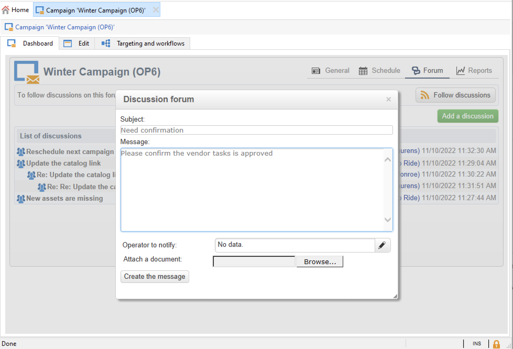

# 論壇{#discussion-forums}

Adobe Campaign操作人員可使用討論區來共用資訊。 下列各元素有各自的論壇：計畫、方案、行銷活動、行銷資源、模擬、庫存。 每個操作員也有一個個人論壇。 所有討論都是公開的，甚至在個人論壇中也是如此。

操作員可以訂閱論壇，以便在每次張貼訊息時收到通知電子郵件。

## 存取論壇 {#accessing-a-forum}

若要存取論壇，請瀏覽至控制面板並按一下 **[!UICONTROL Forum]** 連結在右上角。

訊息及其回應會以從最新到最舊的順序顯示。

若要啟動新螺紋，請按一下 **[!UICONTROL Add a discussion]** 按鈕。 此 **[!UICONTROL Discussion forum]** 方塊隨即出現（請參閱下文）。

在「 」中輸入文字 **[!UICONTROL Message]** 中的欄位和討論標題 **[!UICONTROL Subject]** 欄位。

預設會通知已在此論壇中張貼訊息的操作者。 您可以選取要通知的其他運運算元。 若要通知數個運運算元，請選取一組運運算元。

您可以使用  **[!UICONTROL Browse...]** 按鈕。 附件也會包含在通知電子郵件中。 附件只能個別傳送：若要傳送多個檔案，必須將其壓縮為.zip檔案。

>[!CAUTION]
>
>訊息一旦張貼至論壇，就無法再變更或刪除。

## 張貼至操作員的個人論壇 {#posting-to-the-personal-forum-of-an-operator}

您可以張貼訊息至運運算元的論壇。 個人論壇是公開的，所有操作員都可以看到您的訊息。 操作員在每次有人張貼到他們的個人論壇時都會收到電子郵件通知。

若要存取運運算元的論壇，您可以：

* 瀏覽至 **[!UICONTROL Administration > Access management > Operators]** 在Campaign檔案總管的資料夾中，選取運運算元以開啟其控制面板，然後按一下 **[!UICONTROL Forum]** 右上角的連結。
* 在Adobe Campaign UI中尋找運運算元的名稱（透過此運運算元張貼至論壇的訊息、指派給他們的任務），然後按一下以存取運運算元控制面板。

## 訂閱論壇 {#subscribing-to-a-forum}

訂閱論壇可讓您關注所有討論。 訂閱後，每次在論壇中張貼訊息時，您都會收到電子郵件通知。

若要回複訊息，請按一下電子郵件內文，然後登入Adobe Campaign網路介面。

* 若要訂閱論壇，請按一下 **[!UICONTROL Follow discussions]** 按鈕來顯示訊息清單上方的訊息。

  區段變為藍色，並顯示您已訂閱論壇。

* 若要取消訂閱論壇，請按一下 **[!UICONTROL Unsubscribe]** 按鈕。

* 您的個人儀表板會列出您訂閱的論壇。 按一下 **[!UICONTROL Subscription to discussion forums]** 連結以顯示清單，然後按一下您感興趣的專案以存取其論壇。

  

## 疑難排解通知傳送 {#checking-notification-delivery}

如果訂閱論壇的運運算元沒有如預期收到通知：

* 檢查是否在操作員的設定檔中輸入電子郵件地址。
* 瀏覽至 **[!UICONTROL Administration > Production > Technical workflows > Campaign processes]** Campaign檔案總管的資料夾，並檢查 **[!UICONTROL Jobs in discussion forums]** 工作流程已啟動，沒有錯誤。
* 檢查傳送記錄檔：

   * 在Adobe Campaign首頁上，瀏覽至 **[!UICONTROL Campaigns > Navigation > Deliveries]**，然後開啟 **[!UICONTROL Discussion forum notification]** 傳遞。
   * 在Campaign檔案總管中，瀏覽至 **[!UICONTROL Administration > Production > Objects created automatically > Technical deliveries > Workflow notifications]**，然後按一下 **[!UICONTROL Discussion forum notifications]**.

  在 **[!UICONTROL Discussion forum notifications]** 方塊中，傳送記錄位於 **[!UICONTROL Edit > Delivery]** 標籤。 您也可以檢視 **[!UICONTROL Tracking > Log]** 和 **[!UICONTROL Exclusion causes]** 索引標籤。
