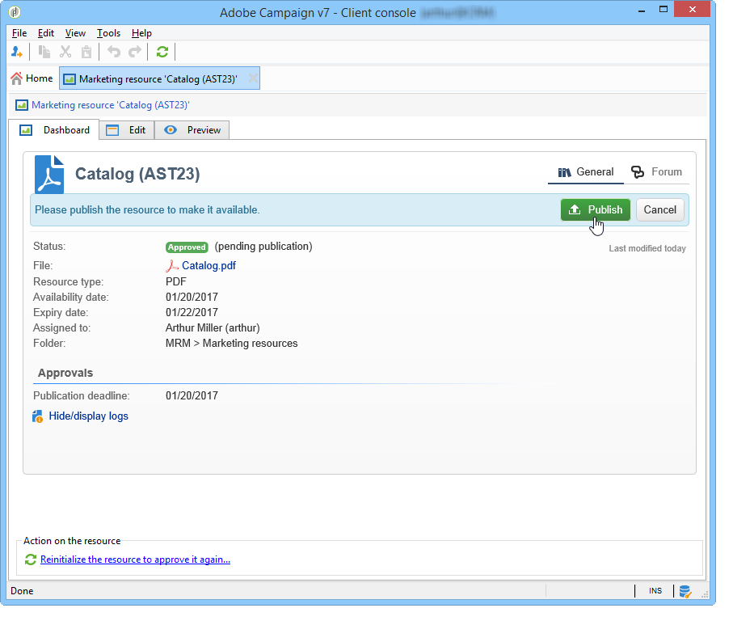

# 管理行銷資源{#managing-marketing-resources}

Adobe Campaign可讓您管理及追蹤促銷活動生命週期中涉及的行銷資源。 這些行銷資源可以是手冊、視覺輔助工具或涉及數個營運商的任何其他通訊媒體。

對於透過Adobe Campaign管理的每個行銷資源，您可以隨時追蹤其狀態和歷史記錄，並檢視目前版本。

## 新增行銷資源 {#adding-a-marketing-resource}

行銷資源可透過 **[!UICONTROL Campaigns]** 標籤。

若要新增資源，請按一下 **[!UICONTROL Create]** 按鈕。

若要讓資源在Adobe Campaign伺服器上可用，您必須將所需資源拖曳至編輯器的中間區域，以新增該資源。 您也可以按一下 **[!UICONTROL Upload file to server...]** 連結。

確認訊息可讓您啟動上傳。

上傳完成時，資源會新增至可用資源清單。 Adobe Campaign運算子可存取。 他們可以檢視(透過 **[!UICONTROL Preview]** 標籤)、建立要修改的副本，或在伺服器上更新檔案(使用 **[!UICONTROL Edit]** 標籤)。

按一下 **[!UICONTROL General]** 頁簽，以選擇負責監視、跟蹤和批准此資源的操作員或操作員組。 選取審核者需透過 **[!UICONTROL Advanced parameters]** 連結。

* 為其分配資源的運算子負責跟蹤該資源。
* 核准營運商負責核准行銷資源。 資源驗證程式啟動時，系統會通知他們。

   如果未選擇審核者，則資源 **[!UICONTROL cannot be]** 須經批准。

* 如有必要，您也可以指定校對程式。

您可以為資源指定（指示性）可用日期。 在此日期後，會以 **[!UICONTROL Late]** 狀態。

## 資源協作工作 {#collaborative-work-on-resources}

您可以修改和更新行銷資源，並視需要通知其他Adobe Campaign運算子。 您可以：

* 將資源下載到本機以修改它。
* 更新伺服器上的檔案，讓其他運算子可存取該檔案。
* 鎖定資源，以禁止其他運算子修改資源。

>[!NOTE]
>
>此 **[!UICONTROL History]** 索引標籤包含資源的下載和更新記錄。 此 **[!UICONTROL Details]** 按鈕可讓您檢視選取的版本。

### 鎖定/解鎖資源 {#locking-unlocking-a-resource}

建立後，資源便可在行銷資源控制面板中使用，而運算子可以編輯和修改資源。

當操作員希望處理資源時，最好在開始工作之前鎖定資源，防止其他操作員同時修改資源。 然後會保留資源；它仍可存取，但無法由其他運算子在伺服器上發佈或更新。

特殊訊息會通知嘗試存取該訊息的任何運算子：

此 **[!UICONTROL Tracking]** 標籤指明鎖定資源的運算子的名稱和計畫的更新日期。

若要鎖定資源，您必須按一下資源，後面接著 **[!UICONTROL Lock]** 按鈕。

您可以在 **[!UICONTROL Tracking]** 索引標籤。

此資訊可讓您通知其他Adobe Campaign運算子資源將解除鎖定的日期。

更新資源後，該資源會自動解除鎖定，並可再次供所有運算子使用。

如有必要，您也可以從控制面板手動解除鎖定。

>[!NOTE]
>
>只有鎖定資源的運算子和具有管理員權限的運算子才有權解鎖資源。

### 論壇 {#discussion-forums}

對於每個資源， **[!UICONTROL Forum]** 標籤可讓參與者交換資訊。

[論壇](discussion-forums.md) 說明論壇在Adobe Campaign的運作方式。

## 行銷資源的生命週期 {#life-cycle-of-a-marketing-resource}

建立資源時，會指派Adobe Campaign運算子來設計、校對、核准和發佈資源。 可決定這些促銷活動的持續時間。

此 **[!UICONTROL Tracking]** 標籤可讓您監視在資源上執行的任何動作：批准、批准拒絕、相關評論或出版物。

此 **[!UICONTROL History]** 索引標籤會顯示為此資源執行的檔案傳輸。

### 核准程式 {#approval-process}

如果預期可用日期是在 **[!UICONTROL Tracking]** 標籤。 到達此日期後，您可以使用 **[!UICONTROL Submit for approval]** 按鈕。 然後資源狀態會變更為 **[!UICONTROL Approval in progress]**.

資源可透過 **[!UICONTROL Approve resource]** 按鈕。

然後，授權操作員可以接受或拒絕批准。 此動作可能：透過所傳送的電子郵件訊息（透過按一下通知訊息中的連結）或透過主控台(透過按一下 **[!UICONTROL Approve]** )按鈕。

批准窗口可讓您輸入注釋。

此 **[!UICONTROL Tracking]** 索引標籤可讓所有運算子追蹤核准程式的各個階段。

>[!NOTE]
>
>除了為每個行銷資源指定的審核者之外，具有管理員權限的運算子和資源管理器也被授權批准行銷資源。

### 發佈資源 {#publishing-a-resource}

核准後，必須發佈行銷資源。 發佈程式必鬚根據公司要求進行具體實施。 這表示資源可以發佈在外聯網或任何其他伺服器上，特定資訊可以發送到外部服務提供商等。

若要發佈資源，請按一下 **[!UICONTROL Publish]** 按鈕。

您也可以透過工作流程自動發佈資源。

發佈資源表示資源可供使用（例如由其他任務使用）。 依資源性質而異，發佈方式也會有所不同：對於傳單，發佈可能意味著將檔案傳送至印表機、對於網路代理，也可能意味著將其發佈至網站等。

若要讓Adobe Campaign發佈，您需要建立適當的工作流程並將其連結至資源。 若要這麼做，請開啟 **[!UICONTROL Advanced settings]** 資源的方塊，然後在 **[!UICONTROL Post-processing]** 欄位。

工作流程將執行：

* 審核者按一下 **[!UICONTROL Publish resource]** 連結（若未定義審核者，則為資源負責人）。
* 如果資源是透過行銷資源建立任務來管理，則會在任務設為時執行 **[!UICONTROL Finished]**，只要 **[!UICONTROL Publish the marketing resource]** 框(請參閱 [行銷資源建立任務](creating-and-managing-tasks.md#marketing-resource-creation-task))

如果工作流程未立即啟動（如果例項的工作流程已停止），則資源的狀態會變更為 **[!UICONTROL Pending publication]**. 工作流程啟動後，資源的狀態會變更為 **[!UICONTROL Published]**. 此狀態不會考慮發佈程式中可能發生的錯誤。 檢查工作流程的狀態，以確定其已正確執行。

## 將資源連結至促銷活動 {#linking-a-resource-to-a-campaign}

### 參考行銷資源 {#referencing-a-marketing-resource}

若已在促銷活動範本中選取此功能，則行銷資源可與促銷活動相關聯。

>[!NOTE]
>
>如需如何建立和設定促銷活動範本的詳細資訊，請參閱 [行銷活動範本](../campaigns/marketing-campaign-templates.md)

按一下 **[!UICONTROL Documents > Resources]** 標籤，然後按一下 **[!UICONTROL Add]** 來選擇相關資源。

您可以依狀態、性質或類型來篩選資源，或套用個人化篩選。

按一下 **[!UICONTROL OK]** 將資源新增至此促銷活動參考的行銷資源清單。

此 **[!UICONTROL Details]** 按鈕可讓您編輯和檢視。

新增的資源會顯示在控制面板中。 您也可以在那裡編輯這些內容。

### 新增行銷資源至傳送大綱 {#adding-a-marketing-resource-to-a-delivery-outline}

行銷資源可透過傳送大綱與傳送相關聯。

>[!NOTE]
>
>如需傳送大綱的詳細資訊，請參閱 [通過傳送大綱關聯和構建連結的資源](../campaigns/marketing-campaign-deliveries.md).

## 股票管理 {#stock-management}

您可以將行銷資源與一個或多個庫存關聯，以便管理供應，並在庫存不足時在控制面板上顯示警告。

>[!NOTE]
>
>如需Adobe Campaign庫存管理的詳細資訊，請參閱 [股票管理](../campaigns/providers--stocks-and-budgets.md#stock-management).

要將市場營銷資源與庫存關聯，請編輯庫存圖並編輯或建立庫存。 新增庫存行並選取對應的行銷資源。

如有必要，您可以透過 **[!UICONTROL Edit the link]** 圖示（放大鏡），在選取資源後就會位於資源右側。

指定初始庫存和警報庫存，然後儲存。

庫存在於資源詳細資訊中。

當庫存不足時，向相關操作者發出警告。

## 進階函式 {#advanced-functions}

行銷資源控制面板可讓您執行一般的作業類型：新增、編輯、鎖定/解除鎖定、核准、發佈。 您可以建立其他類型的行銷資源，並透過Adobe Campaign樹狀結構存取進階功能。 要執行此操作，請按一下 **[!UICONTROL Explorer]** 在Adobe Campaign首頁。

依預設，行銷資源會儲存在 **[!UICONTROL MRM > Marketing resources]** 樹的節點。

您可以從此檢視新增下列資源：

* 檔案
* HTML
* 文字
* URL
