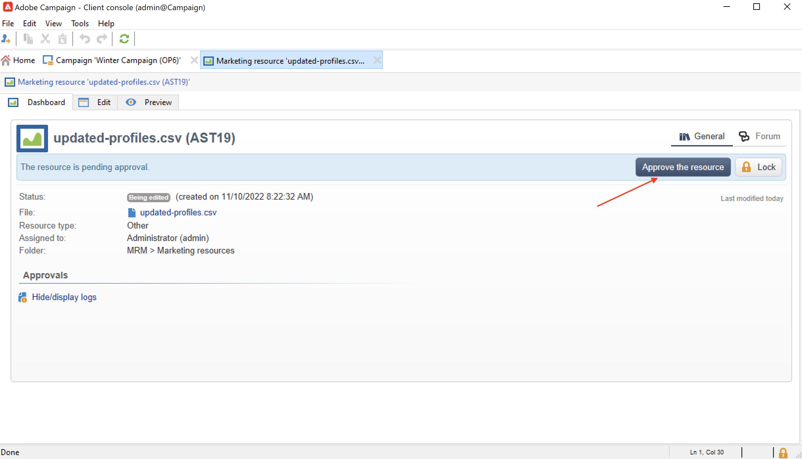

# 管理行銷資源{#managing-marketing-resources}

使用Adobe Campaign管理和跟蹤市場活動生命週期中涉及的市場營銷資源。 這些市場營銷資源可以是白皮書、資料檔案、徽標或與市場活動相關的任何其他資產。

對於通過Adobe Campaign管理的每個市場營銷資源，您可以隨時跟蹤其狀態和歷史記錄，並查看當前版本。

預設情況下，市場營銷資源儲存在 **[!UICONTROL MRM > Marketing resources]** 市場活動瀏覽器的資料夾。

## 添加市場營銷資源 {#adding-a-marketing-resource}

要添加市場營銷資源，請執行以下步驟：

1. 瀏覽到 **[!UICONTROL Campaigns]** ，然後選擇 **[!UICONTROL Marketing resouces]**。

1. 按一下 **[!UICONTROL Create]** 按鈕。
   
1. 將檔案拖放到「市場營銷資源」窗口中，將其上載到「市場活動」伺服器。 您還可以使用 **[!UICONTROL Upload file to server...]** 的子菜單。
   

上載完成後，資源將添加到可用資源清單中。

## 管理行銷資源 {#manage-marketing-resources}

上傳後，所有Adobe Campaign運營商都可以使用市場營銷資源。 他們可以查看它、建立副本以修改它或更新伺服器上的檔案。

使用 **[!UICONTROL Assigned to]** 下拉清單 **[!UICONTROL Edit]** 頁籤，選擇負責資源的操作員。

您還可以選擇負責資源驗證和資源發佈的運算子或運算子組。 要訪問這些選項，請按一下  **[!UICONTROL Advanced parameters]** 的子菜單。

啟動資源驗證進程時，會通過電子郵件通知這些操作員。

如果未選擇審閱者，則資源 **[!UICONTROL cannot be]** 須經批准。

使用 **[!UICONTROL Audit]** 頁籤，以添加校樣讀取器並定義資源的可用性日期。 在此日期之後，它將與 **[!UICONTROL Late]** 狀態。

>[!NOTE]
>
>的 **[!UICONTROL History]** 頁籤包含資源的下載和更新日誌。 的 **[!UICONTROL Details]** 按鈕來查看選定的版本。
>
>的 **[!UICONTROL Audit]** 頁籤，用於監視在資源上執行的任何操作：批准、批准拒絕、相關評論或發佈。

### 鎖定/解鎖資源 {#locking-unlocking-a-resource}

建立後，資源在市場營銷資源控制面板中可用，操作員可以編輯和修改它們。

當操作員開始處理資源時，最佳做法是鎖定資源，防止其他操作員同時修改資源。 然後保留資源：它仍然可訪問，但無法由其他操作員在伺服器上發佈或更新。

只有尚未批准市場營銷資源時，才能將其鎖定。

要鎖定資源，必須按一下 **[!UICONTROL Lock]** 按鈕。

更新資源後，按一下 **[!UICONTROL Lock]** 按鈕，使所有運算子再次可用。

特殊消息將通知任何嘗試訪問它的操作員：

的 **[!UICONTROL Tracking]** 頁籤指示鎖定資源的運算子的名稱。

>[!NOTE]
>
>只有鎖定資源的操作員和具有管理員權限的操作員才有權解鎖資源。

### 論壇 {#discussion-forums}

對於每個資源， **[!UICONTROL Forum]** 頁籤，參與者可共用資訊。

在 [討論論壇](discussion-forums.md) 的子菜單。

### 審批流程 {#approval-process}

預期可用性日期顯示在資源詳細資訊中(如果在 **[!UICONTROL Tracking]** 頁籤。 一旦達到此日期，您就可以使用 **[!UICONTROL Submit for approval]** 按鈕。 然後資源狀態更改為 **[!UICONTROL Approval in progress]**。

要批准資源，請按一下 **[!UICONTROL Approve the resource]** 按鈕。

然後，授權的操作員可以接受或拒絕批准。 此操作可能：通過發送的電子郵件（通過按一下通知消息中的連結）或通過控制台(通過按一下 **[!UICONTROL Approve]** )。

您可以在審批窗口中輸入注釋。

瀏覽到 **[!UICONTROL Tracking]** 頁籤。

>[!NOTE]
>
>除了為每個市場營銷資源指定的審閱者之外，具有管理員權限的操作員和資源管理器還被授權批准市場營銷資源。

### 發佈資源 {#publishing-a-resource}

批准後，必須發佈市場營銷資源。 出版過程必須按照公司要求具體實施。 這意味著資源可以發佈在外聯網或任何其他伺服器上，特定資訊可以發送到外部服務提供商等。

要發佈資源，請按一下 **[!UICONTROL Publish]** 按鈕。

您還可以通過工作流自動發佈資源。

發佈資源意味著使其可供使用（例如，由其他任務）。 發佈因資源性質而異：對於活頁，發佈可以意味著將檔案發送到打印機，對於Web代理，可以意味著將檔案發佈到網站等。

要使Adobe Campaign發佈，您需要建立一個足夠的工作流並將其連結到資源。 為此，請開啟 **[!UICONTROL Advanced settings...]** 框中，然後在 **[!UICONTROL Post-processing]** 的子菜單。

工作流已執行：

* 當審閱者按一下 **[!UICONTROL Publish resource]** 連結（或者，如果未定義審核者，則指資源負責人）。
* 如果通過市場營銷資源建立任務管理資源，則當任務設定為 **[!UICONTROL Finished]**，只要 **[!UICONTROL Publish the marketing resource]** 框中，選擇「預設值」。 [了解更多](creating-and-managing-tasks.md#marketing-resource-creation-task))

如果工作流未立即啟動（如果工作流已停止，例如），則資源的狀態將更改為 **[!UICONTROL Pending publication]**。 啟動工作流後，資源的狀態將更改為 **[!UICONTROL Published]**。 此狀態未考慮發佈過程中可能出現的錯誤。 檢查工作流的狀態，確保它已正確執行。

## 將資源連結到市場活動 {#linking-a-resource-to-a-campaign}

### 引用市場營銷資源 {#referencing-a-marketing-resource}

市場營銷資源可以與市場活動關聯，前提是在 [活動模板](../campaigns/marketing-campaign-templates.md)。

瀏覽到 **[!UICONTROL Edit > Documents > Resources]** 頁籤，然後按一下 **[!UICONTROL Add]** 的子菜單。

您可以按狀態、自然或類型篩選資源，或應用個性化篩選。

使用 **[!UICONTROL Details]** 按鈕來編輯和預覽資源。

### 將市場營銷資源添加到交貨大綱 {#adding-a-marketing-resource-to-a-delivery-outline}

市場營銷資源可以通過交付大綱與交付相關聯。

瞭解有關中的交付大綱的詳細資訊 [此部分](../campaigns/marketing-campaign-deliveries.md)。

為此，請按一下右鍵交貨大綱並選擇 **新建>資源**。

輸入資產名稱，然後從 **市場營銷資源** 的子菜單。

## 股票管理 {#stock-management}

您可以將市場營銷資源與一個或多個庫存相關聯，以便管理供應並在庫存不足時在控制面板上顯示警告。

要將市場營銷資源與庫存關聯，請執行以下步驟：

1. 編輯股票或建立新股票。 瞭解有關Oracle In [此部分](../campaigns/providers--stocks-and-budgets.md#stock-management)。

1. 添加庫存行，然後選擇相應的市場營銷資源。

   

   您可以通過 **[!UICONTROL Edit the link]** 表徵圖。

1. 指定初始庫和警報庫，然後保存。

在市場營銷資源中指示庫存 **股票** 頁籤。
