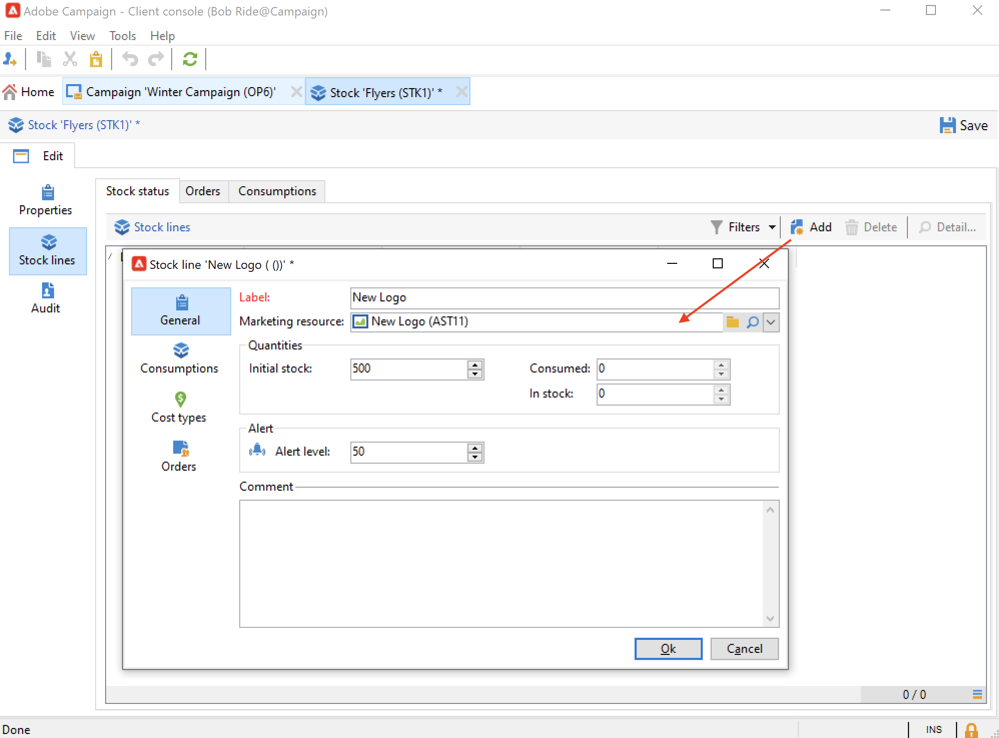

# 管理行銷資源{#managing-marketing-resources}

使用Adobe Campaign來管理及追蹤促銷活動生命週期中涉及的行銷資源。 這些行銷資源可以是白皮書、資料檔案、標誌或與促銷活動相關的任何其他資產。

對於透過Adobe Campaign管理的每個行銷資源，您可以隨時追蹤其狀態和歷史記錄，並檢視目前版本。

依預設，行銷資源會儲存在 **[!UICONTROL MRM > Marketing resources]** Campaign檔案總管的資料夾。

## 新增行銷資源 {#adding-a-marketing-resource}

若要新增行銷資源，請遵循下列步驟：

1. 瀏覽至 **[!UICONTROL Campaigns]** ，然後選取 **[!UICONTROL Marketing resouces]**.

1. 按一下 **[!UICONTROL Create]** 按鈕。
   
1. 將檔案拖放至行銷資源視窗中，將其上傳至Campaign伺服器。 您也可以使用 **[!UICONTROL Upload file to server...]** 連結。
   

上傳完成時，資源會新增至可用資源清單。

## 管理行銷資源 {#manage-marketing-resources}

上傳後，所有Adobe Campaign運算子都能使用行銷資源。 他們可以查看它、製作副本以修改它，或在伺服器上更新檔案。

使用 **[!UICONTROL Assigned to]** 下拉式清單 **[!UICONTROL Edit]** 索引標籤，以選取負責資源的運算子。

您也可以選取負責資源驗證和資源發佈的運算子或運算子群組。 若要存取這些選項，請按一下  **[!UICONTROL Advanced parameters]** 連結。

資源驗證程式啟動時，這些運算子會收到電子郵件通知。

如果未選擇審核者，則資源 **[!UICONTROL cannot be]** 須經批准。

使用 **[!UICONTROL Audit]** 索引標籤來新增校樣閱讀器並定義資源的可用日期。 在此日期後，會以 **[!UICONTROL Late]** 狀態。

>[!NOTE]
>
>此 **[!UICONTROL History]** 索引標籤包含資源的下載和更新記錄。 此 **[!UICONTROL Details]** 按鈕可讓您檢視選取的版本。
>
>此 **[!UICONTROL Audit]** 標籤可讓您監視在資源上執行的任何動作：批准、批准拒絕、相關評論或出版物。

### 鎖定/解鎖資源 {#locking-unlocking-a-resource}

建立後，資源便可在行銷資源控制面板中使用，而運算子可以編輯和修改資源。

當運算子開始使用資源時，最佳作法是鎖定資源，以防止其他運算子同時修改資源。 然後會保留資源：它仍可存取，但無法由其他運算子在伺服器上發佈或更新。

行銷資源只有在尚未核準時才可以鎖定。

若要鎖定資源，您必須按一下 **[!UICONTROL Lock]** 按鈕。

更新資源後，按一下 **[!UICONTROL Lock]** 按鈕，以再次供所有運算子使用。

特殊訊息會通知嘗試存取該訊息的任何運算子：

此 **[!UICONTROL Tracking]** 索引標籤會指出鎖定資源的運算子的名稱。

>[!NOTE]
>
>只有鎖定資源的運算子和具有管理員權限的運算子才有權解鎖資源。

### 論壇 {#discussion-forums}

對於每個資源， **[!UICONTROL Forum]** 標籤可讓參與者共用資訊。

了解更多 [論壇](discussion-forums.md) 區段。

### 核准程式 {#approval-process}

如果預期可用日期是在 **[!UICONTROL Tracking]** 標籤。 到達此日期後，您可以使用 **[!UICONTROL Submit for approval]** 按鈕。 然後資源狀態會變更為 **[!UICONTROL Approval in progress]**.

若要核准資源，請按一下 **[!UICONTROL Approve the resource]** 按鈕。

然後，授權操作員可以接受或拒絕批准。 此動作可能：透過所傳送的電子郵件訊息（透過按一下通知訊息中的連結）或透過主控台(透過按一下 **[!UICONTROL Approve]** )按鈕。

批准窗口可讓您輸入注釋。

瀏覽至 **[!UICONTROL Tracking]** 來檢查核准。

>[!NOTE]
>
>除了為每個行銷資源指定的審核者之外，具有管理員權限的運算子和資源管理器也被授權批准行銷資源。

### 發佈資源 {#publishing-a-resource}

核准後，必須發佈行銷資源。 發佈程式必鬚根據公司要求進行具體實施。 這表示資源可以發佈在外聯網或任何其他伺服器上，特定資訊可以發送到外部服務提供商等。

若要發佈資源，請按一下 **[!UICONTROL Publish]** 按鈕。

您也可以透過工作流程自動發佈資源。

發佈資源表示資源可供使用（例如由其他任務使用）。 依資源性質而異，發佈方式也會有所不同：對於傳單，發佈可能意味著將檔案傳送至印表機、對於網路代理，也可能意味著將其發佈至網站等。

若要讓Adobe Campaign發佈，您需要建立適當的工作流程並將其連結至資源。 若要這麼做，請開啟 **[!UICONTROL Advanced settings...]** 資源的方塊，然後在 **[!UICONTROL Post-processing]** 欄位。

工作流程會執行：

* 審核者按一下 **[!UICONTROL Publish resource]** 連結（若未定義審核者，則為資源負責人）。
* 如果資源是透過行銷資源建立任務來管理，則會在任務設為時執行 **[!UICONTROL Finished]**，只要 **[!UICONTROL Publish the marketing resource]** 框。 [了解更多](creating-and-managing-tasks.md#marketing-resource-creation-task))

如果未立即啟動工作流（如果例項的工作流已停止），則資源的狀態會變更為 **[!UICONTROL Pending publication]**. 工作流程啟動後，資源的狀態會變更為 **[!UICONTROL Published]**. 此狀態不會考慮發佈程式中可能發生的錯誤。 檢查工作流程的狀態，以確定其已正確執行。

## 將資源連結至促銷活動 {#linking-a-resource-to-a-campaign}

### 參考行銷資源 {#referencing-a-marketing-resource}

若已在 [行銷活動範本](../campaigns/marketing-campaign-templates.md).

瀏覽至 **[!UICONTROL Edit > Documents > Resources]** 標籤，然後按一下 **[!UICONTROL Add]** 來選擇相關資源。

您可以依狀態、性質或類型來篩選資源，或套用個人化篩選。

使用 **[!UICONTROL Details]** 按鈕來編輯和預覽資源。

### 新增行銷資源至傳送大綱 {#adding-a-marketing-resource-to-a-delivery-outline}

行銷資源可透過傳送大綱與傳送相關聯。

進一步了解傳遞大綱，請參閱 [本節](../campaigns/marketing-campaign-deliveries.md).

若要這麼做，請以滑鼠右鍵按一下傳送大綱，然後選取 **新增>資源**.

輸入資產名稱，然後從 **行銷資源** 下拉式清單。

## 股票管理 {#stock-management}

您可以將行銷資源與一個或多個庫存關聯，以便管理供應，並在庫存不足時在控制面板上顯示警告。

若要將行銷資源與庫存建立關聯，請遵循下列步驟：

1. 編輯股票或建立新股票。 進一步了解 [本節](../campaigns/providers--stocks-and-budgets.md#stock-management).

1. 新增庫存行，然後選取對應的行銷資源。

   

   您可以透過 **[!UICONTROL Edit the link]** 圖示，在選取資源後，就會顯示在資源右側。

1. 指定初始庫存和警報庫存，然後儲存。

庫存會在行銷資源中指出 **股票** 標籤。
