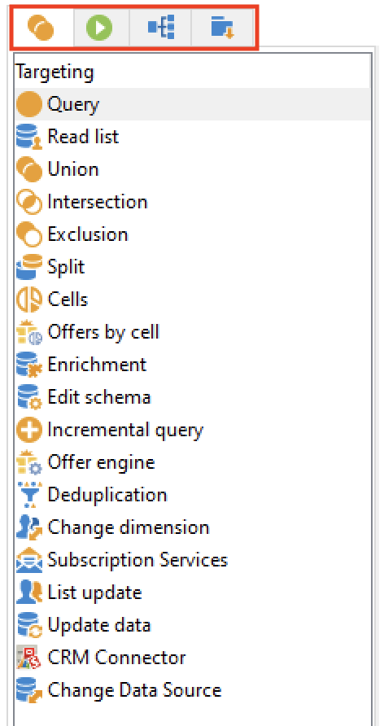

# 工作流程活動{#wf-activities}

工作流程活動會依類別分組，分為四個不同的標籤。

視您的權限、實作以及工作流程的設計內容而定，可用活動可能會有所不同。

例如，在促銷活動中建立的工作流程有特定 **傳遞** 標籤中。 此標籤在 [技術工作流程](technical-workflows.md).

技術工作流程有特定 **事件** 標籤，此標籤在 [行銷活動工作流程](campaign-workflows.md).

以下各節將詳細說明所有活動：

* [目標定位活動](targeting-activities.md)
* [流量控制活動](flow-control-activities.md)
* [動作活動](action-activities.md)
* [事件活動](event-activities.md)
* [促銷活動工作流程特定活動](../campaigns/marketing-campaign-deliveries.md)
