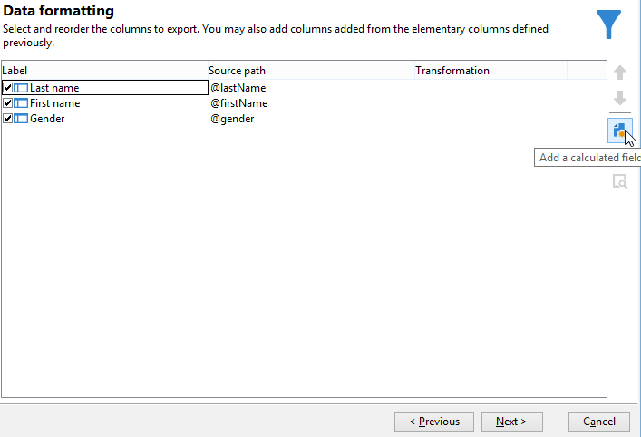

# 新增分項清單型別計算欄位 {#adding-an-enumeration-type-calculated-field}

在此處，我們要建立包含 **[!UICONTROL Enumerations]** 輸入計算欄位。 此欄位將在資料預覽視窗中產生額外的欄。 此欄會指定每個收件者（0、1和2）傳回的結果數值。 會將性別指派給新欄中的每個值：如果值等於「0」，則會將「男性」指派給「1」，將「女性」指派給「2」，或將「未指示」指派給「0」。

* 需要選取哪個表格？

  收件者表格(nms：recipient)

* 要在輸出欄中選取的欄位？

  姓氏、名字、性別

* 要根據哪些條件篩選資訊？

  收件者語言

應用以下步驟：

1. 開啟一般查詢編輯器並選取收件者表格(**[!UICONTROL nms:recipient]**)。
1. 在 **[!UICONTROL Data to extract]** 視窗，選取 **[!UICONTROL Last name]**， **[!UICONTROL First name]** 和 **[!UICONTROL Gender]**.

   

1. 在 **[!UICONTROL Sorting]** 視窗，按一下 **[!UICONTROL Next]**：此範例不需要排序。
1. 在 **[!UICONTROL Data filtering]** 中選取 **[!UICONTROL Filtering conditions]**。
1. 在 **[!UICONTROL Target element]** 視窗，設定篩選條件以收集會說英語的收件者。

   

1. 在 **[!UICONTROL Data formatting]** 視窗，按一下 **[!UICONTROL Add a calculated field]**.

   

1. 前往 **[!UICONTROL Type]** 視窗 **[!UICONTROL Export calculated field definition]** 視窗並選取 **[!UICONTROL Enumerations]**.

   定義新計算欄位必須參考的欄。 若要這麼做，請選取 **[!UICONTROL Gender]** 欄(位於的 **[!UICONTROL Source column]** 欄位：目的地值將與 **[!UICONTROL Gender]** 欄。

   

   定義 **來源** 和 **目的地** 值：目的地值可讓查詢結果更易於讀取。 此查詢應傳回收件者性別，結果將為0、1或2。

   針對要輸入的每個「來源 — 目的地」行，按一下 **[!UICONTROL Add]** 在 **[!UICONTROL List of enumeration values]**：

   * 在 **[!UICONTROL Source]** 欄，在新行中輸入每個性別的來源值(0、1、2)。
   * 在 **[!UICONTROL Destination]** 欄，輸入值：行「0」為「未指示」，行「1」為「男性」，行「2」為「女性」。

   選取 **[!UICONTROL Keep the source value]** 函式。

   按一下 **[!UICONTROL OK]** 以核准計算欄位。

   

1. 在 **[!UICONTROL Data formatting]** 視窗，按一下 **[!UICONTROL Next]**.
1. 在預覽視窗中， **[!UICONTROL start the preview of the data]**.

   額外的欄定義了0、1和2的性別：

   * 0表示「未指示」
   * 1表示「男性」
   * 2表示「女性」

   

   例如，如果您未在 **[!UICONTROL List of enumeration values]**，以及 **[!UICONTROL Generate a warning and continue]** 的功能 **[!UICONTROL In other cases]** 欄位已選取，您將會收到警告記錄。 此記錄指出尚未輸入性別「2」（女性）。 它會顯示在 **[!UICONTROL Logs generated during export]** 資料預覽視窗的欄位。

   

   再舉一個例子，說明沒有輸入列舉值「2」。 選取 **[!UICONTROL Generate an error and reject the line]** 功能：所有性別「2」收件者都會提出異常和行中的其他資訊（名字和姓氏等） 將不會匯出。 錯誤記錄會顯示在 **[!UICONTROL Logs generated during export]** 資料預覽視窗的欄位。 此記錄表示未輸入列舉值「2」。

   
