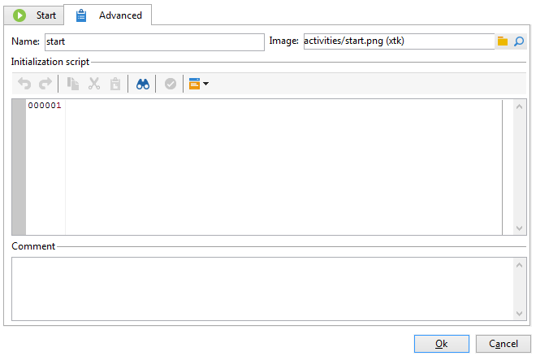

# 高級參數{#advanced-parameters}

活動的屬性畫面具有 **[!UICONTROL Advanced]** 索引標籤，可讓您定義發生錯誤時的行為、活動的執行期間；和可讓您輸入初始化指令碼。 此標籤有兩個版本：

* 簡化版本(適用於 **[!UICONTROL Start]** 和 **[!UICONTROL End]** 例項活動)

   

* 更詳細的版本( **[!UICONTROL Query]** 活動，例如

   

要在 **[!UICONTROL Advanced]** 標籤在以下章節中詳細說明。

## 名稱 {#name}

此欄位包含活動的內部名稱。

## 影像 {#image}

此欄位可讓您變更連結至活動的影像。 有關詳細資訊，請參閱 [變更活動影像](change-activity-images.md).

## 執行 {#execution}

此欄位可讓您定義觸發任務時要執行的動作。 有三種可能的選項：

通常以滑鼠右鍵按一下活動，即可在購物車中選取這些選項。

* **[!UICONTROL Normal]**:活動會照常執行。
* **[!UICONTROL Do not activate]**:不會執行此任務和以下所有任務（在同一分支中）。
* **[!UICONTROL Activate but do not execute]**:此任務和以下所有任務（在同一分支中）將自動停止。 如果您想在任務啟動時在場，則此功能會很實用。 要手動執行任務，請按一下右鍵活動並選擇 **[!UICONTROL Normal execution]**.

## 相似性 {#affinity}

您可以選擇在特定電腦上強制執行工作流程或工作流程活動。 要執行此操作，您必須在工作流或相關活動的級別定義一個或多個傾向。

## Max。 執行期間 {#max--execution-period}

此欄位可讓您在任務過長時設定警告。 它不會影響工作流程操作。 如果任務未在 **[!UICONTROL Max. execution period]** 結束了， **[!UICONTROL Instance monitoring]** 頁面會顯示此工作流程的警告。 此頁面可透過 **[!UICONTROL Monitoring]** 頁簽。

## 行為 {#behavior}

此欄位可讓您定義要使用非同步任務套用的行為。 有兩種可能的選項：

* **[!UICONTROL Several tasks authorized]**:即使第一個任務尚未完成，也可以同時執行多個任務。
* **[!UICONTROL The current task has priority]**:正在執行的任務優先。 只要正在執行任務，就不會執行其他任務。

## 時區 {#time-zone}

此欄位可讓您選取活動的時區。 如需詳細資訊： [管理時區](managing-time-zones.md).

## 發生錯誤時 {#in-case-of-errors}

此欄位可讓您定義當活動發生錯誤時要執行的動作。 有兩種可能的選項：

* **[!UICONTROL Suspend the process]**:工作流程會自動停止。 其狀態變更為 **[!UICONTROL Failed]**. 問題解決後，重新啟動工作流。
* **[!UICONTROL Ignore]**:不會執行此任務和以下所有任務（在同一分支中）。 這對循環任務非常有用。 如果分支有上游的排程器，則會照常在下一個執行日期開始。
* **[!UICONTROL Abort on error]**:工作流程會自動停止，且無法重新啟動。 其狀態變更為 **[!UICONTROL Failed]**.

## 初始化指令碼 {#initialization-script}

此欄位可讓您初始化變數或修改活動屬性。 有關詳細資訊，請參閱： [JavaScript指令碼和範本](javascript-scripts-and-templates.md).

## 評論 {#comment}

此 **[!UICONTROL Comment]** 欄位是可讓您新增說明的自由欄位。
