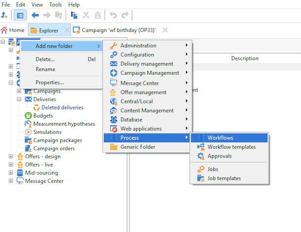

# 建置工作流程 {#build-a-workflow}

## 建立新的工作流程 {#create-a-new-workflow}

工作流程建立流程取決於工作流程的型別。 您可以：

* 建立 [目標工作流程](#targeting-workflows) 從 **[!UICONTROL Profiles and Targets]** > **[!UICONTROL Jobs]** > **[!UICONTROL Targeting workflows]** 瀏覽器的節點或從 **[!UICONTROL Profiles and Targets]** 首頁的索引標籤，透過 **[!UICONTROL Targeting workflows]** 子標籤。

  

* 建立 [行銷活動工作流程](#campaign-workflows) 從 **[!UICONTROL Targeting and workflows]** 行銷活動的標籤

* 建立 [技術工作流程](#technical-workflows) 從 **[!UICONTROL Administration]** > **[!UICONTROL Production]** > **[!UICONTROL Technical workflows]** Explorer節點。 最佳實務是建立特定的工作流程資料夾，以儲存您的技術工作流程。

按一下 **[!UICONTROL New]** 按鈕的工作流程清單上方。

輸入標籤並按一下 **[!UICONTROL Save]**.

## 新增和連結活動 {#add-and-link-activities}

您現在必須定義各種活動，並將它們在圖表中連結在一起。在設定的這個階段，我們可以看到圖表標籤和工作流程狀態（正在編輯）。 視窗的下半部僅用於編輯圖表。 它包含工具列、活動浮動面板（位於左側）和圖表本身（位於右側）。

>[!NOTE]
>
>如果浮動視窗未顯示，請按一下工作流程工具列中的第一個按鈕以顯示它。

活動會依浮動視窗的不同標籤中的類別分組。 可用的標籤和活動會依工作流程型別（技術、目標定位或行銷活動工作流程）而有所不同。

* 第一個標籤包含定位和資料操作活動。 這些活動的詳細資訊，請參見 [目標定位活動](targeting-activities.md).
* 第二個索引標籤包含排程活動，主要用於協調其他活動。 這些活動的詳細資訊，請參見 [流量控制活動](flow-control-activities.md).
* 第三個標籤包含可用於工作流程的工具和動作。 這些活動的詳細資訊，請參見 [動作活動](action-activities.md).
* 第四個索引標籤包含取決於指定事件的活動，例如收到電子郵件或檔案抵達伺服器。 這些活動的詳細資訊，請參見 [事件活動](event-activities.md).

建立圖表

1. 在浮動視窗中選取活動，並使用拖放操作將其移至圖表，以新增活動。

   新增 **開始** 活動，然後是 **傳遞** 活動在圖表上。

   

1. 拖曳「 」，將活動連結在一起 **開始** 活動轉換並將其放置到 **傳遞** 活動。

   

   您可以將新活動放在轉變的結尾處，自動將活動連結至上一個活動。

1. 新增您需要的活動，並將它們連結在一起，如下圖所示。

   

>[!CAUTION]
>
>您可以在相同的工作流程中複製和貼上活動。 不過，我們不建議跨不同的工作流程複製貼上活動。 某些附加至傳送和排程器等活動的設定，在執行目標工作流程時可能會導致衝突和錯誤。 我們建議您  **複製** 工作流程。 如需詳細資訊，請參閱 [複製工作流程](#duplicate-workflows).

您可以使用下列元素來變更圖表的顯示和版面配置：

* **使用工具列**

  圖表編輯工具列可讓您存取工作流程的佈局和執行功能。

  

  這可讓您調整編輯工具的版面：顯示浮動視窗以及圖形物件的概觀、大小和對齊。

  

  以下各節詳細介紹了與進度和日誌顯示相關的圖示：

   * [顯示進度](monitor-workflow-execution.md#displaying-progress)
   * [顯示記錄](monitor-workflow-execution.md#displaying-logs)

* **物件對齊方式**

  若要對齊圖示，請選取圖示並按一下 **[!UICONTROL Align vertically]** 或 **[!UICONTROL Align horizontally]** 圖示。

  使用 **CTRL** 鍵可選取數個分散的活動，或取消選取一或多個活動。 按一下圖表背景以取消選取所有專案。

* **影像管理**

  您可以自訂圖表的背景影像以及與各種活動相關的影像。 請參閱 [變更活動影像](change-activity-images.md).

## 設定活動 {#configure-activities}

連按兩下活動以進行設定，或按一下右鍵並選取 **[!UICONTROL Open...]**.

>[!NOTE]
>
>行銷活動工作流程活動的詳情，請參閱 [本節](activities.md).

第一個索引標籤包含基本設定。 此 **[!UICONTROL Advanced]** tab包含其他引數，這些引數專用於定義發生錯誤時的行為、指定活動的執行持續時間以及輸入初始化指令碼。

為了更清楚瞭解活動及改善工作流程易讀性，您可以在活動中輸入註解。

當操作者捲動到活動上時，這些註解會自動顯示。

## 工作流程範本 {#workflow-templates}

工作流程範本包含屬性的整體設定，且可能包含串連在圖表中的一系列活動。 此設定可重複用於建立包含特定數量之預先設定元素的新工作流程

您可以根據現有範本建立新的工作流程範本，或直接將工作流程變更為範本。

工作流程範本儲存在 **[!UICONTROL Resources > Templates > Workflow templates]** Explorer節點。

除了一般的工作流程屬性外，範本屬性可讓您為根據此範本建立的工作流程指定執行檔案。

## 複製工作流程 {#duplicate-workflows}

您可以複製不同型別的工作流程。 複製之後，不會將工作流程的修改轉存到工作流程的副本中。

>[!CAUTION]
>
>工作流程中提供複製貼上功能，但建議您使用 **複製**. 活動複製後，會保留其整個設定。 對於傳送活動（電子郵件、簡訊、推播通知……），也會複製附加至活動的傳送物件，這可能會造成當機。

1. 在工作流程上按一下右鍵。
1. 按一下 **複製**.

   

1. 在工作流程視窗中，變更工作流程標籤。
1. 按一下「**儲存**」。

行銷活動的檢視中不直接提供重複功能。

不過，您可以建立檢視，以顯示執行個體上的所有工作流程。 在此檢視中，您可以使用以下專案重複工作流程： **複製到**.

**建立檢視**

1. 在 **瀏覽器**，前往您在中建立檢視所需的資料夾。
1. 按一下滑鼠右鍵並前往 **新增資料夾** > **程式**，選取 **工作流程**.

   

新資料夾 **工作流程** 「 」已建立。

1. 按一下右鍵並選取 **屬性**.
1. 在 **限制** 標籤，啟用 **此資料夾是一個檢視** 選項並按一下 **儲存**.

   

資料夾現在已填入執行個體的所有工作流程。

**複製行銷活動工作流程**

1. 在工作流程檢視中選取行銷活動工作流程。
1. 按一下右鍵 **複製到**.
1. 變更其標籤。
1. 按一下「**儲存**」。

您可以在工作流程檢視中看到重複的工作流程。
